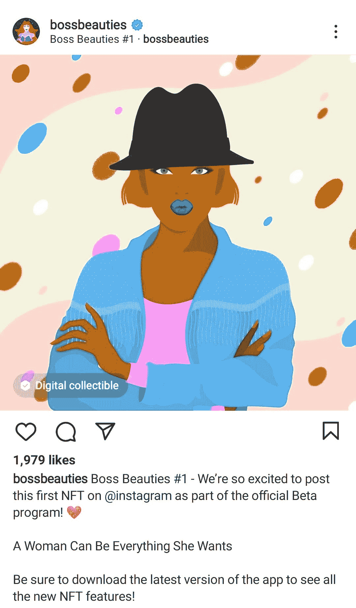

# Instagram 上的 NFTs:它是如何工作的&为什么它是特别的

> 原文：<https://web.archive.org/web/https://dappradar.com/blog/nfts-on-instagram-how-it-works-why-its-special>

## Meta 在 Instagram 上宣布了其在 100 多个国家的 NFT 扩张。但是对于创作者和收藏者来说，意味着什么呢？

前身为脸书的 Meta 一直在关注 Web3 技术，这已经不是什么新闻了。2022 年，扎克伯格的未来社交媒体趋势已经倾向于不可替代令牌(NFT)。

从 8 月份开始，来自全球 100 多个国家的用户将能够在 Instagram 上展示他们的**NFT，Instagram 是一个拥有 12.1 亿月活跃用户的社交网络。**

但是这对 NFT 空间意味着什么呢？社区如何从中受益？让我们开始吧！

## 在 Instagram 上展示 NFT

如果你一直在关注最新的新闻，你就会知道[社交媒体平台正在进入 Web3](https://web.archive.org/web/20220819195335/https://dappradar.com/blog/social-media-platforms-are-jumping-into-web3) 。而 Instagram 这个世界上最受欢迎的网络之一，并不缺乏坚持创新。

自 2022 年 5 月以来，一些精选的 Instagram 用户已经能够将他们的账户连接到一个[加密钱包](https://web.archive.org/web/20220819195335/https://dappradar.com/blog/best-cryptocurrency-wallets-for-2022)，如 Rainbow、MetaMask 和 Trust Wallet。这允许他们在以太坊、多边形和流网络上展示他们的 NFT。

当浏览你的 Instagram feed 时，你可以看到一张 NFT 系列的图片，它会被官方标志所吸引。

[<picture></picture>](https://web.archive.org/web/20220819195335/https://www.instagram.com/p/CdbnkjZuIL2/?utm_source=ig_web_copy_link)

由于与区块链的集成，Instagram 会自动标记所发布资产的创建者和收藏者。

### 谁可以在 Instagram 上访问 NFTs？

2022 年 5 月，Meta 在美国 Instagram 上宣布[推出数字收藏品](https://web.archive.org/web/20220819195335/https://about.fb.com/news/2022/05/introducing-digital-collectibles-to-showcase-nfts-instagram/)。截至 8 月，美洲、亚洲和非洲又有 100 个国家加入了这一名单。

尽管欧洲用户还不能整合他们的钱包并完全使用这一功能，但他们仍然可以在 Instagram 上发现 NFT。

## 什么是 NFT？

[NFT 代表不可替换令牌](https://web.archive.org/web/20220819195335/https://dappradar.com/blog/what-are-non-fungible-tokens-nfts)。每个 NFT 都通过智能合约存储在区块链上，这意味着它们的唯一性得到了保证。NFT 是独一无二的不可替代的数字资产。

2021 年，NFT 市场迎来了第一次繁荣，你可以在 DappRadar 行业报告中读到。关于大品牌和[好莱坞名人的头条新闻](https://web.archive.org/web/20220819195335/https://dappradar.com/blog/celebrity-wallets-a-dive-into-crypto-hollywood)坚持 NFT 式的宣传帮助 NFT 社区成长，但这并不是非物质文化遗产的全部。

作为收藏品的 NFT 是最受欢迎的类型，但它们也可以用来代表其他数字资产，如游戏中的物品、艺术品，甚至是土地或汽车等现实世界的资产。

我们仍然处于采用 NFT 的早期阶段，所以我们还没有看到 NFTs 的所有潜在用例。然而，不可否认的是，NFT 正在上升，并且会持续下去。

[<picture></picture>](https://web.archive.org/web/20220819195335/https://dappradar.com/blog/what-are-non-fungible-tokens-nfts)[<picture></picture>](https://web.archive.org/web/20220819195335/https://dappradar.com/nft/marketplaces)[<picture></picture>](https://web.archive.org/web/20220819195335/https://dappradar.com/nft/sales)

## Instagram 上的 NFTs 对收藏者有什么好处？

人们有非功能性眩晕的许多原因之一是他们个人身份的表现。Instagram 是最好的社交网络之一。

因此，毫不奇怪，许多 NFT 收藏者将与粉丝分享他们的数字收藏品视为一个相当大的优势。

凭借其防复制的区块链独特性，您可以在 Instagram 上分享您的 NFT——不仅是图像或视频展示，还有 NFT 本身。

## 创作者从 Instagram 上的 NFT 中获得了什么？

今天最杰出的 NFT 艺术家们还没有全部利用 Instagram，但是他们已经在 Twitter 上建立了一个社区。

像 Beeple 这样的艺术家在通过 NFTs 取得成功之前，在 Instagram 上甚至很出名。因此，Instagram 和视觉内容创作紧密相连，而 NFT 为其增加了数字真实性。

尽管如此，像 Instagram 这样的社交网络对普通观众的包容性要大得多。在那里工作可以进一步扩大你的影响范围——走出加密的泡泡。

这种 NFTs 与 Meta 的集成可以象征性地，正如官方声明所说，*“改善体验，帮助他们创造更多的货币化机会，并将 NFTs 带给更广泛的受众。”*

该网络的具体目标是什么还有待观察。

## DappRadar 如何将您的 NFT 体验提升到一个新的水平

尽管 Instagram 正在通过进入 NFT 领域打破壁垒，但要看到它对收藏家和艺术家的重大影响，还有很长的路要走。

例如，寻找 NFT 收藏和管理好你的投资组合是任何收藏家的其他基本特征。

这就是为什么 DappRadar 创建了一个[投资组合跟踪器](https://web.archive.org/web/20220819195335/https://dappradar.com/hub/wallet/)，你可以连接你的钱包来管理你所有的 NFT 收藏和加密投资组合。

[https://web.archive.org/web/20220819195335if_/https://www.youtube.com/embed/WHL_uYv8riA?start=15&feature=oembed](https://web.archive.org/web/20220819195335if_/https://www.youtube.com/embed/WHL_uYv8riA?start=15&feature=oembed)

此外，通过使用我们的 [NFT 浏览器](https://web.archive.org/web/20220819195335/https://dappradar.com/hub/nft-explorer)，你还可以在以太坊网络上发现最好的 NFT，并使用 [NFT 价值评估器](https://web.archive.org/web/20220819195335/https://dappradar.com/hub/nft-value-estimator)检查它们的价值。

NFT 的创造者也可以通过我们的排名关注 NFT 最好的市场，并列出他们自己的作品出售。更不用说，你还可以[在 DappRadar](https://web.archive.org/web/20220819195335/https://dappradar.com/blog/how-to-buy-and-sell-nfts-on-dappradar) 上买卖你的 NFT。

## 下一步是什么

我们 DappRadar 将继续关注 Instagram 上关于 NFTs 的新闻，以及该行业如何发展。

如果你有兴趣了解令人兴奋的 NFTs 和去中心化应用领域的最新机会，请关注我们的[博客](https://web.archive.org/web/20220819195335/https://dappradar.com/blog/)、[推特](https://web.archive.org/web/20220819195335/https://twitter.com/dappradar)账户和 [Youtube](https://web.archive.org/web/20220819195335/https://www.youtube.com/c/DappRadar) 频道。

***以上不构成投资建议。此处给出的信息仅供参考。请尽职调查并自行研究。***