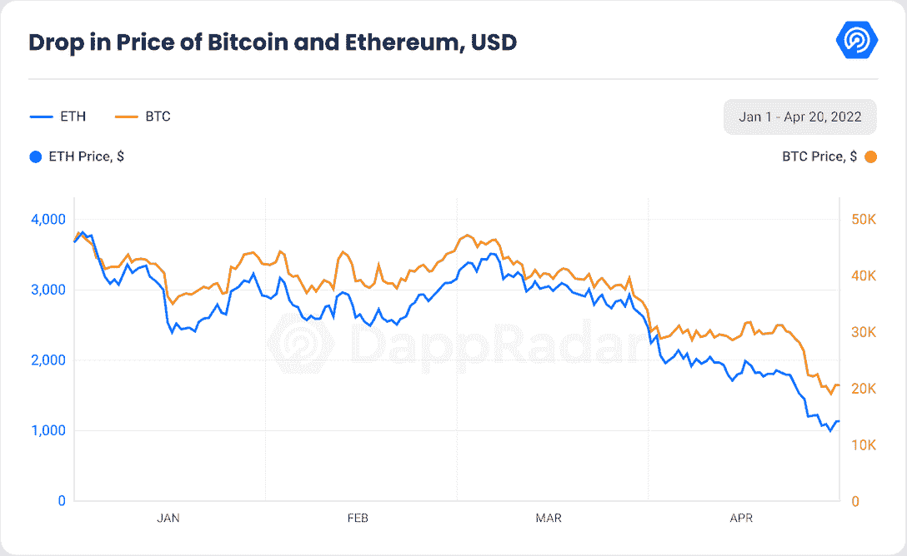

# 蓝筹股 NFT 集合埋葬 BTC 和瑞士联邦理工学院在周末的狂热

> 原文：<https://web.archive.org/web/https://dappradar.com/blog/nfts-rise-while-btc-eth-plunge>

## CryptoPunks、Meebits、CloneX 和 MintVial 正在驯服灰熊市场吗？在这份报告中找出正在发生的事情，以及你如何参与其中。

2022 年 6 月的快速 Dapp 报告显示，受欢迎的蓝筹股 NFT 藏品的数字令人振奋，与灰熊市场形成鲜明对比。CryptoPunks、Meebits 和 CloneX-mint vial 等系列在周末期间的底价至少上涨了 40%。它们表明，区块链产业不仅仅是加密货币。

**关键要点**

*   随着加密货币的基础价格下降，非加密货币变得越来越便宜，对首次购买者也越来越有吸引力。
*   **周六，瑞士联邦理工学院从 1080 下跌至 897 = 17%，BTC 从 20433 下跌至 17760 = 13%**
*   **蓝筹股 NFT 藏品的底价至少上涨了 20%**
*   **crypto punk 和 Meebits 的交易量分别增长了 683%和 360%**

对于整个密码行业来说，上周尤其艰难。6 月 19 日周日，比特币跌破 20，000 美元，逼近 17，000 美元大关，而以太坊跌破 900 美元。自 6 月初以来，许多 NFT 藏品的底价下跌了 20%，而德菲区块链的底价下跌了约 30%。

Source: DappRadar

这种情况对我们来说并不陌生，因为我们在一月份的行业报告中已经目睹了类似的流血事件。当时，以太坊已经从 11 月份的峰值下跌了 48%，许多区块链的 TVL 下跌了约 30%，为该行业描绘了一幅黑暗的画面。

Source: [DappRadar January Industry Report](https://web.archive.org/web/20220906092115/https://dappradar.com/blog/dapp-industry-report-january-2022)

## BTC 和瑞士联邦理工学院股价暴跌，非专利技术公司股价上涨

很像一月份的“秘密冬天”，我们看到了一线希望。许多 NFT 收藏成功地避开了价值的大幅下跌，并蓬勃发展。当时，我们解释了尽管以太坊的价格下跌了近 50%,但以美元计算的 BAYC 底价却成功翻倍，超出了预期。

上周末，在 NFT 的许多“蓝筹”藏品中也观察到了同样的情况。许多有存储价值记录的收藏交易频率大幅上升，因为随着 ETH 价格的下降，经济进入壁垒降低了。

CryptoPunks collection 在 6 月初的日交易量几乎没有突破两位数，但在两个周末都有 90 笔交易。

资料来源:DappRadar

虽然没有那么壮观，但 Meebits 显示了类似的复苏，周末期间，收集量从平均每天不到 5 笔交易增加到 20 笔交易。

总的来说，CryptoPunks 的交易量每周增长 683 %, Meebits 增长 360%。

## 蓝筹股集合的底价至少上涨 20%

这种增加的交易推高了许多蓝筹股集合的底价，如 BAYC、rtf kt–CloneX mint vial、Meebits、CryptoPunks 和 Doodles。所有这些藏品都经历了至少 20%的显著周环比底价增长。

资料来源:DappRadar

领先的是 Meebits，底价增长了 76%，其次是 Clone X Mintvials，增长了 67%，而 Doodles 和 CryptoPunks 分别增长了 44%和 43%。

## 为什么会这样？

资料来源:DappRadar

去年，NFTs 成为文化时代精神的一部分，并在 2021 年 12 月首次打破了谷歌对加密的趋势。NFT 继续主导着 Google 的加密趋势，除了由于当前的危机，加密搜索出现了短暂的高峰。

来源: [DappRadar 一月行业报告](https://web.archive.org/web/20220906092115/https://dappradar.com/blog/dapp-industry-report-january-2022)

不可替代代币(NFT)如今非常流行，吸引了许多人对其作为金融资产的潜力的关注。我们之前在二月份的报告中已经详细报道了这一现象，下面是一个简短的总结:

1.之前因定价过高而被排除在这些藏品之外的潜在买家首次看到了购买机会。东西越便宜，需求就越大。

2.许多蓝筹 NFT 收藏已经演变成一种超越简单 Jpeg 的文化现象。许多人在诸如品脱通行证、游戏资产等事物的效用中看到它们的价值。

3.艺术品是一种历史悠久的投资资产，自 2011 年以来，它越来越受到财富管理公司和许多 T2 咨询服务提供商的青睐。NFT 本身是艺术作品，按照同样的逻辑运作。

## 结论

尽管 FUD 认为密码产业，尤其是非功能性非技术产业已经崩溃，但密码产业仍在不断地自我改造。在经历了连续一个月的市场动荡后，许多 NFT 蓝筹股集合产品的交易出现了复苏，这是由基础区块链股票的贬值推动的。

像 CryptoPunks 这样的一些收藏的交易活动一周比一周增加了 683%。在这种交易活动中，许多蓝筹股至少升值了 20%。像 Meebits 和 CloneX MintVials 这样的收藏分别升值了 76%和 67%。

这种复苏就像是闪回到了 2022 年 1 月的加密冬天，当时 NFTs 在很大程度上避开了其他加密资产的下降。