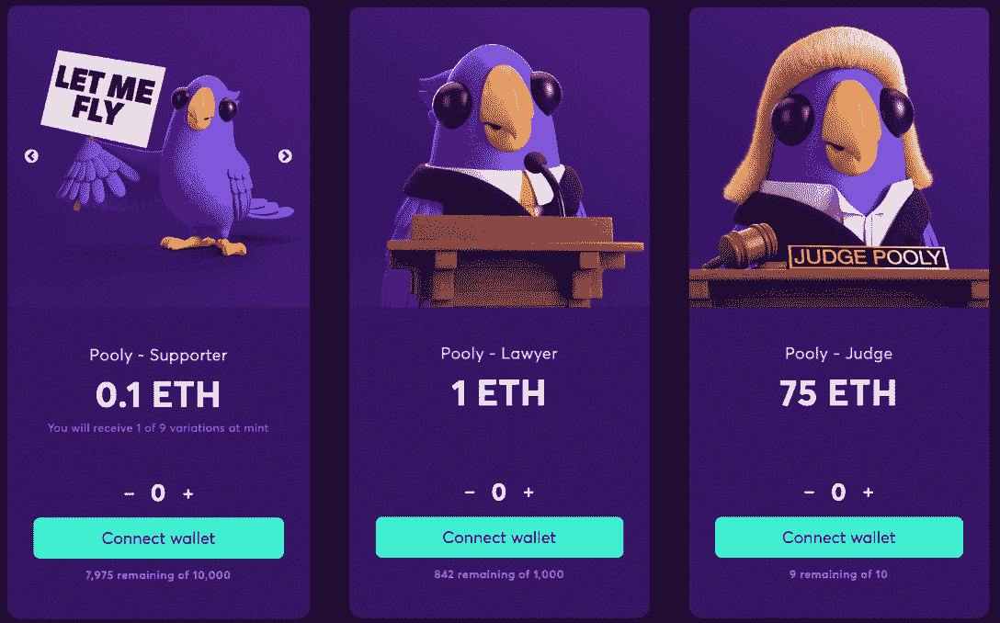
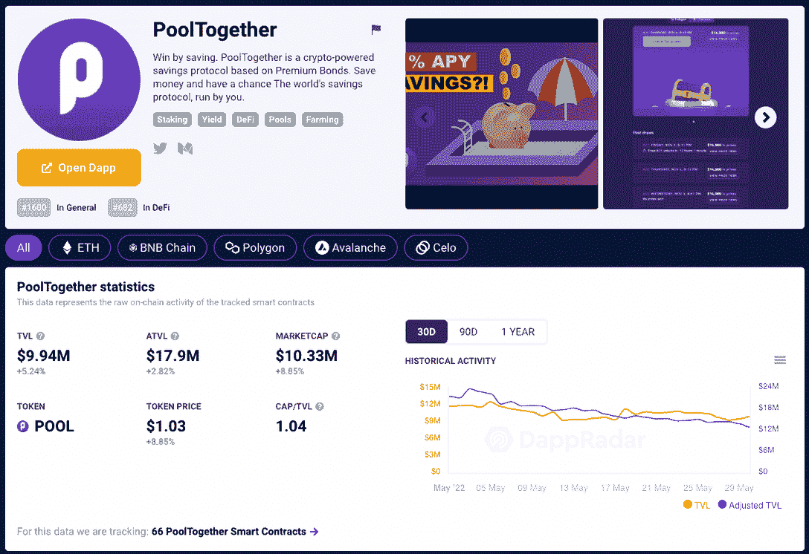
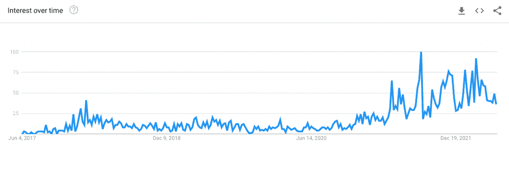

# 当 PoolTogether 发起法律辩护时，NFTs 前来救援

> 原文：<https://web.archive.org/web/https://dappradar.com/blog/nfts-to-the-rescue-as-pooltogether-mounts-legal-defense>

## 当 PoolTogether 被起诉时，DeFi 在码头

以太坊 DeFi 储蓄和彩票协议 PoolTogether 推出了 Pooly NFT 收藏，以帮助其在财务上反击即将到来的集体诉讼。臭名昭著的反加密美国参议员伊丽莎白·沃伦的一名前工作人员提起的诉讼点名了该公司及其投资者。它试图确定当 DeFi 协议被认为伤害了用户时，谁应该承担法律责任。

2021 年 10 月，激烈反加密的美国参议员伊丽莎白·沃伦的前雇员乔·肯特(Joe Kent)对 PoolTogether 提起集体诉讼，指控其违反纽约州赌博法。针对 PoolTogether 的诉讼被视为改变 DeFi 监管格局的一个测试案例。

现在， [PoolTogether 推出了 Pooly NFT 收藏馆](https://web.archive.org/web/20220630214726/https://dappradar.com/multichain/defi/pooltogether),并将利用出售 10，110 件 NFT 的收入来为他们的法律辩护筹集资金。在推出后的两个小时内，该系列筹集了 73 ETH，约合 13.5 万美元，目标是 769 ETH，约合 150 万美元，还有三周多的时间留给 mint。

价格各不相同，那些想要表示支持 [PoolTogether](https://web.archive.org/web/20220630214726/https://dappradar.com/multichain/defi/pooltogether) 的人可以得到从 0.1 ETH 到 75 ETH 的三个级别的 NFT。购买 Pooly NFT 是支持 PoolTogether 抵御集体诉讼的一种方式。此外，有趣的是 [NFTs 作为一种众包方法来拯救](https://web.archive.org/web/20220630214726/https://dappradar.com/nft)，它实际上可以给支持者一些回报，因为他们支持他们相信的产品。

## 严重关切，或推动议程？

在他的投诉中，乔·肯特也被描述为“严重担心加密货币生态系统——需要大量电力——正在加速气候变化，并允许人们逃避金融监管和欺骗消费者。”这份声明只是重复了他的前雇主参议员伊丽莎白·沃伦的议程。

如上所述，人们普遍认为乔·肯特对 [PoolTogether](https://web.archive.org/web/20220630214726/https://dappradar.com/multichain/defi/pooltogether) 的指控更多的是为了支持他老板的计划。由于索赔者只在平台上存入了相当于 10 美元的钱，他并不是在寻求某种报偿。此外，他通过将 pool 聚集到聚光灯下来寻求法律上的明确性，并可能为 DeFi dapps 和更广泛的生态系统创造一个分水岭时刻。

该诉讼将总部位于布鲁克林的 PoolTogether 公司、其创始人雷顿·库萨克(Leighton Cusack)以及该协议的许多投资者列为被告，其中包括蜻蜓资本公司、 [Compound](/web/20220630214726/https://dappradar.com/blog/education-sessions-compound-finance/) Labs 和银河数字资本管理公司。该项目的个人投资者，包括 DeFi platform [Aave](/web/20220630214726/https://dappradar.com/blog/aave-v3-wants-to-take-defi-mainstream/) 的创始人兼首席执行官 Stanislav Kulechov，也被点名。

通过指明公司及其投资者，肯特的诉讼旨在确定当 DeFi 协议被认为伤害了用户时，谁应该承担法律责任。根据案件的结果，这可能会对分散的项目产生巨大的影响，包括分散的交易所和 Dao。此外，这将考验大多数项目的分散程度。

## 什么是 PoolTogether？

从技术上来说， [PoolTogether 是一个 DeFi savings 协议](https://web.archive.org/web/20220630214726/https://dappradar.com/blog/what-is-pooltogether-and-how-to-use-it)的变体。dapp 允许用户存入资金，并进入无损失储蓄游戏，在该游戏中，他们可以因在平台上存入资金而赢得奖励。更简单地说，它是彩票和加密赌注的混合，用户牺牲少量的潜在收益来换取可能的头奖。

用户将加密货币存入池中以购买门票，每个池每周举行一次抽奖，奖励最多五名获胜者。然而，彩票在抽奖后不会过期。相反，彩票会滚动到下一次抽奖，下一次再下一次，直到你赢或从池中取出你的资金。这样，这是一个没有损失的彩票，因为你可能不会赢，但你不能输。

## 奖品从何而来？

[PoolTogether](https://web.archive.org/web/20220630214726/https://dappradar.com/blog/what-is-pooltogether-and-how-to-use-it) 以加密赌注为前提，像彩票一样大规模运作。首先，当用户将资金存入资金池时，他们通过[复合](/web/20220630214726/https://dappradar.com/blog/education-sessions-compound-finance/) DeFi 平台下注，以产生百分比收益。然后，产生的收益用于彩票奖励。

赌注奖励因代币的存放而异，但由于如此多的玩家不断地将他们的资金长期集中在一起，累积起来会有很大的累积奖金。此外，自动智能合约会选择获胜者，并让其他玩家参加最新的每周抽奖，而无需每周进行任何手动操作。

这个想法颠覆了传统的彩票观念。尤其是参与彩票是一种昂贵的习惯，中奖的机会很小，每周你都在花钱，但通常什么也没中。有了 [PoolTogether](https://web.archive.org/web/20220630214726/https://dappradar.com/multichain/defi/pooltogether) ，用户只需购买一张有效门票，直到他们中奖。

事实上，这只不过是一个赌注激励机制。赢得彩票的机会当然是微乎其微的，然而，这是对相对平凡的赌注加密奖励任务的又一层吸引力。此外，从平台上取消赌注需要支付以太坊交易费，因此大多数用户将在赌注合同中锁定他们的令牌，避免大约 20 美元的费用，并每周都有机会赢得彩票。

[https://web.archive.org/web/20220630214726if_/https://www.youtube.com/embed/s00govGHmmQ?feature=oembed](https://web.archive.org/web/20220630214726if_/https://www.youtube.com/embed/s00govGHmmQ?feature=oembed)

## 有什么条件？

写作没有明显的风险，玩家的钱被安全地锁在一份聪明的合同里。智能合同是完全自动化的，项目背后的团队声称，它还通过了 OpenZeppelin & Quantstamp 的几次独立智能合同审计。安全方面，只是用户和智能合约。

此外， [PoolTogether 已经成功运行了很长一段时间](https://web.archive.org/web/20220630214726/https://dappradar.com/blog/dappradars-top-52-dapps-of-2020)，并且在 DappRadar 上没有被归类为高风险 dapp。然而，和所有新技术一样，有一些缺点要记住。也就是说，由于以太坊网络的需求，交易费可能会很贵，如果你只打算往池中投入几美元，支付交易费可能会花费更多。也许乔·肯特就是这么做的？

此外，将你的加密货币锁定在一个资金池中也存在机会成本，因为你可以押注这些资金，或者通过分散的交易所提供流动性来赚取收益。相反，你把它们放在一起，希望赢得头奖。最后，你买的票越多，中奖的机会就越大，所以一个缺陷是，它可能会帮助富人变得更富。尽管如此，任何参与游戏的人都有可能获胜。

[<picture></picture>](https://web.archive.org/web/20220630214726/https://dappradar.com/multichain/defi/pooltogether)

## Uniswap，PoolTogether，谁是下一个？

Web3 和去中心化的组织正在改变现状，为最终用户提供更高效、更人性化的服务。没有一个行业是免于被颠覆的，dapps 已经渗透到[金融](https://web.archive.org/web/20220630214726/https://dappradar.com/rankings/defi)、[音乐、](https://web.archive.org/web/20220630214726/https://dappradar.com/rankings/other)、[艺术](https://web.archive.org/web/20220630214726/https://dappradar.com/rankings/collectibles)、[游戏](https://web.archive.org/web/20220630214726/https://dappradar.com/rankings/games)、票务、销售点和物流，更多的用例正在到来。

在金融和游戏领域，dapps 的影响已经非常强大，现在，在只能被描述为熊市的情况下，严肃的项目正准备在新法规的监督下进行建设，并着眼于大规模采用。

[分散实体](https://web.archive.org/web/20220630214726/https://dappradar.com/rankings)由于其建立的分散方式，给立法者和监管者带来了一系列特殊的挑战。此外，正如埃隆·马斯克(Elon Musk)所言，“监管非常、非常慢”，一般来说，创新的速度远远快于监管。

Dapps 提供了一个特别令人头疼的问题，因为它们执行的操作可以由几个独立的实体在一个平台内完成。那么，如果出了问题，该怪谁呢？是 PoolTogether 提供的平台吗？、或用于服务产品的化合物。也许都不是，或者都是？也许这完全是用户的错。

更重要的是，dapps 正在进入普通人的手中，而不仅仅是 crypto 和区块链的拥护者。这些人迅速需要访问[内容和工具](https://web.archive.org/web/20220630214726/https://dappradar.com/)来帮助他们的旅程，这也是 DappRadar 建立[世界 Dapp 商店](/web/20220630214726/https://dappradar.com/blog/why-users-will-love-the-worlds-dapp-store/)的重要原因。PoolTogether 一案将把 Aave 等主要投资者和 Compound 等重要运营商带入一场关于监管和用户安全的对话。可以说，双方都会支持这样的对话，因为他们都是这个领域的长期参与者，都有继续下去的雄心。

Worldwide Interest in Crypto Regulation | Past 5 Years | [Google Trends](https://web.archive.org/web/20220630214726/https://trends.google.com/trends/explore?date=today%205-y&q=crypto%20regulation)

本月早些时候，领先的分散式交易所 uni swap 受到抨击，因为一名用户提出的新的[集体诉讼](https://web.archive.org/web/20220630214726/https://www.classaction.org/media/risley-v-universal-navigation-inc-et-al.pdf)声称 Uniswap Labs 及其投资者应对她因违反证券法而遭受的损失负责。根据北卡罗来纳的妮莎·瑞斯丽的说法，该诉讼指的是那些利用 [Uniswap 协议](https://web.archive.org/web/20220630214726/https://dappradar.com/multichain/exchanges/uniswap-v3)执行抽水和倾倒计划的不良行为者，她指出缺乏了解你的客户(KYC)尽职调查和未能在证券交易委员会注册是她投诉的主要原因。

简而言之，投资者承担了风险，现在正在寻求政府的帮助，因为他们被烧伤了，没有做任何研究。虽然这是一个有点原始的观点，但它和诉状中提出的指控一样可信。

此类案件的结果可能会对 dapps 的未来产生严重影响。《华尔街日报》称,《PoolTogether》的诉讼似乎是有意测试 DeFi 社区的一些核心理念。PoolTogether 表示，尽管这些指控缺乏法律依据，但仍需要进行彻底的辩护。你可以[在这里](https://web.archive.org/web/20220630214726/https://drive.google.com/file/d/1VlgbQiw8Ac1SyGk6W6o3xw05Pylq9Vz6/view)阅读投诉，在这里阅读 [PoolTogether Inc .的初步回应。访问所有法庭文件的说明在](https://web.archive.org/web/20220630214726/https://drive.google.com/file/d/1s-mGV6NFlM5_3A9fg3Ui_oW475BJTdho/view)[常见问题](https://web.archive.org/web/20220630214726/https://mint.pooltogether.com/#faq)中。

 NewsletterUnsubscribe at any time. [T&Cs](https://web.archive.org/web/20220630214726/https://dappradar.com/terms) and [Privacy Policy](https://web.archive.org/web/20220630214726/https://dappradar.com/privacy-policy)

***以上不构成投资建议。此处给出的信息仅供参考。请行使尽职调查，做你的研究。作者持有多种加密货币的头寸，包括 BTC、瑞士法郎和雷达。***