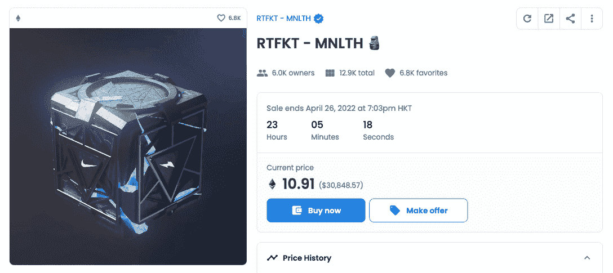
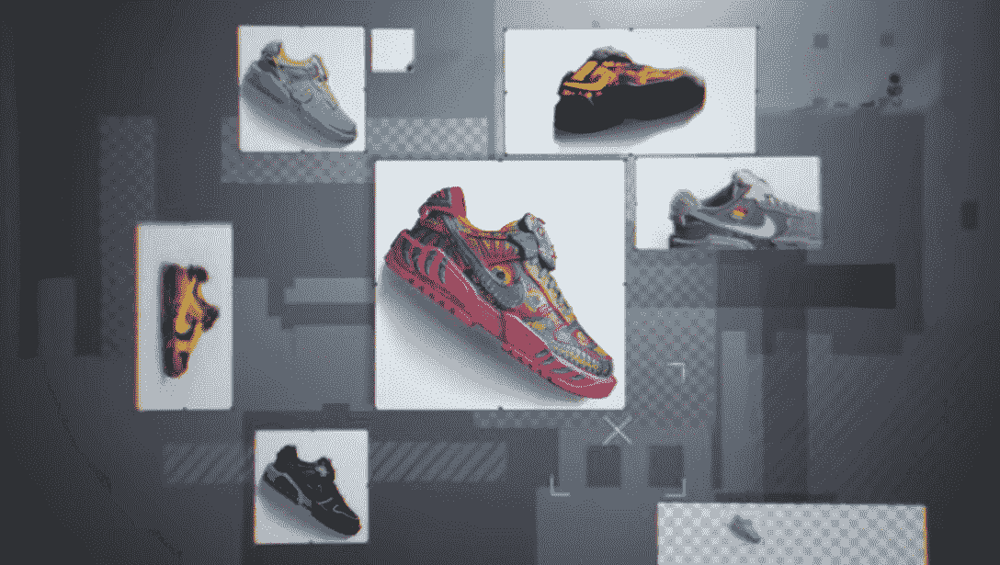

# Nike X RTFKT 通过游戏化的机制推出了隐踢

> 原文：<https://web.archive.org/web/https://dappradar.com/blog/nike-x-rtfkt-unveiled-cryptokicks-through-gamified-mechanics>

## 耐克和 RTFKT 的第一双虚拟运动鞋就在这里

现在是耐克子公司的 RTFKT 在周末展示了其最新的 NFT 运动鞋，名为 CryptoKicks。这些耐克联合品牌虚拟运动鞋的推出是通过焚烧 MNLTH 发生的，mnl th 是一个神秘的 NFT 盒子，Clone X NFT 持有者收到了一个免费赠品。

**总结**

*   耐克去年年底收购了 RTFKT，他们的联合品牌 [**RTFKT x 耐克扣篮创世纪隐踢**](https://web.archive.org/web/20221208163539/https://opensea.io/collection/rtfkt-nike-cryptokicks) **系列终于首次亮相**
*   [**克隆 X NFT**](https://web.archive.org/web/20221208163539/https://dappradar.com/ethereum/collectibles/clone-x-x-takashi-murakami) **持有者被空投了神秘盒子，可以给他们带来虚拟球鞋以及其他福利**
*   **MNLTH NFT 包含 3 个新的 NFT:数字运动鞋，一个定制小瓶和一个新的 mnl th 盒子**
*   **rtf kt x Nike Dunk Genesis Cryptokicks 已经卖到至少 2.86 ETH 或 8400 美元**
*   RTFKT 皮肤瓶售价 1 ETH，而最便宜的第二支 MNLTH 售价 4.3 ETH。

随着区块链、NFTs 和元宇宙将现实世界和数字世界融合在一起，这为品牌为其客户和粉丝创造独特的体验提供了无限的机会。当谈到塑造元宇宙的运动时尚景观时，顶级运动服装品牌阿迪达斯和耐克显然是最具侵略性和战略性的。

2021 年 12 月，阿迪达斯与 [Bored Ape 游艇俱乐部](https://web.archive.org/web/20221208163539/https://dappradar.com/ethereum/collectibles/bored-ape-yacht-club)、加密影响者 Gmoney 和[朋克漫画](https://web.archive.org/web/20221208163539/https://dappradar.com/ethereum/collectibles/punks-comic)合作，将[纳入元宇宙 NFT 系列](https://web.archive.org/web/20221208163539/https://dappradar.com/blog/nike-adidas-and-pepsi-record-220-million-in-combined-nft-trading-volume/)。不出所料，NFT 几分钟内就销售一空。与阿迪达斯的合作方式不同，耐克收购了虚拟运动鞋工作室 RTFKT，开始了征服元宇宙的旅程。

上周五，RTFKT 在 Discord 和 Twitter 上发布了虚拟运动鞋的联名系列。所谓的 Nike CryptoKicks 实际上是 Clone X collection 持有者的专属特权，Clone X collection 是 RTFKT 与当代艺术家村上隆共同创作的个人资料图片(PFP) NFT 项目。

[https://web.archive.org/web/20221208163539if_/https://www.youtube.com/embed/h6dtzwMfLa0?feature=oembed](https://web.archive.org/web/20221208163539if_/https://www.youtube.com/embed/h6dtzwMfLa0?feature=oembed)

## 神秘的 MNLTH 让你耐克 CryptoKicks

为了揭开 CryptoKicks 的神秘面纱，RTFKT 空投了一个神秘的盒子 NFT 给克隆 X 的主人。那些早先为了热钱而放弃《克隆 X NFT》的人现在可能有些后悔了。相反，对于那些拥有它的人来说，现在是收获回报的时候了。

在每个第 1 个盒子里，都有一对隐踢，一个单独的[皮囊](https://web.archive.org/web/20221208163539/https://opensea.io/collection/skinvial-evox)，以及一张第 2 个金库的通行证。你可以在 8.1 ETH 的二级市场上找到这三个项目。而装着这三样东西的第一个盒子的底价是 10.9 ETH，当然，这也让你有机会找到一个罕见的皮肤小瓶和一双隐踢鞋。

值得一提的是，每双隐踢都可以在皮肤小瓶的帮助下进化，这是一种可以触发不同风格的 NFT。通过这种方式，RTFKT 和 Nike 可以为社区提供一种可定制和游戏化的虚拟运动鞋体验，持有者可以在其中收集、进化和繁殖他们的运动鞋。未来将会有不同层次的定制，允许用户创建自己独特风格的数字运动鞋。未来，RTFKT 还将通过一个名为 Forging 的机械师推出实体鞋，但目前还没有这方面的细节。

随后，RTFKT 还计划为创作者和合作伙伴提供参与运动鞋皮肤共同创作的机会。此刻，村上隆的艺术皮肤已经进入收藏。

## 元宇宙是时尚的未来吗？

元宇宙是时尚的未来吗？不幸的是，现在预测还为时过早。然而，品牌在虚拟可穿戴设备上加倍下注是一个不可否认的事实，因为 NFT 肯定可以为物理和虚拟物品添加真实性、独特性和稀缺性等元素。毫无疑问，这些元素与时尚商品尤其相关。

其实耐克对于密码世界的战略规划要追溯到 2019 年。运动服装品牌[于 2019 年](https://web.archive.org/web/20221208163539/https://thenextweb.com/news/nike-blockchain-sneakers-cryptokick-patent)为其名为“CryptoKicks”的区块链兼容运动鞋申请了专利，并于当年 12 月获得美国专利局的批准。有了这些背景信息，收购 RTFKT studio 现在就更有意义了。它完美地反映了当前的趋势，即物理世界和 Web3 世界正在通过收购寻求知识和专业知识的双向流动，这是在区块链之外的 DappRadar 播客的[上一集深入讨论的主题。](https://web.archive.org/web/20221208163539/https://www.youtube.com/watch?v=kORvzSmIW1o&list=PL0L1ZfahiAoOq8hl_dUQBxSCiQIGtaGJK&index=3)

DappRadar 将继续关注 RTFKT 和 CryptoKicks 的最新进展。希望了解区块链世界的最新动态，在 [Twitter](https://web.archive.org/web/20221208163539/https://twitter.com/DappRadar) 上关注 DappRadar，加入我们的 [Discord](https://web.archive.org/web/20221208163539/https://discord.gg/4ybbssrHkm) ，查看我们的 [Youtube 频道](https://web.archive.org/web/20221208163539/https://www.youtube.com/c/DappRadar) l，敬请关注！