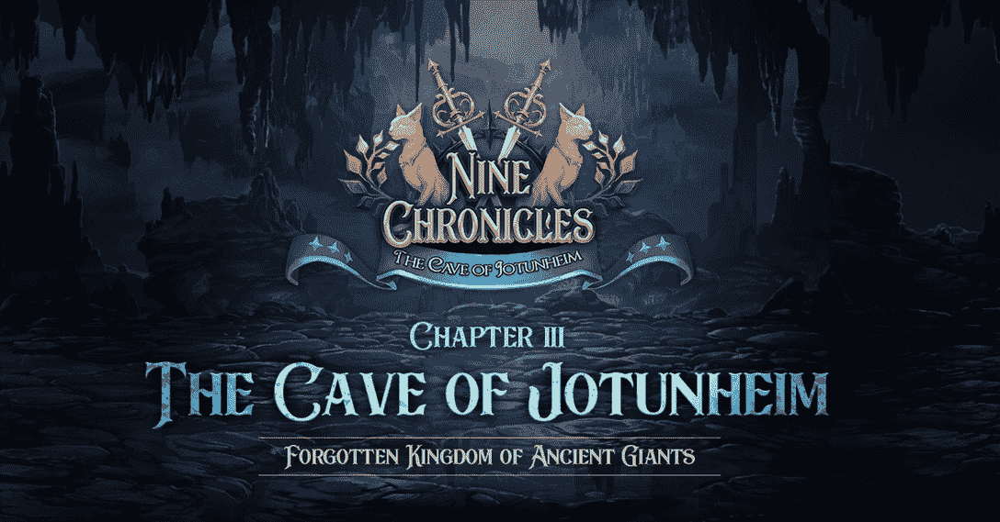
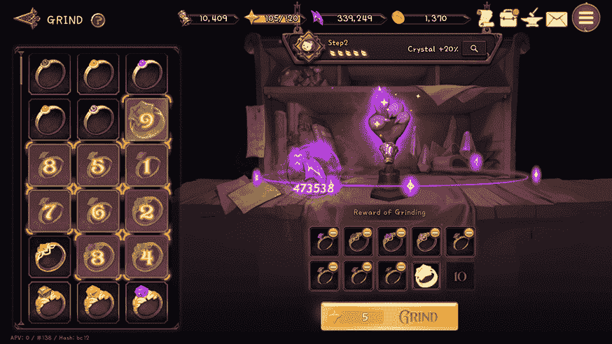
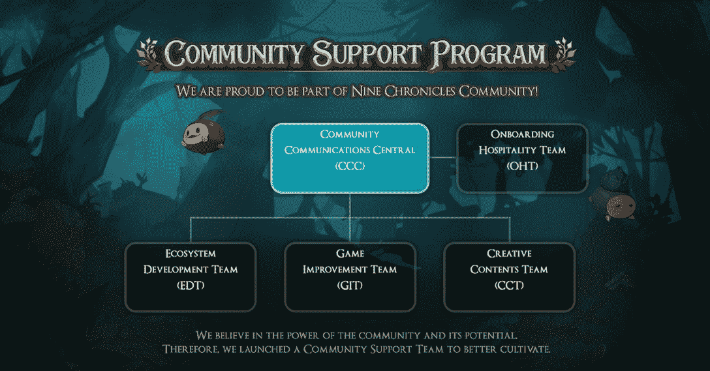

# 九编年史揭开了第三章，为 Nine 托肯打开了更多的赌注机会

> 原文：<https://web.archive.org/web/https://dappradar.com/blog/nine-chronicles-unveils-chapter-three-opening-up-more-staking-opportunities-for-ncg-token>

## 新的功能将使九宫格更加可持续和分散。

《九历记》更新了一套新的游戏玩法，第三章:约顿海姆洞穴，作为其游戏生态系统的扩展。第三章将为玩家提供一个新的游戏货币，更多的赌注机会，各种战斗比赛，一个社区支持计划，等等。

**概要:**

*   《九连环》是一款分散式开源角色扮演游戏(RPG ),采用 Libplanet 区块链引擎打造。
*   它已经进入了 DappRadar 游戏排名的前 20 名。
*   第 3 章旨在通过引入怪物收集(NCG 赌注)升级、WNCG 赌注和引入水晶来提高经济可持续性。
*   此外，新篇章将通过竞技场重启、增加世界 6 和引入社区支持计划来增强游戏体验。
*   该游戏在过去 24 小时内记录了大约 16，000 个独特的钱包，增加了 5.96%。

## 九编年史是什么？

《九历记》是第一款完全去中心化的角色扮演游戏(RPG) ，它利用了 Libplanet 区块链引擎。值得注意的是，Libplanet 使游戏能够在一个点对点的用户网络上运行，而不依赖于中央服务器。多亏了 Libplanet，Nine Chronicles 确保了用户拥有他们的游戏内资产，并创造了一个每个参与者都有发言权的生态系统。

[https://web.archive.org/web/20220811232655if_/https://www.youtube.com/embed/Kf-7NXLVLOE?feature=oembed](https://web.archive.org/web/20220811232655if_/https://www.youtube.com/embed/Kf-7NXLVLOE?feature=oembed)

九编年史是一款沉浸式游戏，拥有精心设计的视觉效果。在游戏中，玩家可以在不同的世界中战斗，制作和交易物品，制定策略，并在竞技场中战斗。玩家可以通过出售游戏内资产、在竞技场中竞争以及参与其他游戏内活动来赢得 NCG。此外，九编年史的生态系统是由 NCG 代币推动的。

## 为什么《九历记》第三章如此备受期待？

介绍第三章:约顿海姆洞穴，九编年史可以将其可持续经济带到一个新的水平。此外，随着一系列新功能的加入，第三章还旨在增强玩家的游戏体验。

### 九历记第 3 章改善经济可持续性

就游戏的经济性而言，第三章旨在让用户从其自主经济中获益更多。其中包括怪物收集(NCG 赌注)升级，WNCG 赌注，并介绍了水晶。

怪物收集是九编年史中的一个受欢迎的功能。它允许玩家通过下注游戏的代币 NCG 来获得核心资源。在第 3 章中，赌注奖金至少是原始版本的两倍，最低赌注金额仅为 50 NCG。

WNCG 代表被包裹的 NCG。这是以太坊区块链上的一个 ERC-20 代币，与 NCG 的价值直接挂钩。持有 WNCG 代币但未参与九幽编年史者，可在平衡器上参与认捐 WNCG，获得奖励。

最后，游戏中加入了一种新的货币——水晶。玩家可以使用旧武器和盔甲来生产水晶。这些宝石可以让玩家解锁新的世界，替代不足的原料，用 buff 加快游戏进程，等等。

### 九历记第 3 章增强游戏体验

九编年史将通过竞技场重启、增加世界 6 和引入社区支持计划来增强游戏体验。

九纪事竞技场将在重启后推出更激动人心的比赛，有三个不同的等级和相应的奖励。全年将有 12 个月度竞技场赛季，四个季度锦标赛，年度总决赛，以及其间的淡季。

九编年史致力于打造一个社区驱动的游戏平台。它的使命包括加速生态系统的健康发展和扩张。为了进一步释放社区的力量和潜力，九编年史建立了一个社区支持计划。

## 该公告促进了用户增长

在九历记向公众公布了第三章的计划后，游戏见证了玩家数量的增长。根据 DappRadar single dapp 跟踪，该游戏在过去 24 小时内注册了约 16，000 个不同的钱包，增长了 5.96%。游戏的 7 天指标也实现了三绿增长。独立用户增加了 10%，交易量增加了 1%，交易量增加了 30%。

找到更多关于九编年史:

[网站](https://web.archive.org/web/20220811232655/https://nine-chronicles.com/)

[不和](https://web.archive.org/web/20220811232655/https://bit.ly/planetarium-discord)

[推特](https://web.archive.org/web/20220811232655/https://twitter.com/NineChronicles)

[中等](https://web.archive.org/web/20220811232655/https://ninechronicles.medium.com/)

**免责声明** —这是一篇赞助文章。DappRadar 不认可本页面上的任何内容或产品。DappRadar 旨在提供准确的信息，但读者应该在采取行动之前总是自己做研究。DappRadar 的文章不能被认为是投资建议。