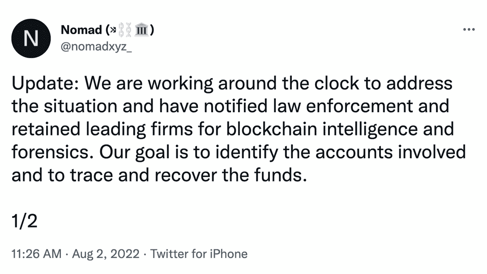
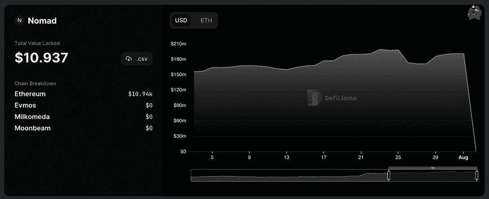
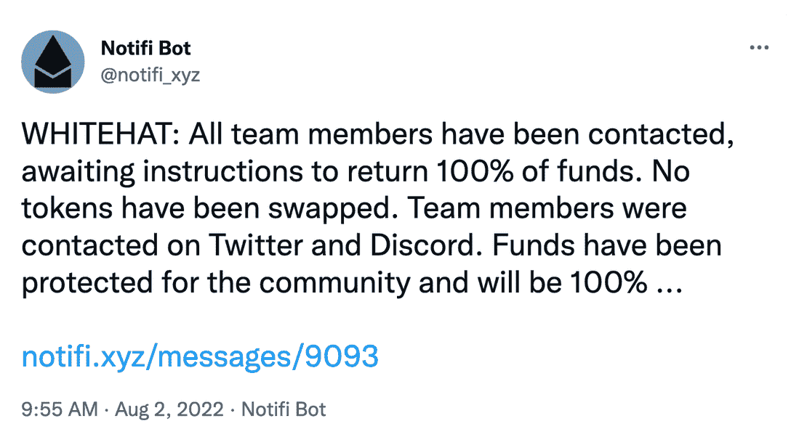

# 游牧桥黑客导致第一次分散寻找

> 原文：<https://web.archive.org/web/https://dappradar.com/blog/nomad-bridge-hack-leads-to-first-decentralized-looting>

## 几名不同的黑客窃取了近 2 亿美元的资金

跨链令牌桥 Nomad 成为一系列攻击的受害者，这些攻击在周一耗尽了几乎所有资金。在一次前所未有的事件中，一名黑客攻击了这座桥，随后数百个其他地址系统地复制了这次攻击。这一系列交易彻底动摇了协议，最终只有 651.54 美元的资金。目前，Nomad 的总锁定价值(TVL)约为 10.937 美元。

混乱的事件始于一次攻击，这次攻击取走了价值 230 万美元的 100 [包装好的比特币](https://web.archive.org/web/20220813210823/https://dappradar.com/hub/token/eth/WBTC) (WBTC)。尽管社区分享了警报，Nomad 宣布正在调查这一情况，但其他几项交易很快跟进。

[<picture></picture>](https://web.archive.org/web/20220813210823/https://twitter.com/nomadxyz_/status/1554413278406721537)

在接下来的几个小时里，这些袭击夺走了价值 1.907 亿美元的 WBTC、[美元硬币](https://web.archive.org/web/20220813210823/https://dappradar.com/hub/token/eth/USDC) (USDC)、[包裹的乙醚](https://web.archive.org/web/20220813210823/https://dappradar.com/hub/token/eth/WETH) (WETH)以及其他几样代币。

随着大门向其他黑客敞开，其他不同的地址也利用了安全漏洞。分析师 FatManTerra 在推特上写道,*有人从 Nomad 桥上抢走了$ 3K-2 万美元。一个人所要做的就是复制第一个黑客的交易并更改地址，然后通过以太扫描点击发送。第一次分散式抢劫。”*

通过下面的 [DeFiLlama](https://web.archive.org/web/20220813210823/https://defillama.com/protocol/nomad) 中跟踪的数据，您可以更好地了解攻击的影响。

令人欣慰的是，一些人提取了资金，然后将它们归还给协议(白人黑客)。这些捐助者中的一些已经开始大声疾呼。

[<picture></picture>](https://web.archive.org/web/20220813210823/https://twitter.com/notifi_xyz/status/1554390350352883712)

## 什么是游牧桥？

Nomad 是一个桥梁，一个协议，允许你在区块链之间移动令牌，在这种情况下，[雪崩](https://web.archive.org/web/20220813210823/https://dappradar.com/rankings/protocol/avalanche)，[以太坊](https://web.archive.org/web/20220813210823/https://dappradar.com/rankings/protocol/ethereum)，[月光](https://web.archive.org/web/20220813210823/https://dappradar.com/rankings/protocol/moonbeam)，埃夫莫斯和米尔科米达 C1。

在黑客入侵的几天前，Nomad 宣布比特币基地风险投资公司和 Polychain Capital 等几家主要投资者参与了筹集 2200 万美元的种子轮投资。

Nomad 团队一直支持该社区，目前正在努力确定参与黑客攻击的账户，以追回资金。

例如，游牧桥并不是以太坊和雪崩之间的唯一桥梁。因此 dapp 生态系统几乎没有感受到黑客攻击的影响。然而，DeFi dapp 本齐确实看到了雪崩区块链的活动突然激增，但这可能是一个巧合。

类似地，在 Moonbeam 生态系统中，DeFi 平台上的交易活动在黑客入侵之后或期间迅速增加。从 DappRadar 上的 [Moonbeam 排名可以看出，Solarflare 和 Beamswap 的活动都非常活跃。](https://web.archive.org/web/20220813210823/https://dappradar.com/rankings/protocol/moonbeam)

## 桥牌黑客模式

桥梁袭击在 2022 年变得更加普遍。随着越来越多的人需要将数字资产从一个区块链转移到另一个，或者是因为另类区块链上 DeFi 协议的兴起，或者是因为玩赚游戏，黑客对这些桥梁的兴趣也在增长。

根据 Rekt 数据库，2022 年第一季度有 12 亿美元的加密资产被盗，其中 80%来自 bridges。

2022 年 3 月，Ronin bridge 遭受了一次攻击，损失了 6 亿美元。结果，Axie Infinity 的活动在接下来的 24 小时内下降了 17%，但最终恢复了。

然而，在 Nomad bridge 攻击事件中，利用这一漏洞的不仅仅是一个有组织的团体。任何人都可以简单地复制代码，这导致了分散的大规模盗窃。

*   **了解更多关于 bridges 的弱点和最近的攻击:** [**区块链 Bridges 如何成为黑客的首要目标**](https://web.archive.org/web/20220813210823/https://dappradar.com/blog/how-blockchain-bridges-became-hackers-prime-targets)

## 通过 DappRadar 了解最新新闻

对于寻找机会的人来说，及时了解加密领域的最新动态是非常重要的。

通过 [DappRadar 博客](https://web.archive.org/web/20220813210823/https://dappradar.com/blog/)、 [Youtube 频道](https://web.archive.org/web/20220813210823/https://www.youtube.com/c/DappRadar)和 [Twitter 账户](https://web.archive.org/web/20220813210823/https://twitter.com/dappradar)，不断了解令人兴奋的去中心化应用世界。

 NewsletterUnsubscribe at any time. [T&Cs](https://web.archive.org/web/20220813210823/https://dappradar.com/terms) and [Privacy Policy](https://web.archive.org/web/20220813210823/https://dappradar.com/privacy-policy)