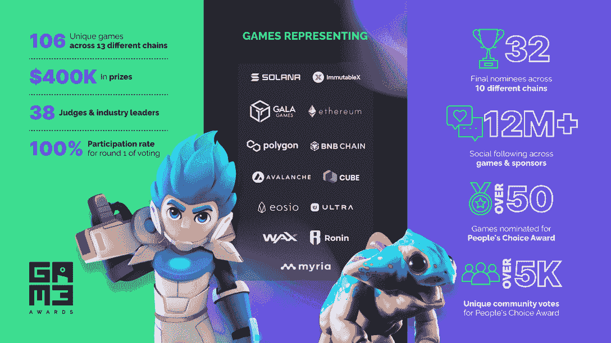

# 首届 Web3 GAM3 奖提名揭晓

> 原文：<https://web.archive.org/web/https://dappradar.com/blog/nominees-revealed-for-inaugural-web3-gam3-awards>

## 争夺 16 个类别奖项的顶级作品和创作者

Polkastarter Gaming 将于 2022 年 12 月 15 日举办首届 Web3 GAM3 大奖。对于这个行业来说，这是一个巨大的进步，因为总部位于区块链的游戏公司希望在价值数十亿美元的游戏世界中确立自己的合法地位。

开发工作室和独立创作者花了 2022 年的时间用预告片逗我们，并发布即将到来的游戏的早期版本。2023 年有望成为区块链奥运会走向成熟的一年。

[投票现已开放](https://web.archive.org/web/20221201051704/http://polkastarter.gg/gam3awards/)粉丝们可以加入讨论并发表自己的意见。

[Explore Web3 Games](https://web.archive.org/web/20221201051704/https://dappradar.com/rankings/category/games)

## GAM3 大奖

Polkastarter Gaming 的首届 GAM3 大奖将表彰 Web3 行业中令人兴奋且不断增长的部分。除了专门为区块链游戏设立的 13 个奖项外，还有三个额外的奖项向更广泛的 Web3 游戏社区致敬。

共有 106 款游戏被提名，其中[多边形](https://web.archive.org/web/20221201051704/https://dappradar.com/rankings/protocol/polygon/category/games)、 [BNB 链](https://web.archive.org/web/20221201051704/https://dappradar.com/rankings/protocol/binance-smart-chain/category/games)和[索拉纳](https://web.archive.org/web/20221201051704/https://dappradar.com/rankings/protocol/solana/category/games)是排名前三的网络代表。专家评审团已经将被提名的游戏减少到 32 个。多边形和[不可变 X](https://web.archive.org/web/20221201051704/https://dappradar.com/rankings/protocol/immutablex/category/games) 各有八个提名者。

The stats for GAM3 Awards

Polkastarter 的游戏主管 Omar Ghanem 对 GAM3 大奖有这样的评价:

> 我们要感谢参与第一轮 GAM3 奖项投票的 38 位评审团成员。尽管手头有超过 100 款游戏要完成，但 100%的投票参与进一步证明了每个人对看到 web3 游戏行业的发展和增长是多么兴奋。
> 
> Omar Ghanem, Head of Gaming at Polkastarter

## 奖项类别

GAM3 奖项共有 13 个类别，代表了区块链游戏界的一些最大的奖项:

*   年度最佳游戏:火山爆发，大时代，众神被解放，丰收，卓越

*   **最值得期待的游戏**:火山爆发，弹片，星际地图，灰烬之剑，树节

*   最佳图形奖:Illuvium，Star Atlas，Metalcore，Big Time，My Pet Holligan

*   最佳动作游戏:大时代，伊留威姆，Metlacore，守护者协会，Superior

*   最佳手游:守护者协会、夹板地、皇家疾风、Thetan 竞技场、Skyweaver

*   最佳冒险游戏:大时代，来自另一个太阳的地球，我的宠物小流氓，沙盒，欧罗里

*   最佳休闲游戏:布兰科斯街区派对，Thetan 竞技场，我的宠物流氓，Axie Infinity Origins，Venari 传奇

*   最佳角色扮演游戏:大时代，遗迹，奥瑞，西弗，幻影星系

*   **最佳射击游戏** : Metalcore，EV。木卫一，不死街区，地灵宫，来自另一个太阳的地球

*   最佳策略游戏:被解放的神、穿越时代、织女、不朽游戏、以太之卡

*   最佳卡牌游戏:被解放的神、夹板地、Axie Infinity Origins、Skyweaver、以太之牌

*   **最佳多人游戏** : Blankos 街区派对、我的宠物流氓、Metalcore、大时代、EV。超正析象管(Image Orthicon)

*   **最佳电竞游戏** : EV。木卫一，金属核心，被解放的神，行星魔咒，蜘蛛坦克

不出所料，像[被解放的神](https://web.archive.org/web/20221201051704/https://dappradar.com/multichain/games/gods-unchained)、[伊鲁维姆](https://web.archive.org/web/20221201051704/https://dappradar.com/multichain/games/illuvium-1)和[星际地图](https://web.archive.org/web/20221201051704/https://dappradar.com/solana/games/star-atlas)这样的游戏是主要特色。这三款游戏都获得了多项提名，这证明了它们的受欢迎程度和质量。您可以使用 DappRadar 的工具来研究列表中每个游戏的链上性能。

我们还提供安全链接，将直接带您到平台，而不用担心到达一个虚假的网站。

[Explore Nominated Games](https://web.archive.org/web/20221201051704/https://dappradar.com/rankings/category/games)

### 三个额外的类别

以上类别旨在认可我们在 Web3 游戏中发现的惊人品质。以下三个奖项是向更广泛的区块链游戏社区致敬的特别奖项。

*   **最佳内容创建者**是为宣传和推动项目采用的人和平台。

*   **游戏选择奖**是游戏认可游戏的地方。这是游戏行业为他们最喜欢的游戏提名和投票的地方。

*   **人民选择奖**是粉丝投票。在这里，玩游戏的人有机会表达他们的观点。

[Vote for GAM3 Awards](https://web.archive.org/web/20221201051704/http://polkastarter.gg/gam3awards/)

## 随身携带您的 Web3 之旅

使用 DappRadar 移动应用程序，再也不会错过 Web3。查看最受欢迎的 dapps 的性能，并关注您投资组合中的 NFT。您在 DappRadar 上的帐户会与我们的移动应用程序同步，这样您很快就可以选择实时接收提醒。

[Download the DappRadar app now](https://web.archive.org/web/20221201051704/https://dappradar.app.link/blog)[<picture></picture>](https://web.archive.org/web/20221201051704/https://play.google.com/store/apps/details?id=com.portfolio.dappradar)