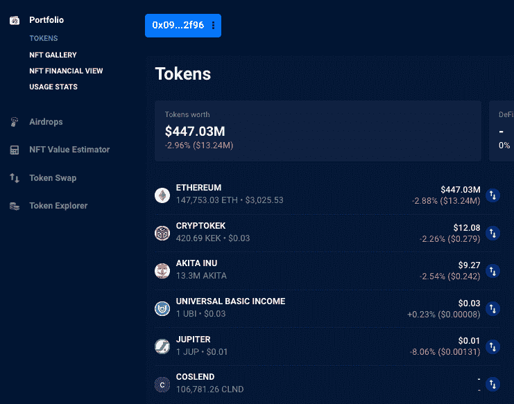
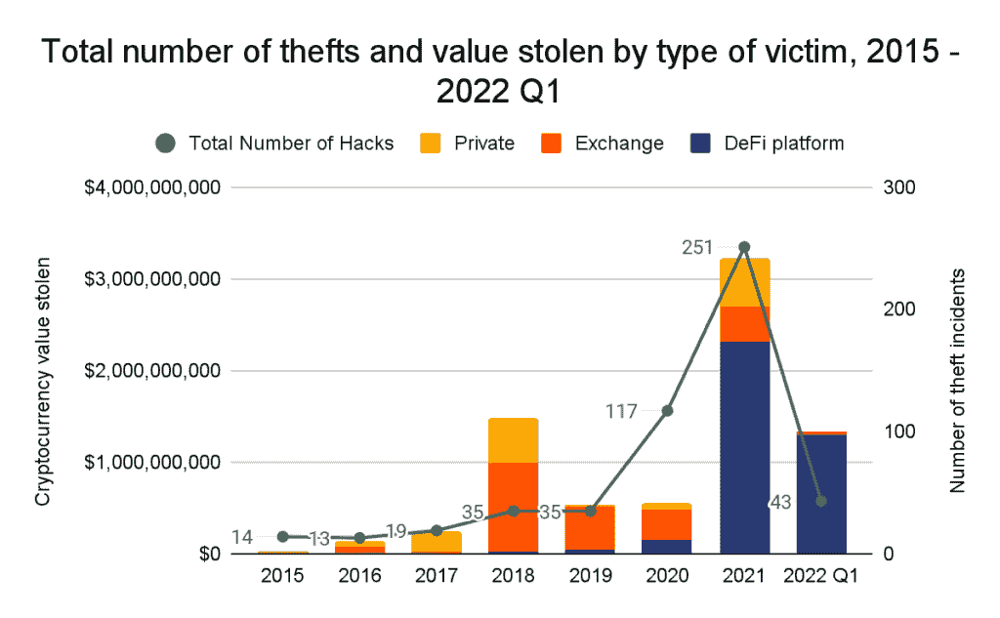
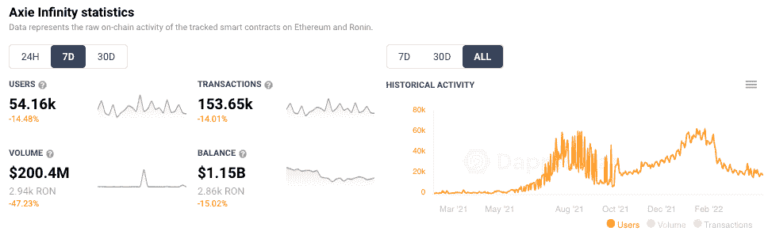

# 6 亿美元浪人黑客背后的朝鲜拉扎勒斯黑客

> 原文：<https://web.archive.org/web/https://dappradar.com/blog/north-korean-lazarus-hackers-behind-600-million-ronin-hack>

## 美国财政部制裁办公室将一个据称由 Lazarus 持有的加密钱包列入黑名单

周四，美国财政部在制裁名单****中增加了一个以太坊地址后，一群被称为 Lazarus 的朝鲜黑客被认定为浪人桥黑客事件的幕后主使之一。Chainalysis 证实该地址参与了 Ronin hack，在攻击期间从 Ronin Bridge smart 合同中获得了 173，600 ETH 和 2550 万 USDC。****

 **## 摘要

*   当 DappRadar 在 4 月 15 日周五检查钱包时，该地址有 147，000 ETH，价值约 4.47 亿美元。
*   [ETH 地址](https://web.archive.org/web/20220925073714/https://dappradar.com/hub/wallet/eth/0x098b716b8aaf21512996dc57eb0615e2383e2f96/assets)现已在所有 Chainalysis 产品的制裁类别中标注。
*   Elliptic [估计](https://web.archive.org/web/20220925073714/https://www.elliptic.co/blog/540-million-stolen-from-the-ronin-defi-bridge?utm_campaign=Ronin%20hack&utm_content=204725261&utm_medium=social&utm_source=twitter&hss_channel=tw-1344645140)14%的被盗资金已经被洗钱。

[Ronin 是 Sky Mavis 打造的定制侧链](https://web.archive.org/web/20220925073714/https://dappradar.com/ethereum/defi/ronin-bridge)。它连接到主以太坊区块链，支持领先的[即玩即赚游戏 Axie Infinity](https://web.archive.org/web/20220925073714/https://dappradar.com/multichain/games/axie-infinity) 的玩家进行更快更便宜的交易。这次黑客攻击是加密史上最广泛的利用。

Source: [DappRadar](https://web.archive.org/web/20220925073714/https://dappradar.com/hub/wallet/eth/0x098b716b8aaf21512996dc57eb0615e2383e2f96/assets)

新指定的 ETH 地址现已在所有 Chainalysis 产品的制裁类别中标记。追踪公司 Elliptic [估计，截至 4 月 14 日星期四，14%的被盗资金已经被洗钱。Ronin Network 在一篇](https://web.archive.org/web/20220925073714/https://www.elliptic.co/blog/540-million-stolen-from-the-ronin-defi-bridge?utm_campaign=Ronin%20hack&utm_content=204725261&utm_medium=social&utm_source=twitter&hss_channel=tw-1344645140)[博客文章](https://web.archive.org/web/20220925073714/https://roninblockchain.substack.com/p/community-alert-ronin-validators?s=w)中称，联邦调查局已经将 Lazarus 与验证器漏洞联系起来，财政部已经批准了这笔资金。此外，据信这是美国财政部制裁办公室首次将涉嫌持有 Lazarus 加密钱包的人列入黑名单。

## 黑客在崛起

[据 chain analysis](https://web.archive.org/web/20220925073714/https://blog.chainalysis.com/reports/2022-defi-hacks/?utm_campaign=twitter&utm_source=OrganicSocial&utm_content=Thread)报道，黑客从 DeFi 平台窃取的加密货币比以往任何时候都多。在最近的一份报告中，他们表示，在过去，加密货币黑客攻击主要是安全漏洞的结果，黑客可以获得受害者的私钥。这相当于扒窃的密码。ronin Network 2022 年 3 月的漏洞显示了这种技术的持续有效性。此外，他们指出，将 Ronin 黑客事件归咎于 Lazarus Group 突显了行业需要更好理解的两件重要事情。首先，朝鲜附属的威胁行为者如何利用密码，其次，DeFi 协议的更好的安全性。

Source: Chainalysis

## Axie & Ronin 的棘手时刻

这一消息将受到那些资金受到攻击的人的欢迎。更广泛的社区应将其视为在安全和与调查网络犯罪的人员合作方面朝着正确方向迈出的步伐。在 Axie 宣布在由世界上最大的加密交易所[币安](https://web.archive.org/web/20220925073714/https://dappradar.com/blog/binance-chain-and-binance-smart-chain-become-bnb-chain/)牵头的一轮融资中获得 1.5 亿美元后，这一消息将 Axie 推回了正确的方向，Animoca Brands、a16z、diadicular、Paradigm 和 Accel 也参与了融资。

与此同时，Sky Mavis 的领先游戏 Axie Infinity 经历了一段艰难的时期，但在一夜之间失去了近一半的用户后，似乎正在从这一漏洞中反弹。连接到 [Axie 的唯一活跃钱包比前一周下降](https://web.archive.org/web/20220925073714/https://dappradar.com/multichain/games/axie-infinity)约 15%,但随着信心的恢复而恢复。更重要的是罗宁桥的[重新开放。](https://web.archive.org/web/20220925073714/https://dappradar.com/ethereum/defi/ronin-bridge)

Ronin 表示，在重新部署 Ronin Bridge 之前，它仍在增加额外的安全措施，目标是在 4 月底之前部署，并承诺不久后对该漏洞进行全面的事后分析。与此同时，分散交易所[武士刀](https://web.archive.org/web/20220925073714/https://dappradar.com/ronin/defi/katana)已经恢复运营。

[<picture></picture>](https://web.archive.org/web/20220925073714/https://dappradar.com/ethereum/games/axie-infinity)[<picture></picture>](https://web.archive.org/web/20220925073714/https://dappradar.com/blog/axie-infinity-biggest-contributor-to-august-game-nft-trading/)[<picture></picture>](https://web.archive.org/web/20220925073714/https://dappradar.com/hub/swap/eth/ETH/AXS?to=0xbb0e17ef65f82ab018d8edd776e8dd940327b28b)

***以上不构成投资建议。此处给出的信息仅供参考。请行使尽职调查，做你的研究。作者持有多种加密货币的头寸，包括 BTC、瑞士法郎和雷达。***

 NewsletterUnsubscribe at any time. [T&Cs](https://web.archive.org/web/20220925073714/https://dappradar.com/terms) and [Privacy Policy](https://web.archive.org/web/20220925073714/https://dappradar.com/privacy-policy)**