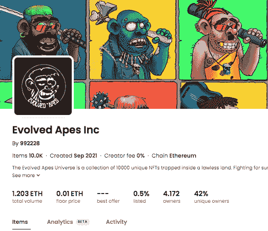
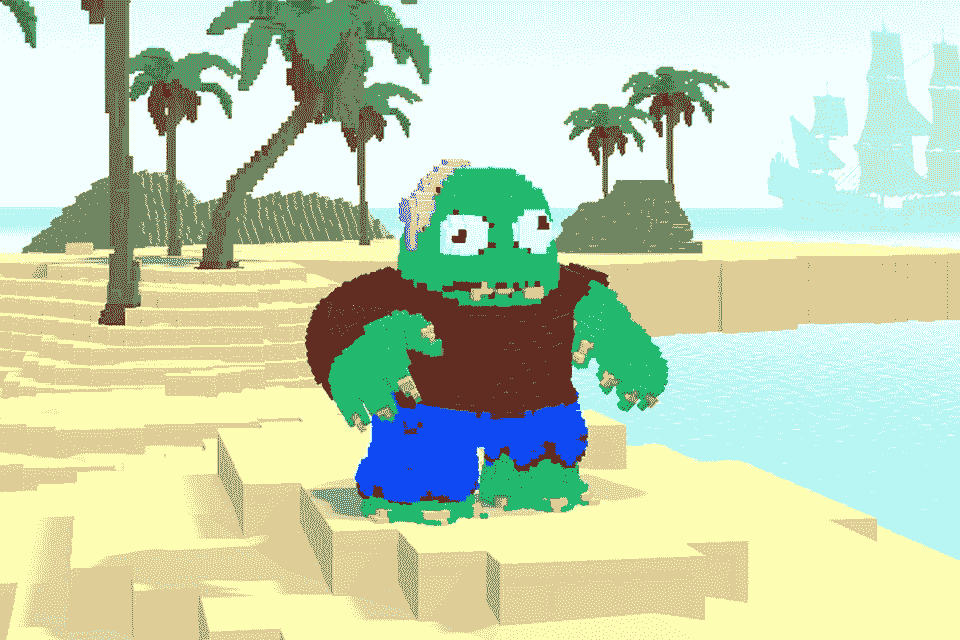
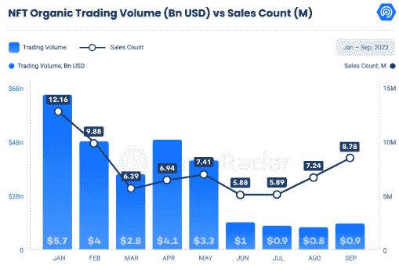

# 并非所有的地毯拉手都是一样的

> 原文：<https://web.archive.org/web/https://dappradar.com/blog/not-all-rug-pulls-are-created-equal>

## 加入我们，用 Daz3D 来看看 NFT 的地毯拉手

对 NFTs 和 Web3 世界的陌生感可能会让人不知所措。每天都有如此多的现有项目和新项目涌现，人们很容易沉浸在兴奋之中，被炒作所吸引。

但是并不是所有的项目都是平等的。在这篇文章中，我们将探讨人们使用术语“地毯拉扯”的一些不同方式，以及如何接受教育，这样它就不会发生在你身上。

## 内容

*   **[“拉地毯”到底是什么意思？](https://web.archive.org/web/20221127182436/https://dappradar.com/blog/not-all-rug-pulls-are-created-equal/#What-does-‘Rug-Pull’-even-mean?)**
*   地毯里有什么？进化猿的教训
*   **[进化后的猿怎么了？](https://web.archive.org/web/20221127182436/https://dappradar.com/blog/not-all-rug-pulls-are-created-equal/#What-happened-to-Evolved-Apes?)**
*   **[‘地毯拉’长什么样？](https://web.archive.org/web/20221127182436/https://dappradar.com/blog/not-all-rug-pulls-are-created-equal/#What-do-‘Rug-Pulls’-look-like?)**
*   **[是‘地毯拉’吗？](https://web.archive.org/web/20221127182436/https://dappradar.com/blog/not-all-rug-pulls-are-created-equal/#Is-it-a-‘Rug-Pull‘-?)**
*   **[如何识别危险信号？](https://web.archive.org/web/20221127182436/https://dappradar.com/blog/not-all-rug-pulls-are-created-equal/#How-to-spot-the-red-flags?)**
*   **[在地毯上自学](https://web.archive.org/web/20221127182436/https://dappradar.com/blog/not-all-rug-pulls-are-created-equal/#Educate-yourself-on-rugs)**

* * *

通过对 NFT 空间的自我教育，你可以学会区分那些有真实、切实目标的项目和那些旨在拿走你的钱的项目。

有些项目的初衷是好的，但运营得不好。其他的完全是夸大其词，背后没有实质内容。还有一些则是彻头彻尾的骗局——他们不会兑现承诺，甚至根本不会兑现任何东西。

[Discover NFT Collections](https://web.archive.org/web/20221127182436/https://dappradar.com/nft/collections)

作为一个社区，我们必须为自己设定标准:我们如何帮助彼此做出关于我们在哪里投入时间和精力的好决定？

## “拉地毯”是什么意思？

不幸的是，Rug pulls 已经成为 Web3 游戏中的常见事件，术语“Rug”被用来描述任何以某种方式出错的项目或体验。从 ETH 的罪犯和坏演员杜平社区到被从 Twitter 空间中删除，术语“Rug”被误用和误传。

如果你是 Web3 的新手，这可能会令人困惑，所以让我们通过观察不同的案例，如进化猿、大爸爸猿俱乐部、MekaVerse 和 Pixelmon，来探索什么是“拉地毯”,什么不是。

## 地毯里有什么？来自进化猿类的教训

从表面上看，进化猿 NFT 收藏馆的官方 OpenSea 页面看起来没什么特别的。

Source: [OpenSea](https://web.archive.org/web/20221127182436/https://dappradar.com/multichain/marketplaces/opensea)

页面顶部的统计数据概述了超过 1200 ETH 的交易量和 0.01 的当前底价。该系列的头像和横幅照片宣传了该项目的艺术。

完整的 10，000 NFT 收藏在项目选项卡下，左边的过滤器面板允许您按特征组织它。项目描述将这 10，000 名 NFT 描述为“被困在一片无法无天的土地上”。为生存而战，只有最强的猿猴才会得胜。”

两周前，一个 NFT 甚至卖到 01 ETH(约 20 美元)。只有进化的类人猿与你典型的欣欣向荣的 NFT 项目相去甚远。

## 进化后的猿怎么了？

该项目在造币日不到 10 分钟就销售一空，筹集了 270 万美元。不久之后，网站关闭，项目创始人删除了他们的 Twitter 账户，798 Eth 被取消了合同——这一点的证据在区块链随处可见。

## “地毯拉”是什么样子的？

拉地毯有多种形式:一些是利用机器人创建虚假社区的骗局，而另一些是由魅力四射的创始人领导的，他们创建真实、热情的社区，如进化猿的例子。

地毯是一个蓄意的骗局，一个 NFT 项目的创始人发起了一个集合，但在社区已经为他们的 NFT 付费后就放弃了它。创始人带着资金消失了，留给社区的是一袋袋毫无价值的 JPEGs 图片。

以下是一些经过确认的地毯拉手示例:

### 进化的类人猿

拉地毯经常发生在艺术被揭示之后，这对进化的猿来说也不例外。据报道，收藏家们从一开始就注意到了危险信号，但他们确信这些 NFT 将是下一个最好的东西。创作者，恰当地命名为“邪恶猿”，在公共造币厂之后删除了所有的社交媒体平台，欺骗了社区和艺术家。

### 大爸爸猿俱乐部

这是索拉纳区块链上最大的 NFT 地毯之一，在这个例子中，在一个 NFT 被铸造到区块链上之前，创始人耗尽了社区资金。

这个项目背后的人带着 130 万美元，乘着以猿为主题的 NFT 的炒作浪潮，一炮而红。失望的收藏者发现自己在投入资金铸造这些从未存在过的非功能性邮票后两手空空。

## 这是“拉地毯”吗？

虽然“大爸爸猿俱乐部”和“进化猿”是教科书式的地毯，但像 2021 年秋天的 MekaVerse mint 这样的项目已经被错误地归类为一个项目。

在 MekaVerse 的艺术展示前几个小时，连锁侦探发现收藏中的“传奇”NFT 正在被交易。鉴于在艺术品和稀有性为人所知之前进行这些交易所需的内幕信息，这种下跌显然是被操纵的。

尽管传播内幕信息背后的罪魁祸首尚不清楚，但社区很快就指责了创始人。

无论如何，MekaVerse 不是地毯，因为创始人没有明确带着项目资金逃跑并放弃收藏。

今年早些时候,“地毯”的绰号也被错误地用于 Pixelmon 事件。Pixelmon 被吹捧为一款有可能取代 Axie Infinity 的 NFT 元宇宙游戏。

Source: Kevin – Pixelmon (past version)

大肆宣传使他们的 NFT 生物下降项目达到 7000 万美元的销售额。但当 Pixelmon 创始人马丁·范·布雷克(Martin Van Blerk)透露团队正在建设的艺术和计划时，社区对此无动于衷，他们指责他用一个精心制作的 7000 万美元的地毯来欺骗他们。Pixelmon 甚至凭借一本在线杂志赢得了“本月地毯”奖。

[Discover Pixelmon](https://web.archive.org/web/20221127182436/https://dappradar.com/ethereum/collectibles/pixelmon)

但是，Pixelmon 不是地毯。范·布雷克野心太大，贪多嚼不烂。此外，他向那些让他失望的人道歉，并承诺补救这种情况，将该项目的一部分股份出售给 LiquidX 工作室，该工作室宣布将接管该项目的领导权。

## 如何识别危险信号？

我们整理了一份你应该关注的重要事情的基本清单。请注意，我们将深入探讨如何保护您免受地毯拉扯的伤害，因此请务必阅读我们的系列文章，了解更多关于您自己的研究和 NFT 安全的信息。

1.  **研究创始团队**:一个 doxed 的团队总是比一个匿名的好。
2.  **检查社交媒体关注者的不成比例的数量:**Twitter 关注者的数量较少，加上 Discord 上的大量关注者，这可能意味着团队正在购买机器人以产生人为的兴趣
3.  **查看项目的网站:**是否显得业余，是否很慢，或者拼写错误百出？
4.  **使用 DappRadar 的 NFT 浏览器分析购买历史:**对某个项目感到怀疑还是好奇？该工具提供带有相应钱包 id 的数据和指标(包括销售活动)

## 自学地毯

MekaVerse 和 Pixelmon 的争议都涉及创始人的失误，这些失误消除了社区信任，降低了项目价值。但是根据定义，它们不是地毯。虽然有些人可能认为区分地毯的确切性质和普通的骗局没有意义，但教育人们了解 NFT 中大量存在的许多危险的细微差别是必不可少的。

地毯可以说是最深最险恶的 NFT 骗局，因为它是对 NFT 空间未来的生存威胁。一个成功的 rugger 必须向他们的社区灌输一层深深的信任，以产生必要的销售来偷走；使得背信行为更具毁灭性。任何穿过地毯的人都会留下强烈的疤痕，这可能会动摇他们购买另一个 NFT 的决心。

Source: [DappRadar Blockchain Industry Report Q3](https://web.archive.org/web/20221127182436/https://drive.google.com/drive/folders/1Q25UPTwTskSQbcCb9tFVgwDUC6f3ho1v)

上图显示，尽管 2022 年以太坊的 NFT 交易量比 Q2 下降了 76%，但 NFT 交易量却增长了 11%。尽管有地毯和灰熊市场，这种情况还是发生了。

虽然有时地毯拉是不可能预测的，但在“模仿”一个项目之前研究 NFT 空间是极其必要的，尤其是在一切都被过度炒作的牛市中。

鉴于我们进入从 2021 年春天开始的 NFT 炒作周期已近两年，NFT 收藏家有大量的数据和见解可供使用。

像 dappar Dar 在 Twitter 上的 NFT 教育内容、T2 的不和谐、T4 的 YouTube 以及 dappar Dar 的 NFT 探索门户网站提供了关于收藏者正在投资的 JPEGs 图片背后的人的深刻见解。

[https://web.archive.org/web/20221127182436if_/https://www.youtube.com/embed/fkEaXYLOW-s?feature=oembed](https://web.archive.org/web/20221127182436if_/https://www.youtube.com/embed/fkEaXYLOW-s?feature=oembed)

但可悲的是，即使是最有知识和经验的收藏家仍然不时面临地毯被拉的风险。作为早期采用者所伴随的风险也是如此。

***这是研究 NFT 地毯拉花本质的系列文章的第一部分。该系列得到了 Fight Back Apes 的支持，这是一个超现实的 3D 猿类集合，具有复古未来主义美学，由进化猿类地毯拉的剩余持有者产生。跟随我们的系列来了解更多关于做你自己的研究和 NFT 安全***

 NewsletterUnsubscribe at any time. [T&Cs](https://web.archive.org/web/20221127182436/https://dappradar.com/terms) and [Privacy Policy](https://web.archive.org/web/20221127182436/https://dappradar.com/privacy-policy)