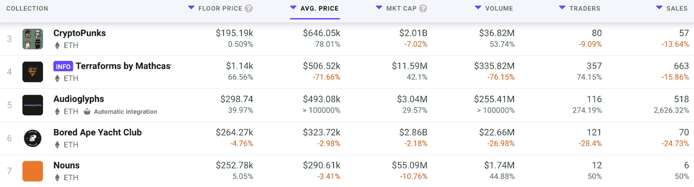
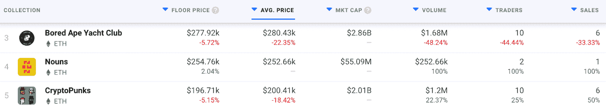
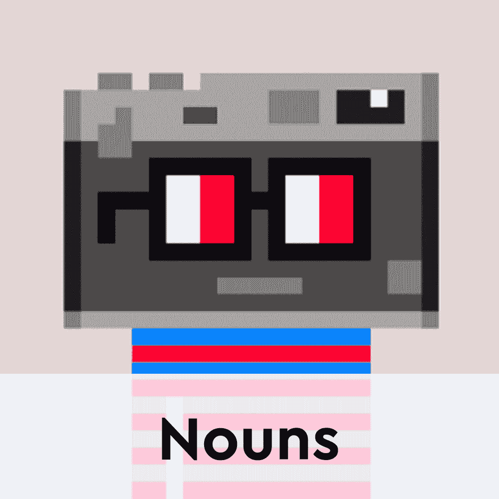
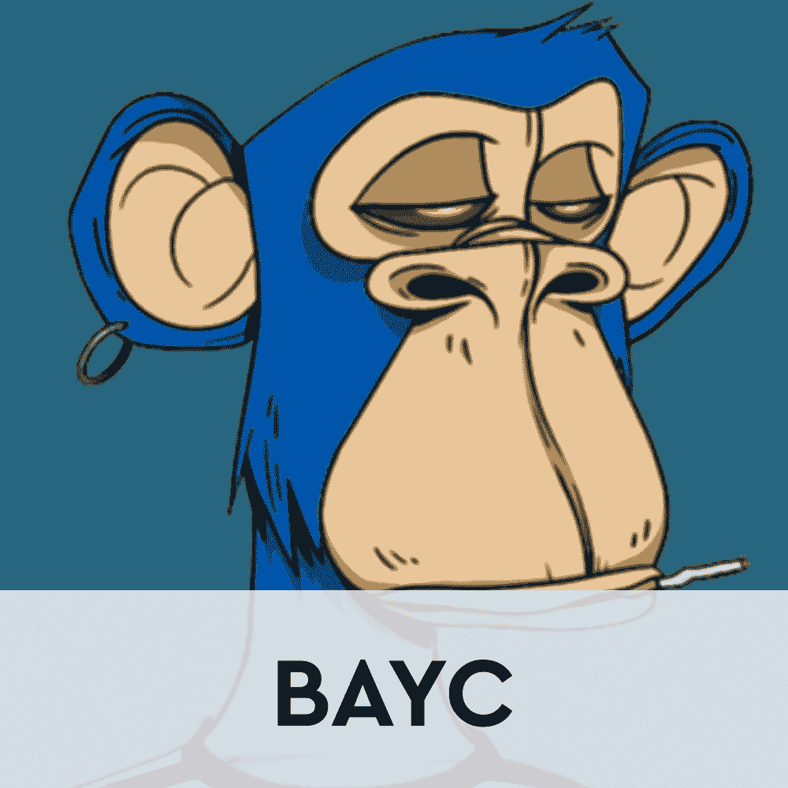

# 名词:与无聊的类人猿齐名的 NFT 收藏

> 原文：<https://web.archive.org/web/https://dappradar.com/blog/nouns-the-nft-collection-thats-on-par-with-bored-apes>

## 被低估还是后起之秀？名词 NFT 正在接管加密空间

名词 NFT 系列已经出现了一段时间，但它似乎没有引起竞争对手的关注和炒作。虽然无聊的 Ape 游艇俱乐部和 CryptoPunks 一直处于聚光灯下，但名词仍然是一个潜伏在阴影中的项目。然而，该系列似乎优于 CryptoPunks，并且也打算挑战 BAYC。

根据 [DappRadar 数据](https://web.archive.org/web/20230117053529/https://dappradar.com/nft/collections/1)显示，在过去 7 天内，一个名词 NFT 的平均支付价格为 252，780 美元。这使得该系列在达普拉达 NFT 顶级收藏排行榜中排名第七，仅次于 Bored Ape 游艇俱乐部。

更重要的是，在过去的 24 小时里，名词已经成功超过了平均销售价格为 252，660 美元的 CryptoPunks。相比之下，CryptoPunks 昨天的平均价格仅为 200，410 美元。

虽然名词的平均价格非常高，但这可能是因为藏品记录的交易数量相对较少。这使得平均价格更容易浮动到 25 万美元以上。名词收藏要达到像 [BAYC](https://web.archive.org/web/20230117053529/https://dappradar.com/ethereum/collectibles/bored-ape-yacht-club) 和[crypto 朋克](https://web.archive.org/web/20230117053529/https://dappradar.com/ethereum/collectibles/cryptopunks)这样的收藏交易活动还有很长的路要走。尽管如此，NFT 的拍卖正在接近 Bored Ape Yacht Club 这样的项目，这一事实强烈表明，该系列有可能成为一个真正的蓝筹项目。

## NFT 收藏的名词是什么？

名词是目前太空中最具实验性的 NFT 项目之一。完全在链上，每天智能合同的收集产生一个独特的名词 NFT。这个过程实际上是无止境的。一旦日常名词“NFT”出现在网站上，收藏者就有机会参与拍卖来购买代币。

名词持有者自动成为集合的治理体的一部分，称为名词道。重要的是，名词道还控制着国库，国库储存着 NFT 拍卖的所有收益。在撰写本文时，名词 DAO 拥有 20，339 ETH，相当于近 5，700 万美元。

有了如此规模的国库和无限量的 NFT 供应，收藏有一条有趣的路要走。虽然无限的供应对收藏家来说可能是一件好事，但它也是价格下降和稀缺性减少的先决条件。重要的是，要达到 20，000 只无聊的猿的数量，大约需要 50 年，因为每天都有一个 NFT 被铸造出来。尽管如此，该项目在过去几周内产生了令人羡慕的业绩。

DappRadar 将继续监测这一创新的完全连锁收集，因为它需要像 Bored Ape 游艇俱乐部和 CryptoPunks 这样的大牌。要了解更多关于名词及其主要竞争对手的信息，请点击下面的链接。此外，您还可以加入 [DappRadar PRO](https://web.archive.org/web/20230117053529/https://dappradar.com/token/pro) ，获取最新的连锁 NFT 销售数据。

[<picture></picture>](https://web.archive.org/web/20230117053529/https://dappradar.com/ethereum/collectibles/nouns)[<picture></picture>](https://web.archive.org/web/20230117053529/https://dappradar.com/ethereum/collectibles/bored-ape-yacht-club)[<picture></picture>](https://web.archive.org/web/20230117053529/https://dappradar.com/ethereum/collectibles/cryptopunks) NewsletterUnsubscribe at any time. [T&Cs](https://web.archive.org/web/20230117053529/https://dappradar.com/terms) and [Privacy Policy](https://web.archive.org/web/20230117053529/https://dappradar.com/privacy-policy)