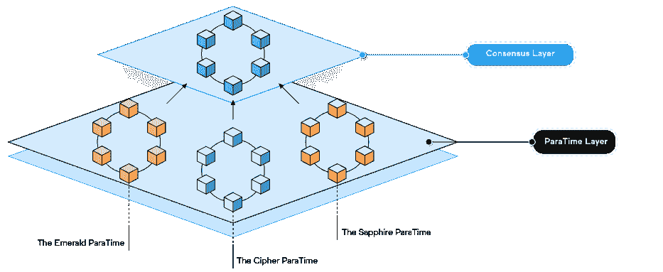

# Oasis 邀请开发人员加入 Sapphire Hackathon 并构建机密 Dapps

> 原文：<https://web.archive.org/web/https://dappradar.com/blog/oasis-invites-developers-to-join-sapphire-hackathon-and-build-confidential-dapps>

## 在 Solidity 中构建第一个机密 dapp 并赢得奖励。

Oasis 在其测试网上发布了 Sapphire ParaTime。Sapphire ParaTime 是行业首创的机密 EVM 运行时。开发人员可以用他们已经知道的语言体验 Web3 支持的保密性。此外，Oasis 邀请开发人员参加 Keep it Confidential Sapphire Hackathon，在 Solidity 中构建世界上第一个机密 dapp，并赢得奖品。

内容:

*   [什么是蓝宝石？](https://web.archive.org/web/20220926010813/https://dappradar.com/blog/oasis-invites-developers-to-join-sapphire-hackathon-and-build-confidential-dapps/#what)
*   [为什么保密很重要](https://web.archive.org/web/20220926010813/https://dappradar.com/blog/oasis-invites-developers-to-join-sapphire-hackathon-and-build-confidential-dapps/#why)
*   【Sapphire 如何解决保密问题？
*   蓝宝石对开发者友好。
*   [如何在蓝宝石上制作 dapp](https://web.archive.org/web/20220926010813/https://dappradar.com/blog/oasis-invites-developers-to-join-sapphire-hackathon-and-build-confidential-dapps/#create)
*   [加入 Keep It Confidential Hackathon，在 Sapphire 上进行构建](https://web.archive.org/web/20220926010813/https://dappradar.com/blog/oasis-invites-developers-to-join-sapphire-hackathon-and-build-confidential-dapps/#hackathon)

在传统的区块链中，存在一个隐私悖论:所有用户数据都是匿名存储的，但却是公开的。因此，在这个时代，随着人们高度重视数据主权，机密 dapps 正在成为 Web3 的必需品。

[Oasis](https://web.archive.org/web/20220926010813/https://dappradar.com/rankings/protocol/oasis) 最近在其[测试网](https://web.archive.org/web/20220926010813/https://medium.com/oasis-protocol-project/confidential-evm-paratime-sapphire-is-now-on-testnet-27f00cab35cc)上推出了 Sapphire Paratime，为 solidity 开发者提供了构建支持隐私的 dapps 的机会。它允许创建 dapps，可以在执行智能合同的同时使数据保密。

值得一提的是，一个充满活力的生态系统已经在绿洲网络上形成。您可以使用 [DappRadar Oasis Ranking 来查找当前最热门的绿洲 dapps。](https://web.archive.org/web/20220926010813/https://dappradar.com/rankings/protocol/oasis)

## 什么是蓝宝石？

Oasis 网络采用模块化架构，将共识和智能合同执行分为共识层和并行层。

共识层是一个可扩展的、高吞吐量的、安全的、利害关系证明的共识，由一组分散的验证器节点运行。同时，ParaTime 层托管许多并行运行时(para time ),以满足特定的需求，如机密计算、开放或封闭委员会等。

[Sapphire ParaTime 是一个突破性的开发环境](https://web.archive.org/web/20220926010813/https://medium.com/oasis-protocol-project/confidential-evm-paratime-sapphire-is-now-on-testnet-27f00cab35cc)，因为它是第一个也是唯一一个机密的以太坊虚拟机(EVM)兼容 ParaTime。这个运行时可以帮助区块链迅速向 Web3 扩展。此外，它允许 EVM 开发人员快速为隐私要求的区块链 dapps 奠定基础，满足用户对数据主权日益增长的需求。

作为绿洲网络上官方机密的 EVM 兼容的 ParaTime，Sapphire 拥有以下功能。

*   机密状态，端到端加密，机密随机性
*   EVM 兼容性
*   易于与 EVM 的 dApps 集成，如 NFT、元宇宙、加密游戏和 DeFi
*   可扩展性—高事务吞吐量
*   低成本—费用比以太坊低 99%以上
*   跨链桥接支持跨链互操作性(即将推出)

此外， [Sapphire 为 Solidity 开发人员提供了一个熟悉的、以太坊兼容的建筑环境，](https://web.archive.org/web/20220926010813/https://medium.com/oasis-protocol-project/confidential-evm-paratime-sapphire-is-now-on-testnet-27f00cab35cc)但具有 Oasis 隐私技术的额外优势。这是实现区块链驱动的 Web3 世界的关键。请继续阅读，找出原因。

## 为什么保密很重要

区块链提供了增强的信任、透明度和跨网络的数据可追溯性，开启了商业运营的新时代。然而，区块链目前的性质也带来了其他问题。例如，如果我们扩展到 Web3，我们需要承认敏感数据，如财务和健康信息，必须保持机密。

为了解决这个问题， [Sapphire 使 dapps 能够利用机密的智能合同。](https://web.archive.org/web/20220926010813/https://medium.com/oasis-protocol-project/confidential-evm-paratime-sapphire-is-now-on-testnet-27f00cab35cc)它允许钱包之间的交易保持可见、透明和安全，同时保持交易金额等数据的私密性。值得注意的是，这不同于我们今天在任何公共 EVM 上看到的。

通常，如果用户在公共 EVM 分散式交易所进行交易，任何人都可以看到这些交易的金额、输入和输出等。那么有没有可以选择性显示信息的技术呢？答案是肯定的。

Sapphire 为 EVM 开发人员提供了保密的智能合同，允许他们隐藏智能合同执行的某些方面。通过这种方式，Sapphire 使 Solidity 开发人员能够构建保护用户隐私的 dApps，从而增强用户体验。

## Sapphire 如何解决保密性问题？

Sapphire 制定了 Oasis 的隐私技术，该技术要求节点使用一种称为可信执行环境(TEE)的安全计算技术。我们可以将 TTE 视为执行智能合约的黑盒。

通过密钥管理，加密的数据与智能合同一起进入黑盒子(称为安全区域)。然后，在黑盒中，数据被解密，由智能合约处理，之后，在被发送出安全区域之前再次加密。

该过程确保数据保持机密，并且对于节点运营商或应用开发者是不可见的。

## Sapphire 对开发者友好。

Oasis 已将隐私保护技术融入其 DNA。Oasis 上的其他 ParaTimes，如 Cipher，继承了 Oasis 相同的隐私保护功能。同样，Sapphire 利用了相同的技术，但为开发人员提供了 EVM 兼容性。这是什么意思？

已经普遍采用的面向用户的工具仍在使用，如 Web3 gateway、wallet、block explorer 等。开发人员也可以使用他们熟悉工具，如 Solidity/Vyper、Hardhat/Truffle 和 Web3.js/Ethers.

因此，Sapphire 使开发人员能够在几分钟内移植 dapp 并开始使用隐私技术，以及 RNG、签名和加密等新的内置功能。

Sapphire 的推出将极大地推动 Web3 的大规模采用。当 Oasis 推出 Emerald 时，它允许开发者将 dapps 从以太坊或其他 EVM 兼容的连锁店转移到 Oasis。

蓝宝石将绿洲作为区块链的多功能性推向了新的高度。它为 EVM 带来了保密性，同时利用了当前的 Oasis 基础设施、工具和生态系统。最重要的是，寻求创建隐私 DApps 的 solidity 开发者最终可以将他们的想法变成现实。

## 如何在蓝宝石上制作 dapp

Sapphire ParaTime 目前部署在 Testnet 上，Mainnet 计划在 2022 年晚些时候部署。开发人员现在可以利用 Testnet 来体验 Sapphire，这是一个机密的 EVM 兼容并行程序。

Oasis 旨在为开发人员提供开始使用 Sapphire 所需的所有信息。[在这个环节中，](https://web.archive.org/web/20220926010813/https://docs.oasis.dev/general/developer-resources/sapphire-paratime/writing-dapps-on-sapphire/)开发者可以了解蓝宝石和以太坊的区别，以及如何与蓝宝石集成编写安全的 dApps。

下面的视频也将帮助开发人员熟悉蓝宝石。

[https://web.archive.org/web/20220926010813if_/https://www.youtube.com/embed/ePp1fFSmKgI?feature=oembed](https://web.archive.org/web/20220926010813if_/https://www.youtube.com/embed/ePp1fFSmKgI?feature=oembed)

## 加入 Keep It Confidential 黑客马拉松，在 Sapphire 的基础上构建

Oasis 将在 9 月举办第一届 Sapphire Hackathon，为开发者提供构建第一个机密 EVM dapp 并赢得奖品的机会。点击此链接[注册黑客马拉松。](https://web.archive.org/web/20220926010813/https://oasisprotocol.org/hackathon?utm_source=dappradar&utm_medium=partnership&utm_campaign=sapphire-hackathon&utm_content=blog)

### 黑客马拉松快照

**日期**

*   2022 年 9 月 14 日—2022 年 10 月 14 日(世界协调时午夜)

**奖品**

*   一等奖——5000 美元(相当于玫瑰)
*   第二名奖金——2500 美元(相当于玫瑰)
*   三等奖——1500 美元(相当于玫瑰)

**类别**

黑客马拉松接受包括但不限于以下内容的想法。

*   包含敏感数据的应用程序
*   机密定义
*   赌博
*   机密 NFTs
*   DID–分散身份
*   去中心化的社会和灵魂束缚的象征

如果您正在寻找一些项目灵感，请查看 [DappRadar Oasis 排名，以](https://web.archive.org/web/20220926010813/https://dappradar.com/rankings/protocol/oasis)发现当前最热门的 Oasis dapps。此外，你可以加入[绿洲不和谐](https://web.archive.org/web/20220926010813/https://discord.com/invite/pJdWeVtmHT)，从其他社区成员那里获得想法。如果你准备好了，那么现在就[注册](https://web.archive.org/web/20220926010813/https://oasisprotocol.org/hackathon?utm_source=dappradar&utm_medium=partnership&utm_campaign=sapphire-hackathon&utm_content=blog) **！**

### 提交要求

*   对你的项目做一个总结，包括描述它是什么以及你想如何发展它。
*   提供一个到代码库的链接，用于判断和测试。代码必须是开源的。
*   提供智能合约部署链接([https://testnet . explorer . sapphire . oasis . dev](https://web.archive.org/web/20220926010813/https://testnet.explorer.sapphire.oasis.dev/))
*   包括一个视频(不到 5 分钟)，展示你的项目是如何工作的，以及你为什么要建立它。视频必须上传到 YouTube、Vimeo 或类似的网站并公开。

准备好之后，点击[立即注册](https://web.archive.org/web/20220926010813/https://oasisprotocol.org/hackathon?utm_source=dappradar&utm_medium=partnership&utm_campaign=sapphire-hackathon&utm_content=blog) **！**

### 评判标准

*   实现质量:项目是否展示了高质量的开发？
*   潜在影响:项目会产生多大的影响？该项目可能吸引多少用户？
*   创新:项目的创造性和独特性如何？
*   用户体验:项目的设计让用户体验变得容易了吗？
*   原创性:该项目必须与同一提交者/团队/组织提交的任何其他应用程序有实质性的不同，并且必须是提交者的原创作品。该项目必须完全由提交者所有，不得侵犯任何其他人或实体的知识产权。
*   保密性:dApp 如何利用保密性？

### 支持和相关文件

为了在 Sapphire Hackathon 期间支持参与者，Oasis 有一个专门的频道[# hackathons on thediscord](https://web.archive.org/web/20220926010813/https://discord.com/channels/748635004384313474/1016659883342446682)。在那里可以随意提问。此外，开发者可以通过这个链接找到开始蓝宝石开发[的指南和文档。](https://web.archive.org/web/20220926010813/https://docs.oasis.dev/general/developer-resources/sapphire-paratime/writing-dapps-on-sapphire/)

欲知更多信息，敬请关注，在 [Twitter](https://web.archive.org/web/20220926010813/https://twitter.com/OasisProtocol) 、 [Discord](https://web.archive.org/web/20220926010813/https://discord.com/invite/pJdWeVtmHT) 上关注 Oasis，并注册[时事通讯](https://web.archive.org/web/20220926010813/https://mailchi.mp/oasisprotocol/oasis-sapphire-hackathon)。

**了解更多关于 Oasis 和 Sapphire Hackathon 的信息:**

[网站](https://web.archive.org/web/20220926010813/https://oasisprotocol.org/)

[黑客马拉松注册](https://web.archive.org/web/20220926010813/https://oasisprotocol.org/hackathon?utm_source=medium&utm_medium=organic&utm_campaign=sapphire-hackathon)

[不和](https://web.archive.org/web/20220926010813/https://discord.com/invite/pJdWeVtmHT)

[推特](https://web.archive.org/web/20220926010813/https://twitter.com/OasisProtocol)

[中等](https://web.archive.org/web/20220926010813/https://medium.com/@oasis-foundation)