# 十月加密恢复带来更多的 NFT 交易者，黑客和利用

> 原文：<https://web.archive.org/web/https://dappradar.com/blog/october-blockchain-industry-report>

## 全球加密市场资本总额再次超过 1 万亿美元，增强了乐观情绪。

10 月份[行业唯一活跃钱包(UAW)](https://web.archive.org/web/20230120171943/https://dappradar.com/blog/dappradar-tracks-unique-active-wallets-but-what-does-that-mean/) 区块链 dapps 平均人数达 201 万，比 9 月份增长 6.84%。这一增长再次证明了该行业在不确定时期的韧性。

这一增长是由本月发生的多项公告和发展推动的。首先，在第二层协议 [Arbitrum](https://web.archive.org/web/20230120171943/https://dappradar.com/rankings/protocol/arbitrum) 和[乐观](https://web.archive.org/web/20230120171943/https://dappradar.com/rankings/protocol/optimism)中纳入以太坊上领先的流动赌注系统 Lido，导致独特活动钱包分别激增 501%和 83.31%。继续，NEAR Foundation 和 Google Cloud 宣布了新的合作关系，这使得其 UAWs 增加了 1，332.85%。

[Download PDF](https://web.archive.org/web/20230120171943/https://wp.dappradar.com/wp-content/uploads/2022/11/dappradar.com-oct-industry-report.pdf)

10 月份表现最好的股票是 Dogecoin，收盘报 0.12 美元，较月初上涨 50%。这一增长是由 Elon Musk 收购 Twitter 和 Dogechain 宣布其未来路线图推动的。

本月 Aptos 和 APT airdrop 的推出在加密货币领域掀起了波澜，促使许多交易员想知道他们如何才能参与其他即将到来的空投。Aptos 的 APT token 市值现已达到 10 亿美元，位列 50 大加密货币之一。

此外，NFT 的交易量和销售数量都下降了 30%，而独立交易者的数量上升了 18%，达到 111 万人。这表明新人对进入 NFT 行业感兴趣，需求仍然很高，正如我们目睹 Reddit 的 NFT 系列的成功一样。

除了市场表现之外，就大型组织和公司的采用情况而言，10 月是一个重要的月份。Visa、PayPal 和 Western Union 已经提交了加密产品和 Web3 相关服务的进一步商标申请。

此外，根据 DeFi scams，hacks and exploit[DeFi yield](https://web.archive.org/web/20230120171943/https://defiyield.app/rekt-database)的数据库，本月是全年资金损失最大的一个月:10.9 亿美元。跨链桥梁似乎是黑客的一大目标，本月 82%的损失可归因于他们。

在下面的报告中，我们概述了 10 月份一些最重要的趋势和数字。

## 关键要点

*   该行业独特的活跃钱包显示出复苏迹象，环比增长 6.84%(201 万)，但仍比 2021 年 10 月下降 31%。
*   Arbitrum 和乐观上个月的独特活跃钱包分别增长了 501%和 83.31%。这一增长得益于与 Lido 的整合，后者为第二层区块链提供了 900 万美元的 wet。
*   在谷歌云合作伙伴关系的推动下，NEAR 的无人机较 9 月增长了 1332.85%。
*   DeFi 10 月 TVL 较 9 月增长 5.33%(830 亿美元)；以太坊仍然占据 61.97%的主导地位，智能合约锁定了 510 亿美元。
*   Aptos 的 APT 币在推出两周后市值达到 10 亿美元，位列 50 大加密货币之一。
*   与 9 月份相比，NFT 的交易量和销售额下降了 30%，而独立交易商的数量却增加了 18%。
*   受 Reddit NFT 系列的成功推动，Polygon 在 NFT 的交易量和销售额较 9 月分别增长了 770%和 109%。
*   10 月份，超过 10 亿美元被盗，这是今年迄今为止最高的月度金额。

## 内容

*   [Dapp 行业概述](https://web.archive.org/web/20230120171943/https://dappradar.com/blog/october-blockchain-industry-report/#Dapp-Industry-Overview)
*   [DeFi 继续显示出复苏的迹象，比 9 月份增长了 5.33%](https://web.archive.org/web/20230120171943/https://dappradar.com/blog/october-blockchain-industry-report/#DeFi-continues-to-show-signs-of-recovery-with-a-5.33%-increase-from-September)
*   经过几个月的停滞后，加密市场似乎已经脱离了狭窄的范围
*   [118 万独立交易者进入 NFT 市场](https://web.archive.org/web/20230120171943/https://dappradar.com/blog/october-blockchain-industry-report/#1.18-Million-unique-traders-enter-the-NFT-market)
*   [NFT 市场竞争白热化](https://web.archive.org/web/20230120171943/https://dappradar.com/blog/october-blockchain-industry-report/#Competition-among-NFT-marketplaces-is-heating-up) [——零版税困境](https://web.archive.org/web/20230120171943/https://dappradar.com/blog/october-blockchain-industry-report/#The-zero-royalties-dilemma)
*   非金融资产正在成为证券吗？
*   [大型机构和企业继续拥抱 Web3](https://web.archive.org/web/20230120171943/https://dappradar.com/blog/october-blockchain-industry-report/#Large-institutions-and-corporations-continue-to-embrace-Web3-)
*   [游戏行业仍占整个行业使用量的 45%](https://web.archive.org/web/20230120171943/https://dappradar.com/blog/october-blockchain-industry-report/#The-gaming-sector-still-accounts-for-45%-of-the-industry’s-usage)
*   [10 月是资金被盗最多的月份](https://web.archive.org/web/20230120171943/https://dappradar.com/blog/october-blockchain-industry-report/#October-is-the-month-with-the-most-lost-funds)
*   [结论](https://web.archive.org/web/20230120171943/https://dappradar.com/blog/october-blockchain-industry-report/#Conclusion)

## Dapp 行业概述

10 月，区块链 dapps 的行业唯一活跃钱包数量平均每天达到 201 万，比 9 月增长 6.84%。这再次显示了该行业抵御宏观经济动荡的能力。区块链博彩业的 UAW 数量较前一个月减少了 2% (898K)，其主导地位也有所下降，降至 45%。另一方面，DeFi 比上个月增加了 7%(50.4 万)，自 6 月以来首次超过 50 万 UAW。

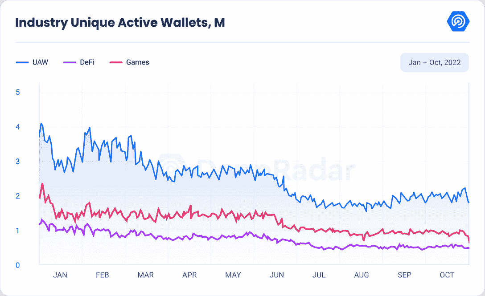

尽管该行业的趋势不容乐观，但仍有一些一线希望让用户对 dapp 行业的未来方向保持乐观。

与前一个月相比，第二层协议[仲裁](https://web.archive.org/web/20230120171943/https://dappradar.com/rankings/protocol/arbitrum)和[乐观](https://web.archive.org/web/20230120171943/https://dappradar.com/rankings/protocol/optimism)分别增加了 501%和 83.31%。这一增长是由最近对 Lido 的整合推动的，通过该整合，这些第二层区块链获得了总计 900 万美元的 wet。

遵循同样惊人的趋势，附近的[与上月相比 UAWs 增加了 1，332.85%。10 月初，NEAR 基金会](https://web.archive.org/web/20230120171943/https://dappradar.com/rankings/protocol/near)[宣布](https://web.archive.org/web/20230120171943/https://near.org/blog/near-teams-with-google-cloud-to-accelerate-web3-startups/)与谷歌云建立新的合作关系。展望未来，谷歌云将为即将获得资助的人提供技术支持。

[BNB 链家](https://web.archive.org/web/20230120171943/https://dappradar.com/rankings/protocol/binance-smart-chain)本月日均 UAW 增长 9.41%，突破 50 万。这是自四月以来我们登记的最高的活动。

相比之下，[以太坊](https://web.archive.org/web/20230120171943/https://dappradar.com/rankings/protocol/ethereum)保持下降趋势，本月独立活跃钱包数量下降 4.53%，目前日均 UAW 为 70768。除了以太坊，[流量](https://web.archive.org/web/20230120171943/https://dappradar.com/rankings/protocol/flow)减少了 23%的 UAW，现在有 42552 的日均 UAW，[索拉纳](https://web.archive.org/web/20230120171943/https://dappradar.com/rankings/protocol/solana)减少了 33.87%，10 月达到 114169 的日均 UAW。

## DeFi 继续显示出复苏的迹象，比 9 月份增长了 5.33%

DeFi 平台(也被称为 TVL)锁定的总价值继续显示出复苏的迹象，本月增长了 5.33%，达到 830 亿美元。

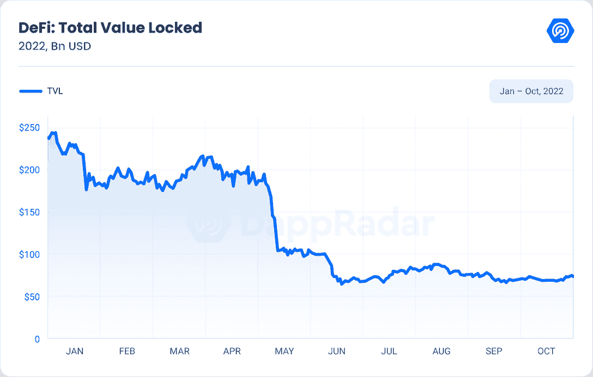

以太坊仍然是最受欢迎的连锁店，拥有 510 亿美元的 TVL，比 9 月份增长了 9.52%。但相对于其他协议，其优势从 9 月份的 69%下降到 10 月份的 61.97%。BNB 在 TVL 以 83 亿美元再次位居第二，环比增长 8.57%。最近的 BNB 链漏洞根本没有影响指标。

![Total_Value_Locked_of_the_Top_Protocols[1]](img/ef33078117e0625893417744944e8564.png)

在同样的趋势下，Arbitrum 继续增加其 TVL，本月增加了 4.05%。这种增长是由可能的 Arbitrum 空投的猜测推动的。

在一系列[推文中](https://web.archive.org/web/20230120171943/https://twitter.com/milesdeutscher/status/1584518035142217730)，加密货币分析师兼评论员 Miles Derschner 在 Twitter 上推测:“Arbitrum 令牌(和空投)的到来比我们想象的要快。人们从乐观中赚了 10，000 到 50，000 美元。阿比特鲁姆是下一个。”

另一方面，Avalanche、Solana 和 Polygon 继续呈下降趋势，本月他们的 TVL 分别下降了 16.34%(26 亿美元)、14.80%(16 亿美元)和 1.11%(15.7 亿美元)。芒果黑客导致了茄果类的减少，在下面的章节中进行了分析。

## 经过几个月的停滞，加密市场似乎已经脱离了它的狭窄范围

全球加密市值最终再次突破 1 万亿美元大关，这有助于市场看涨。随着空头最终退居二线，比特币(BTC)和以太网(ETH)每天都有所上涨。

在 10 月 25 日加密市场开始变绿后，在大约 24 小时内发生了超过 12 亿美元的空头清算。密码市场终于摆脱了自 9 月份以来一直震荡的狭窄价格区间。

尽管市场上出现了明显的上涨和看涨情绪，但 BTC 价格已经稳定在 20，600 美元的关口。另一方面，ETH 价格也在上方阻力位面临拒绝。

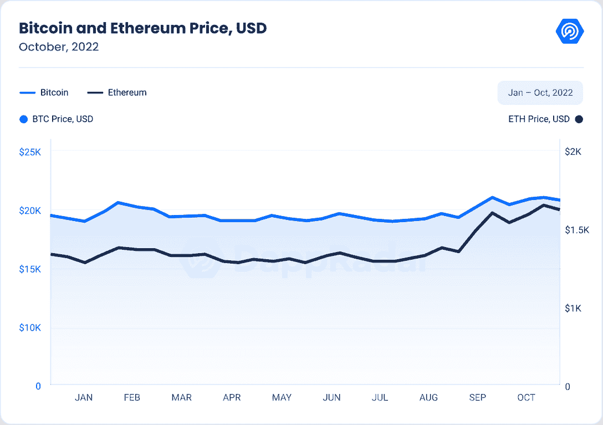

Altcoins 整个月也表现强劲，尤其是在 Dogecoin 的带领下

该股本月收于 0.12 美元，在过去 30 天里上涨了 50%，创下 6 个月来的新高。这一增长是由 Elon Musk 收购 Twitter 和 Dogechain 宣布其未来路线图推动的。

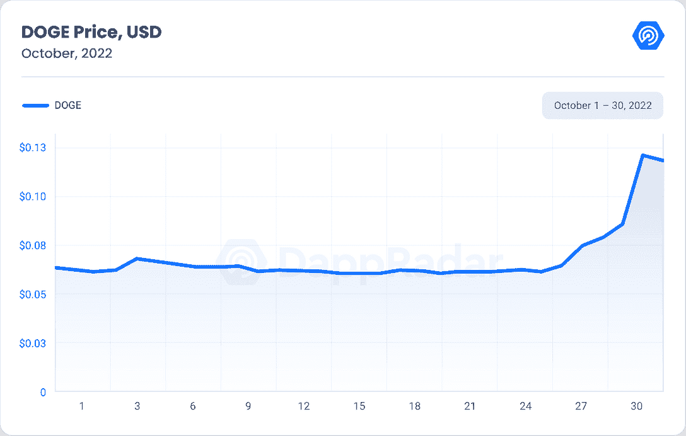

本月另一个表现最好的是 Aptos，许多用户称其为又一个“索拉纳杀手”。它是第 1 层区块链，有自己的主网。10 月 19 日，Aptos Twitter 账户[宣布将进行空投](https://web.archive.org/web/20230120171943/https://twitter.com/AptosLabs/status/1582492643447095297)。根据这条推文，用户应该填写一份 Aptos 激励测试网的申请。

该线程承诺将向 110，235 名参与者空投总共 20，076，150 个 APT 令牌。token 的团队表示，这将是这次唯一的 APT 空投，并表示只能通过 Aptos 官方社区页面声称，并警告人们要小心，只信任 APT 的官方信息来源。

据 CoinGecko 称，Aptos 的 APT token 推出两周之后，市值已经达到 10 亿美元，是全球 50 大加密货币之一。10 月 31 日，APT token 的交易价格为 7.80 美元，比 6.75 美元的历史低点上涨了 15.5%。

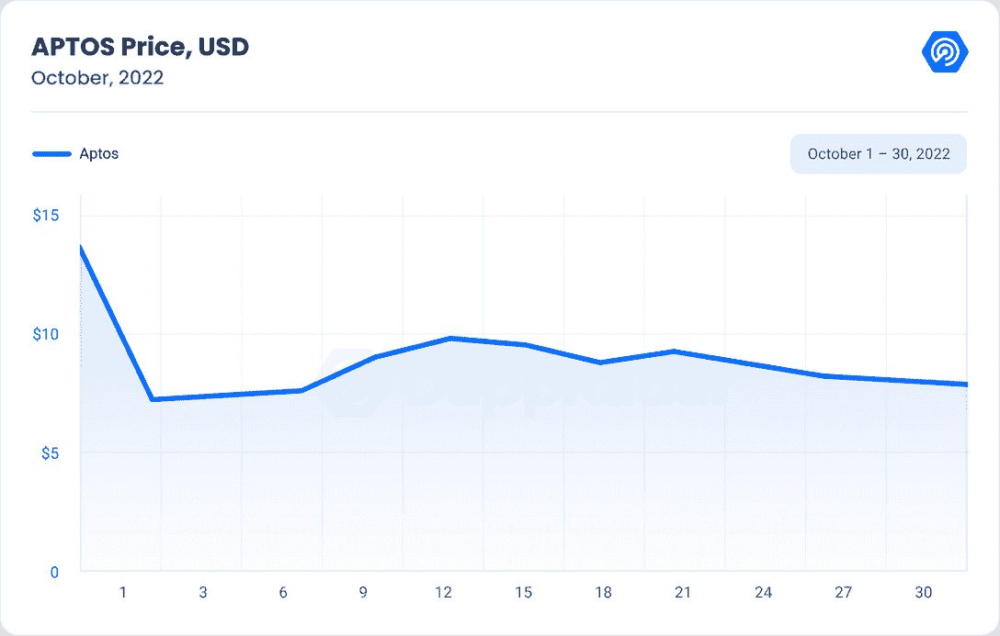

Aptos 是第一层区块链，由 FTX 和加密友好型风险投资公司 Andreessen Horowitz (a16z)支持。Aptos 由前 Meta 工人经营，他们是公司失败的 Diem stablecoin 的先驱。

虽然 Aptos 有一个“艰难的开始”，但观察者对锈基 1 层区块链如 Aptos、Sui 和 Radix 的兴趣仍然很强。

## 118 万独立交易商进入 NFT 市场

本月以美元计算的 NFT 交易量较 9 月下降 30%，至 6.62 亿美元。这是我们今年登记的最低金额。此外，销售额环比下降 30%。

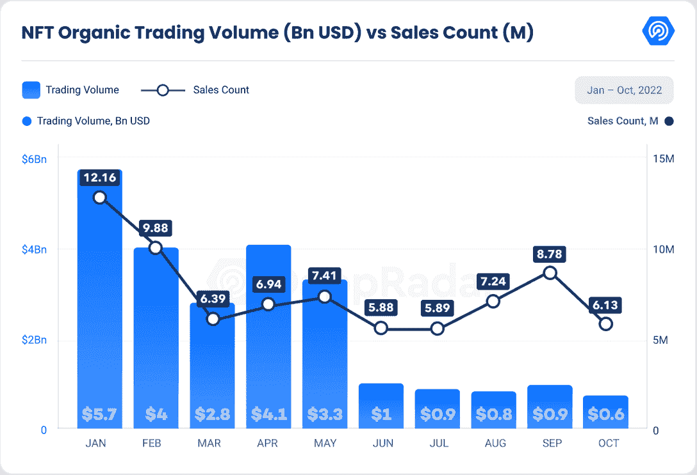

[以太坊](https://web.archive.org/web/20230120171943/https://dappradar.com/nft/protocol/ethereum)在过去的两个月里，其 NFT 交易量继续处于下降趋势。本月，它下降了 21%，达到 3.24 亿美元，是我们自 2021 年 6 月以来记录的最低 NFT 交易量。 [Solana 的](https://web.archive.org/web/20230120171943/https://dappradar.com/nft/protocol/solana)交易量下降了 49%(6600 万美元)，回到了 8 月和 7 月的平均交易量。九月的高峰是由 [y00ts 系列](https://web.archive.org/web/20230120171943/https://dappradar.com/blog/new-dapps-report-y00ts-mint-t00b-entry-ticket-to-y00topia)的发布推动的。

与 Solana 的趋势相同， [Flow](https://web.archive.org/web/20230120171943/https://dappradar.com/nft/protocol/flow) 见证了本月 NFT 交易量下降 60%，至 1557 万美元。前一个月的炒作是因为 NFL 和 Flow 的合作关系。

从好的方面来看，Polygon 在 NFT 的交易量本月飙升，涨幅超过 770%，达到 1000 万美元。这一增长是由我们在本报告中分析过的[的](https://web.archive.org/web/20230120171943/https://dappradar.com/blog/metaverse-report-2-demand-for-metaverse-remains-amidst-crypto-turmoil) [Reddit NFT 收藏](https://web.archive.org/web/20230120171943/https://dappradar.com/blog/are-reddit-polygon-bringing-back-the-bull-market)的成功推动的。

在与 Polygon 相同的趋势下， [Theta](https://web.archive.org/web/20230120171943/https://dappradar.com/nft/protocol/theta) 将其 NFT 交易量增加了 55%，达到 990 万美元。宝莱坞偶像阿米特巴·巴强独特的 NFT 系列的推出推动了这一增长。这一系列艺术品是为了庆祝这位巨星的 80 岁生日。一个名为“流动的盛宴”的多城市 NFT 展览将展出 51 件策划的艺术品，描绘这位文化偶像的生活和时代。

看看其他协议的销售计数，Polygon 的月环比增长了 109%，这主要是由上面提到的 Reddit NFT 收藏库推动的。与 Polygon 一样，BNB 连锁店在 NFT 的销售额也比 9 月份增长了 60%。

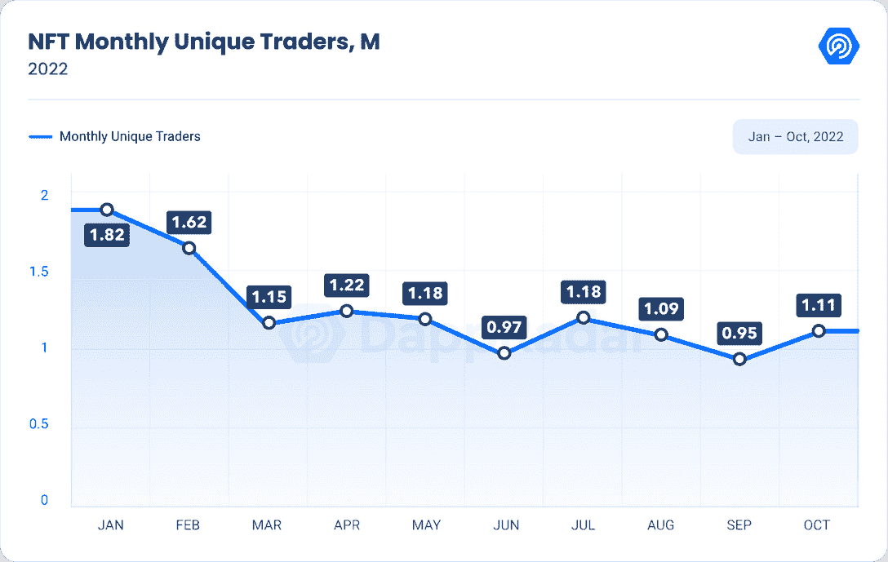

尽管本月 NFT 的交易量和销售数量有所下降，但独立交易商的数量却增长了 18%，达到 111 万。独特交易者数量的增加表明，新的人正在进入 NFT 市场，而且仍然需求量很大。

![Top_10_NFT_Sales[1]](img/faa140b688e7bdc5670e7543d22ea123.png)

看看这个月的十大销售，我们可以观察到宇迦实验室项目是如何主导 NFT 市场的。宇迦实验室是[隐朋克](https://web.archive.org/web/20230120171943/https://dappradar.com/ethereum/collectibles/cryptopunks)、[无聊猿游艇俱乐部](https://web.archive.org/web/20230120171943/https://dappradar.com/ethereum/collectibles/bored-ape-yacht-club)、 [Meebits](https://web.archive.org/web/20230120171943/https://dappradar.com/ethereum/collectibles/meebits) 、[变异猿游艇俱乐部](https://web.archive.org/web/20230120171943/https://dappradar.com/ethereum/collectibles/mutant-ape-yacht-club)、[养狗俱乐部游艇俱乐部](https://web.archive.org/web/20230120171943/https://dappradar.com/ethereum/collectibles/bored-ape-kennel-club)和[彼岸](https://web.archive.org/web/20230120171943/https://dappradar.com/ethereum/collectibles/otherdeed-for-otherside)的幕后公司。再一次，当蓝筹股保持其大部分价值，交易集中在一个资产类别时，我们看到了活动的高度集中。

## NFT 市场的竞争正在升温

本月，一个新的 NFT 市场向 JPEG 收藏者推出，该市场没有交易成本，并且空投了本地令牌，这些收藏者在整个低迷的市场中继续交易。

基于以太坊的平台 Blur 于 10 月 23 日发布了测试版，获得了风险投资巨头 Paradigm、NFT 本土投资基金 6529、数字艺术收藏家 Cozomo de' Medici 和其他人超过 1400 万美元的支持。

该平台面向“专业”NFT 交易员，提供跨多个市场的“扫地”等功能，揭示“狙击”和投资组合分析工具，以及计划向任何在过去 6 个月内交易过基于以太坊的 NFT 的人空投其模糊令牌。

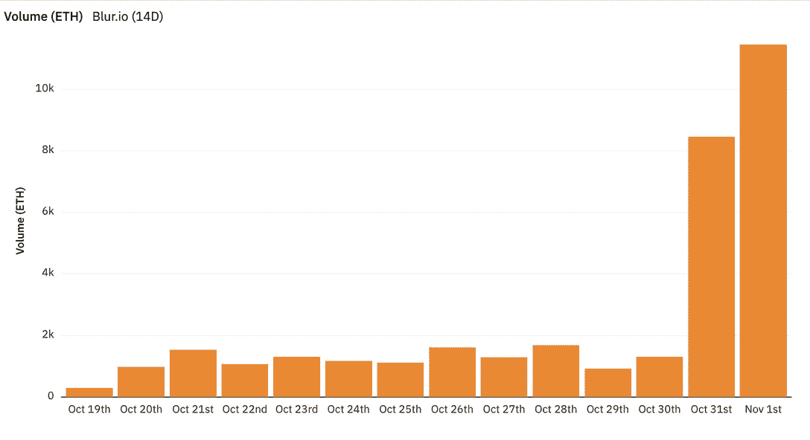

Source: [Blur tweet](https://web.archive.org/web/20230120171943/https://twitter.com/blur_io/status/1587603186088808449?s=46&t=XrGtlAsayLpc6cNxuCaxwQ)

11 月 2 日，他们宣布交易量创下 11，450 ETH(1，810 万美元)的历史新高。

在过去的几个月里，OpenSea 的竞争对手增加了他们的市场份额，将市场从“垄断”转变为“寡头垄断”。就用户和交易量而言，OpenSea 是行业领导者，尽管以太坊和索拉纳交易所 X2Y2 和 Magic Eden 自 2022 年以来获得了市场份额。

10 月份， [OpenSea](https://web.archive.org/web/20230120171943/https://dappradar.com/multichain/marketplaces/opensea) 的市场主导地位与 8 月份相比下降了 8.3%，其 NFT 交易量环比下降了 12.1%(3.13 亿美元)。这是自 2021 年 7 月以来我们登记的最低交易量。

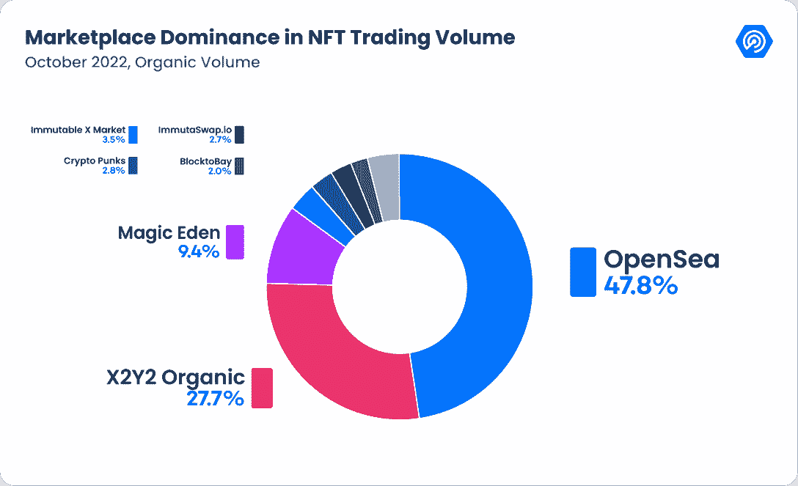

接下来， [X2Y2](https://web.archive.org/web/20230120171943/https://dappradar.com/ethereum/marketplaces/x2y2) 的市场份额持续增长，与 8 月份相比，其市场份额增长了 8.4%。尽管主导地位有所增强，但 NFT 的交易量逐月下降了 38.82%(1.81 亿美元)。然而，这个月他们[推出了](https://web.archive.org/web/20230120171943/https://twitter.com/the_x2y2/status/1583046889947402242)一项新的 NFT 贷款功能。该项目旨在通过不收取任何费用来吸引用户。

贷方可以提供不同期限的多次贷款，以更好地利用他们的 ETH。这与现有的贷款平台有很大不同，在现有的贷款平台上，用户需要使用不同的账户进行投标，这不是资本高效的。

与 X2Y2 的趋势相同， [Magic Eden](https://web.archive.org/web/20230120171943/https://dappradar.com/solana/marketplaces/magic-eden) 与 8 月份相比，其主导地位增加了 2.3%，但交易量仍环比下降 52.07%(6100 万美元)。

尽管在利率和通胀因素不确定、战争和全球冲突持续以及其他因素影响市场的情况下，所有市场都经历了更大的波动，但 NFT 及其基础市场显示出无论波动如何都可以持续的强烈迹象。

### 零版税困境

Cryptopunks 是第一个生成性个人资料图片项目(PFP)的例子之一，在 2017 年没有支付任何版税。这些照片唯一可以交易的地方是官方的 CryptoPunk 交易所，当时和现在都没有对二次销售征税。然而，事情在 2021 年发生了变化，宇迦实验室带着它的 Bored Ape 游艇俱乐部系列进入了这个领域。这个新项目显示了将版税引入其中是多么有利可图。

迄今为止，宇迦实验室的所有收藏已经积累了 1.4 亿美元的版税。看到宇迦的成就，NFT 的其他项目也纷纷效仿，采用了 2.5%的标准版税。随着最近由于熊市导致的 NFT 价格和交易量的下降，用户比以往更加谨慎。

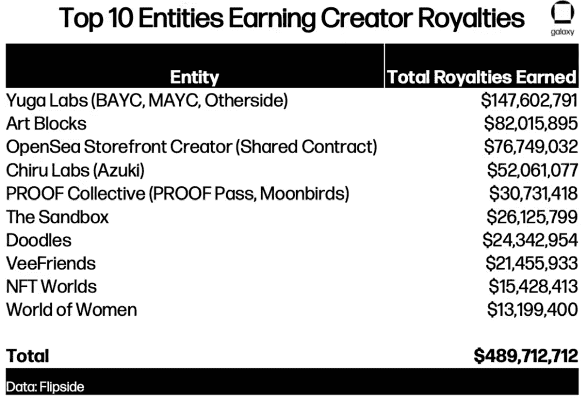

Source: [Galaxy](https://web.archive.org/web/20230120171943/https://www.galaxy.com/research/insights/nft-royalties/)

尽管未能实现宏伟的目标，但市场已经开始反对通过版税产生持续收入的收藏。2022 年 7 月推出的 SudoSwap 利用 AMM 模式进行 NFT 交易，标志着 NFT 行业反版税运动的开始。

到了九月，免版税运动似乎像风暴一样席卷了索拉纳·NFT。Magic Eden 宣布，它将在其平台上选择版税，以与这些迅速崛起的竞争对手公平竞争。自宣布以来，魔术伊甸园的市场份额已增加到约 90%的索拉纳 NFT 市场。

免版税的竞争对手如 Yawww 和 Hadeswap 的出现对 Magic Eden 在索拉纳 NFT 市场业务中 90%的市场份额构成了威胁。在他们决定放弃费用之前，魔术伊甸园的市场份额的巨大变化表明，索拉纳 NFT 生态系统对持续的版税讨论更加敏感。

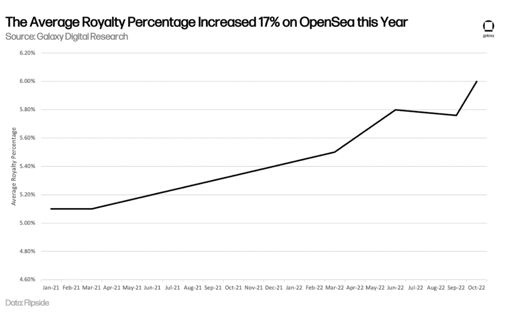

Source: [Galaxy](https://web.archive.org/web/20230120171943/https://www.galaxy.com/research/insights/nft-royalties/)

执行版税的 OpenSea 是领先的平台，这表明以太坊的 NFT 社区将努力维护版税权利。

## 非金融资产正在成为证券吗？

有了这样的宣传，越来越多的公司将 NFTs 视为一种融资方式。NFT 的美妙之处在于它的适应性，以及它允许对区块链上的独特商品进行经认证的所有权转让。但在考虑在 NFT 上市之前，公司应该考虑潜在的法律要求，这些要求限制使用非上市公司进行融资。

美国证券交易委员会(简称“SEC”)负责监管证券，并要求证券在公开交易前在该委员会注册。为了确定一项投资是否属于证券的定义范围，SEC 通常会考虑它是否符合“投资合同”的定义。开创性的美国最高法院案例“SEC 诉 Howey”采用了以下因素来做出这一决定:

*   金钱投资
*   在一个共同的企业中
*   带着利润的期望
*   完全来自他人的努力。

如果 NFT 本身的用途类似于艺术品，那么它看起来就不像证券，而更像是收藏家的资产。当 NFT 的发行者将 NFT 作为一种可能升值的投资进行营销时，非金融交易可能会跨越 SEC 的管辖范围。

细分的 NFT，“F-NFT”和 NFT 篮子也越来越受欢迎。此类产品允许用户投资有限比例的一个 NFT，并可能有助于获得多个非功能性交易的利益。像 Fractional、Niftex 和 DAOfi 这样的平台允许个人购买和交易 F-NFT，就像投资者在 Robinhood 上交易股票一样。

Source: [Medium](https://web.archive.org/web/20230120171943/https://medium.com/tessera-nft/what-is-fractional-dd4f86e6458a)

由于上述原因，非正规金融服务可以用作抵押来获得贷款。NFT 被锁定在一份智能合约中，期限为一段时间，或者直到借款金额(加上利息)得到偿还。如果借款人不能及时偿还贷款，NFT 就会成为资产的新主人。如果借贷平台使用经过严格审计的智能合同，那么向 NFT 放贷是安全的。如果智能合同未经审计，将 NFT 置于潜在黑客攻击合同中的风险就会增加，从而导致您的资产被盗。

考虑到 NFT 市场极其不稳定，如果项目价值暴跌，贷款人可能会被高估的 NFT 套牢。在过去的一段时间里，几个 NFT 担保平台变得流行起来:BenDAO、NFTfi 和 Arcade。

使用 NFT 作为抵押品是一种不出售资产就能快速获得现金的现实方法。然而，借贷双方都有许多风险。首先，当资产被锁定在智能托管合同中时，作为特定资产持有人的好处就丧失了。

**NFT 贷款利息**

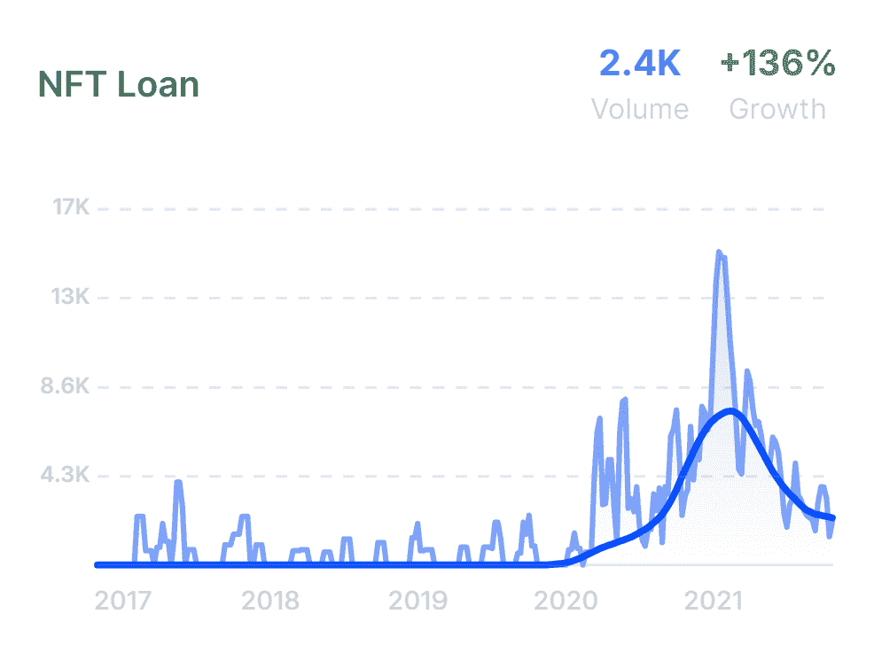

Source: [Glimpse](https://web.archive.org/web/20230120171943/https://meetglimpse.com/trend/nft-loan/)

根据 [Glimpse data](https://web.archive.org/web/20230120171943/https://meetglimpse.com/trend/nft-loan/) 的数据，与前一年相比，去年对 NFT 贷款的兴趣增长了 136%，目前每月搜索量为 24k 次。

## 大型机构和公司继续拥抱 Web3

尽管漫长的秘密冬天；在过去的一段时间里，加密商标的申请源源不断。

商标申请通常是防御性的法律行动，但这并不意味着它们所涵盖的产品和服务将被制造和销售。然而，它们表明一个公司意识到一个有前景的未来市场，并准备进入该市场。

仅在 10 月份，Web3 和 NFT 的申请就由各种品牌提交，如乐器制造商芬达、食品巨头德尔蒙特和卡夫(关于其标志性的 Wienermobile)、汉堡连锁店 Inn-Out、零食制造商塔基斯、葡萄酒和烈酒公司 Mot Hennessy、赛车公司一级方程式赛车、在线博彩平台 DraftKings 和歌手 Lizzo。

最重要的商标申请来自 Visa、Paypal 和 Western Union。

根据 Visa 的文件，该公司正在考虑一种加密货币钱包，该公司将其描述为允许用户查看、访问、存储、监控、管理、交易、发送、接收、传输和交换数字货币、虚拟货币、加密货币、数字和区块链资产以及不可替代令牌(NFT)的软件。

Visa 也可能在元宇宙开展业务，因为它正在考虑提供虚拟环境，用户可以在其中进行娱乐、休闲或娱乐互动。

PayPal 的商标申请中有 18 处提到了加密，首先是用于发送、接收、接受、购买、销售、存储、传输、交易和交换数字货币、虚拟货币、加密货币、稳定币、数字和区块链资产、数字化资产、数字代币、加密代币和公用代币的可下载软件。

PayPal 现在允许客户购买比特币、以太币、比特币现金(BCH)和莱特币(LTC ),并将它们发送到外部钱包，但显然它仍在开发自己的加密货币钱包。

西联汇款提交的文件据称涵盖了数字支付的所有方面，如“数字货币和电子钱包的管理和维护”。像其竞争对手一样，吴打算开发“可下载的软件，用于创建接收和消费加密货币的密钥。”

## 游戏行业仍占整个行业使用量的 45%

游戏区块链技术是 Web3 的新兴、有前途的行业之一，10 月份每天有 898，481 个独特的活动钱包。

值得一提的是，即使游戏在 UAW 的主导地位从 48%下降到 45%,它仍然是该行业的一个良好指标，因为它仍然主导着 Web3 行业。

![Dominance_of_DeFi_and_Games_in_Industry_UAW[1]](img/f3b4700701d3791dcf35d34c6c7469f8.png)

更多的 Web2 游戏公司正在关注区块链游戏。事实上，本月，世嘉，日本最有影响力的游戏公司之一，宣布将开发其第一款基于区块链的游戏。该项目将由另一家游戏公司 Double Jump Tokyo 开发，以日本流行的街机游戏 Sangokushi 泰森特许经营为基础。

要获得更多关于区块链游戏和趋势的见解，如虚拟世界、移动赚钱和领先游戏 dapps，请阅读我们最新的 BGA 游戏报告。

## 10 月是资金流失最多的月份

根据 DEFIYIELD data 的数据，10 月份记录了全年被黑客攻击和窃取的加密资产的最高价值，达到 10.9 亿美元。第二高的月份是 3 月份，原因是 Ronin network 被入侵，损失约 6.25 亿美元，这是迄今为止最大的一次黑客攻击。

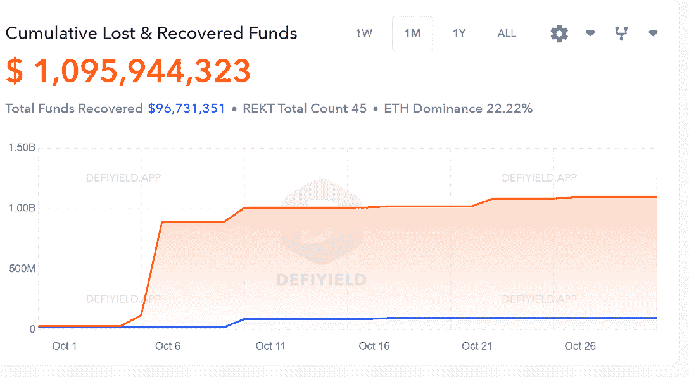

Source: [RektDatabase](https://web.archive.org/web/20230120171943/https://defiyield.app/rekt-database)

本月最大的诈骗案是弗朗西斯科·瓦尔迪维诺·达席尔瓦，又名“比特币酋长”。根据巴西当局的说法，他涉嫌从“数千名”巴西人和至少十个其他国家的公民那里诈骗和洗钱高达 40 亿巴西雷亚尔(约 7.66 亿美元)。

![Top_10_Exploits_in_October[1]](img/4dfc3d3bc06d91ee6926bfe3830e2d52.png)

第二大漏洞是芒果市场，这是一个位于索拉纳区块链的分散式金融(DeFi)交易平台，有 1.17 亿美元的资金被黑客从该平台窃取。根据芒果市场的推文，黑客是由原生 MNGO 令牌上的价格操纵引起的。

此外，在芒果市场漏洞利用的同一天，即 10 月 11 日，发生了三起已知的漏洞利用事件，损失了 357 万美元。

第二大漏洞针对 TempleDAO，这是一个产量农业 DeFi 协议，导致 1,831 ETH 或 237 万美元的损失。Stax 是一个由 TempleDAO 支持的分散式应用程序，它跟踪负责的行为者的地址，同时警告用户不要向 STAX 合同中进一步存款。

第三，第一层区块链 QAN 平台遭受了一次桥梁黑客攻击，在此期间，币安智能链(BSC)和以太坊上的 14 亿 QANX 令牌(或略高于 100 万美元)被耗尽。该公司表示，只有 QANX Bridge 智能合约部署者钱包受到损害，受影响的 QANX 令牌持有者将得到补偿。

10 月 11 日的最后一个目标是以太坊钱包服务 Rabby，该服务报告了其 Rabby 互换功能的智能合同中的一个漏洞，导致了大约 20 万美元的损失。据报道，它仍在追踪被盗资金。

如果这种趋势继续下去，2022 年将可能超过 2021 年，成为有记录以来加密和区块链黑客攻击最多的一年。

去年记录了 200 多起黑客攻击和超过 30 亿美元的损失。今年已经发生了 125 起黑客攻击，接近 30 亿美元的门槛。跨链桥似乎是黑客的主要目标，占本月损失的 82%，占全年的 64%。

## 结论

目前，全球经济正面临巨大障碍。一些金融指数和国家货币已经开始持续下跌。因此，根据一些估计，我们可能正处于全球衰退的最早期阶段。

作为最新的业务之一，加密货币市场在 2022 年的表现尤其糟糕。

此外，可以断言我们已经处于熊市很长一段时间，但正如报告所述，本月显示出复苏的迹象。

值得简要探讨的是重要机构提交加密货币商标申请的渐进但一致的趋势。

商标通常是防御性的法律手段，但这并不保证它们保护的商品和服务会被生产和销售。然而，它们表明一家公司意识到并准备进入一个潜在的未来市场。

毫无疑问，下一轮牛市将会出现，而且可能会比上一轮强得多。每当市场遭遇逆境时，它最终会变得更强大，主动性也会提高。值得注意的是，加密货币不仅是金融资产，也是科技产业的组成部分。