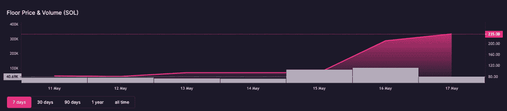
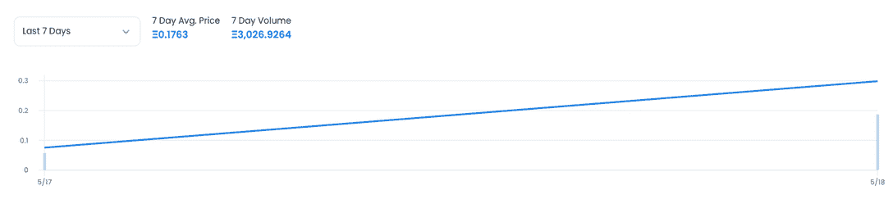
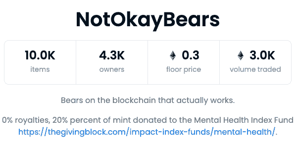
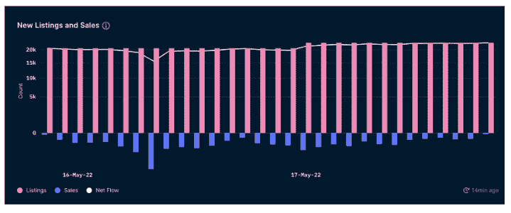

# 好吧熊 NFT 克隆来到以太坊

> 原文：<https://web.archive.org/web/https://dappradar.com/blog/okay-bears-nft-clone-comes-to-ethereum>

## 以太坊试图让它吵闹的邻居索拉纳回来

Solana 上一个名为 Okay Bears 的 NFT 系列已经被复制和反转，然后在以太坊上以 Not Okay Bears 的名义推出，现在这些复制熊的销量超过了原来的 NFT 系列。索拉纳也是无数以太坊克隆收藏的所在地，比如堕落猿社。然而，这一次在[以太坊 NFT 社区](https://web.archive.org/web/20220630225100/https://dappradar.com/nft/protocol/ethereum)展示了它的肌肉，让它吵闹的邻居回来检查。

一些人称这是索拉纳的一个完整的循环时刻，因为在索拉纳上找到山寨的顶级以太坊系列，如[crypto punk](https://web.archive.org/web/20220630225100/https://dappradar.com/ethereum/collectibles/cryptopunks)和 Pudgy Penguins，要比其他方式更常见。 [Okay Bears，Solana](/web/20220630225100/https://dappradar.com/blog/new-dapps-report-okay-bears-bulls-in-a-bear-market/) 上最热门的 NFT 系列之一，已经被有效地复制、反转并粘贴到区块链以太坊上。他们在最后一个小时的销售量超过了前一天。

[Not Okay Bears](https://web.archive.org/web/20220630225100/https://notokaybears.art/) 是一个基于以太坊的 NFT PFP 收集项目，于 5 月 16 日启动，收集了 10，000 幅具有各种特征的熊插图。这些图像看起来是一样的，这是一个大胆的举动，因为这是来自 Okay Bears on Solana 的相同艺术作品——只是颠倒了，所以熊面向左而不是右。这就是我们所说的创新！(注:这是讽刺)

* Left: Original Okay Bears | Right: Not Okay Bears *

## 可以吗？

索拉纳社区对这一举动有些恼火。尽管如此，它最终可以被视为迄今为止最不为人知的一个系列的最高褒奖。在第二波对 NFT 的兴趣中，特别是对 Solana 的兴趣，这位作者的蜘蛛侠感觉想知道这个系列是否不是由 Solana 身边的团队为了刺激 Solana 的更多 NFT 交易而故意推出的。不管怎样，这两个系列在今天和接下来的日子里都会受到媒体越来越多的关注。

在撰写本文时，Okay Bears 正在领先的索拉纳 NFT 市场 Magic Eden 进行交易，底价为 235 索尔，约合 13335 美元。有趣的是，就在两天前，底价还是 94 索尔，约合 5345 美元。诚然，Okay Bears 和其他几个[Solana 系列](https://web.archive.org/web/20220630225100/https://dappradar.com/solana/marketplaces/magic-eden)受到了越来越多的关注，但 Not Okay Bears 的推出似乎在不到 48 小时内将其推向了新高。

Solana Okay Bears collection 在过去 24 小时内的交易量刚刚超过 200 万美元，而 Not Okay Bears collection 在 OpenSea 上的二级市场交易量已经超过 600 万美元。由于投资者向以太坊上的 mint 支付交易费，不太好的熊收藏已经烧掉了 15.84 ETH [或大约 33，000 美元](https://web.archive.org/web/20220630225100/https://ultrasound.money/)。该系列目前的底价为 0.3 ETH，约合 600 美元，OpenSea 显示在写作时的二级交易价值约为 630 万美元。

虽然以太坊上一个不太好的熊 NFTs 的价值仍然远远低于索拉纳上一个原始的好熊，但这个事件表明聪明的营销可以创造一波需求。这实际上是对原始系列的赞美。

Solana network 最近出现了基础设施和正常运行时间问题，在另一个嘲笑中，OpenSea 上的 Not Okay Bears collection 的描述是，“区块链上的熊实际上是工作的。”

## 是否可持续？

早期数据显示，虽然“不太好的熊”系列受到了很多关注，但上市数量开始超过销售，这意味着需求小于供应，因为新铸造的 NFT 似乎最终出现在二级市场上，因为买家立即试图获利。

另一个风险是，Okay Bears 的团队最终会因各种侵权问题对这种剽窃行为采取行动。一位 Twitter 观察员迅速指出了 OpenSea 关于复制和粘贴收藏政策的最新更新。因此，OpenSea(开放海洋)公司(开放海洋)公司(开放海洋)公司(开放海洋)公司(开放海洋)公司(开放海洋)公司(开放海洋)公司(开放海洋)公司(开放海洋)公司(开放海洋)公司(开放海洋)公司(开放海洋)公司(开放海洋)公司(开放海洋)公司(开放海洋公司)将关闭“不正常的熊”公司，阻止这些收藏品在市场上交易，这可能只是一个时间问题。然而，总有其他 NFT 市场出售你的 NFT，像[稀有](https://web.archive.org/web/20220630225100/https://dappradar.com/multichain/marketplaces/rarible)、 [X2Y2](https://web.archive.org/web/20220630225100/https://dappradar.com/ethereum/marketplaces/x2y2) 和 [LooksRare](https://web.archive.org/web/20220630225100/https://dappradar.com/ethereum/marketplaces/looksrare) 。总的来说，现在才 48 小时，猜测结果还为时过早。

## 索拉纳 NFT 开始受到关注

如前所述， [NFT 收藏的索拉纳](https://web.archive.org/web/20220630225100/https://dappradar.com/nft/protocol/solana)最近获得了越来越多的关注。Solana 上的 NFT 交易量从 3 月到 4 月增长了 90%，达到 2.95 亿美元，Okay Bears 和 DeGods 进入了 NFT 交易量最高的前 30 名。同样，值得注意的是，在这个网络中，NFTs 的平均销售价格已经上升到大约 350 美元，显示了这些资产的价值。

此外，[索拉纳 NFT 炒作](/web/20220630225100/https://dappradar.com/blog/dapp-industry-report-april-2022/)可以部分归因于网络[与 OpenSea](/web/20220630225100/https://dappradar.com/blog/opensea-boosts-activity-despite-competition-from-looksrare/) 的整合。领先的 NFT 市场极大地提高了这些 NFT 的知名度，覆盖了新的社区。像索拉纳猴子生意、Aurory、堕落猿学院这样的收藏，以及像[索拉纳](https://web.archive.org/web/20220630225100/https://dappradar.com/solana/marketplaces/solanart)和[魔法伊甸园](https://web.archive.org/web/20220630225100/https://dappradar.com/solana/marketplaces/magic-eden)这样的市场是[索拉纳生态系统](https://web.archive.org/web/20220630225100/https://dappradar.com/rankings/protocol/solana)中真正的先锋。

在撰写本文时，Okay Bears 尚未对该系列发表评论，也没有针对 Not Okay Bears 团队提出任何行动方案。然而，值得注意的是，其他集合，如 CryptoPhunks，在最初的 OG 集合中，[失败了](https://web.archive.org/web/20220630225100/https://nftevening.com/zagabond-transfers-ownership-of-the-phunks-nft-smart-contract/)。我们将继续关注事态的发展。

 NewsletterUnsubscribe at any time. [T&Cs](https://web.archive.org/web/20220630225100/https://dappradar.com/terms) and [Privacy Policy](https://web.archive.org/web/20220630225100/https://dappradar.com/privacy-policy)

***以上不构成投资建议。此处给出的信息仅供参考。请行使尽职调查，做你的研究。作者持有多种加密货币的头寸，包括 BTC、瑞士法郎和雷达。***