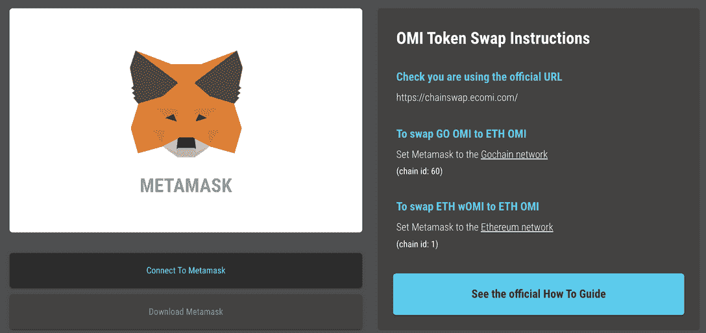
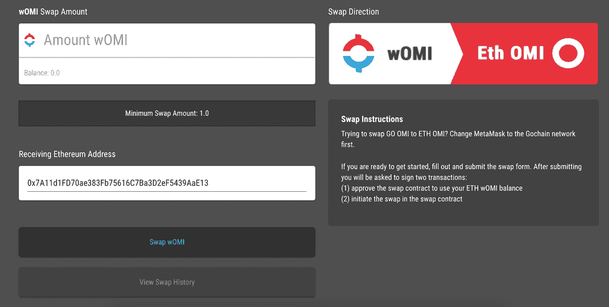
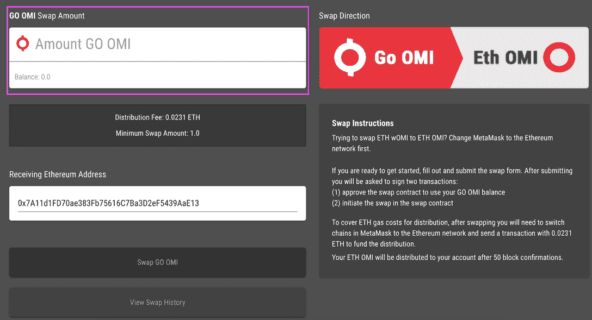
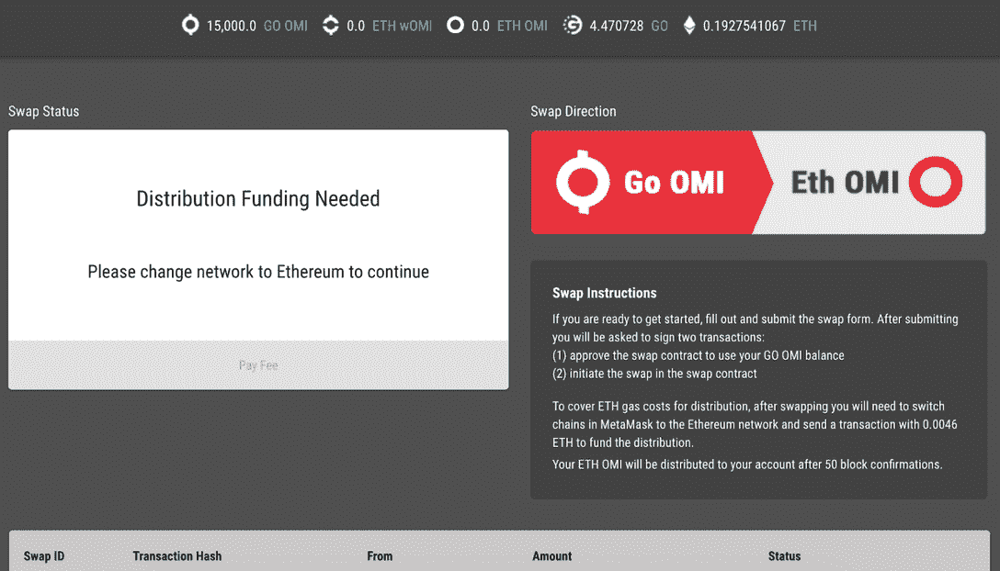
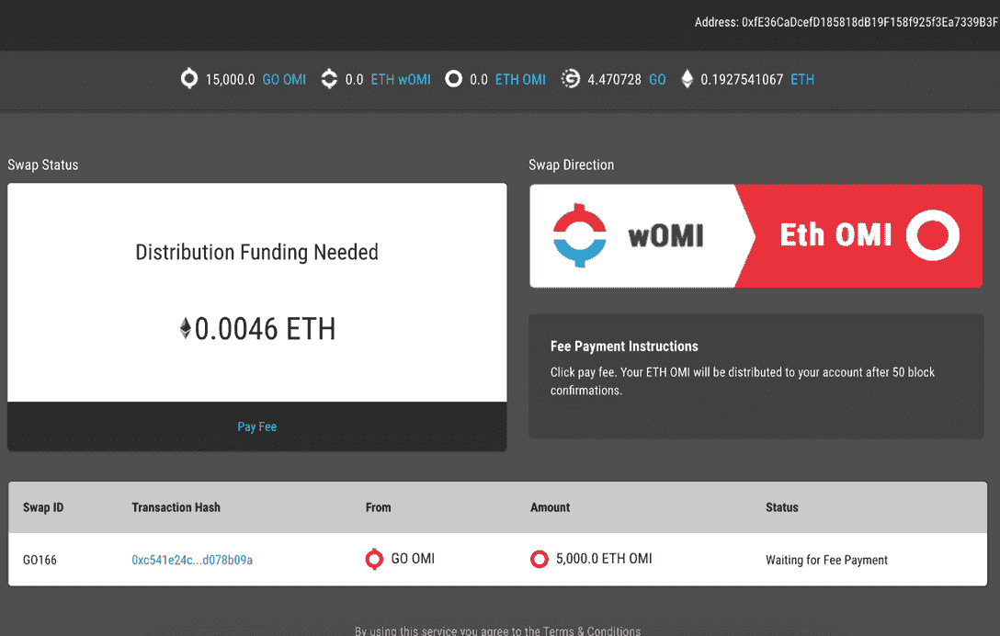
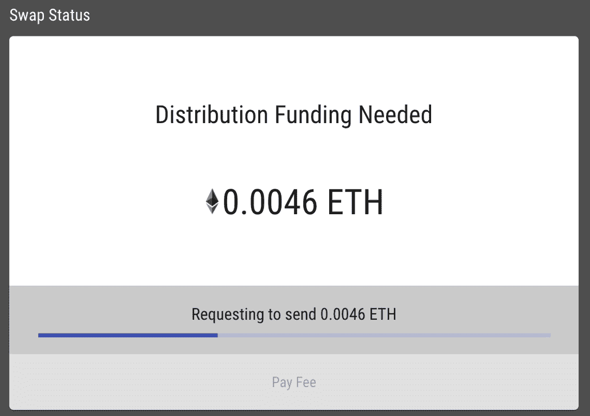

# OMI 手动令牌交换:你需要知道的一切

> 原文：<https://web.archive.org/web/https://dappradar.com/blog/omi-manual-token-swap-everything-you-need-to-know>

## 把 OMI 换成 OMI 以太坊，把女人换成 OMI

ECOMI 生态系统迁移到 Immutable X 的最后阶段包括将 GoChain (OMI)上的 OMI 令牌和现有的包装 OMI (wOMI)交换到新的以太坊 OMI 令牌。官方 [**ECOMI 链互换站点**](https://web.archive.org/web/20230115152210/http://chainswap.ecomi.com/) **是唯一可以手动将你的 GoChain OMI 和包裹 OMI (wOMI)互换到最近的以太坊 OMI 令牌的方法。**

在 ECOMI 基础设施之上的 NFT 市场 VeVe，[在过去六个月里获得了很大的吸引力](/web/20230115152210/https://dappradar.com/blog/unraveling-the-mysteries-of-the-veve-nft-marketplace/),提供优质的 IP 数字收藏品，如 Marvel Comics。通过[不可变 X](https://web.archive.org/web/20230115152210/https://dappradar.com/rankings/protocol/immutablex) 迁移到以太坊改善了对 [VeVe 数字收藏品应用](https://web.archive.org/web/20230115152210/https://dappradar.com/immutablex/collectibles/veve)和 OMI 令牌的访问，并支持 NFT 互操作性。例如，这将允许用户在以太坊市场如 OpenSea 和 LooksRare 以及本地 VeVe 市场上交易 NFT 物品。

让我们看看如何将 GoChain OMI 迁移到以太坊版本的 OMI 令牌。

## 元蒙版教程

在我们开始之前，重要的是要注意，本指南为那些在 GoChain 钱包中持有 MetaMask 上的 OMI 并需要将它们转移到以太坊的人介绍了这个过程。有汽油和交易费用要支付，所以你需要 ETH 并进入你的 Metamask 连接的钱包来执行这些操作。GoChain 的费用很低，但以太坊的费用可能高达 50 多美元。因此，如果你在 GoChain 上持有的 OMI 不到 100 美元，这可能会有点痛苦。此外，使用[这篇便捷的文章](/web/20230115152210/https://dappradar.com/blog/when-are-ethereum-gas-fees-lowest/)来找到可能最便宜的加油时间。

对于熟悉令牌交换、事务签名和元掩码的人来说，将 OMI 从 GoChain 交换到 Ethereum 和 Immutable X 的过程应该非常快速和简单。然而，如果你缺乏这些方面的知识，那就慢慢来，在继续之前仔细检查所有的东西。我们开始吧！

## 连接钱包并选择 OMI

*   官方的 [ECOMI 链交换网站](https://web.archive.org/web/20230115152210/http://chainswap.ecomi.com/)是将你的 GoChain OMI 和 wrapped OMI (wOMI)手动交换到新的以太坊 OMI 令牌的唯一途径。点击[链接](https://web.archive.org/web/20230115152210/https://chainswap.ecomi.com/)开始使用。

*   你将登陆这个页面，你需要做的第一件事就是连接 MetaMask。一旦加入，您将被引导到下一页，根据您的需要提供说明和指导。即把围棋链 OMI 换到 OMI 以太坊，或者把沃米换到 OMI 以太坊。

*   您还需要将 GoChain 添加到元掩码中，假设您还没有这样做。为了确保万无一失，你可以这样做:
    *   打开 Metamask >单击网络下拉菜单>按“添加网络”
    *   在新窗口中填写这些详细信息:
        *   网络名称:GoChain
        *   新的 RPC URL:[https://RPC . go chain . io](https://web.archive.org/web/20230115152210/https://rpc.gochain.io/)
        *   符号:去
        *   链条编号:60
        *   阻止浏览器 URL:[https://Explorer . go chain . io](https://web.archive.org/web/20230115152210/https://explorer.gochain.io/)
    *   保存，完成！

## 1.从 OMI 到 OMI 以太坊

首先，我们将通过交换围棋链 OMI 到以太坊 OMI。这里最关键的第一步是点击你的 MetaMask 钱包扩展，把链从以太坊换到 GoChain。当 MetaMask 设置为 GoChain 时，我们就可以开始了。

在左上角的方框中输入您拥有的 OMI 代币总数。你会看到盒子下面有一个 0.0231 ETH 的分销费，写下来是 71 美元。

值得注意的是，这一数字发生了变化。从我自己的经验来看，我在 2 月 16 日在瑞士联邦理工学院支付了一半的费用，所以确保你在最好的时间行动。您可能还会注意到，下面截图中的费用是 0.0046，因此在任何一天，情况都会发生巨大的变化。

1.  输入您希望交换的 GoChain OMI 代币数量。
2.  确认交换网站上列出的“接收以太坊地址”与您的 MetaMask 帐户中的以太坊地址相匹配。
3.  点击“交换去 OMI”
4.  确认您理解您有责任支付交易双方的交易费用。
5.  互换网站将开启 MetaMask，您需要确认两笔交易:
    (1)交易和
    (2)在 GO tokens 中支付资助费(gas)
6.  您必须先批准事务，然后才能提交它们。交易需要 50 次确认才能被处理，在大多数情况下需要几分钟。

在确认交易之间要有耐心，不要离开屏幕。交易完全确认后，您将收到 MetaMask 的通知，然后您可以继续。

## 2.切换到以太网

一旦您的掉期交易获得批准和处理，您将需要使用浏览器扩展再次打开您的 MetaMask，并切换到以太坊网络，以批准您的 OMI 联邦理工学院代币的分发，并为分发支付联邦理工学院的费用。

1.  Open MetaMask
2.  将网络切换到以太坊主网

您将看到以下消息:

1.  一旦您在 MetaMask 上切换到以太坊网络，请返回交换网站并选择“支付费用”为交易提供资金

2.  等待 MetaMask 提示您批准/签署此交易。同样，您需要确认天然气数量(这次是 ETH)并批准交易。

如果显示的 ETH 气价低于您 MetaMask 钱包中的 ETH 气价，您将无法继续配送。请在继续之前在该地址充值您的 ETH 余额。您可能需要刷新页面以查看更新的余额并继续交易。

如果您已准备好所需的 ETH 数量，请点击“支付费用”。

和以前一样，您的 OMI 代币将在另外 50 次批量确认后分发。在此交易完成之前，请勿关闭交换网站。

## 3.将以太坊 OMI 添加到元蒙版

您的 OMI 代币现在将被发送到您的以太坊钱包中，但是为了查看它们，您需要将以太坊 OMI 代币合同地址添加到 MetaMask 中。

1.  Open MetaMask
2.  确保您在以太坊主网上。
3.  在“资产”选项卡下，选择“导入令牌”，然后选择“自定义令牌”选项卡
4.  输入以太坊 OMI 合同地址:
5.  0 xed 35 af 169 af 46 a 02 ee 13 b 9d 79 EB 57d 6 d68 c 1749 e
6.  它应该预先填充股票和小数。但是，如果没有:
7.  象征符号:OMI
8.  小数:18
9.  确认这些详细信息并添加新令牌。现在，在“assets”选项卡下，您应该会看到 OMI 是一个可用的令牌选项。很快它会显示你的 OMI 余额从围棋链发送。

就是这样；您已经成功地将您的 GoChain OMI 代币交换到不可变 x 上的新 ERC20 以太坊标准版

## 另一个选择是:将 OMI 理工大学的女性交换

连锁互换网站还允许持有人包装 OMI (wOMI)互换直接到新的以太坊 OMI。虽然你将需要为这笔交易的天然气资金，这是一个单一的智能合同调用，并应招致一个较小的交易成本。最有可能的是，那些持有 wOMI 的人过去已经使用过代币互换网站，把 GoChain OMI 包装成了 wOMI。

从 wOMI 换到新以太坊 OMI 的过程是类似的。遵循与上面相同的过程，但是由于 wOMI 已经是一个 ERC20 令牌，您将无需经历将元掩码连接到 GoChain 或在网络之间切换的过程。

取而代之的是，将你保存 ETH wOMI 的 MetaMask 钱包地址连接到交换网站，并选择以太坊网络。该网站将自动检测你试图交换的令牌，并显示 OMI 妇女。在继续之前，请确保您在该地址有足够的 ETH 来支付汽油费和处理令牌分配。

确认您的余额出现在代币交换网站上，并且连接的接收地址/元掩码帐户是正确的。然后按照上面的指示换到新的以太坊 OMI。

## DappRadar 投资组合跟踪器

跨多个链跟踪加密资产会引起相当大的麻烦，但是投资组合跟踪器真的很有帮助。现在你的以太坊元掩码中有了 OMI，你可以使用 DappRadar 投资组合跟踪器来跟踪它和你的投资组合的其余部分。观看下面的短视频，开始更好地掌控您的数字财富。

[https://web.archive.org/web/20230115152210if_/https://www.youtube.com/embed/WHL_uYv8riA?start=7&feature=oembed](https://web.archive.org/web/20230115152210if_/https://www.youtube.com/embed/WHL_uYv8riA?start=7&feature=oembed)

 NewsletterUnsubscribe at any time. [T&Cs](https://web.archive.org/web/20230115152210/https://dappradar.com/terms) and [Privacy Policy](https://web.archive.org/web/20230115152210/https://dappradar.com/privacy-policy)