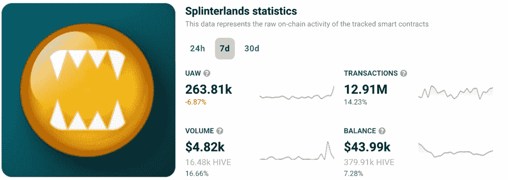
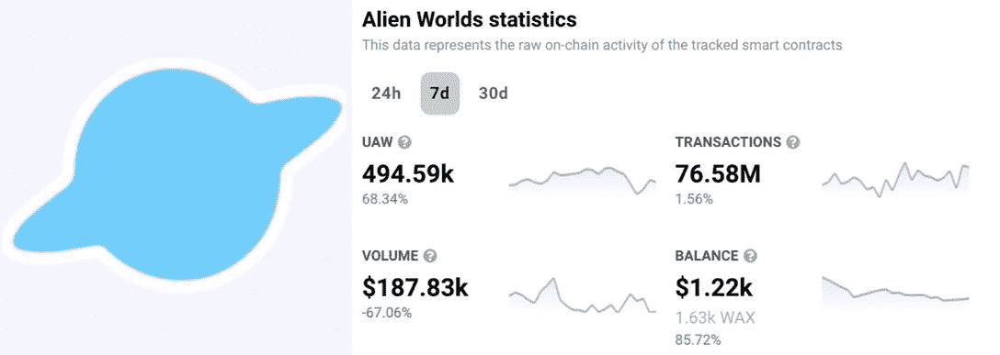
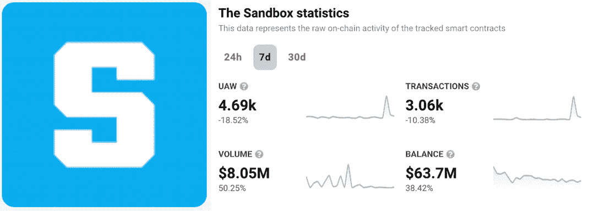
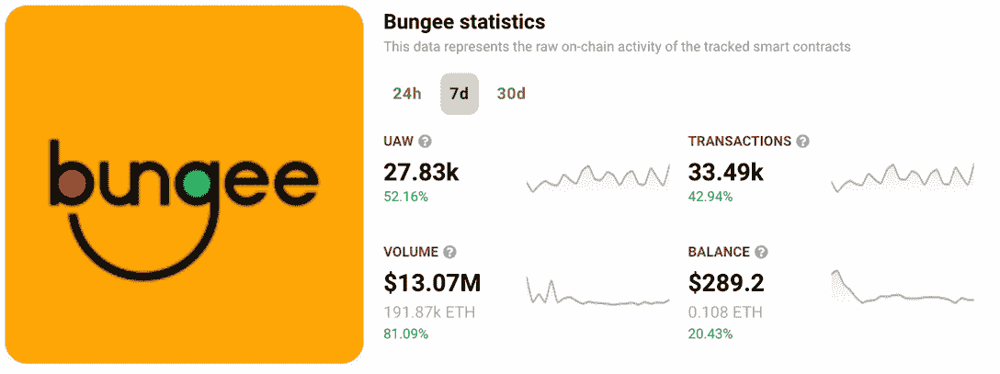
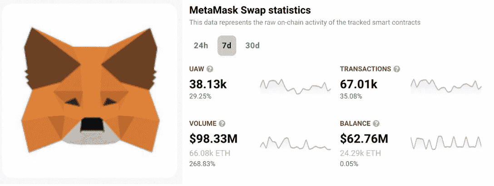
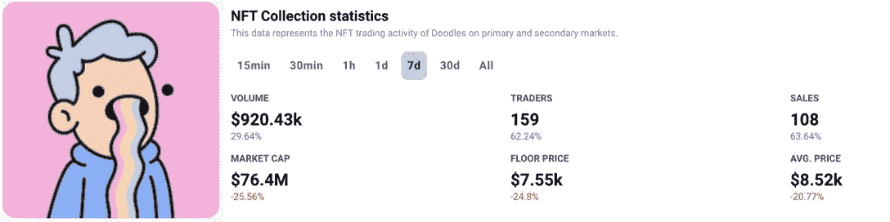
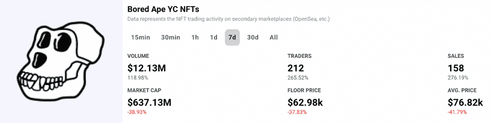
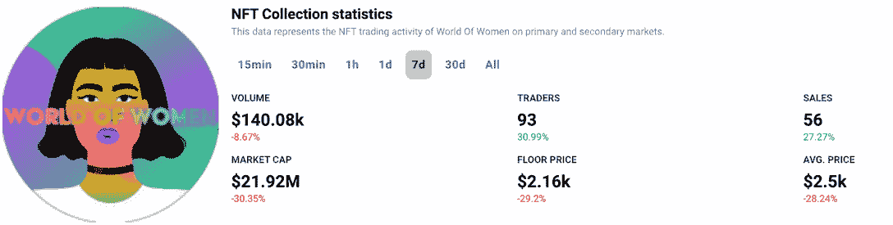
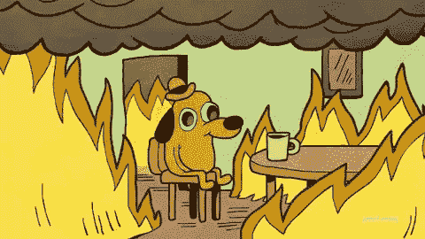

# 安全起见:哪些 Dapps 逃过了 FTX 加密传染病

> 原文：<https://web.archive.org/web/https://dappradar.com/blog/on-the-safe-side-which-dapps-escaped-the-ftx-crypto-contagion>

## 为什么一些民主党人没有受到最近这场危机的影响？

世界上最大的集中交易市场之一 FTX 的崩溃给 Web3 项目带来了危机。对于许多分散的应用程序来说，混乱、资金损失和恐慌性抛售是上周的一部分。然而，几个项目已经从灰烬中重生，向社区宣布他们做得非常好，并按照计划没有任何问题。

**亮点**

*   FTX 和阿拉米达在 Web3 上投资了几个项目。此外，数家 dapps 在上周宣布破产的交易所拥有资金。星图和血清是一些计划受到严重影响的名字；
*   虽然蓝筹股 NFT 的交易数量增加了，但 ETH collections 的底价和市值却下降了。
*   拥有一致游戏社区的游戏和元宇宙虚拟世界的统计数据也没有出现大规模的负面变化。

这篇文章只是一个介绍。11 月 17 日星期四，DappRadar 将发布一份关于 FTX 加密危机对更广泛的 dapp 行业的影响的全面研究报告。

## 游戏继续建立

危机时期的普遍观点是，我们绝不能放弃，必须继续建设。但幸运的是，大多数游戏项目只是在游戏内代币(NFT)的价值上感受到了 FTX 动荡的浪潮。也就是说，不会真正影响项目的开发能力。

[Check Out Top Gaming Dapps](https://web.archive.org/web/20230202141049/https://dappradar.com/rankings/category/games)

### 夹板岛

可收藏的交易卡牌游戏[splitterlands](https://web.archive.org/web/20230202141049/https://dappradar.com/multichain/games/splinterlands)经历了上周的动荡，似乎没有受到影响。事实上，过去的七天对游戏来说是积极的。

[<picture></picture>](https://web.archive.org/web/20230202141049/https://dappradar.com/multichain/games/splinterlands)

在过去的一周里，Splinterland 的交易量上升了 16%,这是游戏玩家如何度过最艰难的经济时期的一个很好的例子。怎么会这样仅仅是因为这些游戏玩家是来玩的，而不是来赚钱的。

### 外星世界

《异形世界》,目前最受欢迎的区块链游戏之一，逆潮流而动，有 68.34%的独特活动钱包与其智能合同互动。

[<picture></picture>](https://web.archive.org/web/20230202141049/https://dappradar.com/multichain/games/alien-worlds)

民主行动党的项目没有受到影响，在这个充满希望的元宇宙，一切都在按计划进行。尽管加密再次下滑，GameFi 仍在继续增长。

### 
沙盒

作为 Web3 上最大的项目之一，涉及游戏、NFT、名人和 DeFi，人们对元宇宙是否会受到加密传染的负面影响有很多预期。

在 2021 年在 FTX 推出了 SAND token 之后，人们公开承认这两个巨头是合作伙伴。阿拉米达的钱包还持有沙盒虚拟世界中的 81 块土地——总共 166，000 块，占土地总供应量的 0.04%。

[<picture></picture>](https://web.archive.org/web/20230202141049/https://dappradar.com/multichain/games/the-sandbox)

然而，事实证明，这些联系太薄弱，不足以吓退元宇宙强大社区中的任何人——该项目也没有受到影响。随着受欢迎的 Alpha 第三季结束，交易和唯一活跃钱包略有下降。尽管如此，该项目的交易量增加了 50%，显示出该领域在消极的一周中出现了积极的迹象。

## DeFi 走向主流？

对 FTX 这样的集中交易所越来越不信任的影响之一，可能是为散户和投资者探索分散融资方案提供了空间。上周，各种连锁店的 DeFi 项目数量急剧增加。

[Explore The Best DeFi Projects](https://web.archive.org/web/20230202141049/https://dappradar.com/rankings/category/defi)

### 橡皮筋

蹦极凭借出色的统计数据在加密传染周中脱颖而出。也许是因为在正确的时间出现在正确的地方，无缝的跨链桥已经帮助成千上万的钱包在协议之间转移他们的资金。

[<picture></picture>](https://web.archive.org/web/20230202141049/https://dappradar.com/multichain/defi/bungee)

交易量增加了 42%，dapp 交易量在一周内增长了 80%。

### MetaMask Swap

这是分散金融应用中的绝对领导者。元掩码钱包和[元掩码互换](https://web.archive.org/web/20230202141049/https://dappradar.com/ethereum/defi/metamask-swap)也对那些在上周投资了加密货币的人有所帮助。在整个加密 Twitter 上，投资者报告说，他们正在从集中的交易所转移，将资金投入像 MetaMask 这样的分散钱包。

[<picture></picture>](https://web.archive.org/web/20230202141049/https://dappradar.com/ethereum/defi/metamask-swap)

dapp 的交易量在短短 7 天内跃升了 268%，新的独特活跃钱包和交易的数量也有所增加。

## NFT 被视为数字资产

一个奇怪的现象是，被认为是蓝筹股投资的收藏品增加了销售额，但平均和最低销售额却大幅下降。

[Check Out Top NFT Collections](https://web.archive.org/web/20230202141049/https://dappradar.com/nft)

### 涂鸦

尽管是 FTX 长长的投资清单中的一部分， [Doodles](https://web.archive.org/web/20230202141049/https://dappradar.com/ethereum/collectibles/doodles) 的首席执行官 Julian Holguin 向 Discord 的社区保证*“FTX 的垮台对我们的业务没有影响。”*

> ***“FTX 风险投资公司在 Doodles 上投资了 100 万美元(筹得 5400 万美元)。我们没有在 FTX、其附属公司或任何其他交易所持有任何资金(法定或加密)。”***

[<picture></picture>](https://web.archive.org/web/20230202141049/https://dappradar.com/ethereum/collectibles/doodles)

在过去的 7 天里，销售和新交易者的数量增加了约 60%，而该项目的市值、均价和底价却缩水了 20%。

### 无聊猿游艇俱乐部

著名的无聊猿游艇俱乐部(BAYC) NFTs 背后的公司宇迦实验室是本周 NFT 空间的另一个关注点。当得知它有 18，000 ETH 的版税存储在一个 FTX 账户中时，该社区猜测哪些会成为市场上最受欢迎的收藏。

然而，很快宇迦实验室的联合创始人 Wylie Aronow 澄清说，他们在 FTX 的所有基金已经在本周早些时候转移到比特币基地托管。

[<picture></picture>](https://web.archive.org/web/20230202141049/https://dappradar.com/ethereum/collectibles/bored-ape-yacht-club)

这并没有阻止市场的过度反应，BAYC 交易者的数量上升了 265%，而平均售价下降了 41%。尽管如此，这场混乱应该很快就会过去，因为收藏品本身并未受到影响。

### 女人的世界

公开持有 FTX 账户用于中转目的的 NFT 收藏馆也出面让收藏者知道他们的业务没有受到交易所崩溃的影响。

> ***“我们分散持有美国国债的渠道，通过将国债分散到不同的银行账户、比特币基地机构、multisig 钱包&冷钱包，来降低风险。”***

[<picture></picture>](https://web.archive.org/web/20230202141049/https://dappradar.com/ethereum/collectibles/world-of-women)

WoW 也看到 NFT 本周的销售额增加，而平均价格和入门价格下降了近 30%。

## 继续跟踪 dapps 对加密传染的反应

DappRadar 很幸运地宣布，它也没有受到 FTX 崩溃的影响，但我们向在这些艰难时刻需要支持的任何人表示同情。

我们正在密切关注业内的多米诺事件，并将让您了解您最喜欢的项目的最新进展。

请务必在 [Twitter](https://web.archive.org/web/20230202141049/https://twitter.com/DappRadar) 上关注我们，通过使用我们的平台了解最新动态并探索 dapps 的实时数据。

[Explore Top Dapps Ranking](https://web.archive.org/web/20230202141049/https://dappradar.com/rankings)

### 有用的链接

*   [NFT DeFi&游戏 Dapps 受 FTX 密码危机影响](https://web.archive.org/web/20230202141049/https://dappradar.com/blog/which-defi-nft-game-dapps-have-been-affected-by-the-ftx-crypto-crisis)
*   [FTX 在 TVL 下跌 66%后给索拉纳带来混乱](https://web.archive.org/web/20230202141049/https://dappradar.com/blog/ftx-causes-chaos-on-solana-after-tvl-dropped-66)
*   [尽管 FTX 密码危机，区块链游戏 Dapps 仍在建设中](https://web.archive.org/web/20230202141049/https://dappradar.com/blog/blockchain-gaming-dapps-still-building-despite-ftx-crypto-crisis)

***以上不构成投资建议。此处给出的信息仅供参考。请尽职调查并自行研究。***

 NewsletterUnsubscribe at any time. [T&Cs](https://web.archive.org/web/20230202141049/https://dappradar.com/terms) and [Privacy Policy](https://web.archive.org/web/20230202141049/https://dappradar.com/privacy-policy)