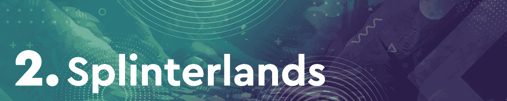
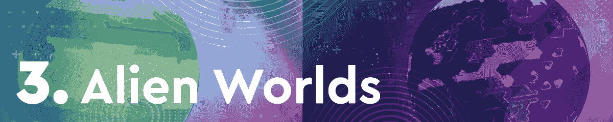
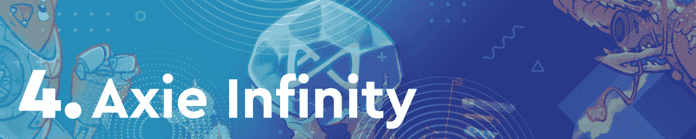
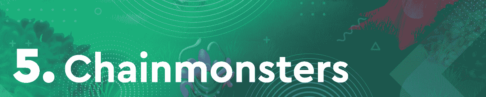
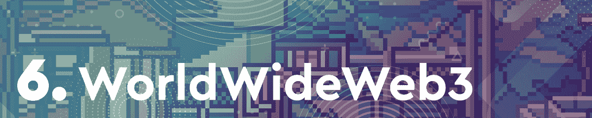
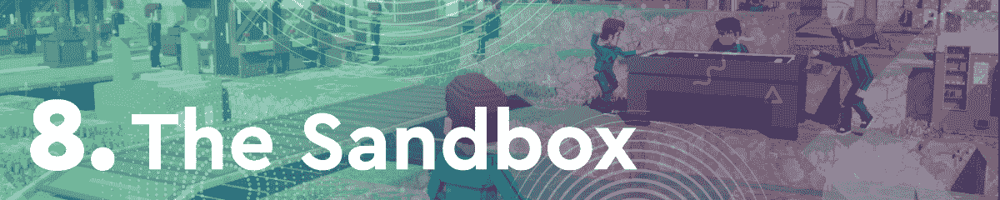
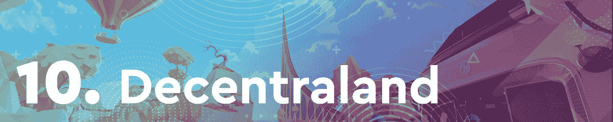

# NFT 世界之巅:NFT 将《我的世界》国防部注入月球

> 原文：<https://web.archive.org/web/https://dappradar.com/blog/on-top-of-the-nft-worlds-nft-infused-minecraft-mod-to-the-moon>

## 虚拟世界产生了近 500 万美元的 NFT 交易量

得益于本土代币 WRLD 价格的稳步上升趋势，NFT 世锦赛已经连续第二周蝉联冠军。由于不断吸引新项目，虚拟世界已经席卷了游戏和收藏界。最近，NFT 世界宣布将举办由 Pixel Creations 开发的第一场区块链高尔夫比赛。

紧随其后的是我们通常怀疑的分裂大陆和外星世界。这是全区块链访问量最大的两个游戏。令人印象深刻的是，由于推出了新的基于移动设备的封闭测试版应用程序，后起之秀 Chainmonsters 也在本周入选。

在过去的几个月里，区块链游戏一直处于加密活动的前沿。通过这篇文章，DappRadar 了解了最热门的游戏 dapps。为了编制这个排名，我们考虑了链上活动，NFT 交易量，令牌估值，以及围绕每个 dapp 的新闻和事件。

在下面浏览本周十大区块链游戏的完整列表。单击相应的图片，了解每个平台的更多信息。或者，看看下面的视频，它总结了排名，可以快速查看。

[https://web.archive.org/web/20220930084334if_/https://www.youtube.com/embed/3YGqCVQzrZE?feature=oembed](https://web.archive.org/web/20220930084334if_/https://www.youtube.com/embed/3YGqCVQzrZE?feature=oembed)

## 区块链十大游戏，第 7 周

NFT 世界连续第二周在排行榜上独占鳌头，这要归功于其本土标志 WRLD 的估值上升了 35.9%。在目前相当悲观的加密市场背景下，这是一个令人印象深刻的表现。在 NFT 世界平台日益流行的支持下，WRLD 是目前市场上表现最好的代币之一。

[splitter lands](https://web.archive.org/web/20220930084334/https://dappradar.com/hive/games/splinterlands)公布了一款名为 Waka Spiritblade 的全新限量版分裂卡。下周就要降了。此外，该游戏的原生令牌 SPS token 上涨了 3.9%，而 Splinterlands 本周吸引了最独特的活跃钱包——514，920 个。这使得蜂巢成为本周排名中最受欢迎的第二名。

《异形世界》凭借本周 351，030 个独特的活动钱包占据了前三名的位置。采矿游戏拥有该领域最大的社区之一。由于各种各样的社区建设活动和倡议,《异形世界》创造了一个专门的追随者，这极大地提高了游戏的性能。

游戏赚取巨头 [Axie Infinity](https://web.archive.org/web/20220930084334/https://dappradar.com/ronin/games/axie-infinity) 本周下降了几个位置，排名第四。在 Sky Mavis 推出其 [Origin 版本](https://web.archive.org/web/20220930084334/https://dappradar.com/blog/axie-infinity-origin-promises-a-brand-new-battle-experience)的同时，Axie 的原生 token AXS 估值下降了 9.7%。尽管如此，Axie Infinity 在 NFT 销售额方面仍是不可否认的领导者，其交易额超过 3300 万美元。

后起之秀 [Chainmonsters](https://web.archive.org/web/20220930084334/https://dappradar.com/flow/games/chainmonsters) 在[在 Android 和 iOS](https://web.archive.org/web/20220930084334/https://dappradar.com/blog/chainmonsters-closed-beta-launched-on-ios-android/) 上推出封闭测试版后，本周已跻身前五。Chainmonsters 最近结束了它的 alpha 测试阶段，现在正在为封闭的 beta 测试者提供更多体验游戏的机会。因此，对游戏公开发行的宣传和期待正在增加。

目前，它已经在最受欢迎的虚拟世界中占据了一席之地。该平台继续吸引人们的注意力，最近在地图上显示了一个全新的区域。此外，WWW3 在过去的七天里在 NFT 创造了超过 110 万美元的交易量。

虚拟房地产交易游戏[高地](https://web.archive.org/web/20220930084334/https://dappradar.com/eos/games/upland)继续其宣布重要地标地块出售的连胜纪录。此外，基于 EOS 的游戏现在正在美国足球明星大使的帮助下积极推动其社区建设活动。这帮助该平台在本周的排名中排名第七。

本周，沙盒为其粉丝推出了一项重要功能。该平台推出了本国货币 SAND 的单一令牌赌注。这将允许玩家和投资者在不需要 ETH 或 MATIC 的情况下，单独下注就能获得回报。虽然 SAND 的估值损失了近 14%，但这种新的赌注机制在过去七天里提高了 Sandbox 的表现。

币安智能连锁 NFT 农事游戏 [Mobox](https://web.archive.org/web/20220930084334/https://dappradar.com/binance-smart-chain/games/mobox-nft-farmer) 本周下降了几个位次，排名第九。尽管如此，该平台活跃度的下降并没有反映在本周 Mobox 吸引的销售数量上。该游戏在 NFT 产生了超过 800 万美元的交易量。

虚拟世界[去中心化](https://web.archive.org/web/20220930084334/https://dappradar.com/ethereum/marketplaces/decentraland)本周登上了排行榜，这要归功于几项关于大品牌进军元宇宙的重要公告。其中最引人注目的是国际银行业巨头 JP 摩根，该公司于本周早些时候在虚拟世界购买了一处房产。虽然分散的土地总结了本周的十大，虚拟世界是在元宇宙的领导地位。

## NFT 世界着火了

连续第二周，NFT 世界占据了本周区块链十大游戏排行榜。受《我的世界》启发的虚拟世界已经吸引了大量的追随者，然而目前它成功的最重要因素是它的本土标志 WRLD。当平台上 NFT 土地的底价飙升超过 300%时，WRLD 又经历了一个辉煌的一周。

在与 WRLD 推出无汽油和几乎免费的游戏内交易后，token 的估值出现了令人难以置信的飙升。仅在过去一周，WRLD 股价就上涨了 35%以上。这是一个令人印象深刻的表现，尤其是与目前加密市场普遍悲观的气氛相比。WRLD 是少数几个成功对抗这一趋势的博彩代币之一。

DappRadar 将继续监测区块链游戏空间，因为像 NFT 世界这样的虚拟环境留下了他们的印记。请继续关注下周的月度 10 大回顾，找出 dapp 成功抢走聚光灯的游戏。此外，你可以在 Twitter 上关注 DappRadar，首先了解最新的区块链博彩新闻。

 NewsletterUnsubscribe at any time. [T&Cs](https://web.archive.org/web/20220930084334/https://dappradar.com/terms) and [Privacy Policy](https://web.archive.org/web/20220930084334/https://dappradar.com/privacy-policy)