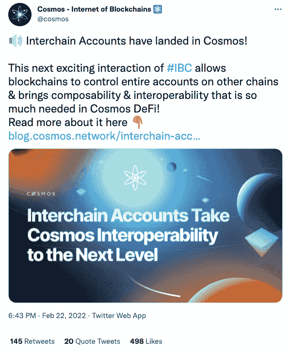

# 一个帐户跨越多个区块链与宇宙

> 原文：<https://web.archive.org/web/https://dappradar.com/blog/one-account-across-multiple-blockchains-with-cosmos>

## 新的区块链间通信更新“允许区块链控制其他链上的整个账户”

**宇宙区块链解决方案推出了区块链间通信更新，允许一个账户跨多个区块链进行通信。链间帐户将允许一个区块链生态系统执行另一个生态系统中的任何本地操作。**

Cosmos 宣布了它的最新更新，扩展了我们在去中心化世界中所能做的事情的可能性。到目前为止，传统的区块链一直各自为政，彼此之间难以沟通。开源的 Cosmos 社区正在规划合作和互操作性的未来。

他们[宣布](https://web.archive.org/web/20221007152759/https://twitter.com/cosmos/status/1496194025073827850)链间账户落地。区块链间通信(IBC)现在将能够做更多的事情，而不仅仅是连接和转移低汽油费的令牌。整个区块链现在可以控制不同链上的帐户，并执行该系统固有的任何操作。

实际上，这意味着用户将能够在一条链上执行交易，而他们的钱包却连接到另一条链上。所以，如果你想用你的代币下注、交换、投票，你不必把它们从一个区块链转移到另一个。你可以通过一个 Cosmos Hub 帐户完成所有这些工作。

Cosmos made the announcement on Twitter

这一举动是因为 Cosmos 试图跟上快速扩张的 DeFi 环境，特别是发展如此迅速的 T2 以太坊区块链 T3。目前，“应用程序必须放弃它们的主权，并受制于它们所基于的第 1 层的约束和治理”。Cosmos 的观点是，每个人都在同一个区块链上建筑是另一种形式的集权。他们的想法是让每个应用程序都建立在自己的区块链上。这些都可以构建成一个相互联系的生态系统。

## 什么是宇宙？

宇宙是一个区块链生态系统，是不同生态系统之间的桥梁。它允许用户在不同的区块链之间平稳地转移价值和信息。开发者 Jaw Kwon 和 Ethan Buchman 在 2014 年共同创立了宇宙网络。他们的目标是解决他们认为的区块链定义中的三个主要问题:

*   主权——传统的区块链鼓励所有的金融活动在一个链条上进行。这否定了分散思维，而分散思维正是建立区块链科技的全部目的。Cosmos 打算通过控制他们自己的区块链来授权开发者和创造者制定他们自己的规则。
*   **可扩展性**–最初的区块链技术并没有为我们目前每天看到的交易数量进行规划。Cosmos 旨在提高区块链速度，引入横向可扩展性。
*   **可持续发展**–Cosmos 使用的高效利益证明(PoS)共识算法减少了区块链的碳足迹，在某些情况下减少了 99%。

Cosmos 是一个开源社区项目。开发团队已经从一个新手发展到许多人。

要更深入地了解 Cosmos 背后的想法以及该团队试图实现的目标，请点击[此处](https://web.archive.org/web/20221007152759/https://dappradar.com/blog/what-is-cosmos/)。