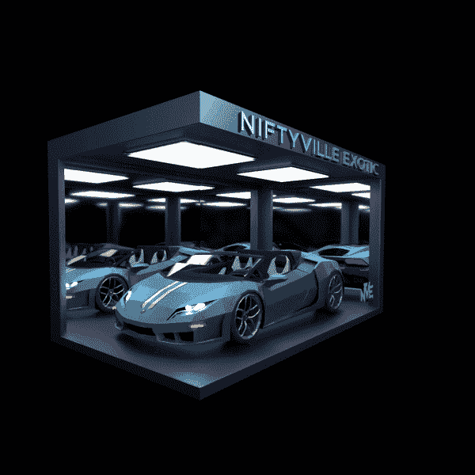
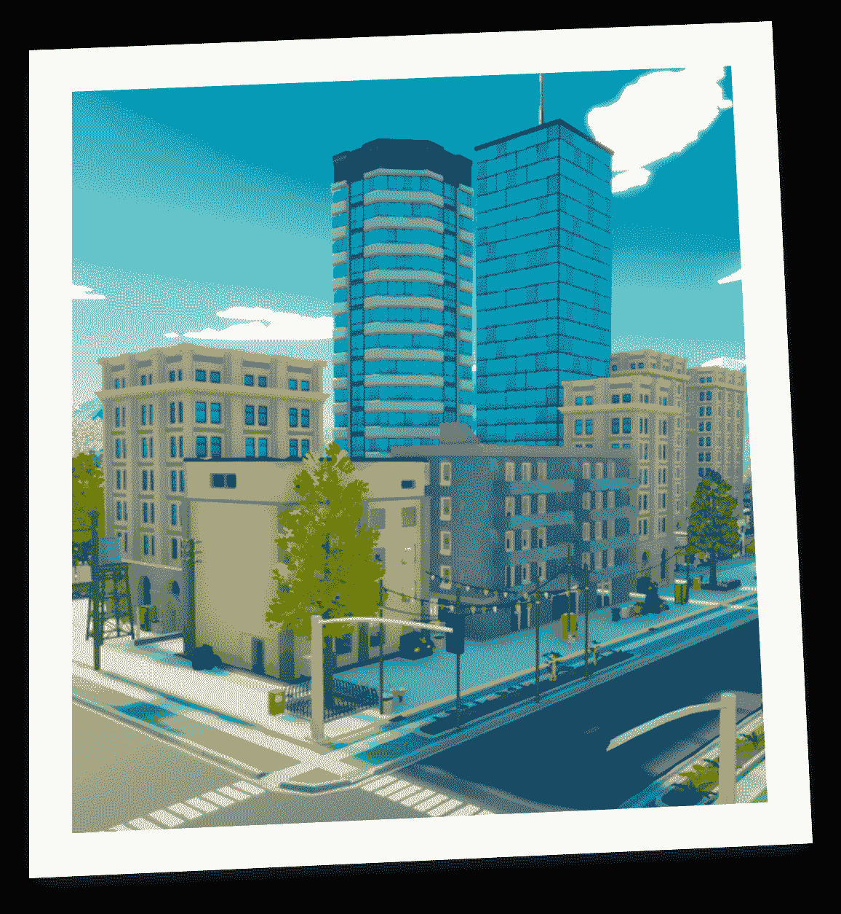

# nessus 推出 niftyville nft 汽车销售

> 原文：<https://web.archive.org/web/https://dappradar.com/blog/onessus-launches-niftyville-nft-car-sale>

## 999 辆进口 NFT 汽车将于 1 月 29 日下线

Onessus 的虚拟世界 NiftyVille 即将推出一系列全新的异国汽车在街上漫游。该平台将于 1 月 29 日举办 NFT 独家销售，展示 999 款独特的汽车设计。每辆车将花费 400 美元，大约有 100 个白名单点，这将使收藏家在 1 月 28 日获得早期造币权。

专属系列拥有六种不同的汽车颜色和设计。他们中的每一个都将成为 NiftyVille 中最独特的游戏道具。重要的是，拥有一辆 NFT 专属汽车还将有机会赢得一辆现实版 2017 款兰博基尼 Huracan Spyder。

根据官方宣布，Onessus 团队决定用实物奖励最具异国情调汽车的持有者。当然，如果这个人不是现实世界中的汽车爱好者，团队准备在菲亚特或 crypto 中提供 20 万美元的替代奖励。

为了进一步提高独家汽车收藏的可用性，Onessus 决定让 NFT 车主在 [WhenStaking](https://web.archive.org/web/20221007153742/https://whenstaking.com/) 平台上进行资产抵押。

重要的是，所有异国情调的汽车 NFT 都是 ERC-20 代币，这意味着收藏家将需要 ETH 参与下降。所有汽车的价格都是 400 美元。然而，对薄荷，收藏家也需要有足够的资金来支付煤气费。

## 什么是 NiftyVille？

NiftyVille 是一个创新的虚拟世界平台，允许用户购买土地，发展业务，增加他们的 NFT 收藏。无论你喜欢拥有一家商店还是一家汽车经销店，NiftyVille 都提供了无限的可能性。

根据 NiftyVille 的官方路线图，该平台还将在 2023 年年中引入就业机制。这对 NiftyVille 的粉丝来说将是一个重要的赚钱机会，因为玩家将有机会执行工作和任务，并获得无效令牌。

目前，游戏中的功能都没有上线。然而，NiftyVille 已经吸引了越来越多的粉丝。这款游戏有一个充满活力的在线社区，NiftyVille land NFTs 已经取得了巨大的销售收入。

独家汽车 NFT 收集只是尼夫蒂维尔发展的下一步。除了限量版的 NFT，参与者还有机会获得一辆 Lamborgini。DappRadar 很高兴看到 NiftyVille 发射如此广泛的空投。别忘了把 1 月 29 日加到你的日历上，去官方的 OpenSea 收藏馆抢夺一辆异国情调的汽车。

要了解最新的 NFT 新闻，请加入 DappRadar PRO。有了专业版，你可以在短短的 15 分钟内获得 NFT 的在线销售数据。此外，你成为了 [Discord](https://web.archive.org/web/20221007153742/https://discord.gg/4ybbssrHkm) 上 DappRadar PRO 社区的一员，在那里你可以参与令人兴奋的讨论，以及 DappRadar 生态系统的治理。

 NewsletterUnsubscribe at any time. [T&Cs](https://web.archive.org/web/20221007153742/https://dappradar.com/terms) and [Privacy Policy](https://web.archive.org/web/20221007153742/https://dappradar.com/privacy-policy)