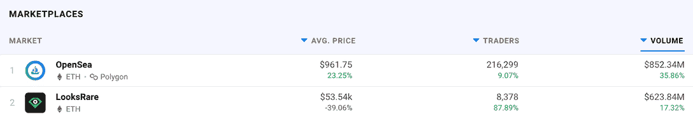

# OpenSea 收购 NFT 聚合器 Gem

> 原文：<https://web.archive.org/web/https://dappradar.com/blog/opensea-acquires-nft-aggregator-gem>

## 此举正值 LooksRare 和其他 NFT 二级市场的竞争日益激烈之际

[**OpenSea**](https://web.archive.org/web/20221001110126/https://dappradar.com/ethereum/marketplaces/opensea) **今日宣布收购领先的 NFT 聚合商** [**Gem**](https://web.archive.org/web/20221001110126/https://dappradar.com/ethereum/marketplaces/gem) **。此举正值 OpenSea 与 LooksRare 争夺二级市场的控制权。**

## **总结**

*   OpenSea 收购 NFT 聚合平台 Gem，OpenSea 首席执行官称该交易“为各个层次的人提供了更多的灵活性和选择”。
*   ***在宣布收购之前，OpenSea 将 Gem 的核心开发商和主要股东乔什·汤普森调离公司。汤普森目前正在处理性行为不端的指控。***
*   2022 年的进展似乎是 OpenSea 采取行动的一个原因，因为它希望重新确立其在 NFT 二级市场领域的强势地位。

OpenSea 希望给用户“专业”的体验。因此，它收购了领先的 NFT 市场整合商 Gem。这将允许 OpenSea 在 NFT 市场上提供更多功能，可能在未来给用户更全面的体验。然而，Gem 将保持原样，由一个独立团队运营。

OpenSea 的联合创始人兼首席执行官 Devin Finzer 在公司网站的一篇博客文章中宣布了这一消息。芬泽写道，Gem 为专业用户打造了一款拥有领先功能的令人惊叹的产品。Gem 可以让你通过一次低成本的交易在多个市场购买 NFT，并以其简单的藏品扫地和基于稀有度的藏品排名而闻名。

重要的是，Gem 将继续独立于 OpenSea 运行。Finzer 已经向用户保证平台不会有任何改变。就目前而言，此举将开放资源，让 Gem 继续其路线图。OpenSea 表示，它将受益于跨平台的专业知识和知识共享。

## 此举正值竞争日益激烈之际

OpenSea 仍然是 NFTs 的第一大二级市场。我们只需要看一下 [DappRadar 的市场排名](https://web.archive.org/web/20221001110126/https://dappradar.com/nft/marketplaces)页面，你就可以看到它处理的交易量远远超过它。

[DappRadar’s marketplace rankings page](https://web.archive.org/web/20221001110126/https://dappradar.com/nft/marketplaces)

看看交易者专栏，它作为卓越的二级市场的地位变得非常明显。在过去的七天里，该平台上发生了 216，299 笔交易。第二大交易发生在 Axie Infinity 市场，这是一个专门为一款游戏打造的平台。

尽管地位稳固，但对 OpenSea 桂冠的竞争仍在加剧。LooksRare 潜伏在地平线上，[不怕使用有争议的策略](https://web.archive.org/web/20221001110126/https://dappradar.com/blog/looksrare-nft-marketplace-hit-by-wash-trading-amidst-airdrop)来成为 NFT 最大的二级市场。 [X2Y2](https://web.archive.org/web/20221001110126/https://dappradar.com/ethereum/marketplaces/x2y2) 是另一个新网站，也想在利润丰厚的新领域获得一些控制权。[它也将部署自己的锦囊妙计来争夺权力](https://web.archive.org/web/20221001110126/https://dappradar.com/blog/x2y2s-vampire-attack-on-opensea)。

LooksRare 过去七天的交易总额为 6.2384 亿美元，X2Y2 同期处理了 3168 万美元的交易。

为了打击这些对其领土的入侵，OpenSea 将 Solana 添加到了在其平台上工作的区块链的名单中。除了这个新增加的功能，用户还可以使用 OpenSea 在[以太坊](https://web.archive.org/web/20221001110126/https://dappradar.com/nft/marketplaces/protocol/ethereum)、[克莱恩](https://web.archive.org/web/20221001110126/https://dappradar.com/rankings/protocol/klaytn)、[多边形](https://web.archive.org/web/20221001110126/https://dappradar.com/nft/marketplaces/protocol/polygon)区块链上交易 NFT。

将 Gem 添加到其工具套件中只会为用户增加价值。

## 什么是宝石？

正如 Devin Finzer 在宣布收购时指出的那样，Gem 发展迅速，填补了一个特定的利基市场，成为大宗购买和扫地的首选平台。

该平台允许用户一次购买多种 NFT，从而降低成本。用户甚至可以将来自不同区块链的 NFT 分组并同时购买。Gem 的产品还使买家能够用任何 ERC-20 令牌支付交易，而不仅仅是使用 ETH。

Gem 因其铲斗功能而成为地板清扫机的首选平台。用户可以很容易地识别出一组他们认为定价过低的 NFT，并很快将它们收集到一次购买中。这样，任何寻找好交易的人都可以快速执行。

使用我们的[工具](https://web.archive.org/web/20221001110126/https://dappradar.com/ethereum/marketplaces/gem)亲自查看 Gem 的链上分析。关注我们的[博客](https://web.archive.org/web/20221001110126/https://dappradar.com/blog/)来了解这个故事的发展。查看我们的[市场排名页面](https://web.archive.org/web/20221001110126/https://dappradar.com/nft/marketplaces)，看看 OpenSea 未来可能面临的其他竞争。请收听我们的新播客[脱离区块链](https://web.archive.org/web/20221001110126/https://www.youtube.com/watch?v=uASQIhKkczA&list=PL0L1ZfahiAoOq8hl_dUQBxSCiQIGtaGJK)，我们将在世界协调时每周五下午 4 点深入探讨此类主题以及更多主题。