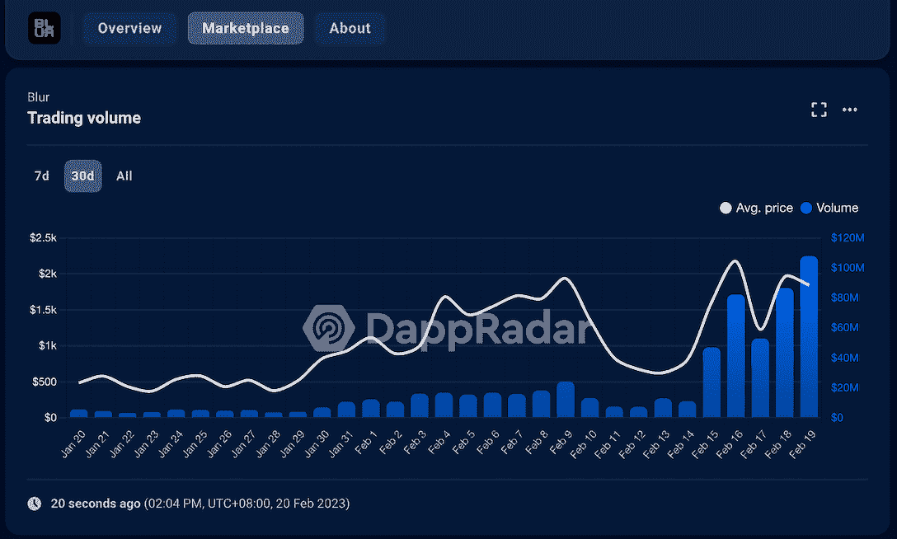

# Opensea 和 Blur 通过创作者版税争夺 NFT 市场的主导地位

> 原文：<https://web.archive.org/web/https://dappradar.com/blog/opensea-and-blur-compete-for-nft-market-dominance-through-creator-royalties>

## 查看 2023 年 2 月 13 日至 2 月 19 日期间的 NFT 销售亮点排名

Blur 和 OpenSea 之间争夺市场领导地位的竞争正在加剧，但显然前者目前占据上风。随着 BLUR token airdrop 和版税调整的到来，Blur NFT 市场的交易量在一周内突破了 4 亿美元，牢牢占据了行业的首位。随后，OpenSea 放松了版税政策，以应对市场份额的损失。请继续阅读，了解过去一周 NFT 领域的更多重大新闻。

## OpenSea 宣布费用和版税的变化

继 Blur 最近的令牌空投和版税政策更新后，OpenSea 以降低费用和调整其链上版税作为回应。然而，这并没有阻止 Blur 在交易量和平台活动方面超越 OpenSea。

在过去的 24 小时里，Blur 交易了近 1 亿美元，是 OpenSea 交易量的四倍。此外，Blur 在过去 7 天内创造了超过 4 亿美元的交易量，是其最大竞争对手的 3.85 倍。

2 月 18 日，OpenSea 宣布对其收费结构进行重大调整，以应对 Blur 的迅速崛起。这些变化包括暂时将费用降低到 0%，转向可选的创建者收入，无需链上强制执行，以及删除使用相同政策阻止市场的运营商过滤器。

> 我们今天做了一些大的改变:
> 1) OpenSea 费用→ 0%一段时间
> 2)对于所有没有链上强制执行的集合，转向可选的创建者收入(0.5%最小值)(旧的&新的)
> 3)具有相同政策的市场将不会被运营商过滤器阻止
> 
> — OpenSea (@opensea) [February 17, 2023](https://web.archive.org/web/20230302115706/https://twitter.com/opensea/status/1626682043655507969?ref_src=twsrc%5Etfw)

这些变化旨在为创作者提供更多的灵活性和选择，以便他们的内容有最大的曝光率和销售机会。

OpenSea 的这一举措是为了跟上 NFT 市场的竞争，还是迫于形势的无奈之举？

看看 Blur 的最新商业模式，其竞价机制和 token airdrop 可以让 NFT 竞价保持在底价附近，从而使 NFT 交易更加有序。此外，奖励有效地吸引了交易者，这反过来增加了 NFT 的流动性和交易意愿。自空投以来，模糊代币的价格一直在攀升。在撰写本文时，BLUR 的交易价格为 1.28 美元。

[View real-time BLUR token price](https://web.archive.org/web/20230302115706/https://dappradar.com/hub/token/eth/BLUR/ETH?from=0x5283d291dbcf85356a21ba090e6db59121208b44)

另一方面，Blur 正在积极推动 NFT 主要市场加入一个更加开放的市场环境，也就是说，不要相互封锁。因此，创作者将获得更多的销售机会。

尽管 Blur 声称优先考虑创作者的需求，但其策略似乎对交易者很有吸引力，导致交易者涌向其平台。买家需求集中在模糊上，卖家自然更愿意给平台供应内容。

在数据方面，Blur 的组合策略有效地推动了平台的增长。

[View more stats about Blur](https://web.archive.org/web/20230302115706/https://dappradar.com/ethereum/marketplaces/blur)[View more stats about OpenSea](https://web.archive.org/web/20230302115706/https://dappradar.com/ethereum/marketplaces/opensea)

## NFT 空间中值得注意的趋势的快照

### 名词的交易活动激增，因为鲸鱼刷卡模糊空投

过去一周，名词的交易活动出现了显著增长。该项目的交易额增加了 3.037%，达到 405 万美元。此外，交易商的数量增加了 600%，销售额也大幅增长了 2900%。

然而，值得注意的是，名词并没有做出任何重大的项目更新。根据 DappRadar 跟踪的数据，名词似乎已经成为《迷离档案》第二季鲸鱼活动的目标。这可能是由于该项目的高楼面价和零版税。

2 月 18 日，名词经历了 1,624 ETH 和 60 笔交易的单日历史新高。然而，许多交易是由少数钱包通过模糊竞价池进行的。您可以通过下面的链接在 DappRadar 上查看这些钱包中的资产。

*   [钱包以 5d41](https://web.archive.org/web/20230302115706/https://dappradar.com/hub/wallet/eth/0xb32229a67fdb69a1c3b46ba76368c460d5a35d41?utm_source=rankings&utm_medium=nft&utm_campaign=nft_sales) 结尾
*   [钱包以 a79c 结尾](https://web.archive.org/web/20230302115706/https://dappradar.com/hub/wallet/eth/0x1f5f902be1f635b30425b690aa9fd5fa2b6fa79c?utm_source=rankings&utm_medium=nft&utm_campaign=nft_sales)
*   [钱包以 6199 结尾](https://web.archive.org/web/20230302115706/https://dappradar.com/hub/wallet/eth/0xfa4fc4ec2f81a4897743c5b4f45907c02ce06199?utm_source=rankings&utm_medium=nft&utm_campaign=nft_sales)

[Use DappRadar to view more stats about Nouns](https://web.archive.org/web/20230302115706/https://dappradar.com/ethereum/collectibles/nouns/nfts)

### 月鸟推出月球协会

月鸟最近公布了月球协会(以前称为道)。这个新的协会旨在培育月鸟和神话品牌的成长和发展，同时也为社区驱动的项目提供资金。

月球协会在瑞士联邦理工学院和 USDC 拥有 200 万美元的种子基金，它还将从 NFT 藏品的二次销售中获得净版税收入的 35%。

通过利用这些资源，月球协会旨在提高月鸟品牌在 Web3 社区的知名度，同时创造直接惠及令牌持有者的产品和体验。值得注意的是，提案只能由月鸟或神话持有者提交，月球协会将于 2 月 28 日开放提案提交，第一次投票将于 3 月 13 日那周举行。

该系列的 7 天交易量令人印象深刻，总计 3259 万美元，增长了 775%。与此同时，一周的销量也有同样显著的增长，达到 2642 辆，增长了 693%。

[Learn more about Moonbirds](https://web.archive.org/web/20230302115706/https://dappradar.com/ethereum/collectibles/moonbirds/nfts)

### 志那都红豆投入更多精力打造 BEANZ IP

志那都红豆强调建立和推广其 BEANZ 知识产权，因为它最近推出了两个新的基于 BEANZ 的角色，Jay 和 Jelly。我们鼓励志那都红豆的粉丝关注官方社交媒体账号以获取最新消息。这一举措凸显了该项目对发展 BEANZ 品牌的承诺。

> 隆重介绍 Jay & Jelly💥杰利是两个喜欢冒险的淘气豆豆。尽管他们喜欢争吵，但他们是形影不离的，无法想象没有彼此的生活💕
> 
> 给你的闺蜜贴上 pic.twitter.com/89disaEJmN[✨](https://web.archive.org/web/20230302115706/https://t.co/89disaEJmN)的标签
> 
> — BEANZ (@BEANZOfficial) [February 13, 2023](https://web.archive.org/web/20230302115706/https://twitter.com/BEANZOfficial/status/1625087393421221889?ref_src=twsrc%5Etfw)