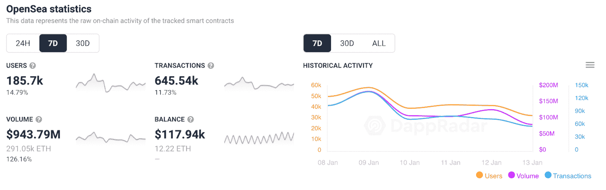
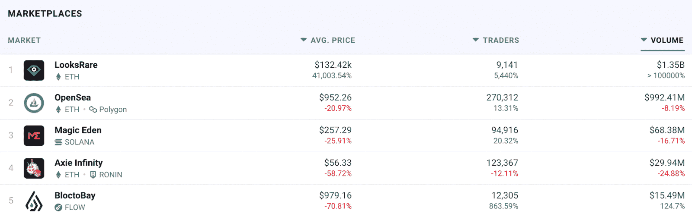

# 尽管面临来自 LooksRare 的竞争，但 OpenSea 促进了活动

> 原文：<https://web.archive.org/web/https://dappradar.com/blog/opensea-boosts-activity-despite-competition-from-looksrare>

## 在过去的七天里，OpenSea 吸引了超过 14%的交易者

很长一段时间以来，OpenSea 一直是 NFT 市场的王者，然而，后起之秀 LooksRare 被证明是一个有价值的竞争对手。尽管在 [**DappRadar 顶级市场排名**](https://web.archive.org/web/20221206103540/https://dappradar.com/nft/marketplaces) **中失去了头把交椅，但 OpenSea 在过去一周吸引了 14%以上的用户。**

面对来自新来者的激烈竞争，OpenSea 还将该平台的交易额提高到接近 9.5 亿美元。该市场拥有超过 185，000 个不同的活动钱包，在过去七天内处理了 645，540 笔交易。

令人印象深刻的是，尽管竞争越来越激烈，区块链以太坊的天然气费用也很高，但 OpenSea 仍然保持着它的地位。当然，随着 NFT 收藏家继续寻找下一个热门藏品，二级市场也非常活跃。此外，作为 NFT 最成功的市场之一，OpenSea 受益于已经建立的品牌和受欢迎程度。

## OpenSea Vs. LooksRare

数月来，OpenSea 一直是 NFT 市场的王者。虽然像 Foundation、 [Rarible](https://web.archive.org/web/20221206103540/https://dappradar.com/ethereum/marketplaces/rarible) 和 SuperRare 这样的竞争对手已经存在了很长时间，但 OpenSea 一直占据着头把交椅。直到 LooksRare 成为焦点。

LooksRare 是最新的 NFT 市场，然而，在过去的一周里，它已经成功地在 NFT 顶级市场排名中夺取了第一名。由于各种因素的综合作用，包括相当有利可图的象征性空投，LooksRare 在过去七天里吸引了超过 13 亿美元的 NFT 交易。

然而，重要的是要注意到[许多收藏家正在参与清洗交易](https://web.archive.org/web/20221206103540/https://dappradar.com/blog/looksrare-nft-marketplace-hit-by-wash-trading-amidst-airdrop)。他们这样做是为了提升自己的形象和交易统计数据。反过来，这将允许他们在[每日观察空投](https://web.archive.org/web/20221206103540/https://dappradar.com/blog/looksrare-nft-marketplace-token-airdrop-is-live)中要求更大的份额。考虑到这一点，市场的成功可能有些人为。只有时间能告诉我们 LooksRare 是否会继续统治排行榜。请记住，Rarible 曾经是 OpenSea 的有力竞争对手。然而，在与 RARI token 农民的 wash 贸易的斗争中，它失去了领先地位。

事实证明，OpenSea 是一个成熟的、值得信赖的二级市场。从这个意义上说，这两者之间的斗争将是 NFT 空间的一个持续事件。看看 LooksRare 能否从 OpenSea 手中夺取市场份额将是一件有趣的事情。

DappRadar 将继续监测 OpenSea 和 LooksRare。尤其是，这两个市场都在争夺 NFT 创作者和收藏家的注意力。如果你想获得最新的 NFT 交易数据，请查看 DappRadar PRO。PRO 还能让你进入独家的 [Discord](https://web.archive.org/web/20221206103540/https://discord.gg/4ybbssrHkm) 频道和聊天。

 NewsletterUnsubscribe at any time. [T&Cs](https://web.archive.org/web/20221206103540/https://dappradar.com/terms) and [Privacy Policy](https://web.archive.org/web/20221206103540/https://dappradar.com/privacy-policy)