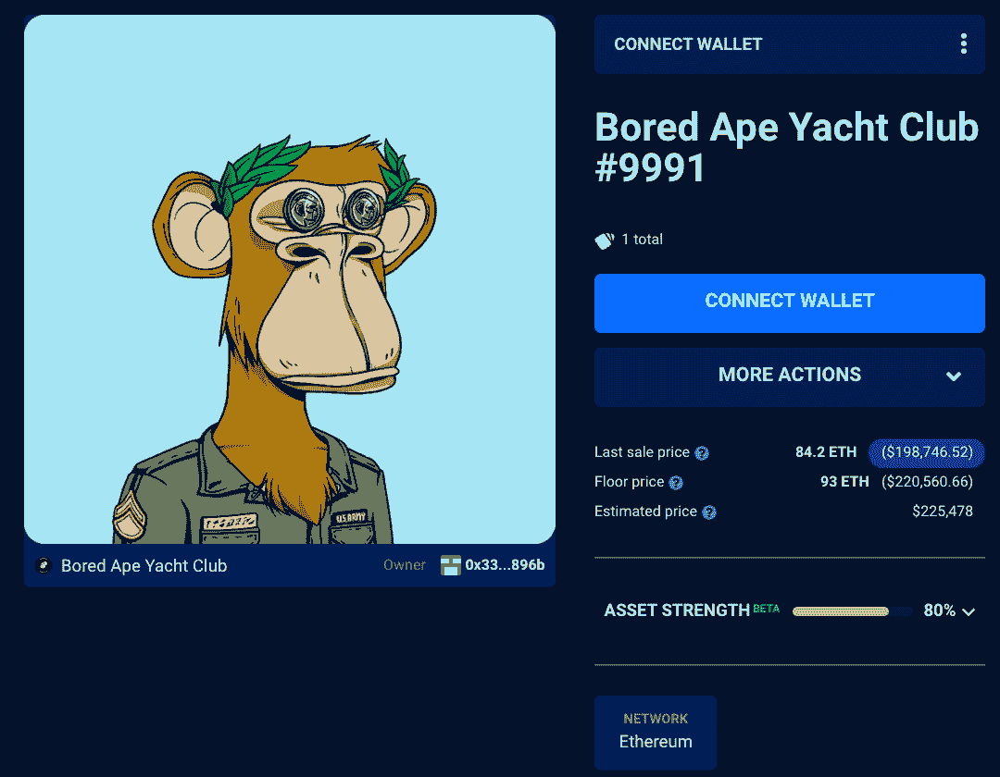
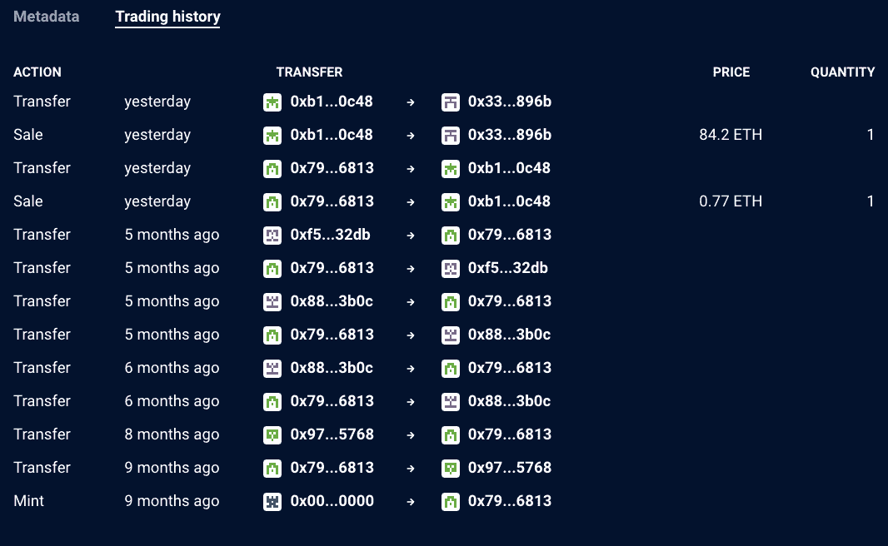
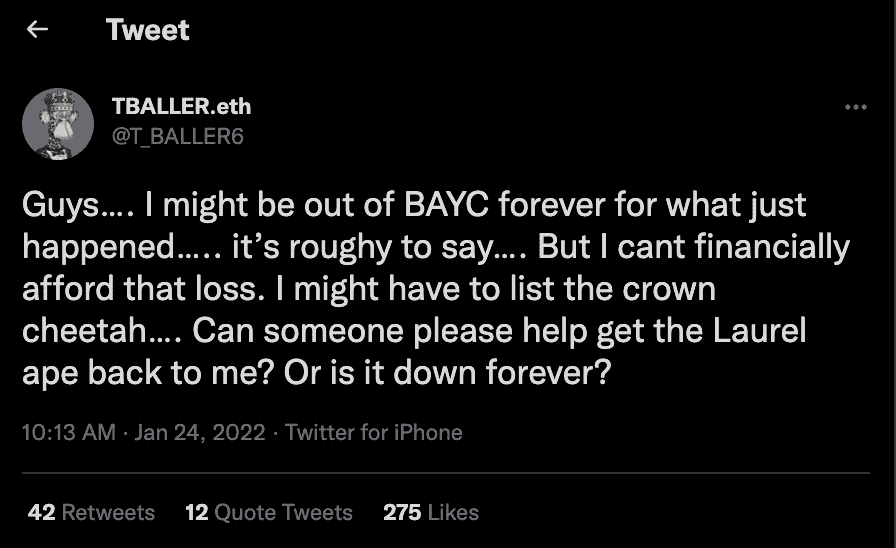

# OpenSea Bug 让 BAYC NFT 以低于 2000 美元的价格出售

> 原文：<https://web.archive.org/web/https://dappradar.com/blog/opensea-bug-lets-bayc-nft-sell-for-under-2000>

## 1 月 24 日周一，9991 号无聊猿花了 0.77 英镑或大约 1750 美元购买

NFT 主要市场 OpenSea 上的一个漏洞使得一件 NFT 湾泳滩收藏品以低于底价的价格转手。1 月 24 日周一，Bored Ape #9991 以 0.77 ETH 或约 1747 美元的价格被买走，尽管这种 NFT 通常能卖到几十万美元。

市场的一个缺陷允许用户以他们过去列出的价格购买某些 NFT，而所有者并没有意识到它们仍在销售。此外，该漏洞允许攻击者以远低于市场价格的价格在多个钱包中购买至少价值 100 万美元的 NFT。

Elliptic 的首席科学家和联合创始人汤姆·罗宾逊(Tom Robinson)首先发现了这些差异，他指出，这一漏洞似乎来自于这样一个事实，即以前可以以新的价格重新列出 NFT，而无需取消旧的列表。那些旧的清单现在被用来以先前指定的价格购买非交易性房地产——通常远低于当前的市场价格。

例如，周一在瑞士联邦理工学院(ETH)以 0.77 英镑(约 1750 美元)的价格买下了来自无聊猿游艇俱乐部(Bored Ape Yacht Club)收藏的卡通猿 NFT(Bored Ape # 9991)。[使用 DappRadar 投资组合跟踪器](https://web.archive.org/web/20220929104442/https://dappradar.com/hub/assets/eth/0xbc4ca0eda7647a8ab7c2061c2e118a18a936f13d/9991)，我们可以看看新主人的钱包。更重要的是，在交易历史上。

[<picture></picture>](https://web.archive.org/web/20220929104442/https://dappradar.com/hub/assets/eth/0xbc4ca0eda7647a8ab7c2061c2e118a18a936f13d/9991)[<picture></picture>](https://web.archive.org/web/20220929104442/https://dappradar.com/hub/assets/eth/0xbc4ca0eda7647a8ab7c2061c2e118a18a936f13d/9991)

这个 bug 让交易员得以拿到底价在 220，000 美元左右、价格不到 2，000 美元的 BAYC NFT 号。当然，这位幸运的买家随后将 NFT 以 84.2 ETH 的价格重新出售，约合 20 万美元。几分钟之内，这件商品就卖出去了，扣除费用后，投资者获得了约 19.7 万美元的利润。

## BAYC 社区前来救援

随着攻击的继续，OpenSea 还没有发布任何官方声明，但是受影响的 NFT 收藏家并不高兴。然而，正如在区块链行业中成为规范一样，稳固的 BAYC NFT 社区正在围绕这个问题团结起来，并寻求在没有 OpenSea 帮助的情况下解决这个问题。

随着名人、投资者和顶级品牌继续涌向 NFT，推动一些受欢迎的 NFT 的销量和价格飙升，最新的 bug 可能会给一些崇拜者一个更令人信服的理由停下来，让尘埃落定。

 NewsletterUnsubscribe at any time. [T&Cs](https://web.archive.org/web/20220929104442/https://dappradar.com/terms) and [Privacy Policy](https://web.archive.org/web/20220929104442/https://dappradar.com/privacy-policy)

***以上不构成投资建议。此处给出的信息仅供参考。请行使尽职调查，做你的研究。作者持有 ETH、BTC、AGIX、HEX、LINK、GRT、CRO、OMI、不变 X、ENS、GALA、AVASTR、GMEE、CUBE、RADAR、FLOW、FTM、BNB、SPS、WRLD、ATOM 和 ADA。***