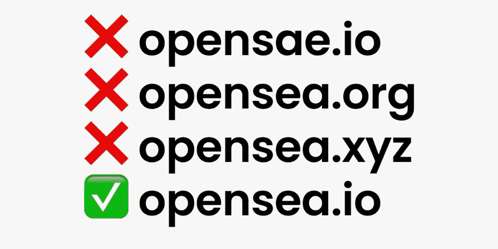

# OpenSea 数据泄露导致用户信息泄露

> 原文：<https://web.archive.org/web/https://dappradar.com/blog/opensea-data-breach-results-in-user-information-leak>

## OpenSea 提醒其用户警惕钓鱼邮件

OpenSea 在其 Twitter 账户和公司博客上宣布了一次数据泄露事件。该事件导致了 OpenSea 用户电子邮件地址的暴露。OpenSea 提醒用户提防恶意行为者。

**概要:**

*   [OpenSea](https://web.archive.org/web/20220812004943/https://dappradar.com/ethereum/marketplaces/opensea) 发现 Customer.io 的一名员工将 OpenSea 客户的电子邮件列表泄露给未经授权的外部方。
*   OpenSea 客户抱怨成为网络钓鱼攻击的目标。
*   该市场在过去 24 小时内失去了超过 30%的用户，部分原因是事故。
*   一些蓝筹股收藏顶住了熊市，实现了增长，如 [CryptoPunk](https://web.archive.org/web/20220812004943/https://dappradar.com/ethereum/collectibles/cryptopunks) 、 [Meetbits](https://web.archive.org/web/20220812004943/https://dappradar.com/ethereum/collectibles/meebits) 和 [Moonbirds](https://web.archive.org/web/20220812004943/https://dappradar.com/ethereum/collectibles/moonbirds) ，成交量分别增长了 54%、42%和 20%。

使用 [NFT 浏览器](https://web.archive.org/web/20220812004943/https://dappradar.com/hub/nft-explorer)发现您最喜爱的 NFT 系列，并获得可操作的准确数据。

## 怎么发生的？

全球最大的 NFT 市场 OpenSea 向公众披露了一个电子邮件供应商安全事件。OpenSea 发现 Customer.io 的一名员工将 OpenSea 客户的电子邮件列表泄露给了未经授权的外部方。根据 OpenSea 的博客文章，该平台一直作为电子邮件发送供应商为 OpenSea 服务。

OpenSea 提醒客户要警惕那些试图使用看起来与其官方电子邮件域相似的电子邮件地址联系他们的恶意行为者。该公司还警告用户要小心试图假冒 OpenSea 的钓鱼邮件。

今年，OpenSea 经历了一些麻烦。事实上，今天发生的数据泄露对 OpenSea 来说并不是第一次。今年 5 月，一名黑客攻击了该市场的 Discord 服务器，导致了一系列网络钓鱼事件。

不和事故之后是内幕交易丑闻。一名前 OpenSea 员工被指控利用 NFTs 的机密信息谋取个人经济利益。随着监管机构瞄准密码行业，此人可能面临最高 40 年的监禁。

## 一些 NFT 正在上升，而 OpenSea 正在下降

根据达普拉达·NFT 的跟踪，自该事件以来，OpenSea 在过去 24 小时内损失了超过 30%的交易者和 20%的交易量。显然，数据泄露已经伤害了用户对平台的信心。

当 OpenSea 忙于收拾残局时，NFTs 领域的一些项目在 24 小时内获得了显著的增长，特别是蓝筹股集合，如 CryptoPunks、Meetbits 和 Moonbirds 的交易量分别增长了 54%、20%和 42%。

此外， [Flow](https://web.archive.org/web/20220812004943/https://dappradar.com/rankings/protocol/flow) 最受欢迎的 NFT 收藏品， [NBA Top Shot](https://web.archive.org/web/20220812004943/https://dappradar.com/flow/collectibles/nba-topshot) 在过去 24 小时内增长了 342%，创下 13，102 的销售额。

DappRadar 将继续关注 OpenSea 的最新发展。在 [Twitter](https://web.archive.org/web/20220812004943/https://twitter.com/dappradar) 、 [Discord](https://web.archive.org/web/20220812004943/https://discord.gg/4ybbssrHkm) 和 [Youtube](https://web.archive.org/web/20220812004943/https://www.youtube.com/c/DappRadar) 上关注我们，跟上区块链世界的动态。

发现新推出的和即将推出的 NFT 系列，并使用超级先进的 [NFT 浏览器](https://web.archive.org/web/20220812004943/https://dappradar.com/hub/nft-explorer)根据机器学习算法、历史销售和元数据获得估计的 NFT 价值！

[<picture></picture>](https://web.archive.org/web/20220812004943/https://dappradar.com/hub/nft-explorer)