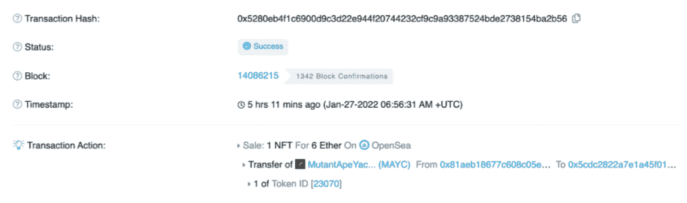
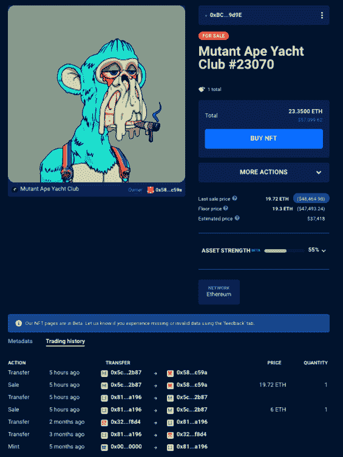

# 误导性的 OpenSea 电子邮件引发 NFT 交易者的更多损失

> 原文：<https://web.archive.org/web/https://dappradar.com/blog/opensea-email-triggers-losses-nft-traders>

## 如果你有不活跃的 OpenSea 列表，请小心，并阅读如何防止损失

领先的 NFT 二级市场 OpenSea 经历了风雨飘摇的一周，因为欺诈者发现了一个漏洞，允许他们以远低于底价或挂牌价格的价格购买 NFT。不幸的是，为了防止这种欺诈行为，OpenSea 设法让用户的情况变得更糟。

虽然这个漏洞在本周早些时候被发现，但 OpenSea 直到今天才做出反应。令人担忧的是，市场似乎忽视了详细解释情况的重要性，导致用户进一步困惑和损失。今天，一封针对不活跃列表的电子邮件被发出，解释说他们应该立即取消其 NFT 的不活跃列表，以防止损失。

不幸的是，这封邮件没有考虑到一个 NFT 可能有不止一个非活动名单。在一个详细的帖子中，用户 [swolfchan.eth](https://web.archive.org/web/20220930095649/https://dappradar.com/hub/wallet/eth/0x81aeb18677c608c05e9c4848320cad9a2a7fa196) 解释了如何防止老 MAYC 上市的损失，按照 OpenSea 的建议，他们损失更多。

本周早些时候， [DappRadar 报告了](https://web.archive.org/web/20220930095649/https://dappradar.com/blog/opensea-bug-lets-bayc-nft-sell-for-under-2000)恶意行为者利用了一个 OpenSea 漏洞，允许他们廉价购买昂贵的 NFT。简而言之，市场的一个缺陷允许用户以他们过去列出的价格购买某些 NFT，而所有者并没有意识到它们仍在销售。此外，该漏洞允许攻击者以远低于市场价格的价格在多个钱包中购买至少价值 100 万美元的 NFT。

## MAYC 23070 号案件

在 Twitter 帖子中，swolfchain.eth 解释说，他们收到了一封来自 OpenSea 的电子邮件，警告用户取消不活跃的列表。Swolfchain 接受了建议，取消了他们的 [MAYC #23070](https://web.archive.org/web/20220930095649/https://dappradar.com/hub/assets/eth/0x60e4d786628fea6478f785a6d7e704777c86a7c6/23070) 的旧 15 ETH 列表。不幸的是，同一个 NFT 的一个更老的不活跃列表成了区块链的下一个。这实质上意味着 MAYC #23070 现在以 6 ETH 的旧价格挂牌。有人利用了这一点。

Swolfchain 的 [Etherescan 记录](https://web.archive.org/web/20220930095649/https://etherscan.io/tx/0x5280eb4f1c6900d9c3d22e944f20744232cf9c9a93387524bde2738154ba2b56)清楚地显示了他的 MAYC 在 OpenSea 上以 6 ETH 的价格出售的交易。当然，NFT 的新主人没有浪费时间将代币转手卖掉。

在将 NFT 转移到几个地址后，新的所有者以 19.72 ETH 的价格将 MAYC #23070 挂牌出售。这代表了 13.72 ETH 的收益，不包括汽油费。尽管如此，在撰写本文时，他的投资组合价值约为 33.689 美元，这仍是一个巨大的提升。目前，变种人猿游艇俱乐部收藏的底价约为 18 ETH。

## OpenSea 误导了用户

可以说，OpenSea 努力保护它的用户。然而，市场对这种情况的反应存在不可否认的漏洞。

首先，OpenSea 在漏洞公开后几天发布了一个影响用户的社区更新警告。其次，正在讨论的社区更新提供了误导性信息。

虽然取消上市正是一个人为了保护自己的资产而必须做的事情，但必须考虑到区块链上记录的以前不活跃的上市的可能性。从这个意义上说，更安全的保护你的 NFT 的方法是把它们转移到一个完全不同的地址，然后取消列表。不幸的是，就像我们在 Swolfchain 的 MAYC 身上看到的那样，简单地删除一个不活跃的列表实际上可能会导致更大的损失。

更糟糕的是，Swolfchain 并不是唯一一家。漏洞暴露后，OpenSea 上出现了无数帖子，用户解释他们如何损失了数千甚至数百万美元。从这个意义上说，要保持高度警惕，检查你的 OpenSea 账户。如果你曾经挂牌出售一件从未售出的 NFT，最安全的方法是把它转移到一个新的地址。或者，您可以使用类似于[撤销](https://web.archive.org/web/20220930095649/https://revoke.cash/)的服务，这实质上收回了对您钱包中的 NFTs 和 crypto 的所有权限和访问。

## 在加密中保持安全，密切关注您的投资组合

虽然区块链技术提供了前所未有的透明度和安全性，但它也是最新的技术领域之一。这为黑客和剥削者提供了大展身手的机会。尽管如此，只要你有你需要的所有信息，还是有办法保护你的资产的。

DappRadar 致力于提供最新、最易获取的投资组合管理和安全信息。你可以看看这个关于如何在加密世界中保持安全的提示列表。此外，通过 DappRadar 投资组合跟踪工具，您可以轻松查看您在 DeFi 和 NFT 中的所有投资。无论是代币、流动性供给还是非金融工具。如果你把钱包连接到 DappRadar 网站，你就可以看到这一切。

随着这项技术的不断发展，我们将继续监测 NFT 空间。虽然 OpenSea 是一个不可否认的市场领导者，但没有人能幸免于漏洞利用或黑客攻击。要了解最新的 NFT 和加密新闻，请在 Twitter 上关注 DappRadar。您还可以加入 DappRadar PRO，利用最新的 NFT 销售数据和独家 Discord 社区。

 NewsletterUnsubscribe at any time. [T&Cs](https://web.archive.org/web/20220930095649/https://dappradar.com/terms) and [Privacy Policy](https://web.archive.org/web/20220930095649/https://dappradar.com/privacy-policy)