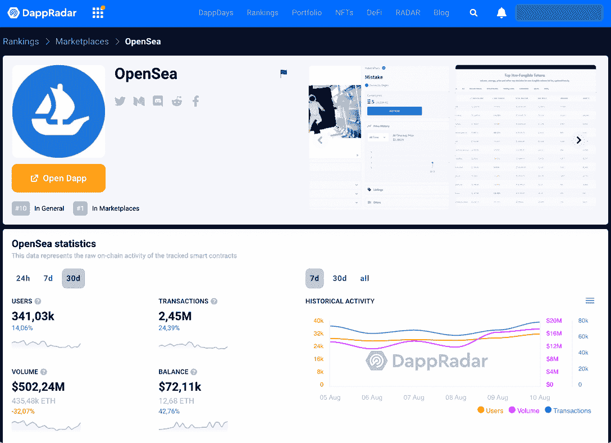

# OpenSea 推出新政策解决 NFT 盗窃问题

> 原文：<https://web.archive.org/web/https://dappradar.com/blog/opensea-launches-new-policy-to-address-nft-theft>

## 被盗物品政策是对最近公众需求的回应

**NFT 市场领导者 OpenSea 推出了一项新政策，以帮助打击在该平台上销售的被盗非功能性桌面。尽管用户报告了一些 2022 年在 OpenSea 上盗窃和出售资产的案件，但该公司一直在努力令人满意地解决这些案件。这一新声明为社区带来了更安全交易的新希望。**

2022 年 2 月，一名黑客在 OpenSea 网站外部发起的网络钓鱼攻击中窃取了价值[百万的 NFT。尽管努力和退款，该平台很快证实了这一点，并提醒其用户。此外，2022 年 6 月](https://web.archive.org/web/20221208093327/https://dappradar.com/blog/opensea-upgrade-throws-door-open-to-hackers)的[数据泄露导致用户信息泄露。](https://web.archive.org/web/20221208093327/https://dappradar.com/blog/opensea-data-breach-results-in-user-information-leak)

在经历了有些矛盾的一年后，OpenSea 把它带到了 Twitter 上，直接解决了这些敏感问题。

> 1/我们能解决🐘在房间里？我们希望为您提供更多关于我们的↯失窃物品政策的清晰和透明
> 
> — OpenSea (@opensea) [August 10, 2022](https://web.archive.org/web/20221208093327/https://twitter.com/opensea/status/1557487545876762625?ref_src=twsrc%5Etfw)

正如你在帖子中看到的，OpenSea 意识到了这些事件对破坏人们对平台信任的副作用。

从那以后，新政策给公司带来了一些调整，例如使用警方报告来确认每一份盗窃报告——以前，它们只是用于升级的纠纷。

OpenSea 还指出，对于报告物品被盗的用户来说，不需要公证人就可以更容易地再次列出物品进行销售。

*   在官方网站上阅读更多关于 OpenSea 被盗物品政策的信息。

## 什么是 OpenSea？

OpenSea 是 NFT 最常用的市场之一。你可以通过这个平台，结合以太坊、多边形和索拉纳网络，从许多最好的收藏中买卖[不可替代的代币](https://web.archive.org/web/20221208093327/https://dappradar.com/blog/what-are-non-fungible-tokens-nfts)。

[Track OpenSea with the DappRadar NFT Rankings](https://web.archive.org/web/20221208093327/https://dappradar.com/multichain/marketplaces/opensea)

此外，你还可以使用 [DappRadar NFT 收藏浏览器](https://web.archive.org/web/20221208093327/https://dappradar.com/hub/nft-explorer)详细探索 NFTs 上最受欢迎的收藏，并使用 [NFT 价值评估器](https://web.archive.org/web/20221208093327/https://dappradar.com/hub/nft-value-estimator)了解它们的价值。

[https://web.archive.org/web/20221208093327if_/https://www.youtube.com/embed/fkEaXYLOW-s?feature=oembed](https://web.archive.org/web/20221208093327if_/https://www.youtube.com/embed/fkEaXYLOW-s?feature=oembed)

我们将继续关注 OpenSea 引领 NFT 空间的旅程。你可以在我们的博客上[了解更多关于市场的信息。](https://web.archive.org/web/20221208093327/https://dappradar.com/blog/tag/opensea)

你可以使用 DappRadar 的 [NFT 追踪器](https://web.archive.org/web/20221208093327/https://dappradar.com/nft)和[工具](https://web.archive.org/web/20221208093327/https://dappradar.com/rankings)来帮助你验证一个 dapp、 [token](https://web.archive.org/web/20221208093327/https://dappradar.com/hub/tokens/ethereum/all/1) 或 NFT 是否合法。我们的 [Twitter](https://web.archive.org/web/20221208093327/https://twitter.com/DappRadar) 页面会快速发送最新的更新，所以当我们听说一个骗局时，我们的关注者会第一时间知道。

 NewsletterUnsubscribe at any time. [T&Cs](https://web.archive.org/web/20221208093327/https://dappradar.com/terms) and [Privacy Policy](https://web.archive.org/web/20221208093327/https://dappradar.com/privacy-policy)