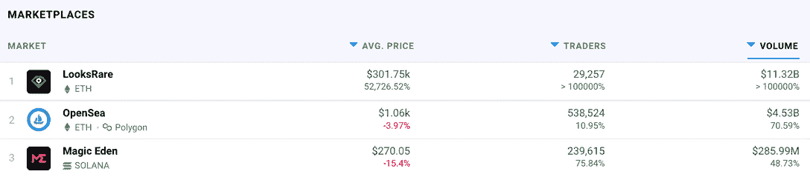
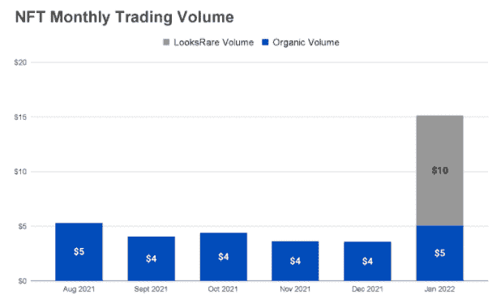
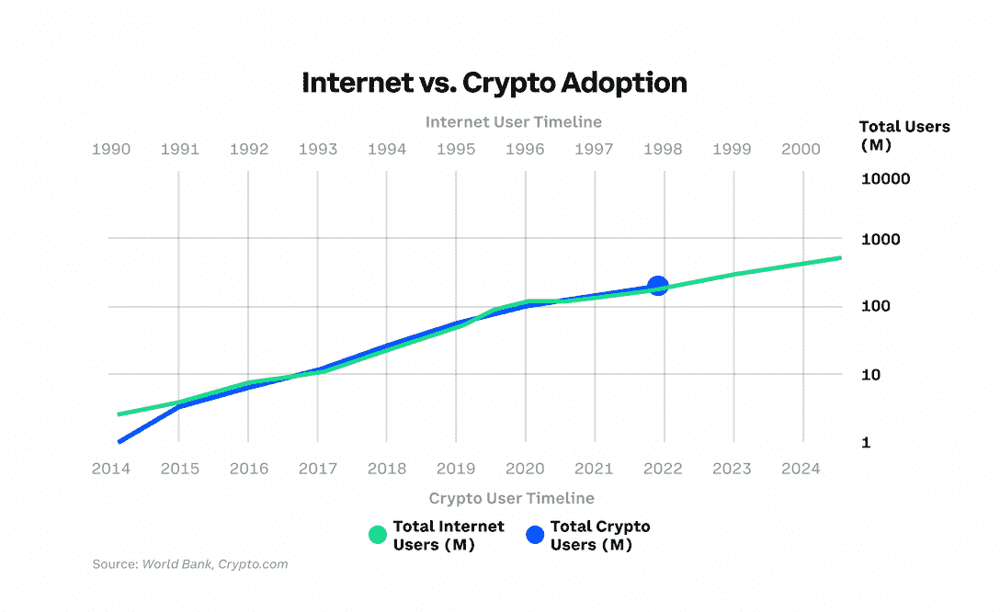
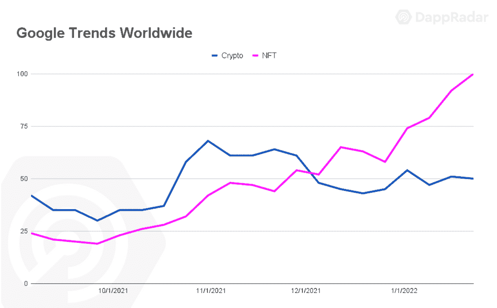

# 1 月份，OpenSea 交易量达到 45 亿美元

> 原文：<https://web.archive.org/web/https://dappradar.com/blog/opensea-nft-trading-volume-hits-4-5b-in-january>

## 尽管加密不景气，NFTs 仍继续繁荣

领先的以太坊 NFT 市场 [**OpenSea**](https://web.archive.org/web/20221002010812/https://dappradar.com/multichain/marketplaces/opensea) **一月份经历了有记录以来最好的月份之一。尽管因导致交易者损失资金的错误和新以太坊市场外观的费用增加而受到抨击，但 OpenSea 在过去 30 天内在 NFT 的销售额超过 45 亿美元。进一步表明，当加密价格横向移动时，对 NFT 的需求是健康的。**

尽管, [LooksRare](https://web.archive.org/web/20221002010812/https://dappradar.com/ethereum/marketplaces/looksrare) 和类似 [Solana](https://web.archive.org/web/20221002010812/https://dappradar.com/rankings/protocol/solana) 和 [Tezos](https://web.archive.org/web/20221002010812/https://dappradar.com/rankings/protocol/tezos) 的网络上的替代市场即将来袭，OpenSea 仍然处于主导地位。一段时间前，NFT 市场在这一领域形成了先发优势，拥有最受追捧的藏品。

Source: DappRadar

一月份，DappRadar 追踪的 NFTs 总销售额超过 150 亿美元，其中 LooksRare 的销售额超过 100 亿美元。然而，正如过去两周报道的那样，LooksRare 的交易量是受 [LOOKS token](https://web.archive.org/web/20221002010812/https://dappradar.com/hub/token/eth/LOOKS?from=0xf4d2888d29d722226fafa5d9b24f9164c092421e) 奖励刺激的人为交易的结果。

Source: [DappRadar](https://web.archive.org/web/20221002010812/https://dappradar.com/)

2021 年，NFT 市场爆发式增长，产生了 258 亿美元的交易，比之前四年的总和高出 18，400%。2022 年的前 31 天证实了 NFT 正在获得更大的动力。2022 年 1 月，非食物疗法的支出与 2021 年 8 月持平，并且没有放缓的迹象。

此外，集中交易平台 crypto.com 和世界银行的研究表明，就用户总数而言，加密技术的采用现在与互联网的采用不相上下。可以说，这些新用户中有许多是通过 [NFT 收藏](https://web.archive.org/web/20221002010812/https://dappradar.com/nft)和[玩赚 dapps](https://web.archive.org/web/20221002010812/https://dappradar.com/rankings/category/games) 进入的。越来越多的可视化平台将人们吸引到他们想了解的 web3 和服务上。

## 新领域

NFT 资产越来越受欢迎。对“NFT”一词的搜索第一次超过了对“密码”的搜索此外，来自亚洲的兴趣增加是有希望的。由北美和欧洲用户主导的市场现在将欢迎亚洲 NFT 观众。

Source: [DappRadar](https://web.archive.org/web/20221002010812/https://dappradar.com/)

这些数字很大程度上是由名人和大品牌在 NFT 世界的参与推动的。像小内马尔(在推特和 Instagram 上拥有+2 亿粉丝)和 T2(在推特和 Instagram 上拥有+1.92 亿粉丝)这样拥有广泛社交影响力的明星已经公开宣布他们最近加入了无聊猿游艇俱乐部(BAYC)，这是 NFT 的首要项目之一。

雪上加霜的是，Twitter，也许是最受加密和 NFT 爱好者欢迎的社交媒体平台[于 2022 年 1 月在社交平台中启用了其第一个 web3 功能](https://web.archive.org/web/20221002010812/https://dappradar.com/blog/twitter-launches-nft-profile-picture-verification/)。社交媒体平台 Instagram 和脸书预计将紧随其后。

值得注意的是，现在受到关注的不仅仅是以太坊 NFT 系列。整个 NFT 的景观都在提升。部分原因是 NFT 上所谓的大甩卖，大部分以本土代币定价，如 SOL、ETH 和 BNB，这些代币在几个月内损失了约 50%的价值。其次，投资者被吸引到蓝筹股 NFT 收藏品，如、[妇女世界](https://web.archive.org/web/20221002010812/https://dappradar.com/ethereum/collectibles/world-of-women)和 [BAYC](https://web.archive.org/web/20221002010812/https://dappradar.com/ethereum/collectibles/bored-ape-yacht-club) 作为价值储存手段，在熊市期间的百分比收益方面有可能超过 BTC 和瑞士联邦理工学院。

作者最感兴趣的是，我们不能再把 NFT 和秘密交易者放在同一个篮子里。一种新的资产类别诞生了，它有自己的群体、追随者和需求。可以说，给 crypto 增加一个视觉元素是打开了普通大众的闸门。然而，大多数严肃的密码交易者不参与 NFT 所有权或翻转，而与此同时，大多数强烈的 NFT 收藏家不产量农业或杠杆合成。两个截然不同的社区正在发展，观察起来很有趣。

 NewsletterUnsubscribe at any time. [T&Cs](https://web.archive.org/web/20221002010812/https://dappradar.com/terms) and [Privacy Policy](https://web.archive.org/web/20221002010812/https://dappradar.com/privacy-policy)

***以上不构成投资建议。此处给出的信息仅供参考。请行使尽职调查，做你的研究。作者持有 ETH，BTC，AGIX，HEX，LINK，GRT，CRO，OMI，不可变 X，GALA，AVASTR，GMEE，CUBE，RADAR，FLOW，FTM，BNB，SPS，WRLD，ATOM，ADA***