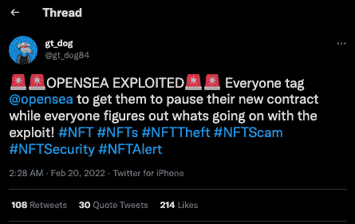
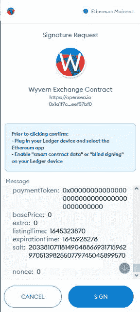
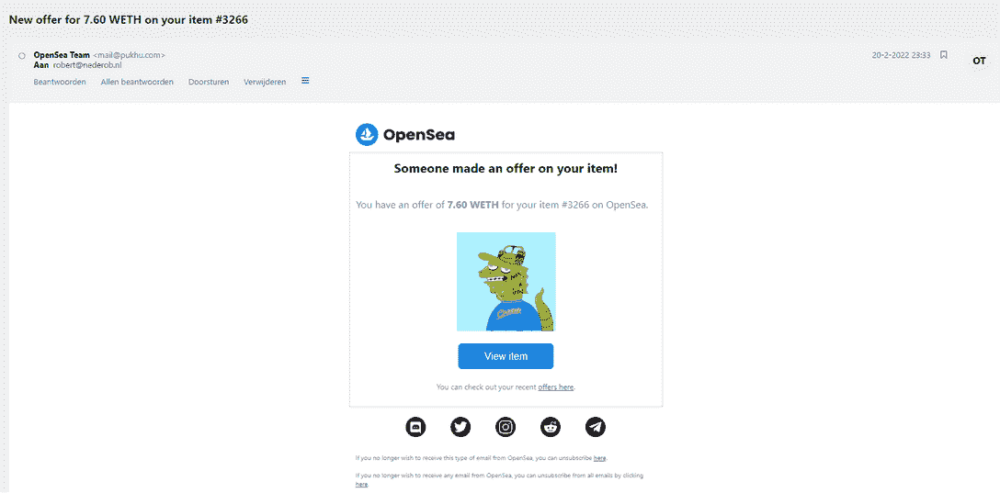
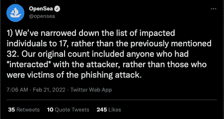
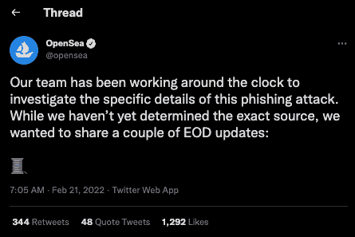

# OpenSea 升级向黑客敞开大门

> 原文：<https://web.archive.org/web/https://dappradar.com/blog/opensea-upgrade-throws-door-open-to-hackers>

## 针对 NFT 移民的网络钓鱼攻击–立即限制访问！

**领先** [**以太坊 NFT 市场 OpenSea**](https://web.archive.org/web/20221229170359/https://dappradar.com/ethereum/marketplaces/opensea) **当该平台于 2 月 20 日宣布一周期限的新智能合约升级时，为黑客创造了机会。为期一周的非活动 NFT 退市升级计划为黑客利用网络钓鱼攻击 NFT 持有者打开了机会之窗。**

OpenSea 升级要求用户将其在以太坊上列出的 NFT 迁移到新的智能合约。此外，OpenSea 免除了所有的天然气费用，允许用户免费进行搬迁。升级的直接结果是，没有从以太坊迁移过来的用户可能会丢失他们旧的、不活跃的列表。然后，他们需要再次列出他们的项目，有可能再次支付汽油费。

在 [OpenSea 发布升级声明](https://web.archive.org/web/20221229170359/https://cointelegraph.com/news/opensea-smart-contract-upgrade-to-delist-inactive-nfts-on-ethereum)后的几个小时内，包括 OpenSea 在内的几个来源的报告显示，针对即将被除名的 NFTs 的攻击正在进行。OpenSea 反应迅速，试图教育用户并快速解决问题。

Peckshield 发现的进一步分析[确定，攻击者在迁移到 OpenSea 的新智能合同之前，使用钓鱼电子邮件来窃取 NFT。一旦用户通过欺诈性电子邮件授权 NFT 迁移，攻击者就可以访问 NFTs。黑客攻击的细节揭示了这个坏演员是如何策划了几周的攻击的。](https://web.archive.org/web/20221229170359/https://twitter.com/peckshield)

## OpenSea NFT 哈克解释说

多亏了一个推特旁观者，我们可以分析攻击，看看它是如何发生的。攻击正式开始于 28 天前，当时黑客上传了一份新的智能合同，以获取尽可能多的签名。

然后，黑客开始发送钓鱼电子邮件，告诉接收者签署一条消息以登录并迁移到新的 OpenSea 智能合同以进行销售。取而代之的是，接收者签署了一份价值 0 ETH 的私人协议，允许黑客在以后零价格购买你的 NFT。

然后，坏演员等待机会之窗，当用户因为害怕失去他们而急于对他们的 NFT 采取行动时。2 月 20 日，他们执行智能合约功能，在清单到期前窃取 NFT。这一切之所以成为可能，是因为他们已经在服务器上存储了你的签名。

对于感兴趣的人来说,[在这里已经解释了黑客更深层次的技术层面。简而言之，NFT 持有者可能会收到一封类似下面截图的电子邮件，告诉他们收到了一个 NFT 的报价，他们不知道或者可能在他们的钱包里，但忘记了。当然，你想卖，你就点。](https://web.archive.org/web/20221229170359/https://twitter.com/isotile/status/1495406610348445706)

OpenSea 的联合创始人兼首席执行官 Devin Finzer 承认了这次网络钓鱼攻击，并证实到目前为止已有 17 名用户被确认受到影响。虽然 NFT 市场尚未破译正在进行的攻击，但区块链调查员 Peckshield 怀疑用户信息(包括电子邮件详细信息)可能泄露，从而加剧了网络钓鱼攻击。

然而，Finzer 要求受影响的用户联系公司，他总结道:

"如果你担心并想保护自己，你可以取消批准访问你的 NFT 收藏."现在建议用户警惕来自 OpenSea 的所有通信，并撤销关于迁移到新智能合同的所有权限。

## 如何撤销对您的 NFTs 的访问

在混乱中，最好的办法是撤销对你的 NFT 收藏和物品的访问权。

对于以太坊网络上的令牌，使用以太扫描可以帮助您了解您在钱包上批准的智能合约的数量。以太网扫描工具是一个数据聚合器，用于所有通过 ERC20 标准构建的令牌。因此，您可以随时看到每个 ERC20 令牌上正在进行的交易。

除此之外，这也是评估令牌批准列表的重要工具。通过 Etherscan，您可以撤销对您的钱包的访问权限。当您撤销对钱包的访问权限时，您需要在下次进入该 dapp 时再次批准访问权限。但是，你的代币不会没了。别担心。现在，让我们进入整个论述的核心。

1.  打开元掩码，确保您已登录。单击钱包地址进行复制。
2.  转到以太网扫描上的[令牌批准检查器](https://web.archive.org/web/20221229170359/https://etherscan.io/tokenapprovalchecker)。这项服务目前处于测试阶段，一旦你登录以太扫描>更多>工具>令牌认证就可以找到。
3.  粘贴您的钱包地址>按搜索
4.  该页面现在将显示与该特定钱包的所有已批准的智能合约交互。
5.  点击“连接到 Web3”按钮，将 Etherscan 连接到您在 Metamask 中激活的钱包。
6.  一旦连接，你可以点击右侧的“撤销”按钮，以确保某个 dapp 不再访问你的钱包。请记住，取消使用权涉及到汽油费。然而，在支出 5 美元或损失 5000 美元之间做出选择想必相当容易。

如前所述，OpenSea 正在全力应对攻击，并努力教育社区，阻止攻击。在撰写本文时，该攻击似乎还没有开始运行，在大约 15 个小时内，恶意合同上没有任何活动。

## 保持安全

现在最好的办法是按照上面的说明撤销对 OpenSea 的访问。然后，密切关注 OpenSea Twitter ,因为他们会继续揭开谜底并告知社区如何保持安全。

 NewsletterUnsubscribe at any time. [T&Cs](https://web.archive.org/web/20221229170359/https://dappradar.com/terms) and [Privacy Policy](https://web.archive.org/web/20221229170359/https://dappradar.com/privacy-policy)

***以上不构成投资建议。此处给出的信息仅供参考。请行使尽职调查，做你的研究。作者持有 ETH、BTC、AGIX、HEX、LINK、GRT、CRO、OMI、不可变 X、GALA、AVASTR、GMEE、CUBE、RADAR、FLOW、FTM、BNB、SPS、WRLD、ATOM 和 ADA。***