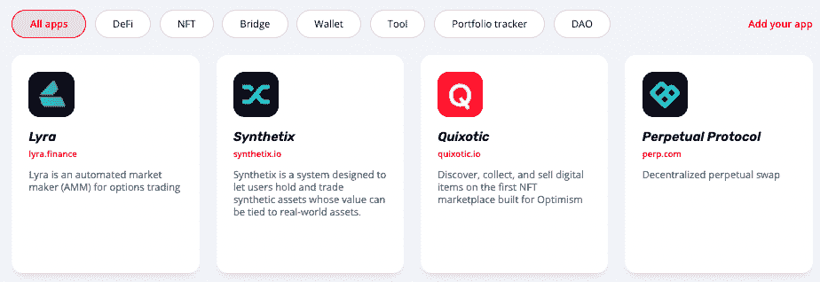
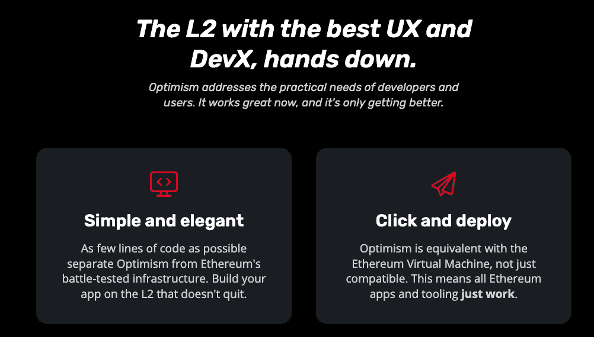

# 乐观的 Dapps 来到 DappRadar

> 原文：<https://web.archive.org/web/https://dappradar.com/blog/optimism-dapps-coming-to-dappradar>

## 攀登以太坊的现在，为它的未来提供资金。

DappRadar 很高兴地宣布，它将很快整合乐观的区块链和它的 dapps 生态系统。乐观是以太坊的第 2 层扩展解决方案，称为乐观汇总。oru 通过将大量交易数据移出主区块链，同时保留以太坊基础层的安全保证，解决了以太坊的扩展困境。现在，我们邀请 DappRadar 社区来了解更多关于乐观网络的信息。

乐观是一种乐观的概括，是对区块链背负另一位家长区块链的证券的一种奇特描述。这样，乐观主义拥有以太坊的所有好处(去中心化和安全性),而没有它的缺点(高昂的汽油费和缓慢的执行)。

乐观已经为其用户节省了超过 100 万 1B 元的汽油费，并处理了数百万笔交易。自从删除其白名单并完全开放部署，同时停止任何再生式升级后，其使用量稳步增长。乐观主义是独一无二的，因为它提供了与以太坊虚拟机的真正对等，同时还将其当前集中排序器产生的 100%利润捐赠给[追溯基金以太坊公共产品](https://web.archive.org/web/20221001234442/https://medium.com/ethereum-optimism/retroactive-public-goods-funding-33c9b7d00f0c)。

DappRadar 将很快整合并跟踪乐观 dapps。因此，我们每月超过 100 万的网站访问者可以接触到乐观 dapp，让他们分析哪些 dapp 表现良好，并发现他们可以使用的 dapp。

## 乐观主义的 Dapp 生态系统

[乐观的 dapp 生态系统](https://web.archive.org/web/20221001234442/https://www.optimism.io/apps/all)已经建立了 Uniswap、Synthetix、Perpetual Protocol 和 Aave 等 DeFi 参与者，允许用户参与代币互换、衍生品交易、收益农业和流动性供应。乐观 DeFi 生态系统目前锁定(TVL)的总价值[超过 3.4 亿美元](https://web.archive.org/web/20221001234442/https://defillama.com/chain/Optimism)。

在 NFT 类别中，有几个系列过着乐观的生活，包括[光学朋克](https://web.archive.org/web/20221001234442/https://www.optipunks.com/)和[皮条客](https://web.archive.org/web/20221001234442/https://dopewars.gg/)——一款嘻哈风格的“玩到赚”元宇宙游戏中的 NFT 角色。用户可以搜索[不切实际的](https://web.archive.org/web/20221001234442/https://quixotic.io/)，乐观的主要 NFT 市场，寻找下一个 NFT 宝石。

## 开始建造 dapps

已经熟悉以太坊开发的构建者会发现，由于真正的 [EVM 等价](https://web.archive.org/web/20221001234442/https://medium.com/ethereum-optimism/introducing-evm-equivalence-5c2021deb306)，部署乐观主义变得异常简单。像 Hardhat 这样的工具开箱即用。乐观主义已经为创造一流的开发者体验分配了大量的资源，这也是事实。乐观部署很简单，只需点击一下就能完成。

如果你正在寻找一个可以开始的地方，我们建议查看乐观[开发者文档](https://web.archive.org/web/20221001234442/https://community.optimism.io/docs/developers)，在那里你可以找到你需要知道的关于在乐观上构建和部署你的第一个应用的一切。

有抱负的开发人员可以[学习乐观主义和乐观向上的工作原理](https://web.archive.org/web/20221001234442/https://community.optimism.io/docs/how-optimism-works/)。那些对深入研究感兴趣的人应该查看一下[协议规范](https://web.archive.org/web/20221001234442/https://community.optimism.io/docs/protocol)或[开发者文档](https://web.archive.org/web/20221001234442/https://community.optimism.io/docs/developers/)进行深入研究。他们的媒体页面也是发布公告和网络背后更多技术设计理念的丰富资源。

## 摘要

*   乐观主义为用户节省了 100 美元 1B+的汽油费
*   乐观是完全开放的部署
*   乐观将不再有重生风格的升级
*   乐观是 EVM 唯一的 L2，意味着开发人员工具“只需工作”,只需点击一下就能部署

 NewsletterUnsubscribe at any time. [T&Cs](https://web.archive.org/web/20221001234442/https://dappradar.com/terms) and [Privacy Policy](https://web.archive.org/web/20221001234442/https://dappradar.com/privacy-policy)