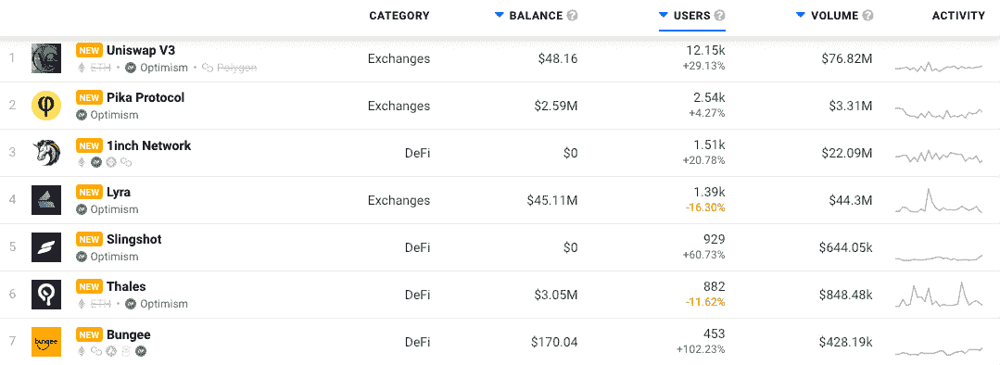
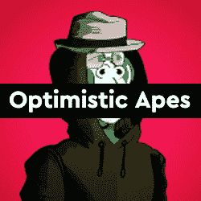
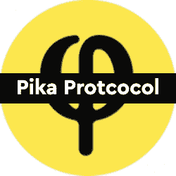

# 乐观 Dapps 现在在 DappRadar 上追踪

> 原文：<https://web.archive.org/web/https://dappradar.com/blog/optimism-dapps-now-tracked-on-dappradar>

## 现在跟踪乐观网络 dapps 包括 Synthetix，Lyra 和 Thales

DappRadar 很高兴宣布整合乐观网络及其 dapps 生态系统。DappRadar 每月一百万的网站访客现在可以通过 [**乐观 dapp 排名**](https://web.archive.org/web/20220925072252/https://dappradar.com/rankings/protocol/optimism) **分析哪些 dapp 吸引了最多的交易量、唯一的用户钱包，或者处理了最多的交易。这样，每个人都可以了解哪些 dapps 和令牌在乐观网络上建立了稳固的社区和价值。**

乐观是一种乐观的概括(ORU ),或者用一种别出心裁的方式来描述一个背负着另一个家长区块链的安全的区块链。通过这种方式，乐观主义拥有以太坊的所有好处，比如真正的分散化和安全性，而没有高昂的汽油费和缓慢的执行速度等缺点。此外，一个易于使用的[桥梁](https://web.archive.org/web/20220925072252/https://gateway.optimism.io/welcome)意味着投资者可以轻松地将资产从其他链转移到乐观上，并开始受益于低汽油费和快速交易。

## 乐观 DappRadar 排名

在发布时，DappRadar 将跟踪 14 个乐观 dappss，随着生态系统的进一步扩展，未来还会有更多的乐观 dapp。该网络专注于 DeFi 和 Exchange dapps，14 个跟踪的乐观 dapp 中有 10 个分布在这两个类别中。这些 dapps 帮助乐观在 TVL 达到近 4 亿美元。 [Uniswap V3 基于乐观主义](https://web.archive.org/web/20220925072252/https://dappradar.com/optimism/exchanges/uniswap-v3)运行，是领先的协议，帮助用户交换代币，进出 DeFi 位置，并避免以太坊燃气费。 [Pika 协议](https://web.archive.org/web/20220925072252/https://dappradar.com/optimism/exchanges/pika-protocol)是乐观主义的原生 DEX，而流行的以太坊 DeFi 协议 [1Inch 也对乐观主义](https://web.archive.org/web/20220925072252/https://dappradar.com/optimism/defi/1inch-network)起作用。

NFTs 系列正在出现，最受欢迎的是乐观猿，这是原始无聊猿游艇俱乐部 NFT 系列的一部分，其价格仅为 NFT 湾的一小部分。随着 NFT 系列的出现，他们有了本地的不切实际的 NFT 市场来交易、发现和创造非功能性交易。

## 发动机罩下的乐观

乐观是以太坊的第二层扩展解决方案，称为乐观汇总，或 ORU。ORU 通过将庞大的交易数据从主区块链中移出，同时保留以太坊基础层的安全保证，解决了以太坊的扩展困境。此外，乐观是 EVM 唯一的 L2，意味着开发人员工具“只是工作”只需点击一下就可以将 dapps 部署到网络上，帮助项目在多个链上找到新的受众。

## dapp 开发者的乐观

已经熟悉以太坊开发的构建者会发现，由于真正的 [EVM 等价](https://web.archive.org/web/20220925072252/https://medium.com/ethereum-optimism/introducing-evm-equivalence-5c2021deb306)，部署乐观主义变得异常简单。像 Hardhat 这样的工具开箱即用。乐观主义已经为创造一流的开发者体验分配了大量的资源，这也是事实。乐观部署是微不足道的，一键完成。

乐观主义与 EVM 完全兼容，dappRadar 邀请 Dapp 开发者[向 DappRadar](https://web.archive.org/web/20220925072252/https://dappradar.com/submit-dapp) 提交他们的 Dapp，在世界 Dapp 商店上创造更多的可见性。有兴趣了解更多关于乐观主义和可能性的开发者可以从[乐观主义文档网站](https://web.archive.org/web/20220925072252/https://www.optimism.io/)开始。

[<picture></picture>](https://web.archive.org/web/20220925072252/https://dappradar.com/optimism/collectibles/optimistic-apes)[<picture></picture>](https://web.archive.org/web/20220925072252/https://dappradar.com/optimism/exchanges/pika-protocol)[<picture></picture>](https://web.archive.org/web/20220925072252/https://dappradar.com/rankings/protocol/optimism) NewsletterUnsubscribe at any time. [T&Cs](https://web.archive.org/web/20220925072252/https://dappradar.com/terms) and [Privacy Policy](https://web.archive.org/web/20220925072252/https://dappradar.com/privacy-policy)