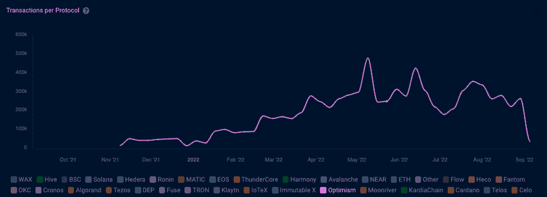
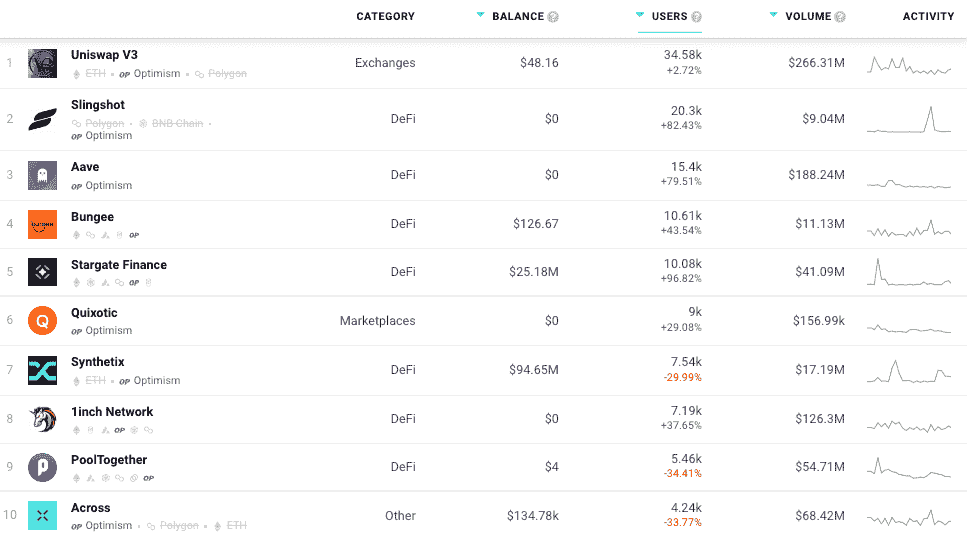

# 乐观数据指向第二层赛季

> 原文：<https://web.archive.org/web/https://dappradar.com/blog/optimism-data-points-to-layer-2-season>

## 每周洞察区块链和 Web3 应用

乐观公司已经为其用户节省了超过 10 亿美元的油费，并处理了数百万笔交易。自从删除其白名单并完全开放部署以来，其使用量稳步增长。乐观是 EVM 唯一等同的第二层，意味着开发者工具“只需点击一下就可以部署 dapps”。

*   [什么是乐观网络？](https://web.archive.org/web/20221006200403/https://dappradar.com/blog/optimism-data-points-to-layer-2-season/#What-is-Optimism-Network?-)
*   dapp 建设者的乐观态度
*   【Aave 用户的 OP 奖励
*   [以太坊合并带来期待](https://web.archive.org/web/20221006200403/https://dappradar.com/blog/optimism-data-points-to-layer-2-season/#Ethereum-Merge-brings-expectation-)
*   乐观主义者身材越来越好
*   [乐观总结](https://web.archive.org/web/20221006200403/https://dappradar.com/blog/optimism-data-points-to-layer-2-season/#Optimism-in-summary-)
*   [探索乐观 dapps](https://web.archive.org/web/20221006200403/http://explore-optimism-dapps-/)
*   [将乐观与元掩码联系起来](https://web.archive.org/web/20221006200403/https://dappradar.com/blog/optimism-data-points-to-layer-2-season/#Connect-Optimism-to-MetaMask-)

如果你在区块链寻找下一个 Spotify、谷歌或亚马逊， [DappRadar 可以帮助](https://web.archive.org/web/20221006200403/https://dappradar.com/blog/tag/dapp-trends)我们每周[的 Dapp 趋势文章](https://web.archive.org/web/20221006200403/https://dappradar.com/blog/tag/dapp-trends)。各种类别和垂直领域发生了如此多的事情，关键是要知道哪些[区块链](https://web.archive.org/web/20221006200403/https://dappradar.com/rankings/protocol/fuse)、[达普斯](https://web.archive.org/web/20221006200403/https://dappradar.com/rankings/protocol/fuse)和 [NFT 项目](https://web.archive.org/web/20221006200403/https://dappradar.com/blog/ten-things-everybody-should-know-about-nfts/)出于正确的原因创造了价值并吸引了观众。

此外，以太坊第 2 层解决方案在 2021 年和 2022 年的吸引力和实用性都有了巨大的飞跃。自今年年初以来，L2 平台的 TVL 在 ETH 方面上涨了 130%。

在这场第二层竞赛中，可以说有三个领先的平台:Loopring、Arbitrum 和 optimistry。本周，我们关注乐观主义、它的 dapps 生态系统和重要的里程碑。

乐观是一种乐观的总结，是描述区块链依赖另一个家长区块链的安全的一种奇特方式。通过这种方式，乐观主义拥有领先的区块链以太坊的所有好处，如权力下放和安全，而没有其缺点，如高昂的汽油费和缓慢的执行。

[***看看我们排行榜中最受欢迎的乐观主义者***](https://web.archive.org/web/20221006200403/https://dappradar.com/rankings/protocol/optimism)

## 什么是乐观网络？

[乐观是以太坊的第二层扩展解决方案](https://web.archive.org/web/20221006200403/https://dappradar.com/rankings/protocol/optimism),称为乐观汇总，或 ORU。ORU 解决了[以太坊的扩展困境](/web/20221006200403/https://dappradar.com/blog/what-is-ethereum-dappradars-ultimate-guide/)，它将庞大的交易数据从主区块链移走，同时保留以太坊基础层的安全保证。

此外，乐观是 EVM 唯一的等价 L2，意味着开发人员工具可以直接工作。只需点击一下就可以将 dapps 部署到网络上，帮助项目在多个链上找到新的受众。

dapp 成功战胜乐观的一个特殊领域是 DeFi 和 token exchanges。主要是乐观主义的经验反映了以太坊，但费用要低得多。目前，DappRadar 追踪的关于[乐观主义的 60 个 dapps 中有 41 个属于 DeFi 和 Exchange 类别，清楚地显示了该网络作为 DeFi 以太坊的可行替代方案的意图。](https://web.archive.org/web/20221006200403/https://dappradar.com/rankings/protocol/optimism)

[https://web.archive.org/web/20221006200403if_/https://www.youtube.com/embed/YT_4uioKLsg?feature=oembed](https://web.archive.org/web/20221006200403if_/https://www.youtube.com/embed/YT_4uioKLsg?feature=oembed)

## dapp 建设者的乐观

已经熟悉以太坊开发的构建者会发现，由于真正的 [EVM 等价](https://web.archive.org/web/20221006200403/https://medium.com/ethereum-optimism/introducing-evm-equivalence-5c2021deb306)，部署乐观主义变得异常简单。像 Hardhat 这样的工具开箱即用。乐观主义已经为创造一流的开发者体验分配了大量的资源，这也是事实。只需点击一下，就能轻松实现乐观部署。

乐观主义与 EVM 完全兼容，dappRadar 邀请 Dapp 开发者[向 DappRadar](https://web.archive.org/web/20221006200403/https://dappradar.com/submit-dapp) 提交他们的 Dapp，在世界 Dapp 商店上创造更多的可见性。有兴趣了解更多关于乐观主义和可能性的开发者可以从[乐观主义文档网站](https://web.archive.org/web/20221006200403/https://www.optimism.io/)开始。

## Aave 用户的 OP 奖励

8 月初，乐观公司推出了面向 Aave 用户的流动性挖掘计划(OP rewards)，使乐观公司的 TVL 从 6 亿美元翻了一番，达到近 12 亿美元。除此之外，OP token 的价格也上涨了约 5%，交易价格约为 1.15 美元。然而，这种增长是由奖励计划刺激的，所以重要的衡量标准是保留。

我们看到，在过去的一年里，乐观情绪推动了交易数量的稳步增长。观察这项活动的持续时间，以及用户是否会因为奖励而变得乐观，但会因为体验而留下来，这将是一件有趣的事情。

## 以太坊合并带来期待

根据最近以太坊开发者的电话，合并上线的暂定日期是 2022 年 9 月 15 日。作为第二层以太坊区块链，乐观主义寻求通过上滚或离线计算来扩展生态系统，以加快交易速度。交易在乐观网上记录，在以太坊上敲定。

乐观主义是 60 多个协议的发源地，包括衍生品交易所 Synthetix、分散交易所 Uniswap 以及借贷和流动性平台 Aave。由于交易所的用户交易订单量很大，包括取消订单，以太坊区块链目前每秒 30 笔交易的能力不足以处理这样的需求。

区块链技术的两个关键目标是规模化大规模采用，以及第二层季节即将到来的理由。专家预测，在[合并升级](/web/20221006200403/https://dappradar.com/blog/what-is-the-ethereum-merge/)之后，网络可能会扩展到每秒 100，000 次交易，而第 2 层解决方案会进一步增强这种能力。它将为乐观主义这样的解决方案铺平道路，使其每秒处理数十万次交易，而所有这些只是成本的一小部分。

## 乐观主义精神会越来越强

用户喜欢他们发现的一大部分已经被广泛使用的乐观主义，dapps 每天与他们互动的活跃钱包数量逐月增加。主要原因很可能是[uni swap、1inch 和 Synthetix 等成熟的 dapps 在乐观的基础上运营](https://web.archive.org/web/20221006200403/https://dappradar.com/rankings/protocol/optimism)，因此用户一旦将一些资产接入生态系统，就会找到熟悉的体验。

在奖励参与者的同时，OP 奖励也为乐观的 dapp 生态系统带来了更多的眼球。它让人们第一次有可能乐观地完成交易，并看到超低汽油费和快速交易的好处。

通过三十天的镜头来看连接到乐观 dapps 的用户数量，我们看到 DeFi 和 Exchanges 占据了主导地位。Multichain dapp Slingshot 的用户增加了 82%以上。与前一个月相比，Stargate Finance 增长了 96%以上。这个团伙中的异类是不切实际的 NFT 市场，上个月有大约 9000 名用户。

## 乐观总结

第二层网络已经明确证明了它们的价值。它们保留了以太坊的区块链安全性，同时为用户提供了一种便捷的方式来快速避免 ETH 汽油费。

然而，以太坊将在接下来的几个月里经历一次重大的革新，成为一个完全可靠的网络。

尽管如此，这并不意味着以太坊 2.0 会使第二层网络变得多余。作为最受欢迎的智能合同区块链，有没有数量的升级可以做，以抵消交通超载。这将第 2 层协议与以太坊紧密联系在一起，而最终用户只需拥有一个普通的浏览器钱包(如 MetaMask)即可充分利用这一优势。

## 探索乐观 dapps

那些对乐观感兴趣的人可以深入了解我们的乐观 dapp 排名。在这里你可以找到乐观主义生态系统中最受欢迎的 dapps。我们建议你看看这三个 dapps:

*   [Aave](https://web.archive.org/web/20221006200403/https://dappradar.com/optimism/defi/aave)–Aave 是一种分散的非托管流动性协议，用户作为供应商、借款人或清算人参与其中。

*   [slings hot](https://web.archive.org/web/20221006200403/https://dappradar.com/optimism/defi/slingshot-1)–slings hot 是一个交易平台，提供聚合的 DEX 流动性，具有类似 CEX 的性能，为每一个流动性代币提供最佳的掉期利率、实时图表和交易数据。

*   唐吉诃德式的交易——唐吉诃德式的交易是 NFT 最大的乐观主义市场，平均交易费用为 0.00025 瑞士法郎，约合 0.50 美元。

## 将乐观与元面具联系起来

[https://web.archive.org/web/20221006200403if_/https://www.youtube.com/embed/VliU0f4kmS8?feature=oembed](https://web.archive.org/web/20221006200403if_/https://www.youtube.com/embed/VliU0f4kmS8?feature=oembed)

***以上不构成投资建议。此处给出的信息仅供参考。请行使尽职调查，做你的研究。作者持有多种加密货币的头寸，包括 BTC、瑞士法郎和雷达。***

 NewsletterUnsubscribe at any time. [T&Cs](https://web.archive.org/web/20221006200403/https://dappradar.com/terms) and [Privacy Policy](https://web.archive.org/web/20221006200403/https://dappradar.com/privacy-policy)