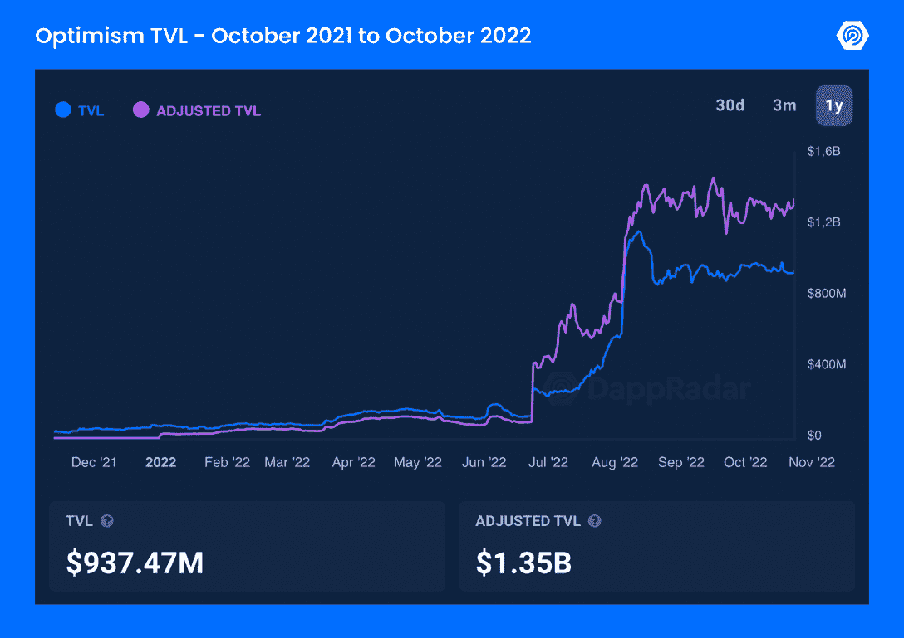
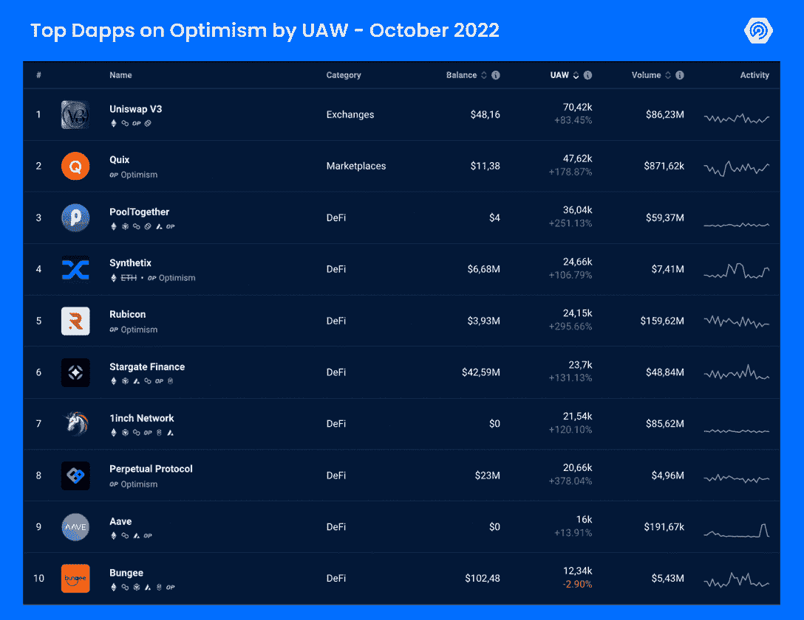

# 乐观情绪在上升:那里发生了什么？

> 原文：<https://web.archive.org/web/https://dappradar.com/blog/optimism-defi-on-the-rise-whats-taking-place-there>

## 10 月是乐观项目的一个月。这对其他 2 层意味着什么？

作为这个加密冬天最有前途的以太坊扩展解决方案之一，乐观主义者看到其分散金融(DeFi)应用程序在独特的活跃钱包(UAW)的数量上增加。)这些正面指标对其他竞争对手 Loopring 和 Arbitrum 意味着什么？以太坊合并对乐观主义的负面影响呢？让我们调查这些事情，找到解释乐观主义者乐观未来的数据。

## 突出

*   乐观主义 dapps 正在上升，DeFi 脱颖而出，成为主要类别；
*   该协议的总价值锁定(TVL)在 9.37 亿美元左右，在以太坊合并后保持强劲；
*   你可以通过 DappRadar [数据](https://web.archive.org/web/20221201131034/https://dappradar.com/defi/protocol/optimism)、[指南](https://web.archive.org/web/20221201131034/http://dappradar.com/blog/)和[报告](https://web.archive.org/web/20221201131034/https://dappradar.com/reports)来追踪乐观情绪的增长。

## 以太坊合并后的乐观主义

本月乐观主义的 UAW 收视率飙升。他们不仅在消极的市场中对抗当前的趋势，而且还在 Web3 上关注一个以前被遗忘的类别，DeFi。

DappRadar 的报告[衡量以太坊合并对第二层](https://web.archive.org/web/20221201131034/https://dappradar.com/blog/measuring-the-impact-of-ethereums-merge-on-layer-2/#Optimism,-is-a-top-crypto-winter-performer)的影响，报告称，乐观情绪见证了 TVL 的 **228%的增长，从 7 月 1 日的 2.7446 亿美元增长到 8 月 31 日的 9.0274 亿美元——使其成为*“顶级加密冬季表演者”***

看看过去 12 个月 [DeFi dapps 锁定的总价值建立在乐观的基础上](https://web.archive.org/web/20221201131034/https://dappradar.com/defi/protocol/optimism)——根据 DappRadar 的数据。

[Oversee Optimism DeFi Industry](https://web.archive.org/web/20221201131034/https://dappradar.com/defi/protocol/optimism)

所有这一切都发生在 Web3 历史上最引人注目的时刻之一，在[以太坊合并](https://web.archive.org/web/20221201131034/https://dappradar.com/blog/what-is-the-ethereum-merge)之后——区块链开始使用利益证明(PoS)模型，解决了乐观主义等第二层解决的几个问题。

作为一个第二层以太坊区块链，乐观主义寻求通过上滚或离线计算来扩展生态系统，以加快交易速度。

然而，目前的数据显示，合并有利于汇总。

正如专家预测的那样，在合并升级后，网络有可能扩展到每秒 100，000 次交易，而第 2 层解决方案进一步增强了这种能力。

## DeFi 正在觉醒，市场也在觉醒

今年第三季度显示[连锁指标显示加密市场正在复苏](https://web.archive.org/web/20221201131034/https://dappradar.com/blog/dappradar-q3-industry-report-on-chain-indicators-signal-a-recovering-crypto-market) : DeFi 的 TVL 较前一时期增长了 2.9%。

正如[顶级乐观 Dapps 排名](https://web.archive.org/web/20221201131034/https://dappradar.com/rankings/protocol/optimism)所示，使用乐观的 DeFi 应用已经回归，甚至超过了其他热门领域，如游戏和 NFTs。

根据 DappRadar 的数据，下面是过去 30 天内注册钱包活动最多的 10 个 dapps。

[See Top Optimism Dapps](https://web.archive.org/web/20221201131034/https://dappradar.com/rankings/protocol/optimism)

尽管如此，根据乐观的官方 Twitter 账户上发布的公告，该协议对 NFTs 和游戏来说也是新的。

本月，该协议启动了一座 NFT 桥，将 Quix Marketplace 与区块链以太坊上最大的 NFT 收藏品连接起来——这可能有助于解释 dapp 如何在 UAW 出现上个月 148%的增长。

此外，乐观基金会与 Lattice 合作，推出了该协议的首批区块链游戏之一 OPCraft。基于链上工艺的 3D 体素游戏使用 OP Stack，乐观主义的模块化汇总架构，现在[可以公开玩](https://web.archive.org/web/20221201131034/https://opcraft.mud.dev/)。

Source: [Optimism Dev Blog](https://web.archive.org/web/20221201131034/https://dev.optimism.io/opcraft-autonomous-world/)

## 用 DappRadar 跟踪乐观 dapps

对于这个行业来说，这是艰难的一年，但当我们接近尾声时，乐观主义确实名副其实。我们 DappRadar 将继续密切监视第二层的轨迹，并为您提供最新消息。

[Track The Best Optimism Dapps](https://web.archive.org/web/20221201131034/https://dappradar.com/rankings/protocol/optimism)

如果你想寻找机会，了解更多关于 Web3 如何改变我们与世界打交道的方式，请从我们的指南和教程中学习。在 [Discord](https://web.archive.org/web/20221201131034/https://discord.com/invite/4ybbssrHkm) 和 [Twitter](https://web.archive.org/web/20221201131034/https://twitter.com/DappRadar) 上加入我们的社区，成为 dapp 行业未来的一部分。

### 有用的链接

*   分散金融(DeFi): DappRadar 的终极指南
*   [DeFi dapp 将乐观主义作为一种可行的选择](https://web.archive.org/web/20221201131034/https://dappradar.com/blog/defi-dapps-are-adopting-optimism-as-a-viable-alternative)
*   什么是乐观主义？简单解释一下
*   [以太坊总结:一个简单的解释](https://web.archive.org/web/20221201131034/https://dappradar.com/blog/ethereum-rollups-a-simple-explanation)

***以上不构成投资建议。此处给出的信息仅供参考。请行使尽职调查，做你的研究。***

 NewsletterUnsubscribe at any time. [T&Cs](https://web.archive.org/web/20221201131034/https://dappradar.com/terms) and [Privacy Policy](https://web.archive.org/web/20221201131034/https://dappradar.com/privacy-policy)