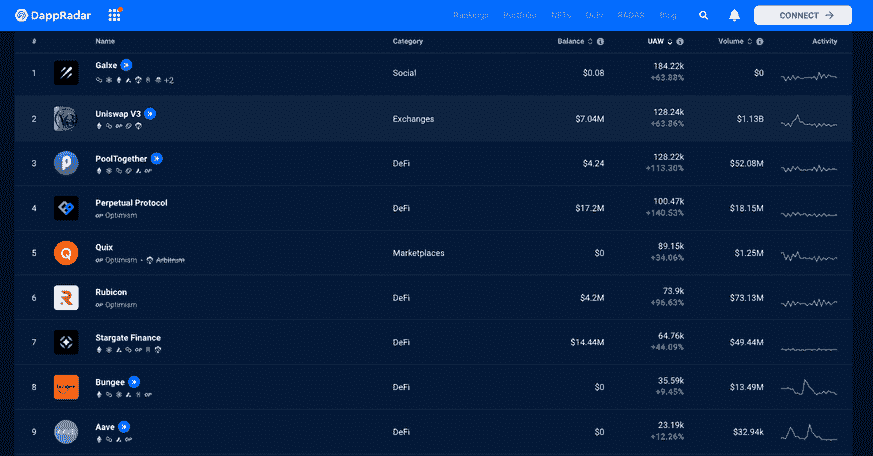
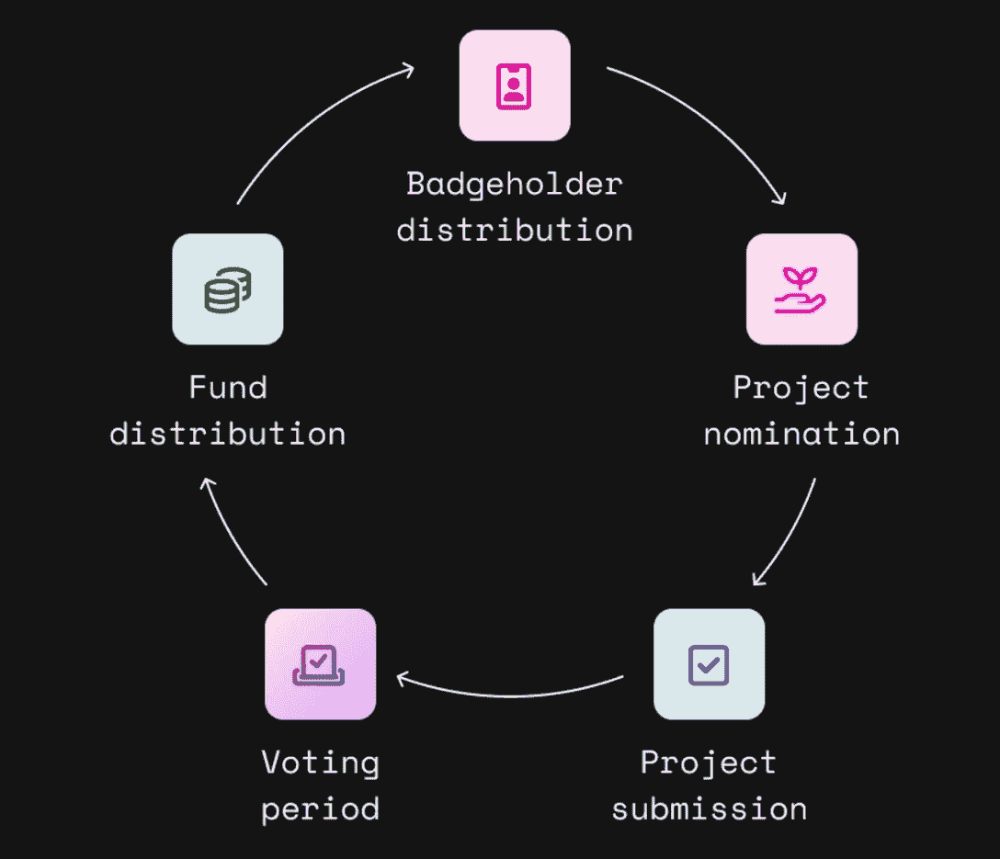
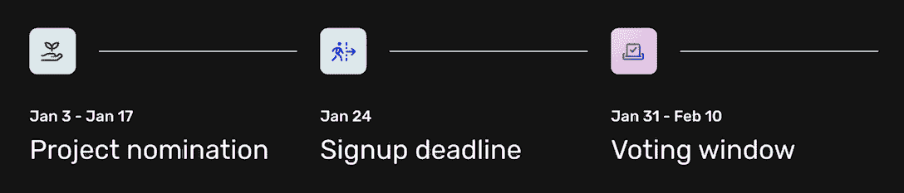

# 用 1000 万 OP 代币推动发展和增长的乐观态度

> 原文：<https://web.archive.org/web/https://dappradar.com/blog/optimism-development-fund-retro-pgf-op-token>

## 乐观主义旨在使开源软件建设有利可图

乐观公司宣布了第二轮 RetroPGF，这是一次象征性的空投，旨在促进他们生态系统的发展。这是一笔 1000 万英镑的 OP token drop，用于资助公共产品和开源工具，激励建设者支持 OP Stack 的开发和使用，OP Stack 是生态系统的一组核心构建模块。

## 内容

*   [乐观生态系统更新](https://web.archive.org/web/20230102022847/https://dappradar.com/blog/optimism-development-fund-retro-pgf-op-token/#ecosystem)
*   什么是 RetroPGF，它是如何工作的？
*   [retro PGF 2 的范围是什么，如何参与？](https://web.archive.org/web/20230102022847/https://dappradar.com/blog/optimism-development-fund-retro-pgf-op-token/#participate)
*   [如何投票](https://web.archive.org/web/20230102022847/https://dappradar.com/blog/optimism-development-fund-retro-pgf-op-token/#vote)
*   [在 Web3 未来的建设中加入乐观主义](https://web.archive.org/web/20230102022847/https://dappradar.com/blog/optimism-development-fund-retro-pgf-op-token/#join)

## 乐观生态系统更新

乐观是使用和市值最高的第二层(L2)网络之一。L2 区块链在继承以太坊安全性的同时，为用户提供了更快的低成本交易。由于这些特点，乐观主义已经吸引了许多 dapps，它的生态系统正在蓬勃发展。

根据 DappRadar 的排名，在过去 30 天里，乐观用户数量最多的 dapps 在独立活跃钱包方面都实现了正增长。DeFi 部分尤其令人印象深刻， [PoolTogether](https://web.archive.org/web/20230102022847/https://dappradar.com/optimism/defi/pooltogether-1) 增长了 113%， [Perpetual Protocol](https://web.archive.org/web/20230102022847/https://dappradar.com/optimism/defi/perpetual-protocol) 增长了 140%， [Rubicon](https://web.archive.org/web/20230102022847/https://dappradar.com/optimism/defi/rubicon) 增长了 96.63%。

[<picture></picture>](https://web.archive.org/web/20230102022847/https://dappradar.com/rankings/protocol/optimism)

Source: [DappRadar’s Optimism Rankings](https://web.archive.org/web/20230102022847/https://dappradar.com/rankings/protocol/optimism)

最近乐观公布了第二轮 RetroPGF。该计划将提供 1000 万 OP 令牌作为奖励，以激励为其生态系统做出贡献的开发者。

现在让我们继续阅读，了解什么是 RetroPGF 以及开发人员如何成为它的一部分。

## 什么是 RetroPGF，它是如何工作的？

追溯性公共产品基金(或 RetroPGF)是乐观主义者解决软件开发中激励失调问题的方案。它致力于通过资助公共产品继续为网络带来更好的开发工具、广泛的用户教育、更安全的基础设施和行业领先的研究。

公民之家是乐观组织的权力下放管理机构之一，它将促进资金分配。其职责包括审查项目，并根据宣布的资助范围就影响进行投票。

RetroPGF 2 计划利用一组分数来确定每个项目获得多少资金。最重要的是，与主动赠款不同，RetroPGF 重视“有用的东西”，而不是“可能有用的东西”。这使得资助已经证明对生态系统有影响的项目变得更加简单。

RetroPGF 的资金来源有两部分。首先，初始 OP 令牌供应的 20%被分配用于通过该计划资助公共产品。此外，当用户乐观地进行交易时，网络消费产生的利润也可以用于资助公共产品。

[Learn more about Retro RGF](https://web.archive.org/web/20230102022847/https://app.optimism.io/retropgf)

## RetroPGF 2 的范围是什么，如何参与？

2023 年 1 月，该计划将向支持开发和使用 OP 堆栈的项目分发 1000 万个 OP 令牌。

OP 堆栈是一系列模块，它们协同工作以形成一致、可靠的区块链。这些组件中的每一个都实现了堆栈的特定层。这种架构使开发人员能够构建他们自己的定制区块链来满足他们的特定需求。

将 OP 堆栈推向更广阔的市场是乐观主义推动 Web3 大规模采用的重要举措。这也是投资重点放在 OP Stack 上的原因。下面看一下开发者可以参与的三个类别。

*   基础设施+依赖:用于构建或部署 OP 栈的软件；对 OP 栈所依赖的协议或标准的贡献；支持核心 OP 栈协议未来发展的实验。
*   工具+实用程序:帮助构建者在乐观 mainnet 上创建应用程序，在 OP 栈上构建，与[集体](https://web.archive.org/web/20230102022847/https://community.optimism.io/docs/governance/)的治理交互，或者使用基于乐观构建的应用程序。
*   教育:努力传播关于乐观如何工作的意识和知识，无论是在技术上还是社会上。

有关计划时间表，请参见下表。您还可以通过访问 [RetroPGF 2 文档](https://web.archive.org/web/20230102022847/https://community.optimism.io/docs/governance/retropgf-2/)找到关于该过程的更多信息。关于公告和更新，请关注 Twitter 上的[乐观谷。](https://web.archive.org/web/20230102022847/https://twitter.com/optimismgov)

## 如何去爱

投票委员会由 90 名持有投票徽章的机构群体成员组成。参加 RetroPGF 1 的人将获得新的徽章，其余成员将根据各种标准通过不同机制选出。

倡导公共产品价值、帮助推动 RetroPGF 融资流程或在上述三个领域拥有专业知识的人更有可能入选投票委员会。

[Learn more about voting in RetroPGF 2](https://web.archive.org/web/20230102022847/https://optimism.mirror.xyz/wqk1Yeyn2OhV9paDzbRXvQ0m0JYDu2npbSkMClwk1rY)

## 加入乐观主义，共创网络 3 的未来

RetroPGF 是乐观主义愿景的重要组成部分。它寻求通过一种平衡私人利润和公共利益的资助机制来推进开源软件开发，并最终推进去中心化的互联网。

任何人都可以在 2023 年 1 月 3 日至 17 日的公开提名期内提名项目，成为 RetroPGF 的一员。关于如何提名的更多信息将在治理论坛上分享，并由 Twitter 上的 [OptimismGov](https://web.archive.org/web/20230102022847/https://twitter.com/optimismgov) 分享。

为了跟进 RetroPGF 2，市民之家的未来迭代，以及乐观主义治理的进展:

*   注册 RetroPGF [简讯](https://web.archive.org/web/20230102022847/https://optimismpbc.typeform.com/to/X2wB4lPu)
*   在推特上关注[乐观谷](https://web.archive.org/web/20230102022847/https://twitter.com/optimismgov)和[乐观谷](https://web.archive.org/web/20230102022847/https://twitter.com/optimismFND)

### 其他有用的链接

*   [网站](https://web.archive.org/web/20230102022847/https://www.optimism.io/)
*   [镜子](https://web.archive.org/web/20230102022847/https://optimism.mirror.xyz/fLk5UGjZDiXFuvQh6R_HscMQuuY9ABYNF7PI76-qJYs)
*   [不和](https://web.archive.org/web/20230102022847/https://discord-gateway.optimism.io/)