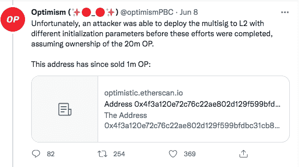

# 乐观的象征在技术事故中损失了 2000 万英镑

> 原文：<https://web.archive.org/web/https://dappradar.com/blog/optimism-loses-20-million-op-tokens-in-embarrassing-tech-mishap>

## 乐观是最具竞争力的以太坊第 2 层扩展解决方案之一

**乐观派不小心向温特穆特的一层地址发出了总额 2000 万的 OP 代币。后来，两人都意识到这个地址没有被部署到乐观的第二层地址。**

**概要:**

*   [乐观](https://web.archive.org/web/20220717042844/https://dappradar.com/rankings/protocol/optimism)披露一名黑客利用团队的技术疏忽，窃取了 2000 万 [OP 令牌](https://web.archive.org/web/20220717042844/https://dappradar.com/hub/token/eth/OP/ETH?from=0x4200000000000000000000000000000000000042)。
*   这些代币最初授予 Wintermute 用于流动性服务。
*   然而，温特穆特提供了一个[以太坊](https://web.archive.org/web/20220717042844/https://dappradar.com/blog/what-is-the-ethereum-merge)(第一层)多重信号的地址，他们还没有部署到乐观(第二层)。
*   在采取恢复行动之前，一名黑客成功窃取了这 2000 万个令牌。
*   温特穆特承诺回购所有被盗代币，并提出在特定时期内接受该事件为白帽黑客。

[https://web.archive.org/web/20220717042844if_/https://www.youtube.com/embed/VliU0f4kmS8?feature=oembed](https://web.archive.org/web/20220717042844if_/https://www.youtube.com/embed/VliU0f4kmS8?feature=oembed)

[乐观是最受期待的以太坊第 2 层扩展解决方案之一。尽管如此，这个自吹自擂的项目这次有了坏消息。根据](https://web.archive.org/web/20220717042844/https://dappradar.com/blog/defi-dapps-are-adopting-optimism-as-a-viable-alternative)[乐观公司的官方推特账户](https://web.archive.org/web/20220717042844/https://twitter.com/optimismPBC/status/1534631766576836608)，由于第一层和第二层的钱包地址混淆，该公司损失了 2000 万代币。这些乐观主义的本土代币 OPs 最初是授予温特穆特用于流动性服务的。

[根据 DappRadar Token Explorer](https://web.archive.org/web/20220717042844/https://dappradar.com/hub/tokens/ethereum/all/) 的消息， [OP token](https://web.archive.org/web/20220717042844/https://dappradar.com/hub/token/eth/OP?from=0x4200000000000000000000000000000000000042) 的价格在过去 30 天里一直在下滑，在撰写本文时交易价格为 0.83 美元，但这一盗窃事件将如何影响乐观情绪仍有待观察。

## 怎么发生的？

5 月 31 日，乐观主义发起了一次象征性空投，以奖励早期用户和激励未来用户。此外，为了促进空投后寻求收购 op 的用户获得更顺畅的体验，乐观与 Wintermute 合作，提供 2000 万 OP 的做市服务。

在发送两笔测试交易后，在 Wintermute 对每笔交易进行确认后，乐观团队发送了全部金额。不幸的是，Wintermute 无法访问令牌，因为 Wintermute 提供了一个以太坊(第 1 层)multisig 的地址，而他们尚未将其部署到乐观(第 2 层)。

为了重新控制这些令牌，Wintermute 启动了恢复操作，希望将 multisig 合同部署到乐观网络上的相同地址。然而，这种尝试已经太晚了。在恢复操作完成之前，黑客利用这一优势，通过使用不同的初始化参数将 multisig 部署到第 2 层网络，窃取了 2000 万个 OP 令牌。

基本上，黑客已经获得了这些代币的控制权，并且已经卖出了第一批 100 万枚代币。另外价值约 73 万美元的 100 万枚代币被送到 Vitalik Buterin 在乐观协会的以太坊地址。至于其余的令牌，黑客可以很容易地出售或使用它们来劫持治理决策。

## 收拾残局

已经发生的事情现在是不可逆转的。那么，乐观主义和温特穆特的最新补救措施是什么？

首先，[温特穆特决定对这起事故负全责](https://web.archive.org/web/20220717042844/https://plaid-cement-e44.notion.site/A-Message-to-the-Community-from-the-Optimism-Foundation-f49b913bb0974d8a854a8bdd409a9dd6)。该公司还承诺回购同等数量的代币。值得注意的是，Wintermute 已经买回了第一批 100 万枚代币，与攻击者卖出的数量相同。

与此同时，乐观将继续做市努力，并向 Wintermute 提供了另外 2000 万 OP 令牌，Wintermute 此次为此支付了 5000 万美元的保证金。此外，温特穆特也采取了一些柔和的动作。如果攻击者同意在一周内归还剩余令牌，Wintermute 将接受该事件为白帽利用。否则，将进行彻底的调查，以确定黑客的身份，然后将其移交给司法部门。

DappRadar 将继续跟进乐观开发及其生态系统的更新。在 [Twitter](https://web.archive.org/web/20220717042844/https://twitter.com/dappradar) 、 [Discord](https://web.archive.org/web/20220717042844/https://discord.gg/4ybbssrHkm) 和 [Youtube](https://web.archive.org/web/20220717042844/https://www.youtube.com/c/DappRadar) 上关注我们，跟上区块链世界的动态。

 NewsletterUnsubscribe at any time. [T&Cs](https://web.archive.org/web/20220717042844/https://dappradar.com/terms) and [Privacy Policy](https://web.archive.org/web/20220717042844/https://dappradar.com/privacy-policy)