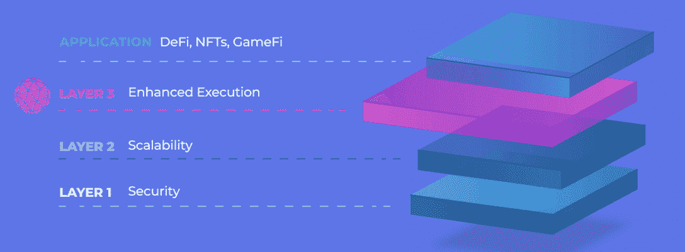
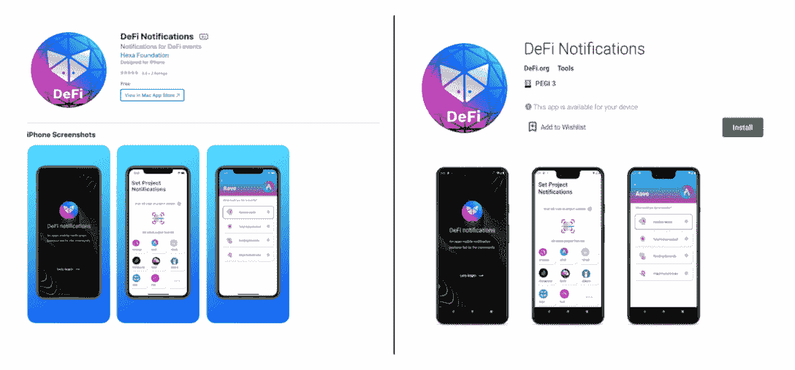

# Orbs:重新定义 DeFi 的独特第 3 层区块链

> 原文：<https://web.archive.org/web/https://dappradar.com/blog/orbs-the-unique-layer-3-blockchain-that-redefines-defi>

## Orbs 的独特架构支持 web 3.0 dapps 智能合约的增强执行

**Orbs 网络是一个开放、分散和公共的区块链基础设施，由一个安全的无许可验证者网络使用利益相关证明(PoS)共识来执行**。**目前，Orbs Orbs 项目致力于成为分散金融(DeFi)应用的首选区块链。**

**概要:**

*   Orbs 是一款极具竞争力的区块链扩展解决方案，具有独特的优势。
*   Orbs 被定位为第 3 层区块链，利用利益相关证明(PoS)共识。
*   区块链提供了两个执行服务来帮助 dApps 在区块链上茁壮成长:Orbs Lambda 和 Orbs VM。
*   Orbs 的混合架构正在成为 DeFi 的游戏规则改变者。

## 区块链扩展解决方案的竞争格局

区块链产业已经进入了以太坊不再包揽一切的阶段。随着先锋区块链的拥堵问题变得越来越突出，它强调了以太坊有效扩展解决方案的紧迫性。因此，Solana 和 Cardano 等替代连锁店加入了竞争，并开始瓜分市场份额。

此外，[继承以太坊安全性和去中心化的第 2 层](https://web.archive.org/web/20220828094527/https://dappradar.com/blog/what-are-layer-1-and-layer-2-blockchains)解决方案也应运而生，以应对以太坊的扩展挑战，降低燃气费用并增加吞吐量。这些解决方案包括多边形、乐观、Arbitrum 和 StarkNet。

以多种协议和解决方案为特征的区块链未来已经到来，竞争比以往任何时候都更加激烈。然而，Orbs 的第 3 层基础设施作为市场领先的区块链脱颖而出，为 DeFi 应用提供服务，以进一步分散和增强功能。

## 什么是球体？

Orbs 充当“去中心化后端”，增强了现有 EVM 智能合约的功能，并为 Web 3.0、DeFi、NFTs 和 GameFi 开辟了全新的可能性范围。

Orbs 与现有的 L1 和 L2 解决方案协同工作，如以太坊、多边形、BNB 链、雪崩等。，作为分层区块链堆栈的一部分。这个独特的特性允许 dapp 利用 Orbs 执行服务，而无需将其流动性转移到不同的链上。

值得注意的是，第 3 层基础设施可以执行更复杂的逻辑和脚本，而这些逻辑和脚本不能单独在智能合约上实现。下图显示了分层区块链堆栈的结构。

## Orbs 是为企业构建的，旨在提高效率

Orbs 提供了两种不同的执行服务来帮助企业在区块链、Orbs Lambda 和 Orbs VM 上蓬勃发展。

Orbs Lambda 是一个事件驱动的无服务器计算解决方案，类似于 [AWS Lambda](https://web.archive.org/web/20220828094527/https://en.wikipedia.org/wiki/AWS_Lambda) ，但本质上是分散的。要为 Orbs Lamba 编写云函数，开发人员可以简单地使用 JavaScript 并利用许多标准库，如 node-fetch。

Orbs VM 提供了一个专用的分散式虚拟机，类似于 [AWS EC2](https://web.archive.org/web/20220828094527/https://en.wikipedia.org/wiki/Amazon_Elastic_Compute_Cloud) 。

开发人员可以将他们的客户服务实现为用任何编程语言编写的行业标准 Docker 容器，如 Go、C++、Rust、JavaScript、Java、Python 等。接下来，开发人员可以在 Orbs VM 上部署容器，并让它以完全分散的方式作为一个永远在线的服务立即运行。

值得注意的是，Orbs Lamba 和 Orbs VM 都是互补的解决方案，允许开发人员丰富他们的业务逻辑，而不牺牲智能契约的使用；因此，权力下放是有保障的。

## 为什么 Orbs 是 DeFi 的游戏规则改变者？

DeFi 已经成为区块链地区的支柱产业。[根据 DappRadar 行业报告](https://web.archive.org/web/20220828094527/https://dappradar.com/blog/2021-dapp-industry-report)，该行业的 TVL 同比增长 7 倍，去年超过 2000 亿美元。尽管 DeFi 仍处于起步阶段，机构交易者也刚刚开始涉足这一领域，但用不了多久，该行业就会迎来更复杂的应用。

这种行业发展的驱动力是技术的进步。因此，Orbs 网络努力为 DeFi 开发人员提供装备，并准备孵化这种创新。

Orbs 的基础设施设计的核心是灵活性和高可扩展性。orb 可以作为独立的第三执行层，与基于 EVM 的 L1 和 L2 协同工作。这种独特架构的最大优势是允许更高级的 DeFi dapps 在 orb 上平稳运行。

开放 DeFi 通知协议的成功是 DeFi dapps 如何受益于 orb 的一个很好的例子。该协议由 Orbs 提供支持，可以让 DeFi 用户不断了解关键链上事件的最新情况。此外，它还提供了移动友好、免费使用、社区驱动、完全去中心化等特性。

## 最后的想法

Orbs 是一种具有竞争力的公共区块链基础设施，旨在满足下一代 DeFi 应用和任何需要终极链上性能的项目的需求。Orbs 独特的第 3 层基础设施能够执行复杂的计算逻辑，而不会牺牲分散性或用户体验。

了解更多关于球体的信息:

[网站](https://web.archive.org/web/20220828094527/https://www.orbs.com/)

[推特](https://web.archive.org/web/20220828094527/https://twitter.com/orbs_network)

[不和](https://web.archive.org/web/20220828094527/https://discord.com/invite/sswGDYGBt5)

[博客](https://web.archive.org/web/20220828094527/https://www.orbs.com/blog/)

**免责声明** —这是一篇赞助文章。DappRadar 不认可本页面上的任何内容或产品。DappRadar 旨在提供准确的信息，但读者应该在采取行动之前总是自己做研究。DappRadar 的文章不能被认为是投资建议。