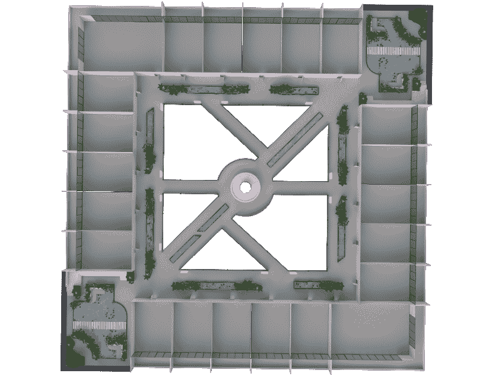
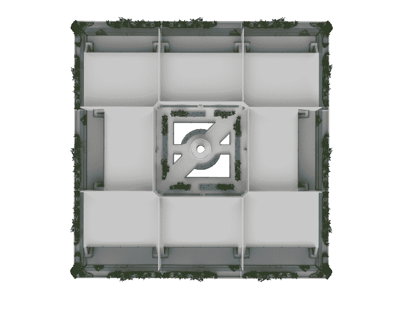

# 组织聚会并在以太坊塔中创建 NFT 画廊

> 原文：<https://web.archive.org/web/https://dappradar.com/blog/organize-meetups-and-create-nft-galleries-in-ethereum-towers>

## 以太坊塔是一个垂直的元宇宙，由 4388 个玩家拥有的公寓组成

在以太坊塔的虚拟世界中，公寓业主可以随心所欲地建造，为社交聚会或 NFT 美术馆创造空间。NFT 持有者可以完全定制公寓，给他们一个位于元宇宙的温馨公寓，一个虚拟的聚会场所，或者一个禅园。

以太坊塔是一个垂直结构，由 4388 个玩家拥有的公寓和各种公共区域组成，位于以太坊世界元宇宙。在其中一栋大楼里拥有一套公寓，可以让居民们从零开始建造自己的空间，并对最小的细节进行定制。

这个垂直元宇宙的所有公寓都由以太坊区块链的 NFT 代表。重要的是，每间公寓都让主人有机会在虚拟世界中创造一个完全可定制的空间。按照您喜欢的方式分割区域，或者使用 3D builder 添加元素，为您和您的朋友、同事或客户设计完美的元宇宙公寓。

以太坊公寓为 NFT 收藏家提供了在元宇宙展示藏品、参加活动和会见朋友的绝佳机会。更重要的是，这种垂直的元宇宙提供了许多社交方式，成为志同道合者社区的一部分。公寓业主甚至可以选择创建高级活动，例如，只有持有特定 NFT 的人才能参加。或者他们可以将他们的公寓出租给其他用户或组织。

## 以太坊塔里能找到哪些空间？

以太坊塔中的公寓分为三种:标准、豪华和顶层公寓。每种类型的公寓都有不同的特点，让收藏家找到适合他们的空间。

Overhead view of the inside of the towers

两座塔楼之间大约 90%的公寓都是标准的。每个塔楼有 1980 套标准公寓。再往上看更大的豪华公寓，每栋楼里只有 198 个这样的房间。此外，每套豪华公寓的面积都是标准公寓的两倍半。

最后，还有顶层公寓。每座塔楼包含 16 套顶层公寓，可以选择设置在两层以上。顶层公寓是以太坊虚拟世界中最高级和最独特的财产。更重要的是，顶层公寓的业主还可以获得更多的选择来个性化他们的公寓，既可以拥有令人垂涎的黑色访问键 NFT，也可以拥有包括他们最喜欢的 NFT 在内的个性化设置。

Penthouse floorplan

## 在以太坊塔中创造你自己的空间

两座塔楼共有 4388 个独特的空间，收藏家们有机会创造一个完全个性化的空间。每套公寓，无论是标准公寓、豪华公寓还是顶层公寓，都可以让主人在一个地方展示他们的 NFT 收藏、设计技巧和激情。

拥有或租赁以太坊公寓还允许收藏家在虚拟世界组织活动和聚集朋友。此外，以太坊塔世界提供了大量的公共空间，收藏者可以加入业主、租户或游客的社区活动。社区成员可以参观公共空中花园，参加探索塔楼和周围地区的活动和社会活动。在元宇宙的以太坊塔中，虚拟世界是你的囊中之物。

重要的是，以太坊塔将为收藏家提供工具，举办免费或高级活动，无论公寓类型如何。此外，公寓提供了展示艺术品的绝佳机会。作为一个虚拟环境，这是一个完美的空间向你的客人炫耀你的 NFT 收藏。

## 虚拟世界正在成为趋势

在过去的几个月里，元宇宙和虚拟世界成了人们谈论的话题。随着脸书更名为 Meta，主流观众将注意力转向这个在虚拟世界中拥有、创造和设计空间的机会。

以太坊塔将虚拟世界的理念向前推进了一步，为收藏家们提供了在元宇宙摩天大楼里拥有一套公寓的机会。垂直的元宇宙分布在两座 101 层的塔楼之间。重要的是，这两座塔楼都有两层顶层，收藏者可以在这里购买 16 套顶层公寓中的一套。

如果你好奇想了解更多关于以太坊塔的信息，[看看这篇文章](https://web.archive.org/web/20220929110800/https://dappradar.com/blog/acquire-an-nft-and-get-access-to-your-apartment-in-ethereum-towers)。在那里，您可以查看垂直元宇宙的所有即将到来的计划，包括所有正在进行的主要扩展里程碑。此外，你可以在社交媒体上关注以太坊塔，了解这个令人兴奋的虚拟世界的最新消息。

DappRadar 将继续监测元宇宙，像以太坊塔这样的项目将继续革新这个领域。请继续关注更多关于达普拉达和以太坊塔的新闻和公告，并查看下面的官方链接了解更多信息。

## 链接:

*   [网站](https://web.archive.org/web/20220929110800/https://ethereumtowers.com/)
*   [信纸](https://web.archive.org/web/20220929110800/https://ethereumtowers.com/#LIGHTPAPER)
*   [推特](https://web.archive.org/web/20220929110800/https://twitter.com/EthereumTowers)
*   [不和](https://web.archive.org/web/20220929110800/https://discord.gg/ethereumtowers)
*   [OpenSea](https://web.archive.org/web/20220929110800/https://opensea.io/collection/ethereum-towers)
*   [Instagram](https://web.archive.org/web/20220929110800/https://www.instagram.com/ethereumtowers/)
*   [脸书](https://web.archive.org/web/20220929110800/https://www.facebook.com/groups/ethereumtowers)

 NewsletterUnsubscribe at any time. [T&Cs](https://web.archive.org/web/20220929110800/https://dappradar.com/terms) and [Privacy Policy](https://web.archive.org/web/20220929110800/https://dappradar.com/privacy-policy)