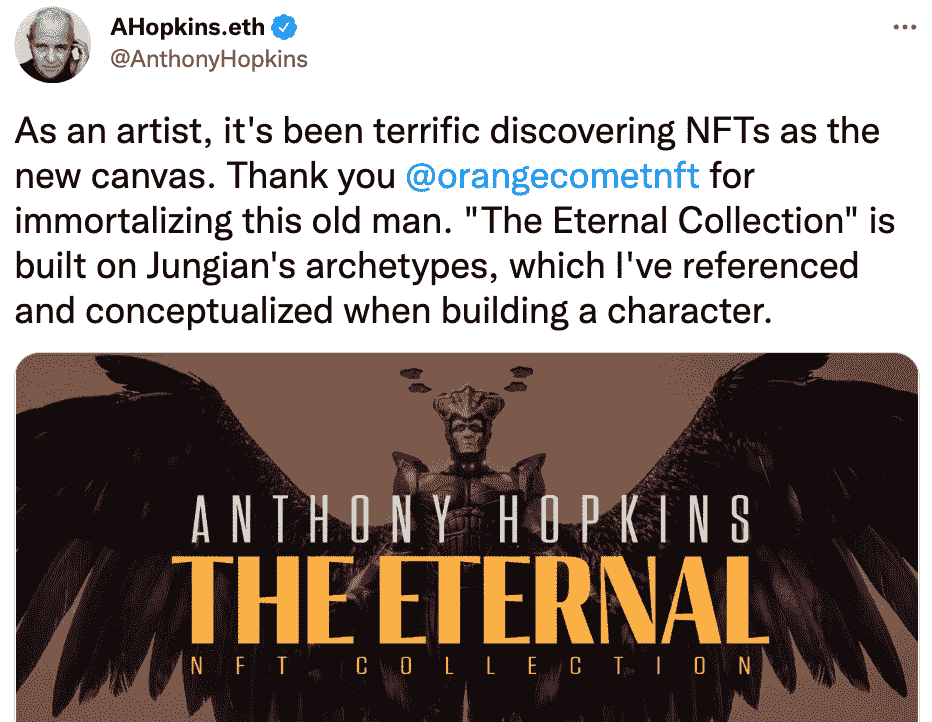
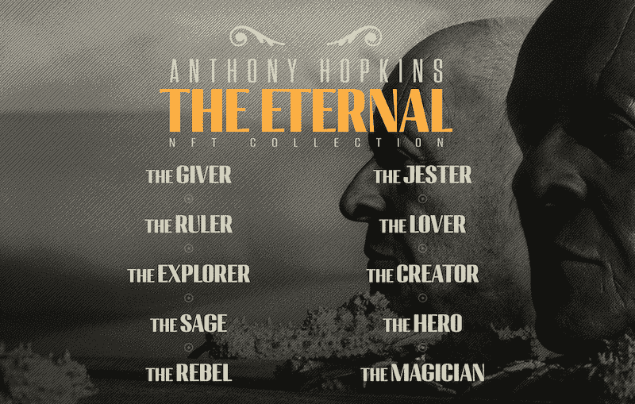
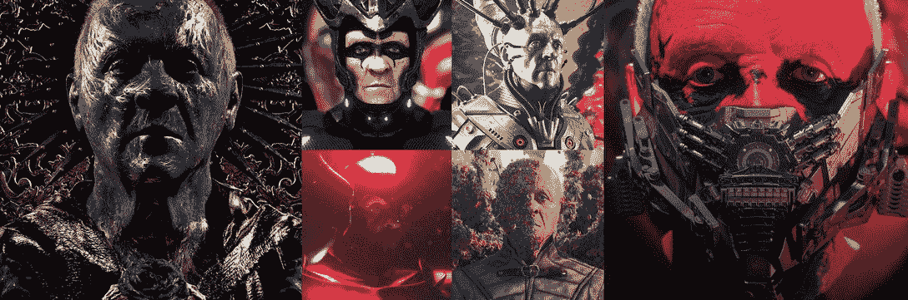
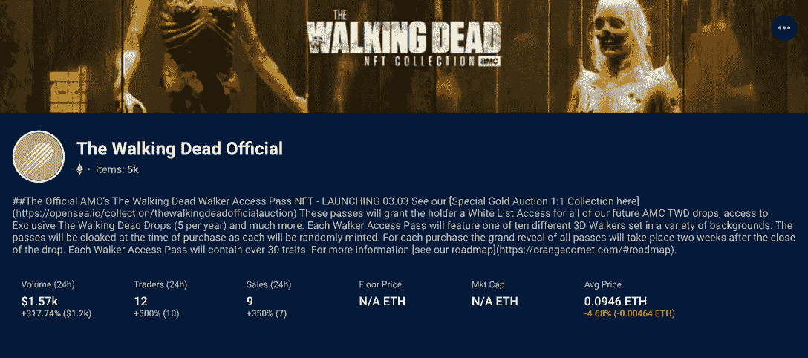

# 奥斯卡获奖演员安东尼·霍普金斯将推出他的第一个 NFT 系列

> 原文：<https://web.archive.org/web/https://dappradar.com/blog/oscar-winning-actor-anthony-hopkins-to-launch-his-first-nft-collection>

## 他的电影角色和艺术作品激发了被称为永恒的系列。

奥斯卡获奖演员兼自学成才的艺术家安东尼·霍普金斯将与 Orange Comet 合作推出他的首个 NFT 系列。该系列名为《永恒》,融合了安东尼·霍普金斯电影和艺术作品中的角色、主题和风格。此外，NFT 系列的持有者还可以享受众多专属福利，包括与演员的实时聊天。

总结:

*   安东尼·霍普金斯将发布他的第一个 NFT 系列，灵感来自他的电影和个人艺术作品。
*   NFT 系列包括 1011 枚代币，将于 9 月中旬开始发售。
*   橙色彗星的[行尸走肉 NFT](https://web.archive.org/web/20220930184603/https://dappradar.com/hub/nft-explorer/collection/the-walking-dead-official?order-direction=asc) 在今年早些时候取得了巨大成功，产生了超过 3000 ETH 的交易量。
*   DappRadar 为用户带来了 NFT 领域的最新趋势。此外，用户可以利用 [DappRadar NFT 浏览器](https://web.archive.org/web/20220930184603/https://dappradar.com/hub/nft-explorer)获得对 NFT 世界的深度数据驱动的洞察力。

如今，名人参与或发行 NFT 已经不是什么新鲜事了。打入 NFT 圈子的名人和运动员包括[贾斯汀比伯](https://web.archive.org/web/20220930184603/https://dappradar.com/hub/wallet/eth/0xE21DC18513e3e68a52F9fcDaCfD56948d43a11c6)、[帕丽斯](https://web.archive.org/web/20220930184603/https://dappradar.com/hub/wallet/eth/0xb6aa5a1aa37a4195725cdf1576dc741d359b56bd)、[史努比·道格](https://web.archive.org/web/20220930184603/https://dappradar.com/hub/wallet/eth/0xce90a7949bb78892f159f428d0dc23a8e3584d75)、[吉米·法伦](https://web.archive.org/web/20220930184603/https://dappradar.com/hub/wallet/eth/0x0394451c1238cec1e825229e692aa9e428c107d8)，甚至[劳勃·狄·尼诺](https://web.archive.org/web/20220930184603/https://dappradar.com/hub/nft-explorer/collection/lit-project-two-1/sales-activity?period=all)。

在 DappRadar，你可以有一个名人加密和 NFT 组合的综合列表，每个钱包都通过 DappRadar 的组合服务进行验证和跟踪。这些明星潜入加密世界，支持下一代数字前沿，并利用 NFTs 作为与粉丝互动的一种方式。

两届奥斯卡奖得主安东尼·霍普金斯爵士是最新一位在 NFT 世界引起轰动的名人。这位演员将与数字娱乐平台 Orange Comet 合作，推出他的第一个 NFT 系列，[永恒的](https://web.archive.org/web/20220930184603/https://orangecomet.com/collection/anthony-hopkins-eternal)。

Souhttps://twitter.com/AnthonyHopkins/status/1559902995634180101rce

## 安东尼·霍普金斯·NFTT 是什么？

[https://web.archive.org/web/20220930184603if_/https://www.youtube.com/embed/FXflyR9Vba8?start=5&feature=oembed](https://web.archive.org/web/20220930184603if_/https://www.youtube.com/embed/FXflyR9Vba8?start=5&feature=oembed)

安东尼·霍普金斯总是一个艺术的人。他几年前成为一名自学成才的画家，并在 2005 年举办了一次个人画展。作为一名本质上的艺术家，安东尼·霍普金斯带着他的作品进军 NFT 是对这一新兴内容创作技术的大胆尝试。

NFT 系列由 1011 个象征组成，具有不同的原型，包括小丑、情人、反叛者、英雄等等。铸造将于 9 月中旬开始，并通过三个阶段的释放，每个阶段都有一个独特的类别。

[Source](https://web.archive.org/web/20220930184603/https://orangecomet.com/collection/anthony-hopkins-eternal/)

### 每个类别的版本和额外津贴

[Source](https://web.archive.org/web/20220930184603/https://orangecomet.com/collection/anthony-hopkins-eternal/)

第一个是标志性类别，一个独一无二的动画 NFT，融合了所有原型。因为这个令牌是最稀有的，它将在拍卖中卖给出价最高的人。获胜者将通过持有此 NFT 享受最多的特权。例如，获胜者将与安东尼·霍普金斯爵士共进午餐，获得这位演员亲笔签名的艺术书籍等等。

第二个是传奇类，有十个独特的一对一动画 NFT，以不同的角色原型为特色。持有人将通过不和谐，霍普金斯亲笔签名的 NFT 艺术装裱版画，与霍普金斯进行个人讨论，等等。

最后一个是区分类别，有 1000 个基于十个原型的独特的一对一图像。此外，每个原型将有 100 个变体，确保每个 NFT 在视觉上与众不同。

其中一个额外的好处是拥有一个有 Hopkins 亲笔签名的 NFT 的实体印刷品。此外，39 名随机购买者将获得一本亲笔签名的“Dreamscapes”艺术书籍，并将随机选择 5 名购买者加入 Discord 聊天。

## 橙色彗星之前成功掉落:行尸走肉 NFT 系列

今年早些时候，Orange Comet 与 AMC 合作，放弃了《行尸走肉》的 NFT 通行证。每张通票授予终身机会，以获得和参与独家优惠。此外，通行证持有者将有机会参观计划中的行尸走肉元宇宙。

该系列于 2022 年 3 月 3 日在 [OpenSea](https://web.archive.org/web/20220930184603/https://dappradar.com/multichain/marketplaces/opensea) 上首次亮相，在撰写本文时已累积了 3,424 ETH 的容量。根据[达普拉达 NFT 探险家](https://web.archive.org/web/20220930184603/https://dappradar.com/hub/nft-explorer)的说法，用户正在积极交易行尸走肉 NFT，在过去 24 小时内产生了 1570 美元的交易量。

## 使用 DappRadar 学习、跟踪和交易 NFT

达普拉达将继续关注永恒 NFT 系列和 NFT 领域的最新进展。在 [Twitter](https://web.archive.org/web/20220930184603/https://twitter.com/dappradar) 、 [Discord](https://web.archive.org/web/20220930184603/https://discord.gg/4ybbssrHkm) 和 [Youtube](https://web.archive.org/web/20220930184603/https://www.youtube.com/c/DappRadar) 上关注我们，了解 NFT 和[元宇宙的最新趋势。](/web/20220930184603/https://dappradar.com/blog/what-is-the-metaverse/)

除了提供最新的新闻和信息，DappRadar 还为 NFTs 带来了数据驱动的见解。DappRadar NFT 探索者为用户提供最新、最高价和最热门的非功能性测试的概述和深入知识。

看看下面的视频，学习如何使用它来改善你的收藏和交易体验。

[https://web.archive.org/web/20220930184603if_/https://www.youtube.com/embed/fkEaXYLOW-s?feature=oembed](https://web.archive.org/web/20220930184603if_/https://www.youtube.com/embed/fkEaXYLOW-s?feature=oembed)