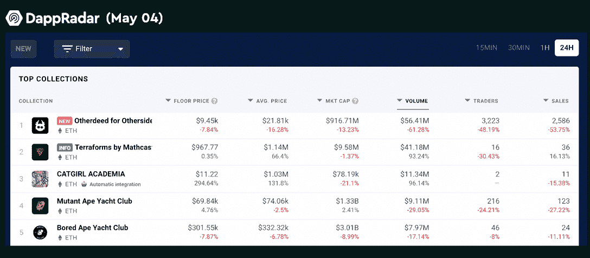
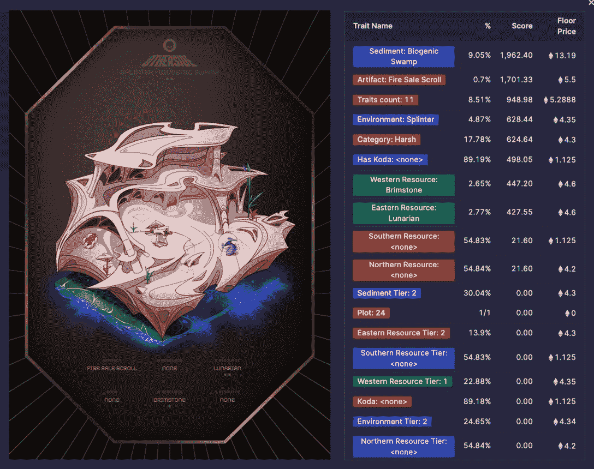

# Otherdeeds 地块以近 100 万美元的价格售出

> 原文：<https://web.archive.org/web/https://dappradar.com/blog/otherdeeds-land-parcel-sold-for-almost-1-million>

## 其他行为 NFT 是宇迦实验室在元宇宙另一边的虚拟土地

4 月 30 日，元宇宙另一边的虚拟世界 Otherdeeds 在几分钟内售罄，尽管汽油费飙升，为宇迦实验室创造了约 3.2 亿美元的收入。现在所有的 deedowners 都公布了他们的地块，最贵的一块在二级市场上以接近 100 万美元的价格售出。

**概要:**

*   Otherdeeds 土地销售导致以太坊区块链的天然气价格大幅上涨。因此，那些有幸在公开拍卖中买到的人现在实际上经历了约 10%的资产价值缩水。
*   NFT 鲸鱼朋克 OTC 公司在 Otherside #24 上花费了近 100 万美元，成为迄今为止最昂贵的 Otherdeeds 地块。
*   自推出以来，Otherside NFT 收藏已有 210，000 ETH 或 5.97 亿美元的交易量。

另一项 NFT 土地出售可以说是加密界最受期待的 NFT 项目。从美国东部时间 4 月 30 日晚上 9 点开始，土地出售立即点燃了购买狂潮，导致以太坊上的交易费用飙升。

用户为每块土地支付了大约 6000 美元(305 美分硬币),再加上高峰时段的 6000 美元的燃气费，在造币日总计大约 4.24 ETH。然而， [Otherdeed 地块](https://web.archive.org/web/20220925082641/https://dappradar.com/ethereum/collectibles/otherdeed-for-otherside)目前的交易价格为 3.59 ETH，这意味着在汽油峰值时购买这些 NFT 的投资者实际上是在赔钱。

## 朋克 OTC 以 100 万美元买下了 Otherdeeds #24

出售完成后，宇迦实验室，Bore Ape 游艇俱乐部的幕后团队，从公开出售中筹集了大约 3.2 亿美元，共出售了 55，000 块其他地契土地。

在过去的 24 小时内，Otherdeeds 在二级市场上产生了 5641 万美元的总交易量，毫无疑问地占据了排行榜的首位。就市值而言，四天前刚刚推出的 Otherdeeds 已经接近 9000 万美元，目前在所有收藏中排名[第五。](https://web.archive.org/web/20220925082641/https://dappradar.com/nft/collections)

5 月 3 日，24 号土地以接近 100 万美元(333 ETH)的天价卖给了 NFT 鲸鱼[朋克场外交易](https://web.archive.org/web/20220925082641/https://twitter.com/punksOTC)。这块地显然是迄今为止最昂贵的一块地。根据 DappRadar 的投资组合跟踪，我们可以看到名为[vault . punkstoc . eth](https://web.archive.org/web/20220925082641/https://dappradar.com/hub/wallet/eth/0x6639c089adfba8bb9968da643c6be208a70d6daa)的地址有一个梦幻 NFT 收集，口袋里有 16 个 CryptoPunks，1 个 BAYC，和 2 个 Otherdeed 地。据粗略估计，他们在 NFT 的资产总值超过 434 万美元。

有趣的是，就特征而言，第 24 号土地甚至不是最稀有的，[在稀有等级](https://web.archive.org/web/20220925082641/https://app.traitsniper.com/otherdeed?sort_last_sale_price=asc&token=24)中仅排名 35，968。它连陆地上的科达都没有！唯一的猜测是 24 可能是朋克 OTC 最喜欢的数字。

## 另一边的未来会怎样？

根据现有的公开信息，我们所知道的是，另一边将是一个以 BAYC 为主题的虚拟世界。尽管 Otherdeeds 的土地图为虚拟世界的视觉风格提供了某种线索，但还不清楚它将会是什么样子，或者它如何能让猿、 [ApeCoin](https://web.archive.org/web/20220925082641/https://dappradar.com/hub/token/eth/APE?from=0x4d224452801aced8b2f0aebe155379bb5d594381) 和其他 deeds 的持有者受益。

也许我们应该观察这些数字资产持有者形成的社区是否有能力刺激创新。毕竟，在 Web 3 的背景下，看到一个商业帝国通过分散的、自下而上的方法建立起来将会更加令人兴奋。

DappRadar 将继续关注 Otherdeeds 的最新进展。在 [Twitter](https://web.archive.org/web/20220925082641/https://twitter.com/dappradar) 、 [Discord](https://web.archive.org/web/20220925082641/https://discord.gg/4ybbssrHkm) 和 [Youtube](https://web.archive.org/web/20220925082641/https://www.youtube.com/c/DappRadar) 上关注我们，跟上区块链世界的动态。