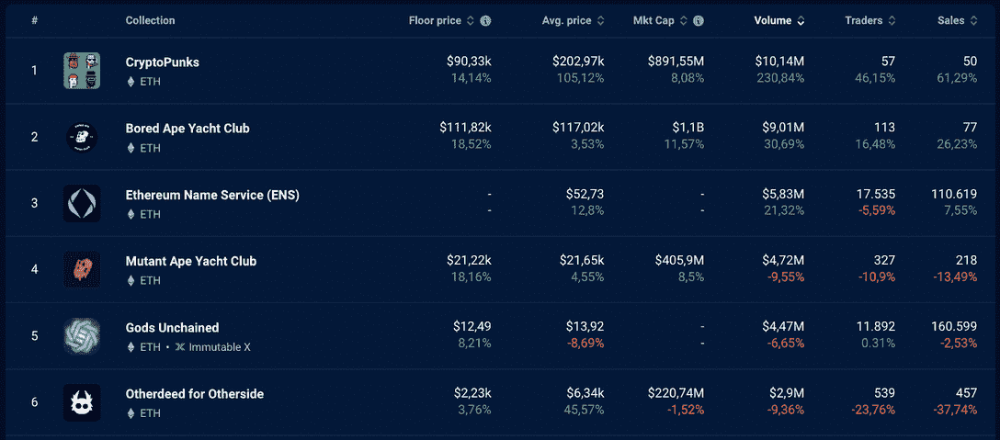
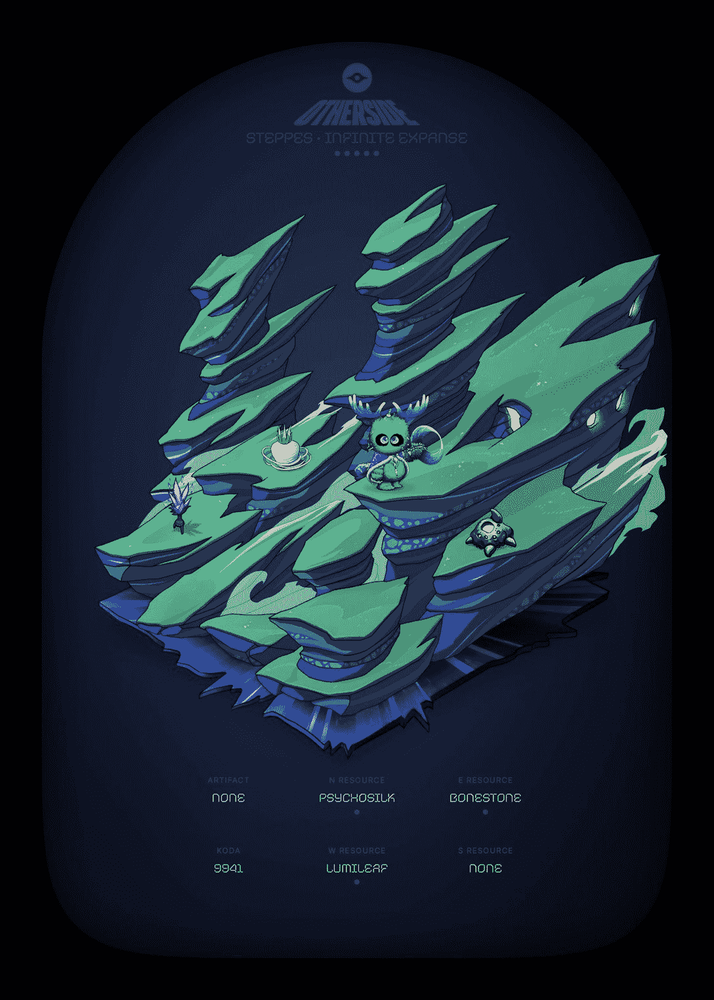
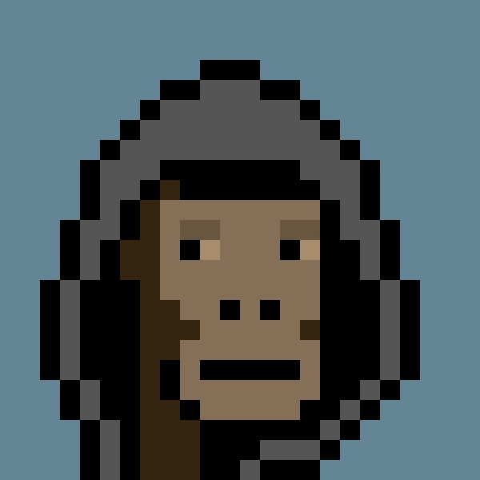

# 其他事迹、变异猿和神秘朋克 NFT 炒作:一个分析

> 原文：<https://web.archive.org/web/https://dappradar.com/blog/otherdeeds-mutant-apes-cryptopunks-nft-hype-an-analysis>

## 了解宇迦实验室项目最近的销售对 NFT 市场意味着什么

对于宇迦实验室的 NFT 收藏来说，过去的一周很有趣——比如《变种人猿游艇俱乐部》( MAYC)、《密码朋克》和《另一边的其他事迹》。与普遍的市场情绪相反，所有这些收藏的底价都有所上升，购买具有特定元数据的非功能性交易也是如此。但是我们怎么能读懂这个呢？让我们开始吧！

## 摘要

*   变异猿通过讲故事项目不断攀升排行榜；
*   元宇宙另一边的另一份地契以 200 ETH 售出；
*   CryptoPunk #2924 拍卖使 NFT 成为最近最贵的。

宇迦实验室收藏本周继续引领 NFT 销售排行榜。然而，一些事件吸引了 Web3 社区的注意力。让我们来了解一下发生了什么事。首先，通过 DappRadar 数据来看看本周[最畅销的 NFT 系列](https://web.archive.org/web/20221130034108/https://dappradar.com/nft/collections)。

[*You can compare NFT collections for yourself by using the DappRadar NFT Rankings.*](https://web.archive.org/web/20221130034108/https://dappradar.com/nft/)

## 变异猿继续攀爬

人们的兴趣和价格都有所增加，尤其是对变种人猿游艇俱乐部 NFTs。

与 BAYC 相比，MAYC 是进入生态系统的一个低价值切入点——底价为 21，220 美元，而第一个系列为 111，820 美元。然而，正如你在 [DappRadar 图表](https://web.archive.org/web/20221130034108/https://dappradar.com/nft/collections)上看到的，两个系列的底价都有大约 18%的相似涨幅。这可能是数量增加的一个原因。

### 背后是什么？

与变种人猿游艇俱乐部 NFTs 合作的一个名为[应用灵长类工程](https://web.archive.org/web/20221130034108/https://twitter.com/AppliedPrimate)的讲故事项目可能是这种炒作的背后原因。尽管不隶属于宇迦实验室，这个 BAYC 和 MAYC 社区项目自 5 月以来一直很活跃，为 2022 年 6 月的纽约 ApeFest 带来了创造性的叙事，在一个独特的故事中涉及了不同的 NFT。

> 2021 年，世界杰出的猿类遗传学家之一 Abbott“Doc”Gibbons 博士创建了应用灵长类工程(A.P.E .)，将他在遗传工程领域的许多突破推向市场。连同他的第一批雇员之一，(15 年 1 月)[pic.twitter.com/jr3Mxjva5T](https://web.archive.org/web/20221130034108/https://t.co/jr3Mxjva5T)
> 
> — Applied Primate Engineering (@AppliedPrimate) [September 27, 2022](https://web.archive.org/web/20221130034108/https://twitter.com/AppliedPrimate/status/1574616660744540160?ref_src=twsrc%5Etfw)

应用灵长类工程让猿类参与著名的 NFT 收藏馆的游戏和讲故事。这个项目背后的团队 Fragment[本周在](https://web.archive.org/web/20221130034108/https://twitter.com/fragmentxyz)[的收藏中增加了一只新的巨型突变](https://web.archive.org/web/20221130034108/https://dappradar.com/hub/assets/eth/0x60e4d786628fea6478f785a6d7e704777c86a7c6/30003)猿——现在有了 5 只这种罕见的 NFT。他们的创始人在[推特](https://web.archive.org/web/20221130034108/https://twitter.com/ptmNFT/status/1575222859693445120)上证实了他们的购买和进一步的计划:

> ***“我们昨天给碎片团队增加了超级噪音。我最喜欢的超级巨星之一！我们在宇迦实验室的朋友正在成为网络 3 的迪士尼，我们想在宇迦宇宙中建造下一个漫威影业有限责任公司。当然，巨人们是复仇者。”***

*   [查看 Fragment 与 DappRadar 的 NFT 产品组合](https://web.archive.org/web/20221130034108/https://dappradar.com/blog/what-is-bored-ape-yacht-club)

## 元宇宙另一边最昂贵的土地被卖掉了

一位投资者以 200 ETH 的价格购买了另一份价值 279，052 英镑的房产。这只巨大的科达现在的钱包已经投资了超过 100 万美元，投资于 NFT 的主要收藏，如 BAYC，MAYC，Bored Ape Kennel Club，以及志那都红豆，CloneX，Meebits 和其他几个其他地方。

[Check out the Otherdeed #49060 value and characteristics](https://web.archive.org/web/20221130034108/https://dappradar.com/hub/assets/eth/0x34d85c9cdeb23fa97cb08333b511ac86e1c4e258/49060)

### 背后是什么？

宇迦实验室的另一边是一个元宇宙虚拟世界，将把 NFT 收藏体验提升到一个全新的水平。这个世界中的土地 NFT 被称为 [Otherdeeds](https://web.archive.org/web/20221130034108/https://dappradar.com/hub/nft-explorer/collection/otherdeed-for-otherside) ，用户可以在上面建造任何他们想要的东西，只要他们拥有它们。

当然，每一片土地都是不同的，都有其独特的特征——比如科达，另一边的稀有本土生物。

自从宇迦实验室在 2022 年初宣布开发以来，对另一边元宇宙的兴趣随着时间的推移而增加。到目前为止，Otherdeed land 的销售额已经超过 10 亿美元，而虚拟世界甚至还没有通过测试阶段。

[https://web.archive.org/web/20221130034108if_/https://www.youtube.com/embed/IY0A2jEmlI4?feature=oembed](https://web.archive.org/web/20221130034108if_/https://www.youtube.com/embed/IY0A2jEmlI4?feature=oembed)

游戏化的元宇宙联合了世界上最著名的 NFTs，这是你不想错过的。通过汇集当前如此多的重大问题，这是一个自圆其说的项目。

*   [**在**完全指南中了解对岸元宇宙](https://web.archive.org/web/20221130034108/https://dappradar.com/blog/what-is-the-otherside-metaverse-how-does-it-work/)

## NFT 以 440 万美元的价格打破纪录

为了 3,300 ETH 的微薄金额， [CryptoPunk #2924](https://web.archive.org/web/20221130034108/https://dappradar.com/hub/assets/eth/0xb47e3cd837ddf8e4c57f05d70ab865de6e193bbb/2924) 昨天转手。这场运动无视熊市趋势，创下数月来单首 NFT 作品的最大销量，也是有史以来第四高价值的朋克作品。

[CryptoPunk #2924](https://web.archive.org/web/20221130034108/https://dappradar.com/hub/assets/eth/0xb47e3cd837ddf8e4c57f05d70ab865de6e193bbb/2924)

### 背后是什么？

OG 系列 CryptoPunks 于 2022 年 3 月加入宇迦实验室生态系统，几乎从未出现在我们排名的前 10 名 NFT 系列中。

这个特殊朋克的新主人在同一个地址没有其他大笔投资，但却成为最大的 Web3 媒体的头条，与熊市中的高投资形成鲜明对比。

正如我们在最新报告中指出的那样，非金融资产已经成为能够正确储存价值的资产——即使是在熊市中。尤其是当它们是宇迦实验室的蓝筹股 NFT 系列时。

因此，无论是谁购买了这种稀有的 CryptoPunk，其价值估计超过 400 万美元(T1)，都是一种可靠的长期投资。

> ***“虽然没有人能够准确预测全球加密货币市场及其组成部分(如不可替代的代币)的未来，但预计 NFT 市场将继续由众多市场参与者扩大(……)对 NFT 市场的预测似乎很乐观，该市场 2021 年的销售额约为 250 亿美元。”***
> 
> [Sara Gherghelas, Blockchain Analyst at DappRadar](https://web.archive.org/web/20221130034108/https://dappradar.com/blog/nft-financials-falling-in-q3-but-on-chain-metrics-remain-bullish)

## 使用 DappRadar 跟踪趋势 NFT

如果你总是想领先一步了解 NFT 空间的最大趋势，DappRadar 工具是必不可少的。

事实上，它们对于理解市场运动、投资背后的东西以及收藏品的表现非常有用。了解[DappRadar Portfolio Tracker](https://web.archive.org/web/20221130034108/https://dappradar.com/hub/wallet/)来管理和跟踪您的 NFT 钱包和任何其他地址。跟上最新的销售、统计数据等是这个行业的一切。

[https://web.archive.org/web/20221130034108if_/https://www.youtube.com/embed/fkEaXYLOW-s?feature=oembed](https://web.archive.org/web/20221130034108if_/https://www.youtube.com/embed/fkEaXYLOW-s?feature=oembed)

***以上不构成投资建议。此处给出的信息仅供参考。请尽职调查并自行研究。***

 NewsletterUnsubscribe at any time. [T&Cs](https://web.archive.org/web/20221130034108/https://dappradar.com/terms) and [Privacy Policy](https://web.archive.org/web/20221130034108/https://dappradar.com/privacy-policy)