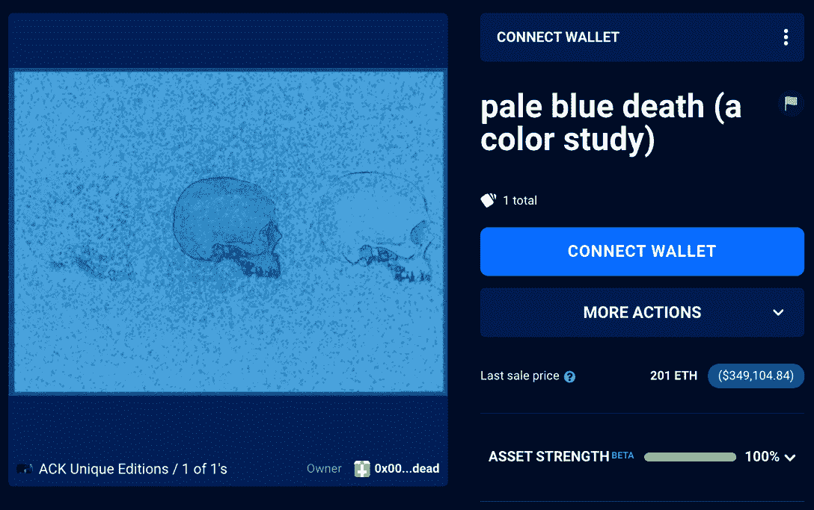
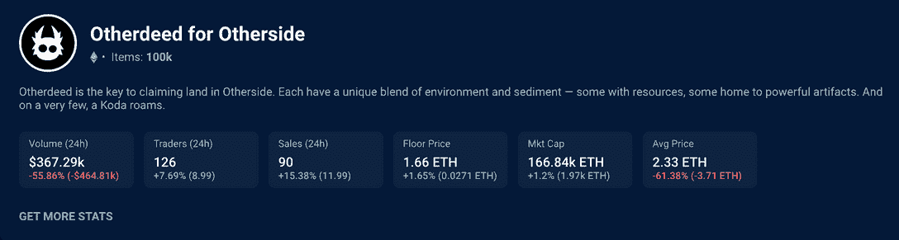
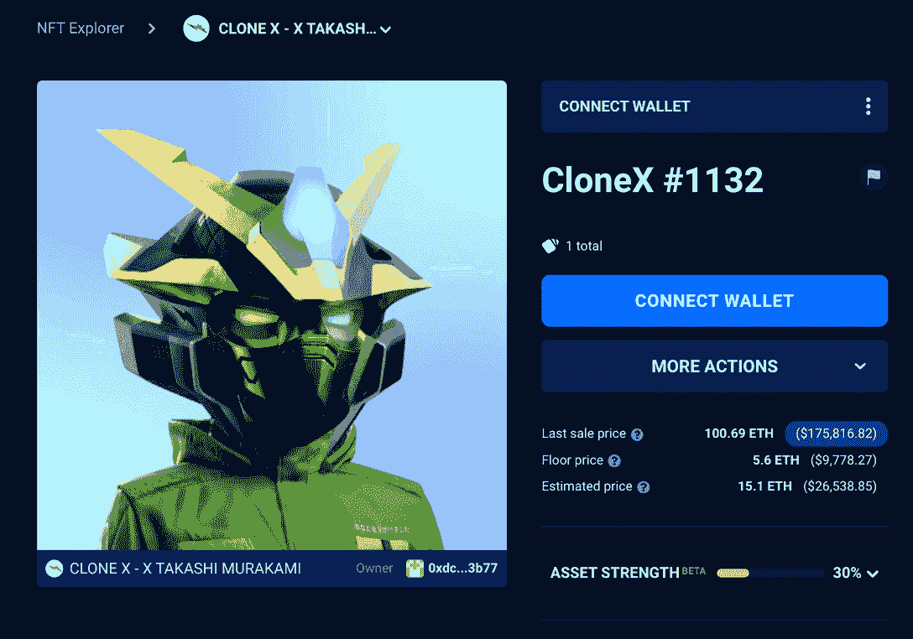

# NFT 元宇宙土地热的另一面——NFT 十大亮点

> 原文：<https://web.archive.org/web/https://dappradar.com/blog/otherside-nft-metaverse-land-rush-top-10-nft-highlights>

## 查看 9 月 4 日至 9 月 11 日之间的 NFT 销售亮点排名

每周 DappRadar 不仅会重点报道 NFT 最贵的商品，还会报道过去七天中最有趣的商品。虽然大数字肯定会占据头条，但强调新兴趋势以保持 DappRadar 社区的领先地位也是至关重要的。

在过去的七天里，NFT 拍卖的最高价格是元宇宙另一边宇迦实验室的一块土地，价格为 180 ETH，约合 31.2 万美元。第三名属于 BAYC #8775，它以大约 22.8 万美元的价格转手给了 [130 ETH。虽然这两种销售从价值角度来看很突出，但许多其他趋势正在出现。](https://web.archive.org/web/20221217095105/https://dappradar.com/hub/assets/eth/0xbc4ca0eda7647a8ab7c2061c2e118a18a936f13d/8775)

紧紧依偎在这两个高价值销售之间，我们看到了一个名为 ACK Unique Editions 的系列中的 NFT，名为《淡蓝色死亡》(一项色彩研究)。这件秘密艺术品以惊人的 201 ETH 售出，约合 35 万美元。有趣的是，该集合是知名加密艺术家 XCOPY 和 ACK 的合作，是 27 张 4k 图像与 strapline 的集合——饮料是免费的，但你永远不会离开。

然而，这次 NFT 的销售看起来有点可疑，因为[钱包的最终目的地似乎是一个烧毁地址](https://web.archive.org/web/20221217095105/https://dappradar.com/hub/wallet/eth/0x000000000000000000000000000000000000dead)。你唯一会做的就是毁掉这辆 NFT，在花了 35 万美元之后，它看起来非常可疑。或者，烧掉 NFT 为剩下的人创造了更高的价值。不管怎样，这是我们需要向我们的社区强调的另一个可疑的 NFT 销售。

最近几个月，随着交易商和收藏家开始寻找资产来对冲全球通货膨胀和密码价格下跌，密码艺术品越来越受欢迎。像传统艺术一样，秘密艺术现在正成为一种更安全的对冲手段，因为它开始获得更多的欣赏。

## 彼岸土地热潮

本周观察到的另一个趋势是宇迦实验室元宇宙项目的销售略有上升。在过去的 24 小时内，126 名交易员完成了 90 笔交易，涨幅超过 15%。

这种抢购可能是因为[的平均销售价格](https://web.archive.org/web/20221217095105/https://dappradar.com/hub/nft-explorer/collection/otherdeed-for-otherside)现在已经下降到大约 2.3 ETH，或者一个基本地块大约 4000 美元。值得注意的是，这一价值低于原来的薄荷价格。

简而言之，买家可以在最受期待的元宇宙项目中获得一块土地，同时如果他们希望出售他们的土地，可以从 ETH 价值的预期上涨中受益。在天平的另一端，[在过去的七天里，发生了价值超过 150，000 美元](https://web.archive.org/web/20221217095105/https://dappradar.com/nft/sales/1)的四宗地块，总计 529 ETH，或近 100 万美元的销售额。

## CloneX

[CloneX 是耐克公司 RTFKT 和艺术家村上隆在区块链以太坊开展的一个受欢迎的 NFT 合作项目](https://web.archive.org/web/20221217095105/https://dappradar.com/hub/nft-explorer/collection/clonex)。这些视觉上吸引人的 3D 角色被设计成在元宇宙中进行交互，并且可以被定制成最好地代表其用户的身份。以 100.69 ETH(约合 17.6 万美元)的价格出售 [CloneX #1132](https://web.archive.org/web/20221217095105/https://dappradar.com/hub/assets/eth/0x49cf6f5d44e70224e2e23fdcdd2c053f30ada28b/8259) ，使其成为上周第八大最高价值的 NFT 拍卖。

**查看 NFT 销售亮点列表**

***注意:出售时给出的美元价值是正确的***

*   [淡蓝色死亡(一项颜色研究)](https://web.archive.org/web/20221217095105/https://dappradar.com/hub/assets/eth/0xd33bc0af2dc4e39cbaef4beff8d1fb3c00c2e7a3/58)–＄305.3k/201 ETH—[买家钱包](https://web.archive.org/web/20221217095105/https://dappradar.com/hub/assets/eth/0xd33bc0af2dc4e39cbaef4beff8d1fb3c00c2e7a3/58)
*   [CloneX # 1132](https://web.archive.org/web/20221217095105/https://dappradar.com/hub/assets/eth/0x49cf6f5d44e70224e2e23fdcdd2c053f30ada28b/8259)-$ 175.57k/100.69 ETH-[买家钱包](https://web.archive.org/web/20221217095105/https://dappradar.com/hub/assets/eth/0x49cf6f5d44e70224e2e23fdcdd2c053f30ada28b/8259)
*   [rare Pepe # 263–中本聪卡](https://web.archive.org/web/20221217095105/https://dappradar.com/hub/assets/eth/0x82c7a8f707110f5fbb16184a5933e9f78a34c6ab/15800541396006671)–＄305.3k/201 ETH—[买家钱包](https://web.archive.org/web/20221217095105/https://dappradar.com/hub/wallet/eth/0x51787a2c56d710c68140bdadefd3a98bff96feb4)
*   [DigiDaigaku # 1091](https://web.archive.org/web/20221217095105/https://dappradar.com/hub/assets/eth/0xd1258db6ac08eb0e625b75b371c023da478e94a9/1091)–【未披露】–$ 80.4k/49 ETH——[买家钱包](https://web.archive.org/web/20221217095105/https://dappradar.com/hub/wallet/eth/0x29b3340f6c8e292a65ab5067632fe7e65fcb7b12)
*   [CloneX # 15717](https://web.archive.org/web/20221217095105/https://dappradar.com/hub/assets/eth/0x49cf6f5d44e70224e2e23fdcdd2c053f30ada28b/7065)-$ 57.23k/35 ETH-[买家钱包](https://web.archive.org/web/20221217095105/https://dappradar.com/hub/wallet/eth/0xb78d9c405dc594fd83710489add09117e2433dd6)
*   [Meridian # 327](https://web.archive.org/web/20221217095105/https://dappradar.com/hub/assets/eth/0xa7d8d9ef8d8ce8992df33d8b8cf4aebabd5bd270/163000327)-$ 55.3k/32 ETH-[买家钱包](https://web.archive.org/web/20221217095105/https://dappradar.com/hub/wallet/eth/0x9b167ae7a58a1916c2a7bd011e4e5445d34ece79)
*   [创世纪道观](https://web.archive.org/web/20221217095105/https://dappradar.com/hub/assets/eth/0x959e104e1a4db6317fa58f8295f586e1a978c297/4560)—$ 44.9k/55k 法力—[买家钱包](https://web.archive.org/web/20221217095105/https://dappradar.com/hub/wallet/eth/0x267b7f300badd048efe4b9b77ff354e868904e78)
*   [涂鸦# 3157](https://web.archive.org/web/20221217095105/https://dappradar.com/hub/assets/eth/0x8a90cab2b38dba80c64b7734e58ee1db38b8992e/3157)-$ 42.72k/27.69 WETH-[买家钱包](https://web.archive.org/web/20221217095105/https://dappradar.com/hub/wallet/eth/0x44264b208419fbcf8053f9cd9f087b7225ab6bb1)
*   [PLS Roulette](https://web.archive.org/web/20221217095105/https://dappradar.com/hub/assets/eth/0x8b947d5d33c9b664b91d41e8118bdea99979eadb/1)–＄41.35k/25.78 WETH—[买家钱包](https://web.archive.org/web/20221217095105/https://dappradar.com/hub/wallet/eth/0x435bf47e91fe2874e83a31ded583702b9d18fdbb)
*   [CloneX # 13399](https://web.archive.org/web/20221217095105/https://dappradar.com/hub/assets/eth/0x49cf6f5d44e70224e2e23fdcdd2c053f30ada28b/2960)-37.83 万美元/ 25 瑞士法郎-[买家钱包](https://web.archive.org/web/20221217095105/https://dappradar.com/hub/wallet/eth/0xdc6f3b6e8f6eafab2094f9a733a371b78a7f3b77)

## 脱离区块链直播！

加入这些家伙，因为他们涵盖了最新的游戏和最近的更新，从世界的发挥，以赚取区块链游戏。

[https://web.archive.org/web/20221217095105if_/https://www.youtube.com/embed/SmlXqGR_7iQ?feature=oembed](https://web.archive.org/web/20221217095105if_/https://www.youtube.com/embed/SmlXqGR_7iQ?feature=oembed)

## 随身携带您的 Web3 之旅

使用 DappRadar 移动应用程序，再也不会错过 Web3。查看最受欢迎的 dapps 的性能，并关注您投资组合中的 NFT。您在 DappRadar 上的帐户会与我们的移动应用程序同步，这样您很快就可以选择实时接收提醒。

[Download the DappRadar app now](https://web.archive.org/web/20221217095105/https://dappradar.app.link/blog)[<picture></picture>](https://web.archive.org/web/20221217095105/https://play.google.com/store/apps/details?id=com.portfolio.dappradar)

***以上不构成投资建议。此处给出的信息仅供参考。请行使尽职调查，做你的研究。作者持有多种加密货币的头寸，包括 BTC、瑞士法郎和雷达*T3**