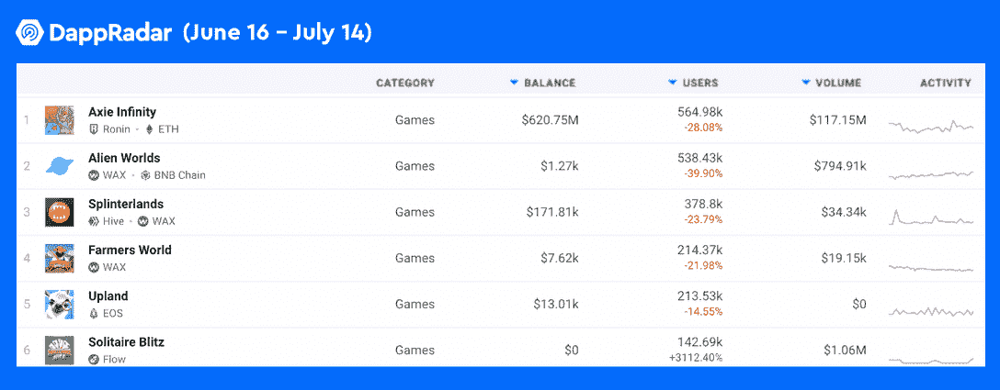
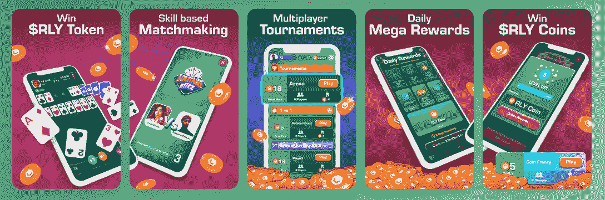
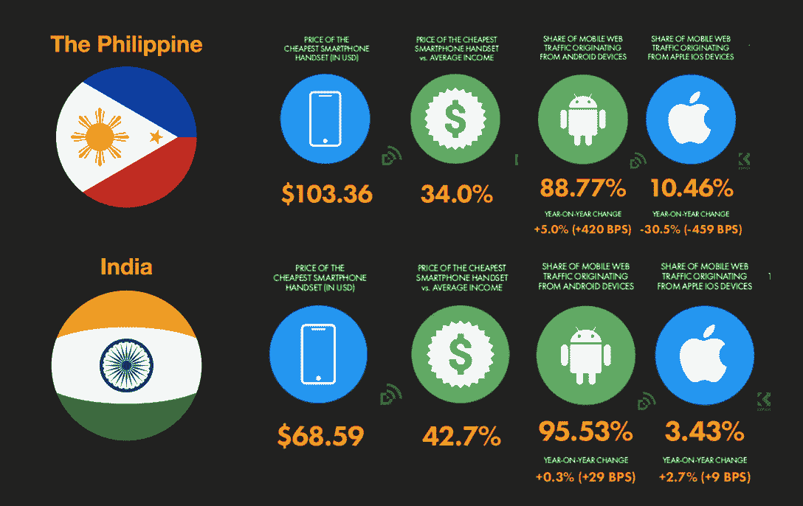

# 如何玩纸牌闪电战并赢得真钱奖励

> 原文：<https://web.archive.org/web/https://dappradar.com/blog/over-140000-users-are-playing-joyrides-solitaire-blitz-to-earn-real-money-rewards>

## 超过 140，000 名用户正在玩 Joyride 的纸牌闪电战，这是流量上排名第一的流行 dapp

**Solitaire Blitz 是 Flow 上排名第一的游戏 dapp，每月向区块链发送 142，695 个用户。通过参与配对游戏和锦标赛，用户可以在游戏中获得 RLY 代币。纸牌闪电战以其简单的游戏方式和有效的奖励机制在印度、菲律宾和许多其他国家广受欢迎。**

## 什么是纸牌闪电战？

[纸牌闪电战](https://web.archive.org/web/20220816013014/https://dappradar.com/flow/games/solitaire-blitz)成为[流量封锁](https://web.archive.org/web/20220816013014/https://dappradar.com/rankings/protocol/flow) [n](https://web.archive.org/web/20220816013014/https://dappradar.com/rankings/protocol/flow) 的最新亮点，30 天用户量增长高达 3112%。Web3 游戏用 RLY 代币奖励玩家，RLY 代币是面向社交的生态系统的原生代币，Rally。

对用户的深刻理解和彻底的市场调查是纸牌闪电战成功的重要因素之一。

DappRadar 可以帮助 dapp 开发团队进行市场研究，因为它跟踪了数千款区块链应用，包括 [DeFi](https://web.archive.org/web/20220816013014/https://dappradar.com/defi) 、 [NFT](https://web.archive.org/web/20220816013014/http://nfts/) 和[游戏](https://web.archive.org/web/20220816013014/https://dappradar.com/rankings/category/games) dapps。

## 纸牌闪电战 2022 增长

NBA 顶级 Sho[t](https://web.archive.org/web/20220816013014/https://dappradar.com/flow/collectibles/nba-topshot)—NBA 和 Dapper Labs 的合作伙伴关系，在 2021 年掀起了一场 NFT 狂潮。值得注意的是,《NBA 最佳投篮》将区块链带到了聚光灯下。然而一年后，Flow 上冠军宝座的主人换了。

Joyride 的纸牌闪电战每月用户超过 142，000 人，是流量区块链上的最新明星。令人印象深刻的是，这几乎是 NBA Top Shot 月用户数的四倍。

根据 DappRadar 的游戏排名，在月用户超过 142，000 的游戏中，我们发现 Solitaire Blitz 是唯一一个在过去 30 天内实现正增长的游戏。此外，Solitaire Blitz 的 30 天增长率高达 3112%。

我们不禁想知道为什么像纸牌这样简单的游戏仍然有如此巨大的吸引力，尤其是现在的玩家面临着大量的游戏选择。今天的文章将揭开纸牌闪电战如何在如此激烈的竞争中胜过其他游戏的神秘面纱。

此外， [DappRadar 排名](https://web.archive.org/web/20220816013014/https://dappradar.com/rankings)和[我们的报告](https://web.archive.org/web/20220816013014/https://dappradar.com/reports)可以为团队提供丰富的 dapp 市场数据和见解，让他们更好地了解当前的行业趋势。

## 纸牌闪电战怎么玩？游戏说明

与许多其他游戏不同，纸牌闪电战不吹嘘复杂的游戏，戏剧性的故事情节，或神秘的传说。相反，纸牌闪电战是将竞争元素和社交网络功能融入到经典纸牌游戏中。

更重要的是，该游戏采用“玩到赚”的机制，允许玩家赢得真钱奖励。

## 如何才能在纸牌闪电战上赚钱？

通过参与配对游戏或锦标赛，纸牌闪电战玩家可以赢得 RLY 代币，这使游戏更具吸引力。

您在游戏中赢得的$RLY 代币存储在您的 [Joyride](https://web.archive.org/web/20220816013014/https://wallet.onjoyride.com/) 钱包中，该钱包可以连接到 [MetaMask](https://web.archive.org/web/20220816013014/https://dappradar.com/blog/what-is-metamask) ，以便向您的以太坊地址存款或取款。

## 什么是 RLY token？

[RLY](https://web.archive.org/web/20220816013014/https://www.coingecko.com/en/coins/rally) 是[拉力赛](https://web.archive.org/web/20220816013014/https://rally.io/)的原生标志，这是一个让创作者和他们的社区能够建立他们独立的数字经济的平台。许多项目已经从 RLY 驱动的经济中受益，包括社交应用、游戏、NFT 社区、metaverses 等等。

持有 RLY 意味着用户可以接入 Rally 的多元生态系统。此外，用户可以在多个交易所用 RYL 交换其他加密或菲亚特，包括 MEXC、Bitget、KuCoin、Huobi Global 和 Phemex。

## Solitaire 还做对了什么？

通过引入 RLY 作为游戏内货币，Solitaire Blitz 确保了其游戏生态系统的包容性和互操作性。这个设计符合 Web3 的精神。

此外，据 Similarweb 报道，纸牌闪电战背后的游戏平台 Joyride 在印度和菲律宾有很高的知名度。值得注意的是，这两个国家[都拥有庞大的加密用户群](/web/20220816013014/https://dappradar.com/blog/behavior-report-macroeconomic-events-accelerate-crypto-adoption-and-regulations/)和[都是游戏赚钱的关键市场](/web/20220816013014/https://dappradar.com/blog/blockchain-behavior-report-interest-in-the-metaverse-and-play-to-earn-booming-in-asia/)。这在某种程度上为 Solitaire Blitz 在这两个国家的成功奠定了基础。

随着我们进一步深入两国的游戏市场，我们发现了一些更有价值的见解。

互联网和智能手机在菲律宾和印度都有相当高的普及率。然而，根据 Hootsuite 关于菲律宾和 T2 用户的数字报告，大多数数字用户都拥有低端智能手机。这些设备无法运行需要高性能的硬核移动游戏。

这样一来，像接龙这样的轻量级休闲游戏自然在这两个市场受到大量用户的青睐。此外，我们还发现，纸牌游戏在菲律宾和印度普遍流行，它在这些国家的 Google Play 纸牌游戏排行榜上排名很高。

## 我们能从纸牌闪电战的成功中学到什么？

游戏行业发展迅速，加密激励机制可以为经典游戏如纸牌游戏注入新的活力。当 DappRadar 跟踪数以千计的 dapps 时，我们注意到许多游戏创作者强调精心制作引人注目的故事和传奇人物。但是，如果他们不能推动用户流量，这就没有任何意义。

纸牌闪电战的成功再次提醒团队，了解目标受众，为他们制作合适的游戏才是根本。

## 用 DappRadar 追踪纸牌闪电战

作为世界上的 Dapp 商店，DappRadar 跟踪成千上万的 Dapp，并为所有用户提供有见地的信息和数据。DappRadar 排名让用户对最热门的区块链应用一目了然，包括 [DeFi](https://web.archive.org/web/20220816013014/https://dappradar.com/defi) 、 [NFT](https://web.archive.org/web/20220816013014/http://nfts/) 和[游戏](https://web.archive.org/web/20220816013014/https://dappradar.com/rankings/category/games)。开发者也可以利用这个特性来了解当前 dapp 用户的喜好。

此外，DappRadar [定期发布报告](https://web.archive.org/web/20220816013014/https://dappradar.com/blog/category/reports)，将其跟踪的数据转化为见解，并为用户提供最新的行业分析。

[订阅《一周回顾》简讯](https://web.archive.org/web/20220816013014/https://dappradar.com/blog/)，将最新趋势直接发送到您的收件箱。在 [Twitter](https://web.archive.org/web/20220816013014/https://twitter.com/dappradar) 、 [Discord](https://web.archive.org/web/20220816013014/https://discord.gg/4ybbssrHkm) 和 [Youtube](https://web.archive.org/web/20220816013014/https://www.youtube.com/c/DappRadar) 上关注我们，跟上区块链世界的动态。