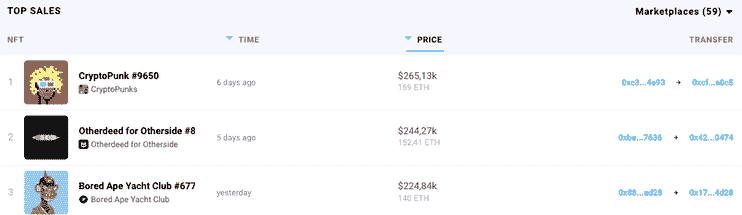

# 价值超过 100 万美元的 BAYC 和蓝筹股系列销量名列前茅

> 原文：<https://web.archive.org/web/https://dappradar.com/blog/over-1million-worth-of-bayc-and-blue-chip-collections-in-top-sales>

## 发现上周最热门的销售仍然无视灰熊市场。

NFT 系列，如 [Bored Ape Yacht Club](https://web.archive.org/web/20220810181342/https://dappradar.com/hub/nft-explorer/collection/bored-ape-yacht-club) 和 [CryptoPunk](https://web.archive.org/web/20220810181342/https://dappradar.com/hub/nft-explorer/collection/cryptopunks) 销售额最近继续占据 NFT 销售额前十名。《另一方的另一件事》在上周的销售排行榜上名列第二。

受欢迎的收藏品吸引了逢低买入的人，他们继续从 ETH 的低价中获利。另一个值得注意的趋势是 Fidenza 和 Twin Flames 在图表中排名第六和第八。

在过去的七天里，NFT 拍卖的最高价格是一副金发冲浪型的 [CryptoPunk #](https://web.archive.org/web/20220810181342/https://dappradar.com/hub/assets/eth/0xb47e3cd837ddf8e4c57f05d70ab865de6e193bbb/4156) 9650 英镑的 3D 复古影院太阳镜，以 169 ETH 的价格易手，约合 26.5 万美元。

在这次拍卖的背后，是大量的 NFT 湾泳滩收藏品的易手。更有趣的是， [CryptoPunk NFTs](https://web.archive.org/web/20220810181342/https://dappradar.com/hub/nft-explorer/collection/cryptopunks) 的底价上涨了 50%以上，过去 7 天的平均成交量为 497 万美元。

[<picture></picture>](https://web.archive.org/web/20220810181342/https://dappradar.com/nft/sales/1)

与过去几周类似，我们也看到一些生成性加密艺术作品通过艺术块平台出售。例如， [Fidenza #741 for 125 ETH，](https://web.archive.org/web/20220810181342/https://dappradar.com/hub/assets/eth/0xa7d8d9ef8d8ce8992df33d8b8cf4aebabd5bd270/78000741)或上周约 184，000 美元。

另一个有趣的拍卖是 Twin Flames #97 ,售价为 115 WETH，约合 17.7 万美元。Twin Flames 是一个摄影 NFT 项目，由@justinaversano 创建，是一个感人的双胞胎照片集，做着他们喜欢的事情。

***查看以下 NFT 销售亮点完整列表:***

*   CryptoPunk #9650 -169 ETH/ 265，13k $**–**[买家钱包](https://web.archive.org/web/20220810181342/https://dappradar.com/hub/wallet/eth/0xcfc50541c3deaf725ce738ef87ace2ad778ba0c5?utm_source=rankings&utm_medium=nft&utm_campaign=nft_sales)
*   other side # 89944–152.41 ETH/244.27K $–[买家钱包](https://web.archive.org/web/20220810181342/https://dappradar.com/hub/wallet/eth/0x42d69f67a14753824ff1ae387a98cc0d490d0474?utm_source=rankings&utm_medium=nft&utm_campaign=nft_sales)
*   BAYC # 6775–140 ETH/224，84，000 美元–买家钱包
*   BAYC # 2643–120，42 WETH/192k $–[买家钱包](https://web.archive.org/web/20220810181342/https://dappradar.com/hub/wallet/eth/0x6a4c4695428d1bb3fac49614dfcf390bc78facfe?utm_source=rankings&utm_medium=nft&utm_campaign=nft_sales)
*   BAYC # 4814–120 ETH/18.891 万美元–[买家钱包](https://web.archive.org/web/20220810181342/https://dappradar.com/hub/wallet/eth/0xdabb5211ef509cc9a2a39f91e0338986b7ccd396?utm_source=rankings&utm_medium=nft&utm_campaign=nft_sales)
*   fiden za # 741–125 ETH/184k $-[买家钱包](https://web.archive.org/web/20220810181342/https://dappradar.com/hub/wallet/eth/0xf0624f08ee09ebc9c7359d405d91a3e31a3b9faa?utm_source=rankings&utm_medium=nft&utm_campaign=nft_sales)
*   BAYC # 7593–17.7 万 USDC/17.8 万美元–买家钱包
*   twin Flames # 97-115 WETH/177k $–[买家钱包](https://web.archive.org/web/20220810181342/https://dappradar.com/hub/wallet/eth/0xb7ef5fb53dc42839270a94ca569536a7c7e7edde?utm_source=rankings&utm_medium=nft&utm_campaign=nft_sales)
*   BAYC # 406–119 ETH/175k $–[买家钱包](https://web.archive.org/web/20220810181342/https://dappradar.com/hub/wallet/eth/0x2334fd2c0010fb428724e31d8cfb0de030b3045c?utm_source=rankings&utm_medium=nft&utm_campaign=nft_sales)
*   BAYC # 4007–111 ETH/174k $–[买家钱包](https://web.archive.org/web/20220810181342/https://dappradar.com/hub/wallet/eth/0x0493a78f14bcb581d8ee9e133f85c1f8bc615324?utm_source=rankings&utm_medium=nft&utm_campaign=nft_sales)

你可以使用我们专门的 [NFT 浏览器](https://web.archive.org/web/20220810181342/https://dappradar.com/nft)在 DappRadar 上[探索 NFT，并使用](https://web.archive.org/web/20220810181342/https://dappradar.com/nft) [DappRadar 投资组合跟踪器](https://web.archive.org/web/20220810181342/https://dappradar.com/hub/wallet)跟踪和分析你自己的 NFT 股票。

[https://web.archive.org/web/20220810181342if_/https://www.youtube.com/embed/fkEaXYLOW-s?feature=oembed](https://web.archive.org/web/20220810181342if_/https://www.youtube.com/embed/fkEaXYLOW-s?feature=oembed)

## **仍然不顾一切**

NFT 空间已经感受到了最近的加密熊趋势的打击，然而一些项目设法无视赔率。CryptoPunks 和 BAYC 等成熟的蓝筹收藏吸引了 NFT 爱好者的广泛关注，DappRadar 将继续关注这些收藏，因为它们将推向新的高度。

要了解更多关于 NFT 空间的信息并获得最新的销售数据，请查看 [DappRadar PRO](https://web.archive.org/web/20220810181342/https://dappradar.com/token/pro) 。PRO 让你可以访问 Discord 上的独家内容和社区频道，以及最近 15 分钟的 [NFT 销售数据](https://web.archive.org/web/20220810181342/https://dappradar.com/nft/sales/1)。

DappRadar 将继续关注 NFT 空间的发展，并带来一个加密投资的新时代。要想首先获得最新的 NFT 新闻和更新，请在 Twitter 上关注 DappRadar，并加入我们的服务器。

 NewsletterUnsubscribe at any time. [T&Cs](https://web.archive.org/web/20220810181342/https://dappradar.com/terms) and [Privacy Policy](https://web.archive.org/web/20220810181342/https://dappradar.com/privacy-policy)