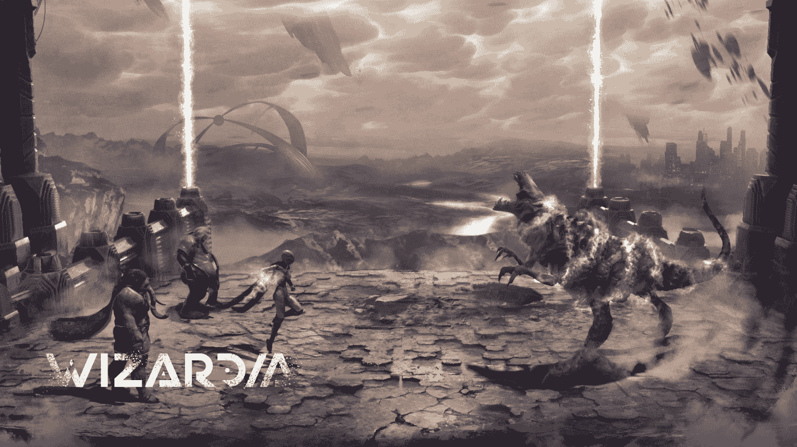
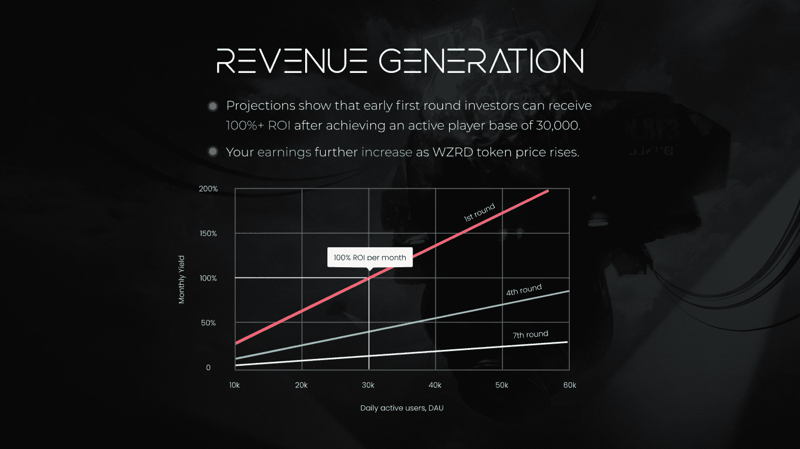

# 拥有巫师竞技场创世纪 NFTs 并从游戏战斗中获得被动收入

> 原文：<https://web.archive.org/web/https://dappradar.com/blog/own-wizardia-arena-genesis-nfts-and-earn-passive-income-from-game-battles>

## 早期投资者现在可以获得竞技场起源 NFTs

即将上映的奇幻 RPG《巫师世界》为元宇宙带来了一种从游戏到赚钱的经济模式，早期投资者可以终生赚取被动收入。竞技场创世纪 NFT 给玩家战斗竞技场的所有权，每次英雄巫师在战场上战斗都要收费。

新推出的竞技场创世纪 NFT 是巫师世界中最热门的资产之一。目前，第二轮代币销售正在进行，因为非代币售价为 175 美元一个。总共会有 7 轮销售，每次竞技场创世纪 NFTs 的价格都会上涨。此外，越早有人介入，他们将收集更多的被动收入。

那么这些竞技场创世纪 NFT 是什么呢？在我们回答这个问题之前，让我们先来看看巫师到底是什么。《巫师》是一款华丽的回合制战斗游戏，充满了 RPG 元素。玩家可以升级和改善他们的 NFT 巫师，升级神器和工艺物品。在巫师世界中，玩家可以选择与怪物或其他敌人战斗，或者让自己的队伍与其他玩家对抗。

由于区块链的技术，玩家对他们的每个巫师拥有完全的所有权，他们也可以出售、交易和出租给其他玩家。当然，这些 NFT 不是唯一的区块链元素。Wizardia 还被注入了从玩到赚的游戏的神奇本质，创造了一个具有现实世界价值的游戏经济。

## 玩到赚是所有的热潮

去年，区块链产业中最大的赢家是 P2E 游戏。这些游戏允许玩家从游戏中的行为中获得经济利益。在 COVID 疫情之后，这一产品类别受到了媒体的广泛关注，现在像育碧、Square Enix 和电子艺界这样的主要游戏公司已经将目光投向了游戏和 NFTs。根据 DappRadar 的[BGA block chain Game Report 2021](https://web.archive.org/web/20221217013837/https://dappradar.com/blog/4-billion-in-investments-sets-blockchain-gaming-up-for-growth-in-2022)的数据，投资涌入了游戏行业，在 2021 年获得了超过 40 亿美元的收入。

然而，传统游戏行业正在奋起直追，需要对这种新模式有所了解。《巫师》的开发者用一个完美的世界，伟大的设计，当然，还有稳固的游戏经济来推动游戏赚钱环境的发展。社区在其中扮演着重要的角色，因为他们将会拥有竞技场创世纪的 NFT，同时也在彼此之间购买、租赁和交易巫师 NFT。巫师社区成为了游戏的核心。

[https://web.archive.org/web/20221217013837if_/https://www.youtube.com/embed/9EjaLoL1SPI?feature=oembed](https://web.archive.org/web/20221217013837if_/https://www.youtube.com/embed/9EjaLoL1SPI?feature=oembed)

## 游戏玩家和投资者的盈利选择

魔法世界提供两种类型的 NFT:竞技场起源 NFT 和巫师 NFT。巫师 NFT 是玩家将在战场上使用的游戏角色。玩家可以在 PVP 比赛中让他们的英雄与怪物或其他玩家对战。巫师 NFT 也可以升级，提高他们在战场上的效力，增加他们的价值。租赁、出售和交易都是即将到来的巫师市场的选项。投资玩家需要保持活跃，以优化他们从游戏中获得的收益。更不用说通过游戏赚取经济来赚取本地 WZRD 令牌也需要活跃的游戏时间。

竞技场起源 NFT 是一种完全不同的投资类型。

这些竞技场起源 NFT 是精心制作的版税结构的支柱，允许 NFT 持有者赚取被动收入。在巫师的循环经济中，收入来自生态系统的战斗系统、市场和其他付费场景。因此，部分收入将进入一个基金，以回报该项目的早期投资者。

通过这种方式，进入 Arena Genesis NFTs 的投资者可以从许多游戏内动作中收取版税，而无需自己参与游戏。最值得注意的是，这是一种对早期采用者最有利的版税结构。竞技场起源 NFT 有七轮销售，每轮都有不同的购买价格。价格随后的每一轮上涨。具体来说，第一轮的价格是每个代币 125 美元，而最后一轮是每个 445 美元。

尽管早期投资者显然会从竞技场创世纪 NFTs 中获得更多回报，但由于版税生成机制，后期投资者仍然可以享受持续回报的潜力。例如，竞技场是版税收入的重要来源。随着更多的玩家加入游戏并进入战斗，其收入也相应上升。在官方网站上，感兴趣的投资者可以找到 Wizardia [版税投影计算器](https://web.archive.org/web/20221217013837/https://wizardia.co/34rdosq)，它提供了一种更好地了解投资回报(ROI)的直观方式。

玩家现在可以提早入场了。从 2 月 14 日开始，[竞技场创世纪 NFTs](https://web.archive.org/web/20221217013837/https://wizardia.co/3rB43H3) 已经公开发售。目前，公开销售已进入第二阶段，每 NFT 175 美元。游戏的第一个可玩的功能，战斗竞技场，将于 2022 年第三季度在 Q2 完成。

## 有用的链接

[网站](https://web.archive.org/web/20221217013837/https://wizardia.io/ref=l1aiostk6x)
[预告片](https://web.archive.org/web/20221217013837/https://wizardia.co/dappradar-yt)
[记号经济学](https://web.archive.org/web/20221217013837/https://wizardia.co/dappradar-lightpaper-tokenomics)
[路线图](https://web.archive.org/web/20221217013837/https://wizardia.co/dappradar-lightpaper-roadmap)
[文字纸](https://web.archive.org/web/20221217013837/https://wizardia.co/dappradar-lightpaper)

## 社会化媒体

[推特](https://web.archive.org/web/20221217013837/https://wizardia.co/dappradar-tw)
不和 电报

**免责声明** —这是一篇赞助文章。DappRadar 不认可本页面上的任何内容或产品。DappRadar 旨在提供准确的信息，但读者应该在采取行动之前总是自己做研究。DappRadar 的文章不能被认为是投资建议。