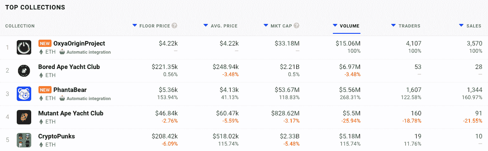
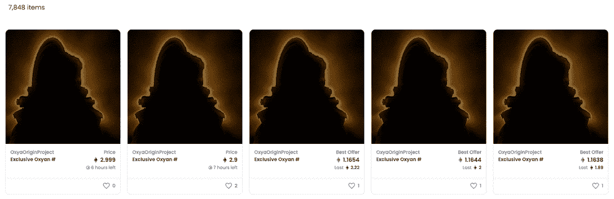
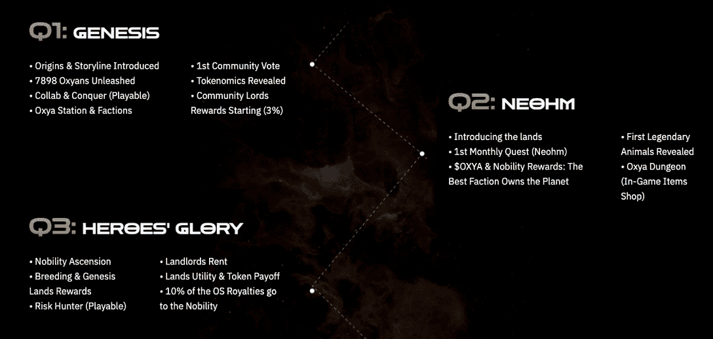

# Oxya 起源 NFTs 风暴图表

> 原文：<https://web.archive.org/web/https://dappradar.com/blog/oxya-origin-nfts-storm-the-charts>

## 劳里·金德兰、复仇者联盟、巫师、神奇四侠等的作品

2022 年才过了几天，Oxya Origin NFTs 就已经销售一空，因此牢牢占据了 DappRadar 24 小时耐力赛的榜首。NFT 投资者对提供独家访问和游戏机会的数字收藏品表现出浓厚的兴趣。

在游戏和元宇宙平台内具有扩展效用的 NFT 收藏品似乎是 1 月份的热门门票。Oxya Origin 系列包括 7898 个 3D 角色，由[劳里·金兰德](https://web.archive.org/web/20221201191413/https://www.imdb.com/name/nm9061446/)设计，他是一位视觉特效艺术家，因其在《复仇者联盟》、《巫师》、《神奇四侠》等电影中的作品而闻名。此外，团队中的其他艺术家此前曾与网飞、育碧和 Riot Games 合作过。该集合由来自九个不同部落的角色组成，这些角色从 250 多个属性中随机产生。

[<picture></picture>](https://web.archive.org/web/20221201191413/https://dappradar.com/nft/collections)

由于收集仅在几天前启动，7 天指标是全面的 100%。然而，交易者和销售的数量表明，本周该系列明显超过了 BAYC、MAYC 和 CryptoPunks 等 OG 系列。正如本周早些时候所报道的，Axie Infinity 经历了风雨飘摇的一周，在交易者数量方面打破了之前的销售记录。

铸造始于 12 月 6 日，奥克斯 NFT 系列在几个小时内就销售一空。早期准入白名单之外的买家的铸造价格为 0.30 ETH，约合 980 美元，外加汽油费。

看一眼 Opensea 上的收藏统计数据，就会发现底价现在是 1.45 ETH，约合 4700 美元。4600 个钱包拥有该系列中的所有非功能性钱包。4500 的交易指数显示，许多买家总是打算立即卖掉他们新收购的非交易资产来获利。不出所料，这种情况下的快速转变可能会在 24 小时内给买家带来近 4000 美元的健康利润。深入研究发现，有些人正试图为他们的非功能性脂肪获取更多的 ETH。随着围绕该系列的炒作升级，这些物品的售价高达 10.000 美元。

## 正当炒作？

这些与漫威和 DC 有联系的知名艺术家的参与，显然是迄今为止该系列受欢迎的一个驱动力。除了 Oxya Origin 的收藏品之外，NFTs 还可以用作社交 RPG 中的化身，允许所有者与其他人互动和交易，玩游戏，征服土地，交易和管理它们。氧源 NFT 提供了进入整个宇宙的途径。此外，Oxya Origin 是一个巨大的生态系统，具有创新的实用程序、社区建设机制和玩家冒险。

2022 年的路线图概述了一些令人兴奋的功能，包括起源和故事情节以及对玩家的奖励。在 2022 年第二季度，游戏开发商将提供土地，OXYA 令牌和贵族奖励。访问该网站可以获得一段精彩的音频叙述，提供玩家找到自己的背景故事。简而言之，这是一个未来的反乌托邦世界，没有任何资源，幸存者们为了收集最珍贵的资源，氧原子而战斗。

## NFT 才刚刚起步

许多观众迫不及待地提前叫停了主导 2021 年大部分时间的 NFT 炒作。然而，那些密切关注的人明白，炒作不会消失，而只是演变成 NFT 崇拜者想要的。效用超越了简单的收藏品，并有机会从他们的购买和访问别人不能获得的地方。

随着我们进入 2022 年，已经变得很清楚的是，这些为持有者提供更多效用的 [NFT 收藏将服务于更广泛的目的，并在地位上增长。也许不仅仅是在他们内置的元宇宙或游戏平台上。也包括其他人建造的。右击 JPG 唱反调者今年将不得不深入挖掘，以找到更多令人信服的理由来忽视非关税壁垒。](https://web.archive.org/web/20221201191413/https://dappradar.com/nft/collections)

 NewsletterUnsubscribe at any time. [T&Cs](https://web.archive.org/web/20221201191413/https://dappradar.com/terms) and [Privacy Policy](https://web.archive.org/web/20221201191413/https://dappradar.com/privacy-policy)

***以上不构成投资建议。此处给出的信息仅供参考。请行使尽职调查，做你的研究。作者持有 ETH、BTC、AGIX、HEX、LINK、GRT、CRO、OMI、不变 X、ENS、GALA、AVASTR、GMEE、CUBE、RADAR、FLOW、FTM、BNB、SPS、WRLD、ATOM 和 ADA。***