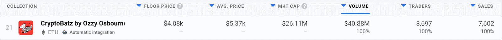
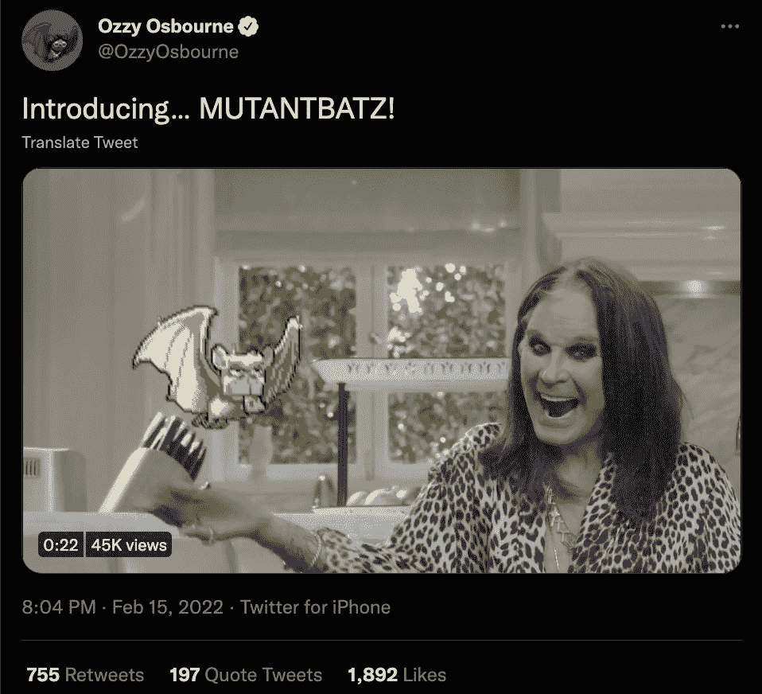

# 奥兹·奥斯朋的 CryptoBatz 将推出 MutantBatz

> 原文：<https://web.archive.org/web/https://dappradar.com/blog/ozzy-osbournes-cryptobatz-to-launch-mutantbatz>

## 据称，MutantBatz 功能将于 2 月 20 日推出

摇滚明星奥兹·奥斯朋的 NFT 系列将很快推出一款有趣的新机械——变形巴茨。根据官方网站，MutantBatz 系列将是 CryptoBatz 和其他几个受欢迎的 NFT 系列之间的合作项目。

所有原始的隐密蝙蝠怪都有能力一次性“咬”掉另一个蓝筹集合中的 NFT。当一个收集者利用这个能力时，他们可以从另一个收集物中选择一个他们的蝙蝠会咬的 NFT。一旦被咬，产生的突变 NFT 将携带原始隐蝠和第二代 NFT 的特征。

重要的是，为了让 CryptoBatz 从另一个集合中咬出一个 NFT 并创建一个变形蝙蝠，两个 NFT 必须存储在同一个钱包中。目前，CryptoBatz 已经宣布了对以下系列的突变体支持:

*   [无聊猿游艇俱乐部](https://web.archive.org/web/20230124150524/https://dappradar.com/ethereum/collectibles/bored-ape-yacht-club)
*   [CryptoDads](https://web.archive.org/web/20230124150524/https://dappradar.com/ethereum/collectibles/the-cryptodads)
*   [超级鸭子](https://web.archive.org/web/20230124150524/https://dappradar.com/ethereum/collectibles/supducks)
*   [外星人](https://web.archive.org/web/20230124150524/https://dappradar.com/nft/collections/protocol/ethereum/1)
*   [网络之王](https://web.archive.org/web/20230124150524/https://dappradar.com/ethereum/collectibles/cyberkongz)

## 什么是 CryptoBatz？

CryptoBatz 是一个基于以太坊的 NFT 集合，有 9666 只夜行动物，由奥兹·奥斯朋创意指导，萨特系统公司建造。该系列于 2022 年 1 月底推出，目前正进入路线图的第二阶段。

自推出以来，该系列吸引了 8600 多名交易者，产生了超过 4080 万美元的交易量。在撰写本文时，CryptoBatz NFT 的底价在 1.2 ETH 左右，约合 4000 美元。

考虑到奥兹·奥斯朋参与了该项目的设计，该系列在 DappRadar 的排名迅速攀升。这是过去 30 天来交易量排名第 21 位的藏品，这是一个令人印象深刻的成就。

既然这位摇滚明星已经宣布了第二阶段的开始和 MutantBatz 的推出，收集活动可能会进一步增加。

DappRadar 将继续监测 CryptoBatz 集合，因为持有者正在改变他们的 NFT。重要的是，这是 NFT 空间中前所未有的突变机制，有可能带来意想不到的令人兴奋的组合。更重要的是，看看这种机制如何影响原始收藏的估价将会很有趣。CryptoBatz 的楼面价会暴涨吗？一个月后，还没有“咬过”人的非传染性非典型肺炎会有多贵？

要首先了解 CryptoBatz 和 MutantBatz 的最新消息，请在 Twitter 上关注 DappRadar，并查看 T2 NFT 顶级收藏排行榜。此外，如果你是 [DappRadar PRO](https://web.archive.org/web/20230124150524/https://dappradar.com/token/pro) 会员，你将获得这些系列的最新连锁销售数据。

 NewsletterUnsubscribe at any time. [T&Cs](https://web.archive.org/web/20230124150524/https://dappradar.com/terms) and [Privacy Policy](https://web.archive.org/web/20230124150524/https://dappradar.com/privacy-policy)