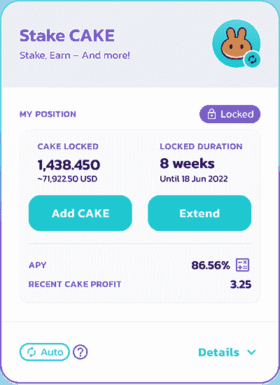
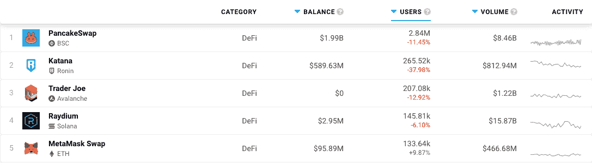

# PancakeSwap 的新定期赌注提供了更高的回报

> 原文：<https://web.archive.org/web/https://dappradar.com/blog/pancakeswaps-new-fixed-term-staking-offers-boosted-rewards>

## 分散式交易所为用户提供了下注和赚取更多利润的机会

定期赌注即将在 PancakeSwap 中出现。这项新功能将为下注的人提供增加收益和赚更多钱的机会。分散的交易所相互争夺最大的市场份额。

每个人都喜欢划算的交易。区块链社区的许多人经常在寻找下一个提高利润的最佳机会。因此，当我看到 PancakeSwap 关于他们新的固定期限赌注报价的最新更新时，我不得不做一些调查。

事实证明，PancakeSwap 将以两种方式更新其赌注选项:

*   灵活的赌注正在取代蛋糕糖浆池。
*   PancakeSwap 首次引入了定期赌注。

到目前为止，用户可以使用蛋糕糖浆池来下注，共有两种。他们提供自动和手动选项。正如您可能猜到的那样，就实际管理而言，每个版本都有不同的用户需求。

对于把蛋糕放进自动糖浆池的人来说，他们赚取的利润将自动再投资，用户可以享受复合收益。用户可以投资他们的蛋糕，坐享其成。(当然，会扣除少量费用。)

有了手动蛋糕糖浆池，用户可以将他们的利润进行再投资，也可以增加他们的收入。但是他们会自己动手做。没有相关费用，用户可以赚更多的钱。

## 从现在开始，赌注将如何运作？

灵活的桩将基本上取代自动蛋糕糖浆池功能，手动选项将被淘汰。费用将保持不变，因为“同样简单和用户友好的体验”。

定期赌注是有趣的地方。对于任何做多蛋糕的人来说，定期下注似乎是最好的选择。你可以把代币锁起来，时间越长，回报越好。不过，你应该知道，一旦你的蛋糕处于固定期限赌注，你将无法访问它。因此，如果蛋糕价格大幅下降，你将无法转移它。下图摘自 PancakeSwap 的新闻稿，显示年收益率(APY)为 86.56%。这意味着，在八周的时间里，如果你锁定了 100 个蛋糕(在撰写本文时为 898 美元)，你将收回 13.32 个蛋糕(119.50 美元)。

这对于那些原本不被动用和闲置的资金来说并不坏。

PancakeSwap fixed-term staking screengrab

## 煎饼交换是如何工作的

PancakeSwap 是一种分散式交换(DEX)。这意味着没有第三方监管其用户并为交易的代币提供担保。币安、比特币基地和北海巨妖等集中交易所(CEX)对使用其平台的人进行验证。交易所本身受到其运营所在国政府的严格监管。

DEXes 是完全依赖区块链技术的点对点交易平台。虽然 CEXes 在中央存储库中持有加密货币，就像银行一样，但 DEXes 是个人可以交易的市场。中央企业为使用其平台设定固定费用，但在 PancakeSwap 等交易所，价格可能会波动。这意味着 DEXes 有更多的机会在市场上找到最佳价值。

就用户而言，PancakeSwap 是世界上最大的 DEX。在过去的 30 天里，有 284 万个不同的活跃钱包与该平台进行了互动。人们在该网站上交易了价值 84.6 亿美元的加密货币，并且它在很长一段时间内都占据着 DappRadar 的 DeFi dapps 排名页面的首位。

[DappRadar DeFi dapps rankings page](https://web.archive.org/web/20221127150628/https://dappradar.com/rankings/category/defi)

要开始在 PancakeSwap 上下注，您可以使用 DappRadar 的 [Token Explorer 来购买一些蛋糕](https://web.archive.org/web/20221127150628/https://dappradar.com/hub/token/bsc/CAKE/BNB?from=0x0e09fabb73bd3ade0a17ecc321fd13a19e81ce82)。你也可以通过访问 [DappRadar 的 DeFi dapp 排名页面](https://web.archive.org/web/20221127150628/https://dappradar.com/rankings/category/defi)来追踪 PancakeSwap 的表现。我们的[博客](https://web.archive.org/web/20221127150628/https://dappradar.com/blog/)将为您提供最新消息，我们的[推特](https://web.archive.org/web/20221127150628/https://twitter.com/DappRadar)非常适合即时发布区块链世界发生的事情。加入我们的 [Discord](https://web.archive.org/web/20221127150628/https://discord.com/invite/4ybbssrHkm) 服务器，进行精彩的对话、每周一次的测验和一个热情的社区。