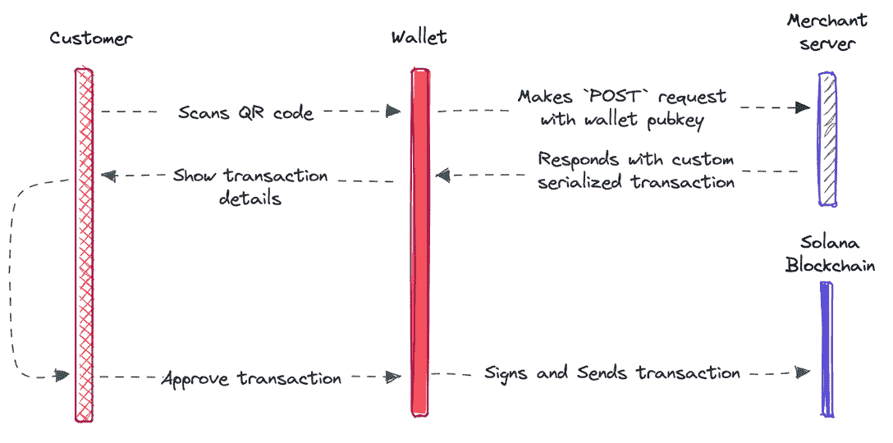

# 用 Solana Pay 带来连锁商务

> 原文：<https://web.archive.org/web/https://dappradar.com/blog/payment-protocol-solana-pay-on-chain-commerce>

## 增强简单购买的力量，建立忠诚的客户群

**支付协议 Solana Pay 引入了一种新的交易系统，允许来自开发者和商家的请求，使商业和点对点经济在链上进行。Solana Pay 最初于 3 个月前推出，旨在为分散和开放的经济开创一个支付和商业的新时代。**

## 摘要

*   Solana Pay 已经发布了交易请求，因此增强了购物体验
*   到目前为止，只有“幻影”和“T2”支持它们，但是更多的钱包已经开始着手这项工作了
*   在市场放缓的情况下，索拉纳 DeFi dapps 表现良好
*   索拉纳上的营养不良开始显示出生命的迹象

## 引入双向令牌传输

到目前为止，Solana Pay 一直依赖于 SOL、USDC、NFTs 和其他令牌的简单单向转移，这为实现分散支付提供了一个很好的起点。有了交易请求，通过结帐应用程序和移动钱包之间的交互请求，可以将任何 Solana 交易带入现实世界。这使得 NFT 铸币，动态折扣，象征性的忠诚度计划，等等。

Solana Pay 背后的核心前提是，支付和底层技术从一项必要的服务变成了商家和消费者之间真正的点对点通信渠道。在野外，这个过程大概是这样的:

1.  客户扫描商家二维码，他们的钱包应用程序将其解释为 Solana Pay 交易请求 URL。
2.  然后钱包向商家 API 发出 HTTP 请求。
3.  商家接收请求中的钱包地址，并可以用为顾客定制的交易来响应。
4.  钱包向客户显示交易细节，就像任何其他交易一样，还可以显示商家 URL 和图标。
5.  最后，客户批准(或拒绝)交易，用他们的私钥签名，并将交易发送到网络。

## Solana Pay 怎么用？

简而言之，交易请求增强了简单购买的能力，允许现实世界中任何可能的 Solana 交易。这可能听起来很神奇，原因还不完全清楚，所以让我们把它带到现实世界中来。对于商家来说，它可能是这样的:

一位新顾客走进你的商店，寻找最新的宣传运动鞋系列。你有现货，他们很兴奋。买家拿出手机，扫描你的销售点上的二维码，进行无缝交易。资金以发送一封电子邮件的速度，以接近零的成本打到商家账户，并立即开始赚取高收益利息。

在顾客离开商店之前，他们的电子钱包中会出现两个代币。第一个是他们新运动鞋的 NFT 版本，可用于任何游戏或虚拟世界。第二个是经过认证的 NFT 收据，它允许他们进入你的专属网上认证球鞋头社区。因此，从理论上讲，他们现在可以成为终身客户。

12 个月后，他们最喜欢的运动鞋的下一个版本发布了。他们的数字钱包有一个新的优惠，提醒他们在商店可以买到，并对他们在其他地方找不到的新鞋带进行个性化推荐。

## 将加密带入主流

设计一个有凝聚力的支付体验的系统，奖励忠诚度，驱动重复访问，并且不需要花费太多，当然不是在公园散步。然而，索拉纳薪酬使其更接近现实。

除了增加客户和商家之间的信任，Solana Pay 还将允许卖家和服务提供商定制新产品和促销活动。这反过来将使他们能够通过定制产品与客户建立更紧密的联系。

目前，这种量身定制的体验在某种程度上是可能的。然而，能够访问客户所有交易的透明分类账，给商家提供了更多的数据。从这个意义上说，他们可以更好地预测客户的需求，并根据他们之前的活动向个人提供更具吸引力的产品。虽然加密货币和数字货币的全球采用仍然很遥远，但 Solana Pay 让我们更近了一步。

[<picture></picture>](https://web.archive.org/web/20221129153747/https://dappradar.com/rankings/protocol/solana)[<picture></picture>](https://web.archive.org/web/20221129153747/https://dappradar.com/solana/marketplaces/magic-eden)[<picture></picture>](https://web.archive.org/web/20221129153747/https://dappradar.com/rankings/protocol/ethereum)

## 从索拉纳薪酬开始建设

交易请求现已上线，可供开发者和商家使用。例如，这可以为商家提供构建模块，以开始构建与客户的体验，从而创造忠诚度和更好的针对性。如今，Phantom 和 [Solflare](https://web.archive.org/web/20221129153747/https://solflare.com/#devices-available) 支持它们，而且更多的钱包已经开始着手这项工作。开发者可以在这里读取规格[，配置](https://web.archive.org/web/20221129153747/https://docs.solanapay.com/spec#specification-transaction-request)[销售点 app](https://web.archive.org/web/20221129153747/https://github.com/solana-labs/solana-pay/tree/master/point-of-sale#using-transaction-requests) 使用交易请求，读取[商家集成指南](https://web.archive.org/web/20221129153747/https://docs.solanapay.com/core/transaction-request/merchant-integration)，以及[加入 Solana](https://web.archive.org/web/20221129153747/https://discord.com/invite/solana)Tech 支持 Discord 。指针也有一个教程。

 NewsletterUnsubscribe at any time. [T&Cs](https://web.archive.org/web/20221129153747/https://dappradar.com/terms) and [Privacy Policy](https://web.archive.org/web/20221129153747/https://dappradar.com/privacy-policy)

* * *

*以上不构成投资建议。此处给出的信息仅供参考。请行使尽职调查，做你的研究。作者持有多种加密货币的头寸，包括 BTC、瑞士法郎和雷达。*