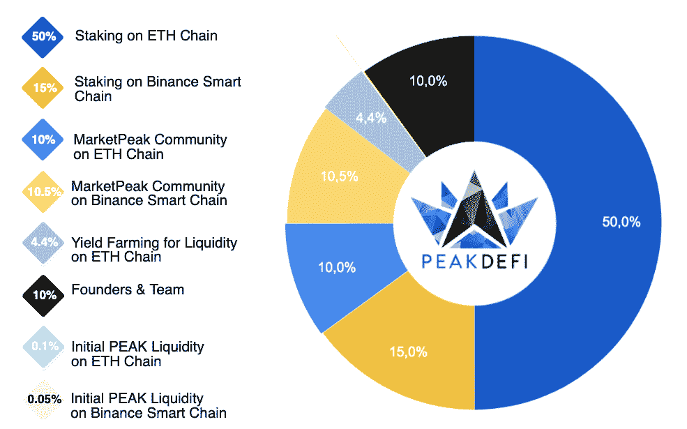

# PEAKDEFI Launchpad 为加密投资者提供高投资回报率的优质项目

> 原文：<https://web.archive.org/web/https://dappradar.com/blog/peakdefi-launchpad-offers-crypto-investors-quality-projects-with-high-roi>

## 发射台已经成为各种产品类别的区块链项目的门户

PEAKDEFI Launchpad 致力于呈现无数优质的区块链项目，为不同胃口的投资者带来更多的投资机会。与此同时，launchpad 平台为有前途的项目提供资源，使其业务蓬勃发展，找到受众，并在市场上引起轰动。

在传统金融(TradFi)体系中，资本有限的个人无法享受高级投资服务。例如，优质的私募股权或风险投资项目只提供给亿万富翁和企业投资者。因此，这些“不太重要的投资者”通常会自己做研究来寻求最佳投资选择，并被大量的可能性淹没。可以说，这导致了财富差距的进一步扩大。

加密货币的出现为个人投资者打开了更加公平、透明和多样化的投资机会之门。然而，丰富的选择仍然让投资者感到困惑。作为回应，PEAKDEFI 推出了自己的 launchpad，将优质项目和潜在投资者有效连接起来。

## 什么是 PEAKDEFI Launchpad？

PEAKDEFI Launchpad 旨在让有前途的项目和投资者同时受益。一方面，PEAKDEFI 为极具天赋的团队提供项目起飞所需的所有资源。它致力于成为初创项目的全方位合作伙伴，提供包括筹资、商业建议、营销等在内的服务。通过这种方式，PEAKDEFI 确保了他们数据库中的所有项目都是有价值的、有巨大潜力的。值得注意的是，这都要归功于 PEAKDEFI 多年来在开发和启动加密初创公司方面的经验。

另一方面，PEAKDEFI 为投资者提供 360 度的投资标的分析，包括 tokenomics、背后的团队、用例、长期价值、财务状况、路线图等等。在加密市场中，投资者因新的初始 Dex 产品(IDO)和初始游戏产品(IGO)而过载，PEAKDEFI Launchpad 可以帮助人们安心地找到具有高潜在投资回报(ROI)的优秀项目。

为了实现这些目标，PEAKDEFI 将:

*   **为项目评估设定高标准**。项目在上市前将经过 5 个阶段的尽职调查。这是为了保护投资者免受可预防的风险，并帮助实现回报最大化。

*   保持对所有人的公平分配。 PEAKDEFI 创建了一个分层系统，使每个人都能从每个池的分配中获得适当的份额。

*   **利用智能合同提高效率**。PEAKDEFI Launchpad 采用智能合同来实现自动化的项目启动和筹资流程。

## 即将开展的项目

目前，PEAKDEFI Launchpad 已经吸引了许多令人兴奋的项目加入。这些项目来自区块链产业的不同领域，从游戏到 NFT。

### 有形的

有形是一个有形的不可替代令牌(TNFT)市场，允许任何人使用加密货币从世界领先的供应商那里购买有价值的实物商品，这允许用户随时兑换实物商品。在购买有形资产清单上列出的资产时，会生成一个代表该有形资产的 TNFT。

### 生物工人 z

BioworkerZ 是一款可在移动设备上玩的游戏。它是两个空前经典的手机游戏的完美结合:神庙逃亡和爬山赛车。这是一个收集并运行的游戏，优化了 3D 体验，您可以收集游戏中的令牌 BIOZ 作为奖励。

## 令牌组学

PEAK 是 PEAKDEFI 背后的令牌，为平台提供动力。这是在以太坊区块链建造的 ERC 20 代币。总供应量将达到 20 亿峰值。令牌的分发如下:

PEAK token 有各种各样的效用，让持有者受益。首先，持有者将能够参与项目的众筹。此外，您可以将您的 PEAK token 投资于 PEAKDEFI Global Fund，该基金的工作方式类似于 TradFi 中的基金投资，但以分散的方式进行。它将把投资者从自己创建资产组合的痛苦中解救出来，同时仍能保证投资收益最大化。最后但同样重要的是，持有 PEAK tokens 将授予您对任何即将到来的治理提案进行投票的权利。

DappRadar 将持续关注 PEAKDEFI 的最新动态。如果你想了解加密世界的最新动态，请在 Twitter 上关注 DappRadar。对于协议、dapps 和令牌的现场性能，请使用我们的[排名工具](https://web.archive.org/web/20221001111542/https://dappradar.com/rankings)和[令牌浏览器](https://web.archive.org/web/20221001111542/https://dappradar.com/hub/tokens/ethereum/all/1)。

## 关于 PEAKDEFI

PEAKDEFI 是一个自筹资金的项目，为 DEFI 社区带来有前途的项目。它始于 2020 年，此后一直是一个由 PEAK token 和各种 Web3 dapps 驱动的生态系统。该生态系统包括一只全球基金，它通过智能合约自动帮助投资者实现最佳投资业绩。PEAKDEFI 拥有适用于 iOS 和 Android 的最高效的多链 DEFI 钱包。它为用户提供了直接访问他们的 NFT 收藏，快速 dapp 浏览器和赌注功能，所有这些都在一个移动应用程序中。

要了解关于 PEAKDEFI 和 Launchpad 的更多信息，请查看以下频道:

[Launchpad 网站](https://web.archive.org/web/20221001111542/http://launchpad.peakdefi.com/)
[PEAKDEFI 网站](https://web.archive.org/web/20221001111542/https://peakdefi.com/)
[推特](https://web.archive.org/web/20221001111542/https://twitter.com/peakdefi)
[不和](https://web.archive.org/web/20221001111542/https://discord.gg/3ENv5QCtcs)
[白皮书](https://web.archive.org/web/20221001111542/https://peakdefi.com/assets/pdf/PEAKDEFI_Whitepaper_v0.3.pdf)

**免责声明** —这是一篇赞助文章。DappRadar 不认可本页面上的任何内容或产品。DappRadar 旨在提供准确的信息，但读者应该在采取行动之前总是自己做研究。DappRadar 的文章不能被认为是投资建议。