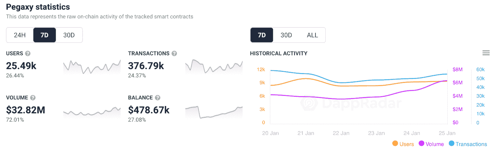
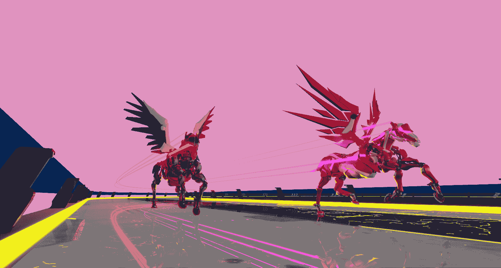

# peg xy NFT 赛马追逐多边形的头把交椅

> 原文：<https://web.archive.org/web/https://dappradar.com/blog/pegaxy-nft-race-horses-chase-the-top-spot-on-polygon>

## 该游戏在过去一周吸引了 25000 个用户钱包，将其业绩提升了 26%

Pegaxy 是最新的多边形游戏版本之一，然而，dapp 在 DappRadar 排名中一直稳居榜首。在过去的七天里，NFT 赛马游戏的用户群增加了 26%，达到了 25，000 多个独特的活动钱包。

令人印象深刻的是，与 2021 年底相比， [Pegaxy](https://web.archive.org/web/20221207003703/https://dappradar.com/polygon/games/pegaxy) 是 Polygon 上目前吸引更多用户的少数 dapps 之一。目前有一种非常悲观的气氛。然而，多边形上的玩赚比以往任何时候都强。过去七天里，活跃钱包数量排名前三的 dapps 都属于这一类别。

由于令人羡慕的表现，Pegaxy 设法攀升至第三名。随着独特活跃钱包的激增，该平台处理的交易数量也增长了 25%左右。然而，最值得注意的是，这款游戏在过去七天里产生了超过 3200 万美元的交易量。

玩家的涌入和 Pegaxy 上的活动也对游戏的本地令牌 VIS 产生了积极的影响。虽然大多数加密令牌的估值正经历前所未有的下跌，但一个 VIS 令牌的价格却上涨了 34.61%。

## Pegaxy 的下一步是什么？

Pegaxy 似乎已经将获取用户作为其发展计划的一部分。然而，这款热门游戏背后的团队有一个雄心勃勃的路线图。该平台即将推出的主要改进之一是赛道和马匹的 3D 版本。这是一项重大的设计努力，无疑将使游戏体验更加身临其境。

目前，Pegaxy 背后的团队正在托管这款 3D 游戏的封闭测试版。这个版本的比赛只对拥有创始人、传奇或史诗 Pega NFTs 的玩家开放。官方路线图还包括一个基于移动平台的广泛计划，以及一个有重大奖励的社区黑客马拉松。

考虑到 Pegaxy 在 2022 年前几周的成功运行，这将是该平台的一个恒星年。凭借雄心勃勃的路线图和在游戏玩家和加密爱好者中日益增长的人气，Pegaxy 已经做好了在 DappRaddar Polygon 游戏排名中登顶的准备。

DappRadar 将继续监控 [Pegaxy](https://web.archive.org/web/20221207003703/https://dappradar.com/polygon/games/pegaxy) 和游戏 dapps 不断增长的多边形生态系统。如果你想了解最新的游戏新闻，请加入 [DappRadar PRO](https://web.archive.org/web/20221207003703/https://dappradar.com/token/pro) 。使用 PRO，您可以访问独家内容和最新的链上数据。此外，你可以在[推特](https://web.archive.org/web/20221207003703/https://twitter.com/dappradar)上关注 DappRadar，并加入我们充满活力的 [Discord](https://web.archive.org/web/20221207003703/https://discord.gg/4ybbssrHkm) 社区！

 NewsletterUnsubscribe at any time. [T&Cs](https://web.archive.org/web/20221207003703/https://dappradar.com/terms) and [Privacy Policy](https://web.archive.org/web/20221207003703/https://dappradar.com/privacy-policy)