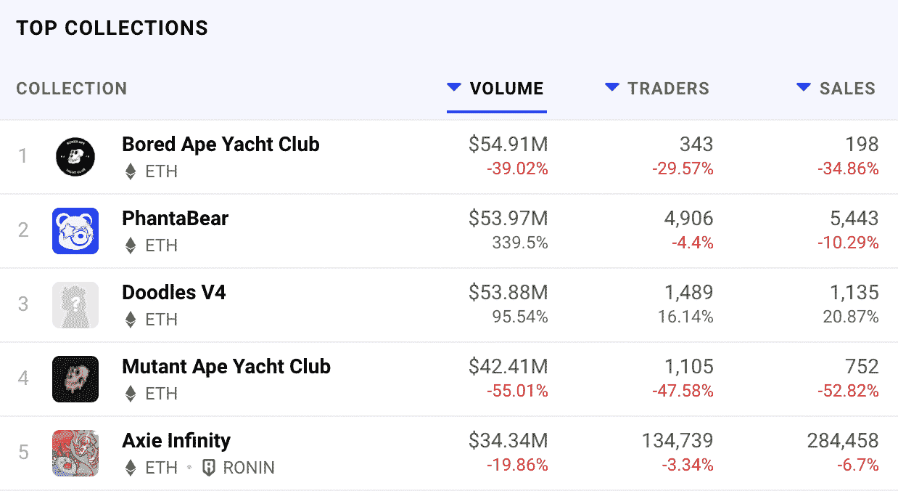

# PhantaBear 攀升 NFT 排名，击败涂鸦和 MAYC

> 原文：<https://web.archive.org/web/https://dappradar.com/blog/phantabear-climbs-nft-rankings-beats-doodles-and-mayc>

## PhantaBear 是过去 24 小时内交易量最高的藏品

以太坊 NFT 系列的新成员 PhantaBear 在过去几天表现抢眼，成为过去 24 小时内交易量最大的系列。令人印象深刻的是，PhantaBear NFT 系列在每周 [**DappRadar 排名**](https://web.archive.org/web/20220929043701/https://dappradar.com/nft) **中排名也相当高，胜过 Doodles 和突变猿游艇俱乐部等大牌。**

PhantaBear 是一个由 10.000 个算法生成的数字收藏品组成的集合，它可以作为 Ezek 俱乐部的会员卡。Ezek Club 的目标是成为区块链最好的独家热点之一，会员可以在这里出租元宇宙土地，组织活动和表演，体验仅限访问的虚拟世界的全部潜力。

除了 Ezek Club access，PhantaBears 的设计也令人印象深刻。每只 Phanta 熊都有 PHANTACi 设计的服装和配饰，Phanta ci 是周杰伦在 2006 年共同创立的时尚品牌。重要的是，PHANTACi 对该系列的参与并不止于此，因为几位 PhantaBears 将在名为 phanta ci 2022 春季系列的现实生活时装系列中展示他们的服装。

## PhantaBear 和 Ezek 瞄准了元宇宙

幻影 NFT 系列只是雄心勃勃的路线图的第一步。该团队旨在为 Ezek 俱乐部成员创造一个完整的元宇宙体验。据[官方网站](https://web.archive.org/web/20220929043701/https://ezek.io/)报道，在 2022 年中期，PhantBear 的持有者将可以进入 Ezek 虚拟世界。在那里，他们将能够购买土地和创建虚拟活动。

Ezek club 的最终目标是创建一个复杂的创作者和粉丝网络，他们可以在虚拟体验中进行合作。PhantaBear NFTs 将作为整个 Ezek 虚拟世界的访问密钥。

由 Matrix Labs 技术团队支持的创意团队创建的 PhantaBear 有可能成为 NFT 顶级收藏。随着一个雄心勃勃的路线图和围绕可爱熊设计的浓厚兴趣的建立，这个项目才刚刚开始。

DappRadar 将继续监测 PhantaBear，因为它的日珥越来越大。加入 [DappRadar PRO](https://web.archive.org/web/20220929043701/https://dappradar.com/token/pro) 也可以密切关注这位后起之秀。专业给你访问 NFT 销售数据，从短短的最后十五分钟。它还授予独家访问[不和](https://web.archive.org/web/20220929043701/https://discord.gg/4ybbssrHkm)的讨论和渠道。请继续关注，在[推特](https://web.archive.org/web/20220929043701/https://twitter.com/dappradar)上关注 DappRadar，首先了解最新的 NFT 新闻。

 NewsletterUnsubscribe at any time. [T&Cs](https://web.archive.org/web/20220929043701/https://dappradar.com/terms) and [Privacy Policy](https://web.archive.org/web/20220929043701/https://dappradar.com/privacy-policy)