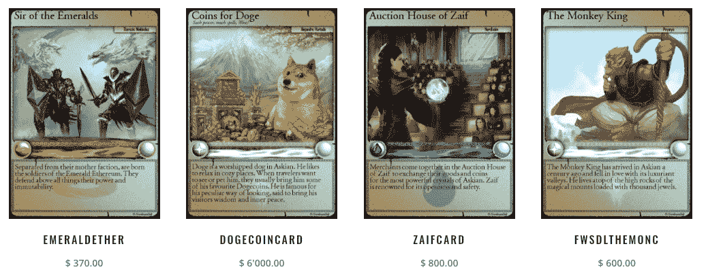
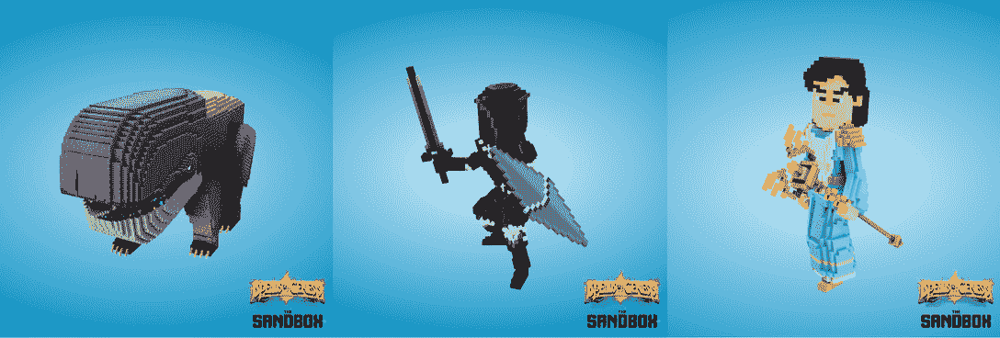
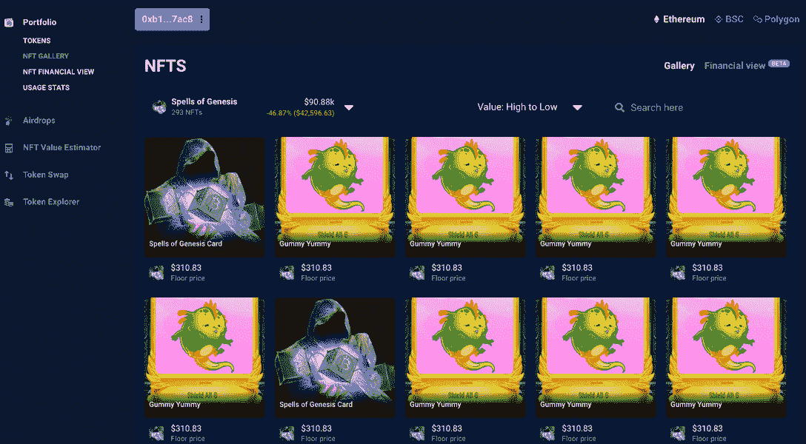
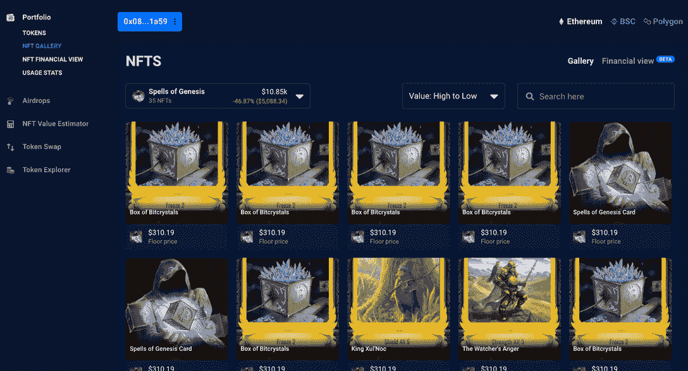

# 首创区块链游戏《创世纪魔咒》五周年

> 原文：<https://web.archive.org/web/https://dappradar.com/blog/pioneering-blockchain-game-spells-of-genesis-turns-five>

## 第一款采用区块链技术的手机动作益智游戏

今天，区块链游戏公司 EverdreamSoft 庆祝其旗舰游戏《创世纪咒语》五周年，推出了游戏内 NFTs 八折销售。除此之外，EverdreamSoft 还在 NFT 开设了一个加密体素博物馆，并在沙盒中推出了第一个 14 个加密体素 NFT 集合。

## 摘要

*   原生市场上 20%的创世纪魔法代码为 SOG20
*   NFT 博物馆现在[在隐体素](https://web.archive.org/web/20220927113825/https://www.cryptovoxels.com/play?coords=E@355E,298S)中开放
*   体素化的 NFT 集合[现在在沙盒中可用](https://web.archive.org/web/20220927113825/https://www.sandbox.game/en/shop/?collections=71)
*   [看看创世纪 NFT 鲸鱼钱包里面的咒语](https://web.archive.org/web/20220927113825/https://dappradar.com/blog/pioneering-blockchain-game-spells-of-genesis-turns-five/#Spells-of-Genesis-NFT-Whales-)
*   [什么是创世纪的法术？](https://web.archive.org/web/20220927113825/https://dappradar.com/blog/pioneering-blockchain-game-spells-of-genesis-turns-five/#What-is-Spells-of-Genesis?)

动作益智游戏《创世纪的咒语》是第一款采用区块链技术的手机游戏。2015 年，他们发行了首批可以在他们的游戏中使用的令牌化数字收藏品之一。两年后，游戏玩家可以升级他们的游戏内置卡，最终使用交易对手协议，在比特币区块链上将它们铸造成令牌化的数字资产。随后在 2017 年，这款游戏在以太坊网络上推出，并成为首批多链 dapps 之一。

快进到 2022 年，NFTs 和 play-to-earn 成为了热门话题，推动了 Q1 2022 年超过 50%的 dapp 总使用量。然而，越来越清楚的是，NFTs 不仅仅是艺术。不可替代的代币可以是虚拟房地产、游戏世界中的物品、虚拟和物理活动门票，甚至可以给所有者一定比例的收益产生流动性池。为了庆祝《创世纪》五周年，EverdreamSoft 在本地市场对所有商品[提供有限的八折优惠。](https://web.archive.org/web/20220927113825/https://crystalsuite.com/store/?orderby=price)

## 创世纪的沙盒和咒语

随着《创世纪》开始与领先的虚拟世界平台合作，与沙盒的合作指向了《创世纪》的更多进展。EverdreamSoft 刚刚与纳比亚工作室合作，在沙盒上推出了第一个体素化的 14 个 NFT 集合，包括《T2》中的八个标志性角色。最贵的是 Satoshi 传奇卡，售价在 2800 美元左右。与此同时，收藏家可以以不到 35 美元的价格买到一个 SatoshiBlock 或一篮子宝石。

为了进一步庆祝五周年，EverdreamSoft 还宣布在本月早些时候在 CryptoVoxels 内建立一个 NFT [历史博物馆。画廊展出了古老的 SoG 卡和各种顶级的行业知名的 NFT 收藏品，提供了一个相互联系的世界和体验的沉浸式展示。](https://web.archive.org/web/20220927113825/https://www.cryptovoxels.com/play?coords=E@355.5E,298S,0.5U)

此外，这种合作可能预示着未来与其他领先的虚拟世界平台，如 Decentraland 和 Somnium Space 的合作。现在的 OG 游戏看起来会扩大它的覆盖范围，并且可以说会朝着十周年纪念日努力。随着注入 NFT 的游戏越来越受欢迎，未来潜在的合作伙伴也可能看到《创世纪》成为更广泛的元宇宙平台的可玩部分。

## 创世纪 NFT 鲸的咒语

已经有好几个创世纪 NFT 鲸的咒语了。使用 DappRadar 投资组合，我们可以放大他们的钱包，看看他们有什么，并进一步调查拥有创世纪卡的财务收益。

这个钱包地址存放了 293 个创世纪非功能魔法物品，价值超过 31.4 ETH，或者 9 万美元，有趣的是，它已经存放了大部分非功能魔法物品两年多了。每枚 NFT 的交易历史显示，大多数是在铸造阶段被钱包捕获的，现在它们的价值都大大增加了。

这个钱包装有 35 个创世纪魔法物品，总价值约为 4.4 ETH，或者写的时候约为 10，000 美元。像第一个钱包一样，大多数物品在铸造阶段就被保护起来，并且已经在钱包里放了两年多了。

## 创世纪的咒语是什么？

在创世纪的法术中，玩家可以通过合并来获得卡片并升级。这是游戏的一个重要部分，因为卡片通过升级来增加它们的力量。它们从青铜变成了白银，然后变成了黄金。最后一步是 EverdreamSoft 所说的区块链化，这实际上是将卡片“铸造”到区块链上。游戏玩家可以在 Android 和 iOS 上免费下载创世纪的咒语。连接来自以太坊区块链和比特币交易对手的 Casa Tookan 钱包资产可以在手机游戏中使用。

[https://web.archive.org/web/20220927113825if_/https://www.youtube.com/embed/js6Cnm5wzYA?feature=oembed](https://web.archive.org/web/20220927113825if_/https://www.youtube.com/embed/js6Cnm5wzYA?feature=oembed)

*以上不构成投资建议。此处给出的信息仅供参考。请行使尽职调查，做你的研究。作者持有多种加密货币的头寸，包括 BTC、瑞士法郎和雷达。*

 NewsletterUnsubscribe at any time. [T&Cs](https://web.archive.org/web/20220927113825/https://dappradar.com/terms) and [Privacy Policy](https://web.archive.org/web/20220927113825/https://dappradar.com/privacy-policy)